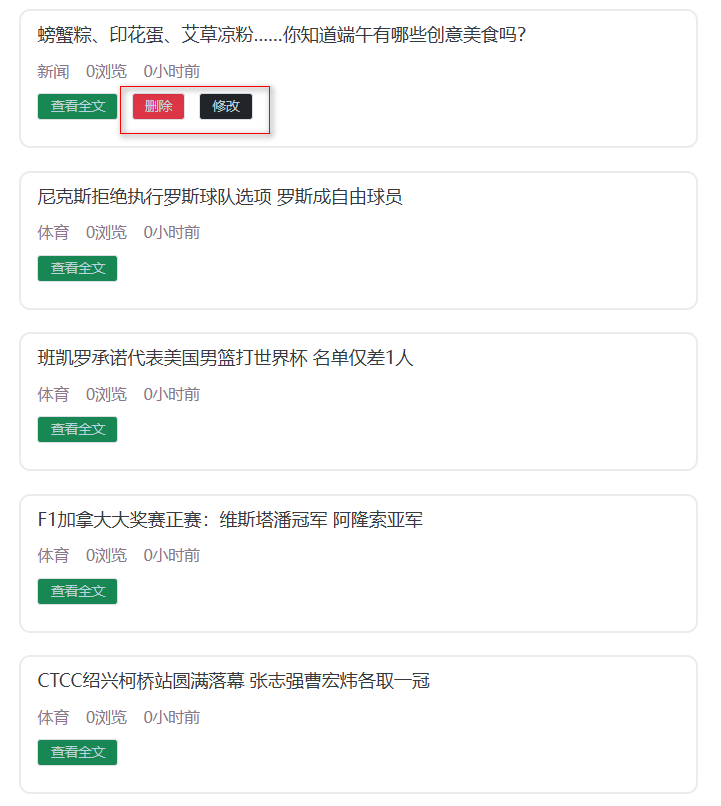

# 1. 微头条业务简介

> 微头条新闻发布和浏览平台,主要包含业务如下

+ 用户功能
    + 注册功能
    + 登录功能
+ 头条新闻
    + 新闻的分页浏览
    + 通过标题关键字搜索新闻
    + 查看新闻详情
    + 新闻的修改和删除
+ 权限控制
    + 用户只能修改和自己发布的头条新闻

# 2. 技术栈介绍
> 前端技术栈

+ ES6作为基础JS语法
+ nodejs用于运行环境
+ npm用于项目依赖管理工具
+ vite用于项目的构建架工具
+ Vue3用于项目数据的渲染框架
+ Axios用于前后端数据的交互
+ Router用于页面的跳转
+ Pinia用于存储用户的数据
+ LocalStorage作为用户校验token的存储手段
+ Element-Plus提供组件

> 后端技术栈
+ JAVA作为开发语言,版本为JDK17
+ Tomcat作为服务容器,版本为10.1.7
+ Mysql8用于项目存储数据
+ Servlet用于控制层实现前后端数据交互
+ JDBC用于实现数据的CURD
+ Druid用于提供数据源的连接池
+ MD5用于用户密码的加密
+ Jwt用于token的生成和校验
+ Jackson用于转换JSON
+ Filter用于用户登录校验和跨域处理
+ Lombok用于处理实体类

# 3. 功能展示

> 头条首页信息搜索

> 登录功能

> 注册功能

> 权限控制功能

> 发布头条功能

> 修改头条功能

> 删除头条功能

