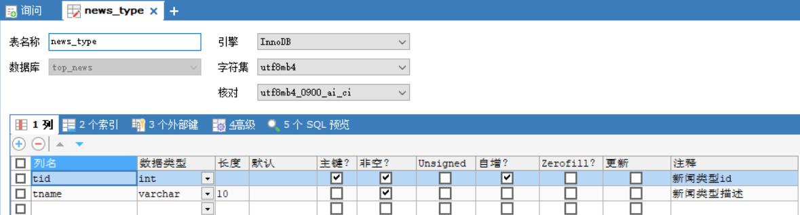
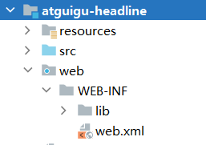

# 1  数据库准备
> `news_users` 用户表


> `news_type` 新闻类型表



> `news_headline` 新闻信息表


## 1.2 数据库创建SQL

+ 导入资料中的 `top_news.sql` 文件即可

# 2 MVC项目架构模式

>  MVC（Model View Controller）是软件工程中的一种 **`软件架构模式` **，它把软件系统分为** `模型`**、 **`视图`**和 **`控制器`**三个基本部分。用一种业务逻辑、数据、界面显示分离的方法组织代码，将业务逻辑聚集到一个部件里面，在改进和个性化定制界面及用户交互的同时，不需要重新编写业务逻辑。

+ **M**：Model 模型层,具体功能如下
    1. 存放和数据库对象的实体类以及一些用于存储非数据库表完整相关的VO对象
    2. 存放一些对数据进行逻辑运算操作的的一些业务处理代码

+ **V**：View 视图层,具体功能如下
    1. 存放一些视图文件相关的代码 html css js等
    2. 在前后端分离的项目中,后端已经没有视图文件,该层次已经衍化成独立的前端项目

+ **C**：Controller 控制层,具体功能如下
    	1. 接收客户端请求,获得请求数据
      2. 将准备好的数据响应给客户端

> MVC模式下,项目中的常见包

+ M:
    1. 实体类包(pojo /entity /bean) 专门存放和数据库对应的实体类和一些VO对象
    2. 数据库访问包(dao/mapper)  专门存放对数据库不同表格CURD方法封装的一些类
    3. 服务包(service)                       专门存放对数据进行业务逻辑预算的一些类

+ C:
    1. 控制层包(controller)

+ V:
    1. web目录下的视图资源 html css js img 等
    2. 前端工程化后,在后端项目中已经不存在了


# 3 搭建项目

## 3.1 创建WEB项目



## 3.2 导入依赖


## 3.3 准备包结构


+ controller 控制层代码,主要由Servlet组成
+ service     服务层代码,主要用于处理业务逻辑
+ dao          数据访问层,主要用户定义对于各个表格的CURD的方法
+ pojo         实体类层,主要用于存放和数据库对应的实体类以及一些VO对象
+ util           工具类包,主要用存放一些工具类
+ common  公共包,主要用户存放一些其他公共代码
+ filters       过滤器包,专门用于存放一些过滤器
+ test          测试代码包,专门用于定义一些测试的功能代码,上线前应该删掉,后期用maven可以自动处理掉

# 4 准备工具类
## 4.1 异步响应规范格式类
### Result类

```java
package com.atguigu.headline.common;

/**
 * 全局统一返回结果类
 *
 */
public class Result<T> {
    // 返回码
    private Integer code;
    // 返回消息
    private String message;
    // 返回数据
    private T data;
    public Result(){}
    // 返回数据
    protected static <T> Result<T> build(T data) {
        Result<T> result = new Result<T>();
        if (data != null)
            result.setData(data);
        return result;
    }
    public static <T> Result<T> build(T body, Integer code, String message) {
        Result<T> result = build(body);
        result.setCode(code);
        result.setMessage(message);
        return result;
    }
    public static <T> Result<T> build(T body, ResultCodeEnum resultCodeEnum) {
        Result<T> result = build(body);
        result.setCode(resultCodeEnum.getCode());
        result.setMessage(resultCodeEnum.getMessage());
        return result;
    }
    /**
     * 操作成功
     * @param data  baseCategory1List
     * @param <T>
     * @return
     */
    public static<T> Result<T> ok(T data){
        Result<T> result = build(data);
        return build(data, ResultCodeEnum.SUCCESS);
    }
    public Result<T> message(String msg){
        this.setMessage(msg);
        return this;
    }
    public Result<T> code(Integer code){
        this.setCode(code);
        return this;
    }
    public Integer getCode() {
        return code;
    }
    public void setCode(Integer code) {
        this.code = code;
    }
    public String getMessage() {
        return message;
    }
    public void setMessage(String message) {
        this.message = message;
    }
    public T getData() {
        return data;
    }
    public void setData(T data) {
        this.data = data;
    }
}
```

### ResultCodeEnum 枚举类

``` java
package com.atguigu.headline.common;
/**
 * 统一返回结果状态信息类
 *
 */
public enum ResultCodeEnum {

    SUCCESS(200,"success"),
    USERNAME_ERROR(501,"usernameError"),
    PASSWORD_ERROR(503,"passwordError"),
    NOTLOGIN(504,"notLogin"),
    USERNAME_USED(505,"userNameUsed")
    ;

    private Integer code;
    private String message;
    private ResultCodeEnum(Integer code, String message) {
        this.code = code;
        this.message = message;
    }
    public Integer getCode() {
        return code;
    }
    public String getMessage() {
        return message;
    }
}

```

## 4.2 MD5加密工具类
``` java
package com.atguigu.headline.util;

import java.security.MessageDigest;
import java.security.NoSuchAlgorithmException;

public final class MD5Util {
    public static String encrypt(String strSrc) {
        try {
            char hexChars[] = { '0', '1', '2', '3', '4', '5', '6', '7', '8',
                    '9', 'a', 'b', 'c', 'd', 'e', 'f' };
            byte[] bytes = strSrc.getBytes();
            MessageDigest md = MessageDigest.getInstance("MD5");
            md.update(bytes);
            bytes = md.digest();
            int j = bytes.length;
            char[] chars = new char[j * 2];
            int k = 0;
            for (int i = 0; i < bytes.length; i++) {
                byte b = bytes[i];
                chars[k++] = hexChars[b >>> 4 & 0xf];
                chars[k++] = hexChars[b & 0xf];
            }
            return new String(chars);
        } catch (NoSuchAlgorithmException e) {
            e.printStackTrace();
            throw new RuntimeException("MD5加密出错！！+" + e);
        }
    }
}

```

## 4.3 JDBCUtil连接池工具类
``` java
package com.atguigu.headline.util;

import com.alibaba.druid.pool.DruidDataSourceFactory;

import javax.sql.DataSource;
import java.io.IOException;
import java.io.InputStream;
import java.sql.Connection;
import java.sql.SQLException;
import java.util.Properties;

public class JDBCUtil {
    private static ThreadLocal<Connection> threadLocal =new ThreadLocal<>();

    private static DataSource dataSource;
    // 初始化连接池
    static{
        // 可以帮助我们读取.properties配置文件
        Properties properties =new Properties();
        InputStream resourceAsStream = JDBCUtil.class.getClassLoader().getResourceAsStream("jdbc.properties");
        try {
            properties.load(resourceAsStream);
        } catch (IOException e) {
            throw new RuntimeException(e);
        }

        try {
            dataSource = DruidDataSourceFactory.createDataSource(properties);
        } catch (Exception e) {
            throw new RuntimeException(e);
        }


    }
    /*1 向外提供连接池的方法*/
    public static DataSource getDataSource(){
        return dataSource;
    }

    /*2 向外提供连接的方法*/
    public static Connection getConnection(){
        Connection connection = threadLocal.get();
        if (null == connection) {
            try {
                connection = dataSource.getConnection();
            } catch (SQLException e) {
                throw new RuntimeException(e);
            }
            threadLocal.set(connection);
        }

        return connection;
    }


    /*定义一个归还连接的方法 (解除和ThreadLocal之间的关联关系) */
    public static void releaseConnection(){
        Connection connection = threadLocal.get();
        if (null != connection) {
            threadLocal.remove();
            // 把连接设置回自动提交的连接
            try {
                connection.setAutoCommit(true);
                // 自动归还到连接池
                connection.close();
            } catch (SQLException e) {
                throw new RuntimeException(e);
            }
        }
    }
}

```

### 添加jdbc.properties配置文件

``` properties
driverClassName=com.mysql.cj.jdbc.Driver
url=jdbc:mysql://localhost:3306/top_news
username=root
password=root
initialSize=5
maxActive=10
maxWait=1000
```

## 4.4  JwtHelper工具类
``` java
package com.atguigu.headline.util;

import com.alibaba.druid.util.StringUtils;
import io.jsonwebtoken.*;

import java.util.Date;

public class JwtHelper {
    private static long tokenExpiration = 24*60*60*1000;
    private static String tokenSignKey = "123456";

    //生成token字符串
    public static String createToken(Long userId) {
        String token = Jwts.builder()

                .setSubject("YYGH-USER")
                .setExpiration(new Date(System.currentTimeMillis() + tokenExpiration))
                .claim("userId", userId)
                .signWith(SignatureAlgorithm.HS512, tokenSignKey)
                .compressWith(CompressionCodecs.GZIP)
                .compact();
        return token;
    }

    //从token字符串获取userid
    public static Long getUserId(String token) {
        if(StringUtils.isEmpty(token)) return null;
        Jws<Claims> claimsJws = Jwts.parser().setSigningKey(tokenSignKey).parseClaimsJws(token);
        Claims claims = claimsJws.getBody();
        Integer userId = (Integer)claims.get("userId");
        return userId.longValue();
    }


    //判断token是否有效
    public static boolean isExpiration(String token){
        try {
            boolean isExpire = Jwts.parser()
                    .setSigningKey(tokenSignKey)
                    .parseClaimsJws(token)
                    .getBody()
                    .getExpiration().before(new Date());
            //没有过期，有效，返回false
            return isExpire;
        }catch(Exception e) {
            //过期出现异常，返回true
            return true;
        }
    }
}

```

## 4.5 JSON转换的WEBUtil工具类

``` java
package com.atguigu.headline.util;

import com.atguigu.headline.common.Result;
import com.fasterxml.jackson.databind.ObjectMapper;
import jakarta.servlet.http.HttpServletRequest;
import jakarta.servlet.http.HttpServletResponse;

import java.io.BufferedReader;
import java.io.IOException;
import java.text.SimpleDateFormat;

public class WebUtil {
    private static ObjectMapper objectMapper;
    // 初始化objectMapper
    static{
        objectMapper=new ObjectMapper();
        // 设置JSON和Object转换时的时间日期格式
        objectMapper.setDateFormat(new SimpleDateFormat("yyyy-MM-dd HH:mm:ss"));
    }
	// 从请求中获取JSON串并转换为Object
    public static <T> T readJson(HttpServletRequest request,Class<T> clazz){
        T t =null;
        BufferedReader reader = null;
        try {
            reader = request.getReader();
            StringBuffer buffer =new StringBuffer();
            String line =null;
            while((line = reader.readLine())!= null){
                buffer.append(line);
            }

            t= objectMapper.readValue(buffer.toString(),clazz);
        } catch (IOException e) {
            throw new RuntimeException(e);
        }
        return t;
    }
	// 将Result对象转换成JSON串并放入响应对象
    public static void writeJson(HttpServletResponse response, Result result){
        response.setContentType("application/json;charset=UTF-8");
        try {
            String json = objectMapper.writeValueAsString(result);
            response.getWriter().write(json);
        } catch (IOException e) {
            throw new RuntimeException(e);
        }
    }
}
```

# 5 准备各层的接口和实现类
## 5.1 准备实体类和VO对象
### NewsUser

``` java
package com.atguigu.headline.pojo;

import lombok.AllArgsConstructor;
import lombok.Data;
import lombok.NoArgsConstructor;
import java.io.Serializable;

@AllArgsConstructor
@NoArgsConstructor
@Data
public class NewsUser implements Serializable {
    private Integer uid;
    private String username;
    private String userPwd;
    private String nickName;
}
```

### NewsType

``` java
package com.atguigu.headline.pojo;

import lombok.AllArgsConstructor;
import lombok.Data;
import lombok.NoArgsConstructor;
import java.io.Serializable;

@AllArgsConstructor
@NoArgsConstructor
@Data
public class NewsType implements Serializable {
    private Integer tid;
    private String tname;
}
```

### NewsHeadline

``` java
package com.atguigu.headline.pojo;

import lombok.AllArgsConstructor;
import lombok.Data;
import lombok.NoArgsConstructor;
import java.io.Serializable;
import java.util.Date;

@AllArgsConstructor
@NoArgsConstructor
@Data
public class NewsHeadline implements Serializable {
    private Integer hid;
    private String title;
    private String article;
    private Integer type;
    private Integer publisher;
    private Integer pageViews;
    private Date createTime;
    private Date updateTime;
    private Integer isDeleted;

}
```

### HeadlineQueryVo

``` java
package com.atguigu.headline.pojo.vo;

import lombok.AllArgsConstructor;
import lombok.Data;
import lombok.NoArgsConstructor;
import java.io.Serializable;

@AllArgsConstructor
@NoArgsConstructor
@Data
public class HeadlineQueryVo implements Serializable {
    private String keyWords;
    private Integer type ;
    private Integer pageNum;
    private Integer pageSize;
}

```

### HeadlinePageVo

``` java
package com.atguigu.headline.pojo.vo;

import lombok.AllArgsConstructor;
import lombok.Data;
import lombok.NoArgsConstructor;
import java.io.Serializable;

@AllArgsConstructor
@NoArgsConstructor
@Data
public class HeadlinePageVo implements Serializable {
    private Integer hid;
    private String title;
    private Integer type;
    private Integer pageViews;
    private Long pastHours;
    private Integer publisher;
}
```

### HeadlineDetailVo

``` java
package com.atguigu.headline.pojo.vo;


import lombok.AllArgsConstructor;
import lombok.Data;
import lombok.NoArgsConstructor;
import java.io.Serializable;

@AllArgsConstructor
@NoArgsConstructor
@Data
public class HeadlineDetailVo implements Serializable {
    private Integer hid;
    private String title;
    private String article;
    private Integer type;
    private String typeName;
    private Integer pageViews;
    private Long pastHours;
    private Integer publisher;
    private String author;
}

```

## 5.2 DAO层接口和实现类


### BaseDao基础类,封装了公共的查询方法和公共的增删改方法
> `注意,所有的Dao接口的实现类都要继承BaseDao`

``` java
package com.atguigu.headline.dao;


import com.atguigu.headline.util.JDBCUtil;
import java.lang.reflect.Field;
import java.sql.*;
import java.time.LocalDateTime;
import java.util.ArrayList;
import java.util.List;

public class BaseDao {
    // 公共的查询方法  返回的是单个对象
    public <T> T baseQueryObject(Class<T> clazz, String sql, Object ... args) {
        T t = null;
        Connection connection = JDBCUtil.getConnection();
        PreparedStatement preparedStatement = null;
        ResultSet resultSet = null;
        int rows = 0;
        try {
            // 准备语句对象
            preparedStatement = connection.prepareStatement(sql);
            // 设置语句上的参数
            for (int i = 0; i < args.length; i++) {
                preparedStatement.setObject(i + 1, args[i]);
            }

            // 执行 查询
            resultSet = preparedStatement.executeQuery();
            if (resultSet.next()) {
                t = (T) resultSet.getObject(1);
            }
        } catch (Exception e) {
            throw new RuntimeException(e);
        } finally {
            if (null != resultSet) {
                try {
                    resultSet.close();
                } catch (SQLException e) {
                    throw new RuntimeException(e);
                }
            }
            if (null != preparedStatement) {
                try {
                    preparedStatement.close();
                } catch (SQLException e) {
                    throw new RuntimeException(e);
                }

            }
            JDBCUtil.releaseConnection();
        }
        return t;
    }
    // 公共的查询方法  返回的是对象的集合

    public <T> List<T> baseQuery(Class clazz, String sql, Object ... args){
        List<T> list =new ArrayList<>();
        Connection connection = JDBCUtil.getConnection();
        PreparedStatement preparedStatement=null;
        ResultSet resultSet =null;
        int rows = 0;
        try {
            // 准备语句对象
            preparedStatement = connection.prepareStatement(sql);
            // 设置语句上的参数
            for (int i = 0; i < args.length; i++) {
                preparedStatement.setObject(i+1,args[i]);
            }

            // 执行 查询
            resultSet = preparedStatement.executeQuery();

            ResultSetMetaData metaData = resultSet.getMetaData();
            int columnCount = metaData.getColumnCount();

            // 将结果集通过反射封装成实体类对象
            while (resultSet.next()) {
                // 使用反射实例化对象
                Object obj =clazz.getDeclaredConstructor().newInstance();

                for (int i = 1; i <= columnCount; i++) {
                    String columnName = metaData.getColumnLabel(i);
                    Object value = resultSet.getObject(columnName);
                    // 处理datetime类型字段和java.util.Data转换问题
                    if(value.getClass().equals(LocalDateTime.class)){
                        value= Timestamp.valueOf((LocalDateTime) value);
                    }
                    Field field = clazz.getDeclaredField(columnName);
                    field.setAccessible(true);
                    field.set(obj,value);
                }

                list.add((T)obj);
            }

        } catch (Exception e) {
            throw new RuntimeException(e);
        } finally {
            if (null !=resultSet) {
                try {
                    resultSet.close();
                } catch (SQLException e) {
                    throw new RuntimeException(e);
                }
            }
            if (null != preparedStatement) {
                try {
                    preparedStatement.close();
                } catch (SQLException e) {
                    throw new RuntimeException(e);
                }
            }
            JDBCUtil.releaseConnection();
        }
        return list;
    }
    
    // 通用的增删改方法
    public int baseUpdate(String sql,Object ... args) {
        // 获取连接
        Connection connection = JDBCUtil.getConnection();
        PreparedStatement preparedStatement=null;
        int rows = 0;
        try {
            // 准备语句对象
            preparedStatement = connection.prepareStatement(sql);
            // 设置语句上的参数
            for (int i = 0; i < args.length; i++) {
                preparedStatement.setObject(i+1,args[i]);
            }

            // 执行 增删改 executeUpdate
            rows = preparedStatement.executeUpdate();
            // 释放资源(可选)


        } catch (SQLException e) {
            throw new RuntimeException(e);
        } finally {
            if (null != preparedStatement) {
                try {
                    preparedStatement.close();
                } catch (SQLException e) {
                    throw new RuntimeException(e);
                }

            }
            JDBCUtil.releaseConnection();
        }
        // 返回的是影响数据库记录数
        return rows;
    }
}

```

### dao层的所有接口

``` java
package com.atguigu.headline.dao;
public interface NewsHeadLineDao {
    
}

package com.atguigu.headline.dao;
public interface NewsTypeDao {
    
}


package com.atguigu.headline.dao;
public interface NewsUserDao {

}

```

### dao层所有实现类

``` java
package com.atguigu.headline.dao.impl;
import com.atguigu.headline.dao.BaseDao;
import com.atguigu.headline.dao.NewsHeadLineDao;
public class NewsHeadlineDaoImpl extends BaseDao implements NewsHeadLineDao{
    
}

package com.atguigu.headline.dao.impl;
import com.atguigu.headline.dao.BaseDao;
import com.atguigu.headline.dao.NewsTypeDao;
public class NewsTypeDaoImpl extends BaseDao implements NewsTypeDao{
    
}

package com.atguigu.headline.dao.impl;
import com.atguigu.headline.dao.BaseDao;
import com.atguigu.headline.dao.NewsUserDao;
public class NewsUserDaoImpl extends BaseDao implements NewsUserDao{
    
}
```

## 5.3 Service层接口和实现类


### service层所有接口

``` java
package com.atguigu.headline.service;
public interface NewsHeadlineService {
    
}

package com.atguigu.headline.service;
public interface NewsTypeService {
    List<NewsType> findAll();
}

package com.atguigu.headline.service;
public interface NewsUserService {
    
}
```

### service层所有实现类

``` java
package com.atguigu.headline.service.impl;
import com.atguigu.headline.service.NewsHeadlineService;
public class NewsHeadlineServiceImpl  implements NewsHeadlineService {
}


package com.atguigu.headline.service.impl;
import com.atguigu.headline.service.NewsTypeService;
public class NewsTypeServiceImpl implements NewsTypeService {
  
}

package com.atguigu.headline.service.impl;
import com.atguigu.headline.service.NewsUserService;
public class NewsUserServiceImpl implements NewsUserService {
   
}

```

## 5.4 Controller层接口和实现类
### BaseController 用于将路径关联到处理方法的基础控制器
> `所有的Controller都要继承该类`

``` java
package com.atguigu.headline.controller;

import jakarta.servlet.ServletException;
import jakarta.servlet.http.HttpServlet;
import jakarta.servlet.http.HttpServletRequest;
import jakarta.servlet.http.HttpServletResponse;

import java.io.IOException;
import java.lang.reflect.Method;

public class BaseController extends HttpServlet {
    @Override
    protected void service(HttpServletRequest req, HttpServletResponse resp) throws ServletException, IOException {
        // 响应的MIME类型和乱码问题
        resp.setContentType("application/json;charset=UTF-8");

        String requestURI = req.getRequestURI();
        String[] split = requestURI.split("/");
        String methodName =split[split.length-1];
        // 通过反射获取要执行的方法
        Class clazz = this.getClass();
        try {
            Method method=clazz.getDeclaredMethod(methodName,HttpServletRequest.class,HttpServletResponse.class);
            // 设置方法可以访问
            method.setAccessible(true);
            // 通过反射执行代码
            method.invoke(this,req,resp);
        } catch (Exception e) {
            e.printStackTrace();
            throw new RuntimeException(e.getMessage());
        }
    }
}

```

### 所有的Controller类

``` java
package com.atguigu.headline.controller;
import jakarta.servlet.annotation.WebServlet;
@WebServlet("/headline/*")
public class NewsHeadlineController extends BaseController {
    
}

package com.atguigu.headline.controller;
import jakarta.servlet.annotation.WebServlet;
@WebServlet("/type/*")
public class NewsTypeController {
    
}

package com.atguigu.headline.controller;
import jakarta.servlet.annotation.WebServlet;
@WebServlet("/user/*")
public class NewsUserController extends BaseController{
    
}

package com.atguigu.headline.controller;
import jakarta.servlet.annotation.WebServlet;
@WebServlet("/portal/*")
public class PortalController extends BaseController{
    
}

```

# 6 开发跨域CORS过滤器

## 6.1 什么是跨域

> 同源策略（Sameoriginpolicy）是浏览器最核心也最基本的安全功能，如果缺少了同源策略，则浏览器的正常功能可能都会受到影响。可以说Web是构建在同源策略基础之上的，浏览器只是针对同源策略的一种实现。**`同源策略会阻止一个域的javascript脚本和另外一个域的内容进行交互。所谓同源（即指在同一个域）就是两个页面具有相同的协议（protocol），主机（host）和端口号`**

## 6.2 为什么会产生跨域

> 前后端分离模式下,客户端请求前端服务器获取视图资源,然后客户端自行向后端服务器获取数据资源,前端服务器的 协议,IP和端口和后端服务器很可能是不一样的,这样就产生了跨域


## 6.3 如何解决跨域
> 前端项目代理模式处理


> 后端跨域过滤器方式处理


### CrosFilter过滤器

``` java
package com.atguigu.headline.filters;

import com.atguigu.headline.common.Result;
import com.atguigu.headline.util.WebUtil;

import java.io.IOException;

import javax.servlet.Filter;
import javax.servlet.FilterChain;
import javax.servlet.FilterConfig;
import javax.servlet.ServletException;
import javax.servlet.ServletRequest;
import javax.servlet.ServletResponse;
import javax.servlet.annotation.WebFilter;
import javax.servlet.http.HttpServletRequest;
import javax.servlet.http.HttpServletResponse;


@WebFilter("/*")
public class CrosFilter implements Filter {
    @Override
    public void doFilter(ServletRequest servletRequest, ServletResponse servletResponse, FilterChain filterChain) throws IOException, ServletException {

        HttpServletRequest request = (HttpServletRequest) servletRequest;
        System.out.println(request.getMethod());
        HttpServletResponse response = (HttpServletResponse) servletResponse;
        response.setHeader("Access-Control-Allow-Origin", "http://localhost:5173");
        response.setHeader("Access-Control-Allow-Credentials", "true");
        response.setHeader("Access-Control-Allow-Methods", "POST, GET, PUT,OPTIONS, DELETE, HEAD");
        response.setHeader("Access-Control-Max-Age", "3600");
        response.setHeader("Access-Control-Allow-Headers", "authority, content-type, version-info, X-Requested-With");
        // 如果是跨域预检请求,则直接在此响应200业务码
        if(request.getMethod().equalsIgnoreCase("OPTIONS")){
            WebUtil.writeJson(response, Result.ok(null));
        }else{
            // 非预检请求,放行即可
            filterChain.doFilter(servletRequest, servletResponse);
        }
    }
}
```

> 未来我们使用框架，直接用一个 `@CrossOrigin` 就可以解决跨域问题了