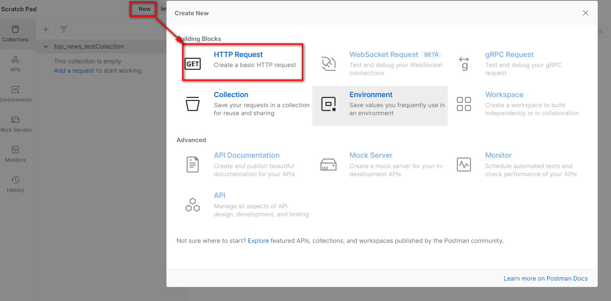

# 1. 什么是 PostMan ?
+  Postman是一个 **`接口测试工具`**，在做接口测试的时候，Postman相当于一个客户端，它可以模拟用户发起的各类HTTP请求，将请求数据发送至服务端，获取对应的响应结果， 从而验证响应中的结果数据是否和预期值相匹配;并确保开发人员能够及时处理接口中的bug，进而保证产品上线之后的稳定性和安全性。 它主要是用来模拟各种HTTP请求的(如:get/post/delete/put..等等)，Postman与浏览器的区别在于有的浏览器不能输出Json格式，而Postman更直观接口返回的结果。 

# 2 怎么安装 PostMan ?

+ 官网下载地址: https://www.getpostman.com ，或者使用资料中提供的安装包
+ 安装过程简单，一路next即可
+  第一次启动postman 会要求输入用户名和密码，如果没有的话，关闭，再次启动就可以直接进入了 

# 3 怎么使用 PostMan ?
> 启动PostMan后，创建一个collection，在该collection下专门存放和微头条项目相关的测试

> 创建完毕后，增加新的接口测试

> 填写要测试的接口相关的路径，参数，请求体内容等信息

> 测试完毕后，可以选择将该接口的测试进行保存，方便后续随时再次测试

