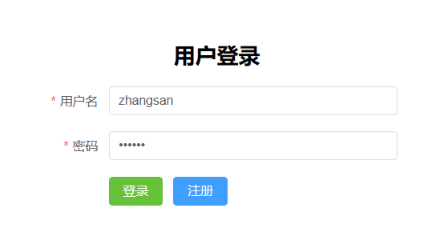
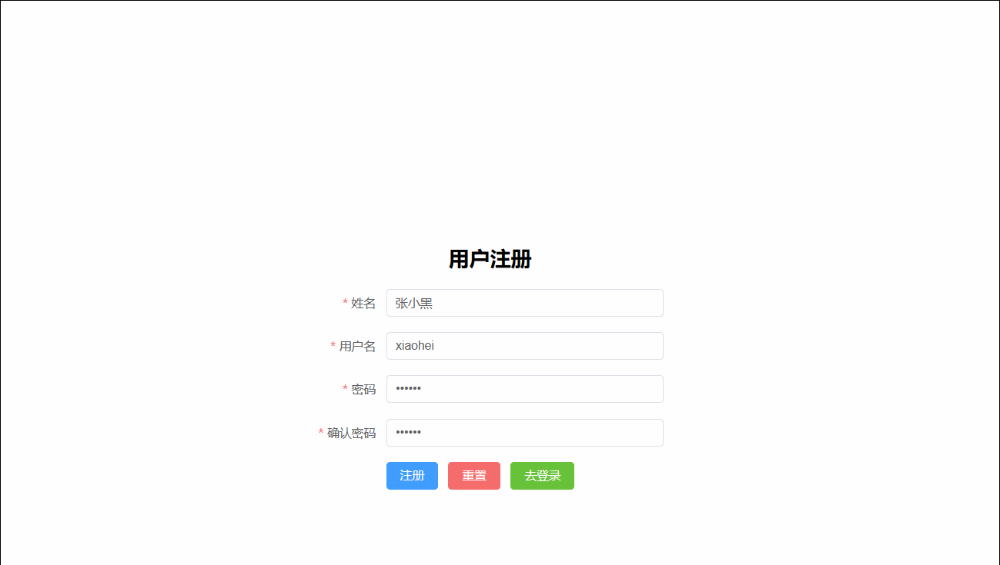

# 1. 登录表单提交


## 1.1 需求描述
> 用户在客户端输入用户名密码并向后端提交，后端根据用户名和密码判断登录是否成功，用户有误或者密码有误响应不同的提示信息

## 1.2 uri: 

``` http
user/login
```

## 1.3 请求方式:

``` http
POST
```

## 1.4 请求参数

``` json
{
    "username":"zhangsan"， //用户名
    "userPwd":"123456"     //明文密码
}
```

## 1.5 响应示例
### 登录成功

``` json
{
    "code":"200"，         // 成功状态码 
 	"message":"success"   // 成功状态描述
 	"data":{
		"token":"... ..." // 用户id的token
	}
}
```

### 用户名有误

``` json
{
    "code":"501"，
 	"message":"用户名有误"
 	"data":{}
}
```

### 密码有误

``` json
{
    "code":"503"，
 	"message":"密码有误"
 	"data":{}
}
```

## 1.6 后端代码
### NewsUserController

``` java
package com.atguigu.headline.controller;

import com.atguigu.headline.common.Result;
import com.atguigu.headline.common.ResultCodeEnum;
import com.atguigu.headline.pojo.NewsHeadline;
import com.atguigu.headline.pojo.NewsUser;
import com.atguigu.headline.service.NewsUserService;
import com.atguigu.headline.service.impl.NewsUserServiceImpl;
import com.atguigu.headline.util.JwtHelper;
import com.atguigu.headline.util.MD5Util;
import com.atguigu.headline.util.WebUtil;

import javax.servlet.ServletException;
import javax.servlet.annotation.WebServlet;
import javax.servlet.http.HttpServletRequest;
import javax.servlet.http.HttpServletResponse;
import java.io.IOException;
import java.util.HashMap;
import java.util.Map;


@WebServlet("/user/*")
public class NewsUserController extends BaseController{

    private NewsUserService newsUserService =new NewsUserServiceImpl();
    /**
     * 登录验证
     * @param req
     * @param resp
     * @throws ServletException
     * @throws IOException
     */
    protected void login(HttpServletRequest req, HttpServletResponse resp) throws ServletException, IOException {
        NewsUser newsUser = WebUtil.readJson(req, NewsUser.class);

        Result result =null;
        NewsUser loginNewsUser =newsUserService.findByUserName(newsUser.getUsername());
        // 判断用户名
        if (null != loginNewsUser) {
            // 判断密码
            if(loginNewsUser.getUserPwd().equals(MD5Util.encrypt(newsUser.getUserPwd()))){
                // 密码正确
                Map<String, Object> data =new HashMap<>();
                // 生成token口令
                String token = JwtHelper.createToken(loginNewsUser.getUid().longValue());
                // 封装数据map
                data.put("token", token);
                // 封装结果
                result=Result.ok(data);
            }else{
                // 封装密码错误结果
                result=Result.build(null, ResultCodeEnum.PASSWORD_ERROR);
            }
        }else{
            // 封装用户名错误结果
            result=Result.build(null,ResultCodeEnum.USERNAME_ERROR);
        }
        // 响应结果
        WebUtil.writeJson(resp, result);
    }
}
```

### NewsUserService

``` java
package com.atguigu.headline.service;

import com.atguigu.headline.pojo.NewsUser;

public interface NewsUserService {
    /**
     * 根据用户名，获得查询用户的方法
     * @param username 要查询的用户名
     * @return 如果找到返回NewsUser对象，找不到返回null
     */
    NewsUser findByUserName(String username);
}
```

### NewsUserServiceImpl

``` java 
package com.atguigu.headline.service.impl;

import com.atguigu.headline.dao.NewsUserDao;
import com.atguigu.headline.dao.impl.NewsUserDaoImpl;
import com.atguigu.headline.pojo.NewsUser;
import com.atguigu.headline.service.NewsTypeService;
import com.atguigu.headline.service.NewsUserService;
import com.atguigu.headline.util.MD5Util;

public class NewsUserServiceImpl implements NewsUserService {
    private NewsUserDao newsUserDao =new NewsUserDaoImpl();
    @Override
    public NewsUser findByUserName(String username) {
        return newsUserDao.findByUserName(username);
    }
}
```

### NewUserDao

``` java
package com.atguigu.headline.dao;
import com.atguigu.headline.pojo.NewsUser;

public interface NewsUserDao {
    /**
     * 根据用户名查询用户信息
     * @param username 要查询的用户名
     * @return 找到返回NewsUser对象，找不到返回null
     */
    NewsUser findByUserName(String username);
}
```

### NewsUserDaoImpl

``` java
package com.atguigu.headline.dao.impl;

import com.atguigu.headline.dao.BaseDao;
import com.atguigu.headline.dao.NewsUserDao;
import com.atguigu.headline.pojo.NewsUser;
import java.util.List;

public class NewsUserDaoImpl extends BaseDao implements NewsUserDao {

    @Override
    public NewsUser findByUserName(String username) {
        // 准备SQL
        String sql ="select uid，username，user_pwd userPwd ，nick_name nickName from news_user where username = ?";
        // 调用BaseDao公共查询方法
        List<NewsUser> newsUserList = baseQuery(NewsUser.class, sql, username);
        // 如果找到，返回集合中的第一个数据(其实就一个)
        if (null != newsUserList && newsUserList.size()>0){
            return  newsUserList.get(0);
        }
        return null;
    }
}
```

# 2. 根据token获取完整用户信息
## 2.1 需求描述
> 客户端发送请求，提交token请求头，后端根据token请求头获取登录用户的详细信息并响应给客户端进行存储

## 2.2 uri

``` http
user/getUserInfo
```

## 2.3 请求方式

``` http
GET
```

### 请求头

``` json
token: ... ...
```

## 2.4 响应示例
### 成功获取

``` JSON
{
    "code": 200，
    "message": "success"，
    "data": {
        "loginUser": {
            "uid": 1，
            "username": "zhangsan"，
            "userPwd": ""，
            "nickName": "张三"
        }
    }
}
```

### 获取失败

``` json
{
    "code": 504，
    "message": "notLogin"，
    "data": null
}
```

## 2.5 后端代码
### NewsUserController

``` java 
package com.atguigu.headline.controller;

import com.atguigu.headline.common.Result;
import com.atguigu.headline.common.ResultCodeEnum;
import com.atguigu.headline.pojo.NewsHeadline;
import com.atguigu.headline.pojo.NewsUser;
import com.atguigu.headline.service.NewsUserService;
import com.atguigu.headline.service.impl.NewsUserServiceImpl;
import com.atguigu.headline.util.JwtHelper;
import com.atguigu.headline.util.MD5Util;
import com.atguigu.headline.util.WebUtil;
import jakarta.servlet.ServletException;
import jakarta.servlet.annotation.WebServlet;
import jakarta.servlet.http.HttpServletRequest;
import jakarta.servlet.http.HttpServletResponse;

import java.io.IOException;
import java.util.HashMap;
import java.util.Map;


@WebServlet("/user/*")
public class NewsUserController extends BaseController{

    private NewsUserService newsUserService =new NewsUserServiceImpl();

/**
     * 接收token，根据token查询完整用户信息
     * @param req
     * @param resp
     * @throws ServletException
     * @throws IOException
     */
    protected void getUserInfo(HttpServletRequest req, HttpServletResponse resp) throws ServletException, IOException {
        String token = req.getHeader("token");
        Result  result =Result.build(null, ResultCodeEnum.NOTLOGIN);
        if(null!= token){
            if (!JwtHelper.isExpiration(token)) {
                Integer uid = JwtHelper.getUserId(token).intValue();
                NewsUser newsUser =newsUserService.findByUid(uid);
                newsUser.setUserPwd("");
                Map<String, Object> data =new HashMap<>();
                data.put("loginUser", newsUser);
                result=Result.ok(data);

            }
        }
        WebUtil.writeJson(resp, result);
    }
}
```

### NewsUserService

``` java 
package com.atguigu.headline.service;

import com.atguigu.headline.pojo.NewsUser;

public interface NewsUserService {
    /**
     * 根据用户id查询用户信息
     * @param uid 要查询的用户id
     * @return 找到返回NewsUser对象，找不到返回null
     */
    NewsUser findByUid(Integer uid);
}
```

### NewsUserServiceImpl

``` java
package com.atguigu.headline.service.impl;

import com.atguigu.headline.dao.NewsUserDao;
import com.atguigu.headline.dao.impl.NewsUserDaoImpl;
import com.atguigu.headline.pojo.NewsUser;
import com.atguigu.headline.service.NewsTypeService;
import com.atguigu.headline.service.NewsUserService;
import com.atguigu.headline.util.MD5Util;

public class NewsUserServiceImpl implements NewsUserService {
    private NewsUserDao newsUserDao =new NewsUserDaoImpl();

    @Override
    public NewsUser findByUid(Integer uid) {
        return newsUserDao.findByUid(uid);
    }
}
```

### NewUserDao

``` java
package com.atguigu.headline.dao;

import com.atguigu.headline.pojo.NewsUser;


public interface NewsUserDao {
    /**
     * 根据用户id连接数据库查询用户信息
     * @param uid  要查询的用户id
     * @return 找到返回NewsUser对象，找不到返回null
     */
    NewsUser findByUid(Integer uid);
}
```

### NewUserDaoImpl

``` java
package com.atguigu.headline.dao.impl;

import com.atguigu.headline.dao.BaseDao;
import com.atguigu.headline.dao.NewsUserDao;
import com.atguigu.headline.pojo.NewsUser;
import java.util.List;

public class NewsUserDaoImpl extends BaseDao implements NewsUserDao {
    @Override
    public NewsUser findByUid(Integer uid) {
        String sql ="select uid，username，user_pwd userPwd ，nick_name nickName from news_user where uid = ?";
        List<NewsUser> newsUserList = baseQuery(NewsUser.class, sql, uid);
        if (null != newsUserList && newsUserList.size()>0){
            return  newsUserList.get(0);
        }
        return null;
    }
}
```

# 3. 注册时用户名占用校验


## 3.1 需求说明
> 用户在注册时输入用户名时，立刻将用户名发送给后端，后端根据用户名查询用户名是否可用并做出响应

## 3.2 uri:

``` http
user/checkUserName
```

## 3.3 请求方式:

``` http
POST
```

## 3.4 请求参数

``` json
username=zhangsan
```

## 3.5 响应示例
### 用户名校验通过

``` json
{
    "code":"200"，
 	"message":"success"
 	"data":{}
}
```

### 用户名占用

``` json
{
    "code":"505"，
 	"message":"用户名占用"
 	"data":{}
}
```

## 3.6 后端代码

### NewsUserController

``` java 
package com.atguigu.headline.controller;

import com.atguigu.headline.common.Result;
import com.atguigu.headline.common.ResultCodeEnum;
import com.atguigu.headline.pojo.NewsHeadline;
import com.atguigu.headline.pojo.NewsUser;
import com.atguigu.headline.service.NewsUserService;
import com.atguigu.headline.service.impl.NewsUserServiceImpl;
import com.atguigu.headline.util.JwtHelper;
import com.atguigu.headline.util.MD5Util;
import com.atguigu.headline.util.WebUtil;
import jakarta.servlet.ServletException;
import jakarta.servlet.annotation.WebServlet;
import jakarta.servlet.http.HttpServletRequest;
import jakarta.servlet.http.HttpServletResponse;

import java.io.IOException;
import java.util.HashMap;
import java.util.Map;


@WebServlet("/user/*")
public class NewsUserController extends BaseController{

    private NewsUserService newsUserService =new NewsUserServiceImpl();

    /**
     * 注册时校验用户名是否被占用
     * @param req
     * @param resp
     * @throws ServletException
     * @throws IOException
     */
    protected void checkUserName(HttpServletRequest req, HttpServletResponse resp) throws ServletException, IOException {
        String username = req.getParameter("username");
        NewsUser newsUser = newsUserService.findByUserName(username);
        Result result=null;
        if (null == newsUser){
            result=Result.ok(null);
        }else{
            result=Result.build(null, ResultCodeEnum.USERNAME_USED);
        }
        WebUtil.writeJson(resp, result);
    }
}
```

# 4. 注册表单提交


## 4.2 需求说明
> 客户端将新用户信息发送给服务端，服务端将新用户存入数据库，存入之前做用户名是否被占用校验，校验通过响应成功提示，否则响应失败提示


## 4.3 uri:

``` http
user/regist
```

## 4.4 请求方式:

``` http
POST
```

## 4.5 请求参数

``` json
{
    "username":"zhangsan"，
    "userPwd":"123456"，
    "nickName":"张三"
}
```

## 4.6 响应示例
### 注册成功

``` json
{
    "code":"200"，
 	"message":"success"
 	"data":{}
}
```

### 用户名占用

``` json
{
    "code":"505"，
 	"message":"用户名占用"
 	"data":{}
}
```

## 4.7 后端代码
### NewsUserController

``` java 
package com.atguigu.headline.controller;

import com.atguigu.headline.common.Result;
import com.atguigu.headline.common.ResultCodeEnum;
import com.atguigu.headline.pojo.NewsHeadline;
import com.atguigu.headline.pojo.NewsUser;
import com.atguigu.headline.service.NewsUserService;
import com.atguigu.headline.service.impl.NewsUserServiceImpl;
import com.atguigu.headline.util.JwtHelper;
import com.atguigu.headline.util.MD5Util;
import com.atguigu.headline.util.WebUtil;
import jakarta.servlet.ServletException;
import jakarta.servlet.annotation.WebServlet;
import jakarta.servlet.http.HttpServletRequest;
import jakarta.servlet.http.HttpServletResponse;
import java.io.IOException;
import java.util.HashMap;
import java.util.Map;


@WebServlet("/user/*")
public class NewsUserController extends BaseController{

    private NewsUserService newsUserService =new NewsUserServiceImpl();

    /**
     * 注册功能接口
     * @param req
     * @param resp
     * @throws ServletException
     * @throws IOException
     */
    protected void regist(HttpServletRequest req, HttpServletResponse resp) throws ServletException, IOException {
        NewsUser newsUser = WebUtil.readJson(req,  NewsUser.class);
        NewsUser usedUser = newsUserService.findByUserName(newsUser.getUsername());
        Result result=null;
        if (null == usedUser){
            newsUserService.registUser(newsUser);
            result=Result.ok(null);
        }else{
            result=Result.build(null, ResultCodeEnum.USERNAME_USED);
        }
        WebUtil.writeJson(resp, result);
    }
}
```

### NewsUserService

``` java 
package com.atguigu.headline.service;

import com.atguigu.headline.pojo.NewsUser;

public interface NewsUserService {

    /**
     * 注册用户信息，注册成功返回大于0的整数，失败返回0
     * @param newsUser
     * @return
     */
    int registUser(NewsUser newsUser);
}
```

### NewsUserServiceImpl

``` java
package com.atguigu.headline.service.impl;

import com.atguigu.headline.dao.NewsUserDao;
import com.atguigu.headline.dao.impl.NewsUserDaoImpl;
import com.atguigu.headline.pojo.NewsUser;
import com.atguigu.headline.service.NewsTypeService;
import com.atguigu.headline.service.NewsUserService;
import com.atguigu.headline.util.MD5Util;

public class NewsUserServiceImpl implements NewsUserService {
    @Override
    public int registUser(NewsUser newsUser) {
        // 密码明文转密文
        newsUser.setUserPwd(MD5Util.encrypt(newsUser.getUserPwd()));
        // 存入数据库
        return newsUserDao.insertNewsUser(newsUser);
    }
}
```

### NewUserDao

``` java
package com.atguigu.headline.dao;

import com.atguigu.headline.pojo.NewsUser;


public interface NewsUserDao {
    /**
     * 将用户信息存入数据库
     * @param newsUser 
     * @return
     */
    int insertNewsUser(NewsUser newsUser);
}
```

### NewUserDaoImpl

``` java
package com.atguigu.headline.dao.impl;

import com.atguigu.headline.dao.BaseDao;
import com.atguigu.headline.dao.NewsUserDao;
import com.atguigu.headline.pojo.NewsUser;
import java.util.List;

public class NewsUserDaoImpl extends BaseDao implements NewsUserDao {
    @Override
    public int insertNewsUser(NewsUser newsUser) {
        String sql ="insert into news_user values(DEFAULT，?，?，?)";
        return baseUpdate(sql, newsUser.getUsername(), newsUser.getUserPwd(), newsUser.getNickName());
    }
}
```