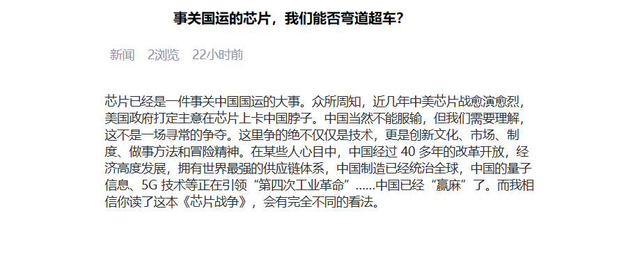

# 1. 查询所有头条分类


## 1.1 需求说明
> 进入新闻首页，查询所有分类并动态展示新闻类别栏位

## 1.2 uri:

``` http
portal/findAllTypes
```

## 1.3 请求方式

``` http
GET
```

## 1.4 请求参数

``` JSON
无
```

## 1.5 响应示例

``` JSON
{
    "code":"200"，
 	"message":"OK"
 	"data":
            [
                {
                    "tid":"1"，
                    "tname":"新闻"
                }，
                {
                    "tid":"2"，
                    "tname":"体育"
                }，
                {
                    "tid":"3"，
                    "tname":"娱乐"
                }，
                {
                    "tid":"4"，
                    "tname":"科技"
                }，
                {
                    "tid":"5"，
                    "tname":"其他"
                }
            ]
    
}

```

## 1.6 后端代码
### PortalController

``` java 
package com.atguigu.headline.controller;

import com.atguigu.headline.common.Result;
import com.atguigu.headline.pojo.NewsType;
import com.atguigu.headline.pojo.vo.HeadlineDetailVo;
import com.atguigu.headline.pojo.vo.HeadlineQueryVo;
import com.atguigu.headline.service.NewsHeadlineService;
import com.atguigu.headline.service.NewsTypeService;
import com.atguigu.headline.service.impl.NewsHeadlineServiceImpl;
import com.atguigu.headline.service.impl.NewsTypeServiceImpl;
import com.atguigu.headline.util.WebUtil;
import jakarta.servlet.ServletException;
import jakarta.servlet.annotation.WebServlet;
import jakarta.servlet.http.HttpServletRequest;
import jakarta.servlet.http.HttpServletResponse;

import java.io.IOException;
import java.util.HashMap;
import java.util.List;
import java.util.Map;

@WebServlet("/portal/*")
public class PortalController extends BaseController{

    private NewsHeadlineService headlineService=new NewsHeadlineServiceImpl();
    private NewsTypeService newsTypeService=new NewsTypeServiceImpl();
    /**
     * 查询所有新闻类型
     * @param req
     * @param resp
     * @throws ServletException
     * @throws IOException
     */
    protected void findAllTypes(HttpServletRequest req， HttpServletResponse resp) throws ServletException， IOException {
        List<NewsType> newsTypeList =newsTypeService.findAll();
        WebUtil.writeJson(resp，Result.ok(newsTypeList));
    }
}
```

### NewsTypeService

``` java 
package com.atguigu.headline.service;

import com.atguigu.headline.pojo.NewsType;

import java.util.List;

public interface NewsTypeService {
    /**
     * 查询全部新闻类型
     * @return
     */
    List<NewsType> findAll();
}

```

### NewsTypeServiceImpl

``` java
package com.atguigu.headline.service.impl;

import com.atguigu.headline.dao.NewsTypeDao;
import com.atguigu.headline.dao.impl.NewsTypeDaoImpl;
import com.atguigu.headline.pojo.NewsType;
import com.atguigu.headline.service.NewsTypeService;

import java.util.List;

public class NewsTypeServiceImpl implements NewsTypeService {
    private NewsTypeDao  newsTypeDao =new NewsTypeDaoImpl();
    @Override
    public List<NewsType> findAll() {
        return newsTypeDao.findAll();
    }
}
```

### NewUserDao

``` java
package com.atguigu.headline.dao;

import com.atguigu.headline.pojo.NewsType;

import java.util.List;

public interface NewsTypeDao {
    /**
     * 从数据库中查询全部新闻类型
     * @return
     */
    List<NewsType> findAll();
}

```

### NewsTypeDaoImpl

``` java
package com.atguigu.headline.dao.impl;

import com.atguigu.headline.dao.BaseDao;
import com.atguigu.headline.dao.NewsTypeDao;
import com.atguigu.headline.pojo.NewsType;

import java.util.List;

public class NewsTypeDaoImpl extends BaseDao implements NewsTypeDao {
    @Override
    public List<NewsType> findAll() {
        String sql ="select tid，tname from news_type";
        return  baseQuery(NewsType.class， sql);
    }
}
```

# 2. 分页带条件查询所有头条


## 2.1 需求说明

+ 客户端向服务端发送查询关键字，新闻类别，页码数，页大小
+ 服务端根据条件搜索分页信息，返回含页码数，页大小，总页数，总记录数，当前页数据等信息，并根据时间降序，浏览量降序排序

## 2.2 uri:

``` http
portal/findNewsPage
```

## 2.3 请求方式:

``` http
POST
```

## 2.4 请求参数:

``` json
{
    "keyWords":"马斯克"， // 搜索标题关键字
    "type":0，           // 新闻类型
    "pageNum":1，        // 页码数
    "pageSize":"10"     // 页大小
}
```

## 2.5 响应示例:

``` json
{
    "code":"200"，
 	"message":"success"
 	"data":{
    	"pageInfo":{
    		"pageData":[                           // 本页的数据
    			{
    				"hid":"1"，                     // 新闻id 
    				"title":"尚硅谷宣布 ... ..."，   // 新闻标题
    				"type":"1"，                    // 新闻所属类别编号
    				"pageViews":"40"，              // 新闻浏览量
    				"pastHours":"3" ，              // 发布时间已过小时数
    				"publisher":"1"                // 发布用户ID
				}，
				{
    				"hid":"1"，                     // 新闻id 
    				"title":"尚硅谷宣布 ... ..."，   // 新闻标题
    				"type":"1"，                    // 新闻所属类别编号
    				"pageViews":"40"，              // 新闻浏览量
    				"pastHours":"3"，              // 发布时间已过小时数
    				"publisher":"1"                // 发布用户ID
				}，
				{
    				"hid":"1"，                     // 新闻id 
    				"title":"尚硅谷宣布 ... ..."，   // 新闻标题
    				"type":"1"，                    // 新闻所属类别编号
    				"pageViews":"40"，              // 新闻浏览量
    				"pastHours":"3"，               // 发布时间已过小时数
    				"publisher":"1"                // 发布用户ID
				}
    		]，
			"pageNum":1，    //页码数
			"pageSize":10，  // 页大小
			"totalPage":20， // 总页数
			"totalSize":200 // 总记录数
		}
	}
}
```

## 2.6 后端代码

### PortalController

``` java 
package com.atguigu.headline.controller;

import com.atguigu.headline.common.Result;
import com.atguigu.headline.pojo.NewsType;
import com.atguigu.headline.pojo.vo.HeadlineDetailVo;
import com.atguigu.headline.pojo.vo.HeadlineQueryVo;
import com.atguigu.headline.service.NewsHeadlineService;
import com.atguigu.headline.service.NewsTypeService;
import com.atguigu.headline.service.impl.NewsHeadlineServiceImpl;
import com.atguigu.headline.service.impl.NewsTypeServiceImpl;
import com.atguigu.headline.util.WebUtil;
import jakarta.servlet.ServletException;
import jakarta.servlet.annotation.WebServlet;
import jakarta.servlet.http.HttpServletRequest;
import jakarta.servlet.http.HttpServletResponse;

import java.io.IOException;
import java.util.HashMap;
import java.util.List;
import java.util.Map;

@WebServlet("/portal/*")
public class PortalController extends BaseController{

    private NewsHeadlineService headlineService=new NewsHeadlineServiceImpl();
    private NewsTypeService newsTypeService=new NewsTypeServiceImpl();
    /**
     * 分页带条件查询新闻
     * @param req
     * @param resp
     * @throws ServletException
     * @throws IOException
     */
    protected void findNewsPage(HttpServletRequest req， HttpServletResponse resp) throws ServletException， IOException {
        HeadlineQueryVo headLineQueryVo = WebUtil.readJson(req， HeadlineQueryVo.class);
        // 查询分页五项数据
        Map<String，Object> pageInfo =headlineService.findPage(headLineQueryVo);
        // 将分页五项数据放入PageInfoMap
        Map<String，Object> pageInfoMap=new HashMap<>();
        pageInfoMap.put("pageInfo"，pageInfo);
        // 响应JSON
        WebUtil.writeJson(resp， Result.ok(pageInfoMap));
    }
}
```

### NewsHeadlineService

``` java 
package com.atguigu.headline.service;

import com.atguigu.headline.pojo.NewsHeadline;
import com.atguigu.headline.pojo.vo.HeadlineDetailVo;
import com.atguigu.headline.pojo.vo.HeadlineQueryVo;

import java.util.List;
import java.util.Map;

public interface NewsHeadlineService {
    /**
     * 分页查询头条新闻方法
     * @param headLineQueryVo
     * @return
     */
    Map<String， Object> findPage(HeadlineQueryVo headLineQueryVo);
}
```

### NewsHeadlineServiceImpl

``` java
package com.atguigu.headline.service.impl;

import com.atguigu.headline.dao.NewsHeadLineDao;
import com.atguigu.headline.dao.impl.NewsHeadlineDaoImpl;
import com.atguigu.headline.pojo.NewsHeadline;
import com.atguigu.headline.pojo.vo.HeadlineDetailVo;
import com.atguigu.headline.pojo.vo.HeadlinePageVo;
import com.atguigu.headline.pojo.vo.HeadlineQueryVo;
import com.atguigu.headline.service.NewsHeadlineService;

import java.util.HashMap;
import java.util.List;
import java.util.Map;

public class NewsHeadlineServiceImpl  implements NewsHeadlineService {
    private NewsHeadLineDao newsHeadLineDao =new NewsHeadlineDaoImpl();

    @Override
    public Map<String， Object> findPage(HeadlineQueryVo headLineQueryVo) {
        // 准备一个map，用于装分页的五项数据
        Map<String，Object> pageInfo =new HashMap<>();
        // 分页查询本页数据
        List<HeadlinePageVo>  pageData =newsHeadLineDao.findPageList(headLineQueryVo);
        // 分页查询满足记录的总数据量
        int totalSize = newsHeadLineDao.findPageCount(headLineQueryVo);
        // 页大小
        int pageSize =headLineQueryVo.getPageSize();
        // 总页码数
        int totalPage=totalSize%pageSize == 0 ?  totalSize/pageSize  : totalSize/pageSize+1;
        // 当前页码数
        int pageNum= headLineQueryVo.getPageNum();
        pageInfo.put("pageData"，pageData);
        pageInfo.put("pageNum"，pageNum);
        pageInfo.put("pageSize"，pageSize);
        pageInfo.put("totalPage"，totalPage);
        pageInfo.put("totalSize"，totalSize);


        return pageInfo;
    }
}
```

### NewsHeadLineDao

``` java
package com.atguigu.headline.dao;

import com.atguigu.headline.pojo.NewsHeadline;
import com.atguigu.headline.pojo.vo.HeadlineDetailVo;
import com.atguigu.headline.pojo.vo.HeadlinePageVo;
import com.atguigu.headline.pojo.vo.HeadlineQueryVo;

import java.util.List;

public interface NewsHeadLineDao {
    /**
     * 根据查询条件，查询满足条件的记录数
     * @param headLineQueryVo
     * @return
     */
    int findPageCount(HeadlineQueryVo headLineQueryVo);

    /**
     * 根据查询条件，查询当前页数据
     * @param headLineQueryVo
     * @return
     */
    List<HeadlinePageVo> findPageList(HeadlineQueryVo headLineQueryVo);
}
```

### NewsHeadlineDaoImpl

``` java
package com.atguigu.headline.dao.impl;

import com.atguigu.headline.dao.BaseDao;
import com.atguigu.headline.dao.NewsHeadLineDao;
import com.atguigu.headline.pojo.NewsHeadline;
import com.atguigu.headline.pojo.vo.HeadlineDetailVo;
import com.atguigu.headline.pojo.vo.HeadlinePageVo;
import com.atguigu.headline.pojo.vo.HeadlineQueryVo;

import java.util.LinkedList;
import java.util.List;

public class NewsHeadlineDaoImpl extends BaseDao implements NewsHeadLineDao{

    @Override
    public int findPageCount(HeadlineQueryVo headLineQueryVo) {
        //  拼接动态 SQL，拼接参数
        List<Object> args =new LinkedList<>();
        String  sql="select count(1) from news_headline where is_deleted=0 ";
        StringBuilder sqlBuffer =new StringBuilder(sql) ;
        String keyWords = headLineQueryVo.getKeyWords();
        //判断并动态拼接条件
        if (null != keyWords && keyWords.length()>0){
            sqlBuffer.append("and title like ? ");
            args.add("%"+keyWords+"%");
        }
        //  判断并动态拼接条件
        Integer type = headLineQueryVo.getType();
        if(null != type  && type != 0){
            sqlBuffer.append("and type  =  ? ");
            args.add(type);
        }

        // 参数转数组
        Object[] argsArr = args.toArray();
        System.out.println(sqlBuffer.toString());
        Long totalSize = baseQueryObject(Long.class， sqlBuffer.toString()， argsArr);
        // 返回数据
        return totalSize.intValue();
    }

    @Override
    public List<HeadlinePageVo> findPageList(HeadlineQueryVo headLineQueryVo) {
        //  拼接动态 SQL，拼接参数
        List<Object> args =new LinkedList<>();
        String  sql="select hid，title，type，page_views pageViews，TIMESTAMPDIFF(HOUR，create_time，NOW()) pastHours，publisher from news_headline where is_deleted=0 ";
        StringBuilder sqlBuffer =new StringBuilder(sql) ;
        String keyWords = headLineQueryVo.getKeyWords();
        if (null != keyWords && keyWords.length()>0){
            sqlBuffer.append("and title like ? ");
            args.add("%"+keyWords+"%");
        }
        Integer type = headLineQueryVo.getType();
        if(null != type  && type != 0){
            sqlBuffer.append("and type  =  ? ");
            args.add(type);
        }

        sqlBuffer.append("order by pastHours ， page_views desc ");
        sqlBuffer.append("limit ? ， ?");
        args.add((headLineQueryVo.getPageNum()-1)*headLineQueryVo.getPageSize());
        args.add(headLineQueryVo.getPageSize());

        // 参数转数组
        Object[] argsArr = args.toArray();
        System.out.println(sqlBuffer.toString());
        List<HeadlinePageVo> pageData = baseQuery(HeadlinePageVo.class， sqlBuffer.toString()， argsArr);

        return pageData;
    }
}
```

# 3. 查看头条详情




## 3.1 需求说明
+ 用户点击"查看全文"时，向服务端发送新闻id
+ 后端根据新闻id查询完整新闻文章信息并返回
+ 后端要同时让新闻的浏览量+1

## 3.2 uri

``` http
portal/showHeadlineDetail
```

## 3.3 请求方式

``` http
POST
```

## 3.4 请求参数

``` json
hid=1
```

## 3.5 响应示例

``` json
{
    "code":"200"，
    "message":"success"，
    "data":{
        "headline":{
            "hid":"1"，                     // 新闻id 
            "title":"马斯克宣布 ... ..."，   // 新闻标题
            "article":"... ..."            // 新闻正文
            "type":"1"，                    // 新闻所属类别编号
            "typeName":"科技"，             // 新闻所属类别
            "pageViews":"40"，              // 新闻浏览量
            "pastHours":"3" ，              // 发布时间已过小时数
            "publisher":"1" ，               // 发布用户ID
            "author":"张三"                 // 新闻作者
        }
    }
}
```

## 3.6 后端代码

### PortalController

``` java 
package com.atguigu.headline.controller;

import com.atguigu.headline.common.Result;
import com.atguigu.headline.pojo.NewsType;
import com.atguigu.headline.pojo.vo.HeadlineDetailVo;
import com.atguigu.headline.pojo.vo.HeadlineQueryVo;
import com.atguigu.headline.service.NewsHeadlineService;
import com.atguigu.headline.service.NewsTypeService;
import com.atguigu.headline.service.impl.NewsHeadlineServiceImpl;
import com.atguigu.headline.service.impl.NewsTypeServiceImpl;
import com.atguigu.headline.util.WebUtil;
import jakarta.servlet.ServletException;
import jakarta.servlet.annotation.WebServlet;
import jakarta.servlet.http.HttpServletRequest;
import jakarta.servlet.http.HttpServletResponse;

import java.io.IOException;
import java.util.HashMap;
import java.util.List;
import java.util.Map;

@WebServlet("/portal/*")
public class PortalController extends BaseController{

    private NewsHeadlineService headlineService=new NewsHeadlineServiceImpl();
    private NewsTypeService newsTypeService=new NewsTypeServiceImpl();
    /**
     * 查询单个新闻详情
     * @param req
     * @param resp
     * @throws ServletException
     * @throws IOException
     */
    protected void showHeadlineDetail(HttpServletRequest req， HttpServletResponse resp) throws ServletException， IOException {
        // 获取要查询的详情新闻id
        Integer hid =Integer.parseInt(req.getParameter("hid"));
        
        // 查询新闻详情vo
        HeadlineDetailVo headlineDetailVo =headlineService.findHeadlineDetail(hid);
        // 封装data内容
        Map<String ，Object> data =new HashMap<>();
        data.put("headline"，headlineDetailVo);
        // 响应JSON
        WebUtil.writeJson(resp，Result.ok(data));
    }
}
```

### NewsHeadlineService

``` java 
package com.atguigu.headline.service;

import com.atguigu.headline.pojo.NewsHeadline;
import com.atguigu.headline.pojo.vo.HeadlineDetailVo;
import com.atguigu.headline.pojo.vo.HeadlineQueryVo;

import java.util.List;
import java.util.Map;

public interface NewsHeadlineService {
    /**
     * 根据头条id，显示头条详情
     * @param hid
     * @return
     */
    HeadlineDetailVo findHeadlineDetail(Integer hid);
}
```

### NewsHeadlineServiceImpl

``` java
package com.atguigu.headline.service.impl;

import com.atguigu.headline.dao.NewsHeadLineDao;
import com.atguigu.headline.dao.impl.NewsHeadlineDaoImpl;
import com.atguigu.headline.pojo.NewsHeadline;
import com.atguigu.headline.pojo.vo.HeadlineDetailVo;
import com.atguigu.headline.pojo.vo.HeadlinePageVo;
import com.atguigu.headline.pojo.vo.HeadlineQueryVo;
import com.atguigu.headline.service.NewsHeadlineService;

import java.util.HashMap;
import java.util.List;
import java.util.Map;

public class NewsHeadlineServiceImpl  implements NewsHeadlineService {
    private NewsHeadLineDao newsHeadLineDao =new NewsHeadlineDaoImpl();
    @Override
    public HeadlineDetailVo findHeadlineDetail(Integer hid) {
        // 修改新闻信息浏览量+1
        newsHeadLineDao.increasePageViews(hid);
        // 查询新闻详情
        return newsHeadLineDao.findHeadlineDetail(hid);
    }
}
```

### NewsHeadLineDao

``` java
package com.atguigu.headline.dao;

import com.atguigu.headline.pojo.NewsHeadline;
import com.atguigu.headline.pojo.vo.HeadlineDetailVo;
import com.atguigu.headline.pojo.vo.HeadlinePageVo;
import com.atguigu.headline.pojo.vo.HeadlineQueryVo;

import java.util.List;

public interface NewsHeadLineDao {
    /**
     * 多表查询新闻详情
     * @param hid
     * @return
     */
    HeadlineDetailVo findHeadlineDetail(Integer hid);
    
    int increasePageViews(Integer hid);
}
```

### NewsHeadlineDaoImpl

``` java
package com.atguigu.headline.dao.impl;

import com.atguigu.headline.dao.BaseDao;
import com.atguigu.headline.dao.NewsHeadLineDao;
import com.atguigu.headline.pojo.NewsHeadline;
import com.atguigu.headline.pojo.vo.HeadlineDetailVo;
import com.atguigu.headline.pojo.vo.HeadlinePageVo;
import com.atguigu.headline.pojo.vo.HeadlineQueryVo;

import java.util.LinkedList;
import java.util.List;

public class NewsHeadlineDaoImpl extends BaseDao implements NewsHeadLineDao{
    @Override
    public HeadlineDetailVo findHeadlineDetail(Integer hid) {
        String sql ="select hid，title，article，type， tname typeName ，page_views pageViews，TIMESTAMPDIFF(HOUR，create_time，NOW()) pastHours，publisher，nick_name author from news_headline h left join  news_type t on h.type = t.tid left join news_user u  on h.publisher = u.uid where hid = ?";
        List<HeadlineDetailVo> headlineDetailVoList = baseQuery(HeadlineDetailVo.class， sql， hid);
        if(null != headlineDetailVoList && headlineDetailVoList.size()>0)
            return headlineDetailVoList.get(0);
        return null;
    }
    
    @Override
    public int increasePageViews(Integer hid) {
        String sql ="update news_headline set page_views = page_views +1 where hid =?";
        return baseUpdate(sql，hid);
    }
}
```