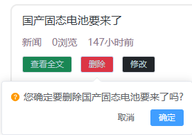

# 1. 登录校验
## 1.1 需求说明

+ 客户端在进入发布页前、发布新闻前、进入修改页前、修改前、删除新闻前先向服务端发送请求携带token请求头
+ 后端接收token请求头后，校验用户登录是否过期并做响应
+ 前端根据响应信息提示用户进入登录页还是进入正常业务页面

## 1.2 uri

``` http
user/checkLogin
```

## 1.3 请求方式

``` http
GET
```

## 1.4 请求参数

``` json
无
```

### 请求头

``` JSON
token: ... ...
```

## 1.5 响应示例
### 登录未过期

``` json
{
    "code":"200"，
    "message":"success"，
    "data":{}
}
```

### 登录已过期

``` json
{
    "code":"504"，
    "message":"loginExpired"，
    "data":{}
}
```

## 1.6 后端代码
### NewsUserController

``` java 
package com.atguigu.headline.controller;

import com.atguigu.headline.common.Result;
import com.atguigu.headline.common.ResultCodeEnum;
import com.atguigu.headline.pojo.NewsHeadline;
import com.atguigu.headline.pojo.NewsUser;
import com.atguigu.headline.service.NewsUserService;
import com.atguigu.headline.service.impl.NewsUserServiceImpl;
import com.atguigu.headline.util.JwtHelper;
import com.atguigu.headline.util.MD5Util;
import com.atguigu.headline.util.WebUtil;
import jakarta.servlet.ServletException;
import jakarta.servlet.annotation.WebServlet;
import jakarta.servlet.http.HttpServletRequest;
import jakarta.servlet.http.HttpServletResponse;

import java.io.IOException;
import java.util.HashMap;
import java.util.Map;


@WebServlet("/user/*")
public class NewsUserController extends BaseController{

    private NewsUserService newsUserService =new NewsUserServiceImpl();
    /**
     * 通过token检验用户登录是否过期
     * @param req
     * @param resp
     * @throws ServletException
     * @throws IOException
     */
    protected void checkLogin(HttpServletRequest req， HttpServletResponse resp) throws ServletException， IOException {
        String token = req.getHeader("token");
        Result  result =Result.build(null，ResultCodeEnum.NOTLOGIN);
        if(null!= token){
            if (!JwtHelper.isExpiration(token)) {
                result=Result.ok(null);
            }
        }
        WebUtil.writeJson(resp，result);
    }
}
```

### 登录校验过滤器

``` java
package com.atguigu.headline.filters;

import com.atguigu.headline.common.Result;
import com.atguigu.headline.common.ResultCodeEnum;
import com.atguigu.headline.util.JwtHelper;
import com.atguigu.headline.util.WebUtil;
import jakarta.servlet.*;
import jakarta.servlet.http.HttpServletRequest;
import jakarta.servlet.http.HttpServletResponse;

import java.io.IOException;

public class LoginFilter implements Filter {
    @Override
    public void doFilter(ServletRequest servletRequest， ServletResponse servletResponse， FilterChain filterChain) throws IOException， ServletException {
        HttpServletRequest request =(HttpServletRequest)  servletRequest;
        String token = request.getHeader("token");
        boolean flag =false;
        // token不为空并且没过期
        if (null  != token ){
            boolean expiration = JwtHelper.isExpiration(token);
            if (!expiration ){
               flag=true;
            }
        }
        if (flag){
            filterChain.doFilter(servletRequest，servletResponse);
        }else{
            WebUtil.writeJson((HttpServletResponse) servletResponse， Result.build(null， ResultCodeEnum.NOTLOGIN));
        }
    }
}
```

### `web.xml` 中配置登录校验过滤器

``` xml
    <!--登录校验过滤器-->
    <filter>
        <filter-name>loginFilter</filter-name>
        <filter-class>com.atguigu.headline.filters.LoginFilter</filter-class>
    </filter>
    <filter-mapping>
        <filter-name>loginFilter</filter-name>
        <url-pattern>/headline/*</url-pattern>
    </filter-mapping>
```

# 2. 提交发布头条


## 2.1 需求说明

+ 用户在客户端输入发布的新闻信息完毕后
+ 发布前先请求后端的登录校验接口验证登录
+ 登录通过则提交新闻信息
+ 后端将新闻信息存入数据库

## 2.2 uri

``` http
headline/publish
```

## 2.3 请求方式

``` http
POST
```

## 2.4 请求头

``` json
token: ... ...
```

## 2.5 请求参数

``` json
{
    "title":"尚硅谷宣布 ... ..."，   // 文章标题
    "article":"... ..."，          // 文章内容
    "type":"1"                    // 文章类别
}
```

## 2.6 响应示例
### 发布成功

``` json
{
    "code":"200"，
    "message":"success"，
    "data":{}
}
```

### 失去登录状态发布失败

```  json
{
    "code":"504"，
    "message":"loginExpired"，
    "data":{}
}
```

## 2.7 后端代码
### NewsHeadlineController

``` java 
package com.atguigu.headline.controller;


import com.atguigu.headline.common.Result;
import com.atguigu.headline.pojo.NewsHeadline;
import com.atguigu.headline.service.NewsHeadlineService;
import com.atguigu.headline.service.impl.NewsHeadlineServiceImpl;
import com.atguigu.headline.util.JwtHelper;
import com.atguigu.headline.util.WebUtil;
import jakarta.servlet.ServletException;
import jakarta.servlet.annotation.WebServlet;
import jakarta.servlet.http.HttpServletRequest;
import jakarta.servlet.http.HttpServletResponse;

import java.io.IOException;
import java.util.HashMap;
import java.util.Map;

@WebServlet("/headline/*")
public class NewsHeadlineController extends BaseController {

    private NewsHeadlineService newsHeadlineService =new NewsHeadlineServiceImpl();
    /**
     * 发布新闻
     * @param req
     * @param resp
     * @throws ServletException
     * @throws IOException
     */
    protected void publish(HttpServletRequest req， HttpServletResponse resp) throws ServletException， IOException {
        // 读取新闻信息
        NewsHeadline newsHeadline = WebUtil.readJson(req， NewsHeadline.class);
        // 通过token获取发布者ID
        String token = req.getHeader("token");
        Long userId = JwtHelper.getUserId(token);
        newsHeadline.setPublisher(userId.intValue());
        // 将新闻存入数据库
        newsHeadlineService.addNewsHeadline(newsHeadline);
        WebUtil.writeJson(resp，Result.ok(null));
    }
}
```

### NewsHeadlineService

``` java 
package com.atguigu.headline.service;

import com.atguigu.headline.pojo.NewsHeadline;
import com.atguigu.headline.pojo.vo.HeadlineDetailVo;
import com.atguigu.headline.pojo.vo.HeadlineQueryVo;

import java.util.List;
import java.util.Map;

public interface NewsHeadlineService {
    /**
     * 新增头条
     * @param newsHeadline
     * @return
     */
    int addNewsHeadline(NewsHeadline newsHeadline);
}
```

### NewsHeadlineServiceImpl

``` java
package com.atguigu.headline.service.impl;

import com.atguigu.headline.dao.NewsHeadLineDao;
import com.atguigu.headline.dao.impl.NewsHeadlineDaoImpl;
import com.atguigu.headline.pojo.NewsHeadline;
import com.atguigu.headline.pojo.vo.HeadlineDetailVo;
import com.atguigu.headline.pojo.vo.HeadlinePageVo;
import com.atguigu.headline.pojo.vo.HeadlineQueryVo;
import com.atguigu.headline.service.NewsHeadlineService;

import java.util.HashMap;
import java.util.List;
import java.util.Map;

public class NewsHeadlineServiceImpl  implements NewsHeadlineService {
    private NewsHeadLineDao newsHeadLineDao =new NewsHeadlineDaoImpl();
    public int addNewsHeadline(NewsHeadline newsHeadline) {
        return newsHeadLineDao.addNewsHeadline(newsHeadline);
    }
}
```

### NewsHeadLineDao

``` java
package com.atguigu.headline.dao;

import com.atguigu.headline.pojo.NewsHeadline;
import com.atguigu.headline.pojo.vo.HeadlineDetailVo;
import com.atguigu.headline.pojo.vo.HeadlinePageVo;
import com.atguigu.headline.pojo.vo.HeadlineQueryVo;

import java.util.List;

public interface NewsHeadLineDao {
    /**
     * 头条存入数据库
     * @param newsHeadline
     * @return
     */
    int addNewsHeadline(NewsHeadline newsHeadline);
}
```

### NewsHeadlineDaoImpl

``` java
package com.atguigu.headline.dao.impl;

import com.atguigu.headline.dao.BaseDao;
import com.atguigu.headline.dao.NewsHeadLineDao;
import com.atguigu.headline.pojo.NewsHeadline;
import com.atguigu.headline.pojo.vo.HeadlineDetailVo;
import com.atguigu.headline.pojo.vo.HeadlinePageVo;
import com.atguigu.headline.pojo.vo.HeadlineQueryVo;

import java.util.LinkedList;
import java.util.List;

public class NewsHeadlineDaoImpl extends BaseDao implements NewsHeadLineDao{
    @Override
    public int addNewsHeadline(NewsHeadline newsHeadline) {
        String sql = "insert into news_headline values(DEFAULT，?，?，?，?，0，NOW()，NOW()，0)";

        return baseUpdate(
                sql，
                newsHeadline.getTitle()，
                newsHeadline.getArticle()，
                newsHeadline.getType()，
                newsHeadline.getPublisher()
        );
    }
}
```

# 3. 修改头条回显


## 3.1 需求说明

+ 前端先调用登录校验接口，校验登录是否过期
+ 登录校验通过后 ，则根据新闻id查询新闻的完整信息并响应给前端

## 3.2 uri

``` http
headline/findHeadlineByHid
```

## 3.3 请求方式

``` http
POST
```

## 3.4 请求参数

``` json
hid=1
```

## 3.5 响应示例
### 查询成功

``` json
{
    "code":"200"，
    "message":"success"，
    "data":{
        "headline":{
            "hid":"1"，
            "title":"马斯克宣布"，
            "article":"... ... "，
            "type":"2"
        }
    }
}
```

## 3.6 后端代码
### NewsHeadlineController

``` java 
package com.atguigu.headline.controller;


import com.atguigu.headline.common.Result;
import com.atguigu.headline.pojo.NewsHeadline;
import com.atguigu.headline.service.NewsHeadlineService;
import com.atguigu.headline.service.impl.NewsHeadlineServiceImpl;
import com.atguigu.headline.util.JwtHelper;
import com.atguigu.headline.util.WebUtil;
import jakarta.servlet.ServletException;
import jakarta.servlet.annotation.WebServlet;
import jakarta.servlet.http.HttpServletRequest;
import jakarta.servlet.http.HttpServletResponse;

import java.io.IOException;
import java.util.HashMap;
import java.util.Map;

@WebServlet("/headline/*")
public class NewsHeadlineController extends BaseController {
    private NewsHeadlineService newsHeadlineService =new NewsHeadlineServiceImpl();
    /**
     * 修改新闻回显
     * @param req
     * @param resp
     * @throws ServletException
     * @throws IOException
     */
    protected void findHeadlineByHid(HttpServletRequest req， HttpServletResponse resp) throws ServletException， IOException {
        Integer hid = Integer.parseInt(req.getParameter("hid"));
        NewsHeadline newsHeadline =newsHeadlineService.findHeadlineByHid(hid);
        Map<String ，Object> data =new HashMap<>();
        data.put("headline"，newsHeadline);
        WebUtil.writeJson(resp，Result.ok(data));

    }
}
```

### NewsHeadlineService

``` java 
package com.atguigu.headline.service;

import com.atguigu.headline.pojo.NewsHeadline;
import com.atguigu.headline.pojo.vo.HeadlineDetailVo;
import com.atguigu.headline.pojo.vo.HeadlineQueryVo;

import java.util.List;
import java.util.Map;

public interface NewsHeadlineService {
    /**
     * 根据新闻id查询单个新闻
     * @param hid
     * @return
     */
    NewsHeadline findHeadlineByHid(Integer hid);
}
```

### NewsHeadlineServiceImpl

``` java
package com.atguigu.headline.service.impl;

import com.atguigu.headline.dao.NewsHeadLineDao;
import com.atguigu.headline.dao.impl.NewsHeadlineDaoImpl;
import com.atguigu.headline.pojo.NewsHeadline;
import com.atguigu.headline.pojo.vo.HeadlineDetailVo;
import com.atguigu.headline.pojo.vo.HeadlinePageVo;
import com.atguigu.headline.pojo.vo.HeadlineQueryVo;
import com.atguigu.headline.service.NewsHeadlineService;

import java.util.HashMap;
import java.util.List;
import java.util.Map;

public class NewsHeadlineServiceImpl  implements NewsHeadlineService {
    private NewsHeadLineDao newsHeadLineDao =new NewsHeadlineDaoImpl();
    @Override
    public NewsHeadline findHeadlineByHid(Integer hid) {
        return newsHeadLineDao.findHeadlineByHid(hid);
    }
}
```

### NewsHeadLineDao

``` java
package com.atguigu.headline.dao;

import com.atguigu.headline.pojo.NewsHeadline;
import com.atguigu.headline.pojo.vo.HeadlineDetailVo;
import com.atguigu.headline.pojo.vo.HeadlinePageVo;
import com.atguigu.headline.pojo.vo.HeadlineQueryVo;

import java.util.List;

public interface NewsHeadLineDao {
    NewsHeadline findHeadlineByHid(Integer hid);
}
```

### NewUserDaoImpl

``` java
package com.atguigu.headline.dao.impl;

import com.atguigu.headline.dao.BaseDao;
import com.atguigu.headline.dao.NewsHeadLineDao;
import com.atguigu.headline.pojo.NewsHeadline;
import com.atguigu.headline.pojo.vo.HeadlineDetailVo;
import com.atguigu.headline.pojo.vo.HeadlinePageVo;
import com.atguigu.headline.pojo.vo.HeadlineQueryVo;

import java.util.LinkedList;
import java.util.List;

public class NewsHeadlineDaoImpl extends BaseDao implements NewsHeadLineDao{
    
    @Override
    public NewsHeadline findHeadlineByHid(Integer hid) {
        String sql ="select hid，title，article，type，publisher，page_views pageViews from news_headline where hid =?";
        List<NewsHeadline> newsHeadlineList = baseQuery(NewsHeadline.class， sql， hid);
        if(null != newsHeadlineList && newsHeadlineList.size()>0)
            return newsHeadlineList.get(0);
        return null;
    }
}
```

# 4. 保存修改
## 4.1 需求描述

+ 客户端将新闻信息修改后，提交前先请求登录校验接口校验登录状态
+ 登录校验通过则提交修改后的新闻信息，后端接收并更新进入数据库

## 4.2 uri

``` http
headline/update
```

## 4.3 请求方式 

``` http
POST
```

## 4.4 请求参数

``` JSON
{
    "hid":"1"，
    "title":"尚硅谷宣布 ... ..."，
    "article":"... ..."，
    "type":"2"
}
```

## 4.5 响应示例
### 修改成功

``` json
{
    "code":"200"，
    "message":"success"，
    "data":{}
}
```

### 修改失败

```  json
{
    "code":"504"，
    "message":"loginExpired"，
    "data":{}
}
```

## 4.6 后端代码
### NewsHeadlineController

``` java 
package com.atguigu.headline.controller;


import com.atguigu.headline.common.Result;
import com.atguigu.headline.pojo.NewsHeadline;
import com.atguigu.headline.service.NewsHeadlineService;
import com.atguigu.headline.service.impl.NewsHeadlineServiceImpl;
import com.atguigu.headline.util.JwtHelper;
import com.atguigu.headline.util.WebUtil;
import jakarta.servlet.ServletException;
import jakarta.servlet.annotation.WebServlet;
import jakarta.servlet.http.HttpServletRequest;
import jakarta.servlet.http.HttpServletResponse;

import java.io.IOException;
import java.util.HashMap;
import java.util.Map;

@WebServlet("/headline/*")
public class NewsHeadlineController extends BaseController {
    private NewsHeadlineService newsHeadlineService =new NewsHeadlineServiceImpl();
    /**
     * 更新新闻信息
     * @param req
     * @param resp
     * @throws ServletException
     * @throws IOException
     */
    protected void update(HttpServletRequest req， HttpServletResponse resp) throws ServletException， IOException {
        NewsHeadline newsHeadline = WebUtil.readJson(req， NewsHeadline.class);
        newsHeadlineService.updateNewsHeadline(newsHeadline);
        WebUtil.writeJson(resp，Result.ok(null));
    }
}
```

### NewsHeadlineService

``` java 
package com.atguigu.headline.service;

import com.atguigu.headline.pojo.NewsHeadline;
import com.atguigu.headline.pojo.vo.HeadlineDetailVo;
import com.atguigu.headline.pojo.vo.HeadlineQueryVo;

import java.util.List;
import java.util.Map;

public interface NewsHeadlineService {
    int updateNewsHeadline(NewsHeadline newsHeadline);
}
```

### NewsHeadlineServiceImpl

``` java
package com.atguigu.headline.service.impl;

import com.atguigu.headline.dao.NewsHeadLineDao;
import com.atguigu.headline.dao.impl.NewsHeadlineDaoImpl;
import com.atguigu.headline.pojo.NewsHeadline;
import com.atguigu.headline.pojo.vo.HeadlineDetailVo;
import com.atguigu.headline.pojo.vo.HeadlinePageVo;
import com.atguigu.headline.pojo.vo.HeadlineQueryVo;
import com.atguigu.headline.service.NewsHeadlineService;

import java.util.HashMap;
import java.util.List;
import java.util.Map;

public class NewsHeadlineServiceImpl  implements NewsHeadlineService {
    private NewsHeadLineDao newsHeadLineDao =new NewsHeadlineDaoImpl();
    @Override
    public int updateNewsHeadline(NewsHeadline newsHeadline) {
        return newsHeadLineDao.updateNewsHeadline(newsHeadline);
    }
}
```

### NewsHeadLineDao

``` java
package com.atguigu.headline.dao;

import com.atguigu.headline.pojo.NewsHeadline;
import com.atguigu.headline.pojo.vo.HeadlineDetailVo;
import com.atguigu.headline.pojo.vo.HeadlinePageVo;
import com.atguigu.headline.pojo.vo.HeadlineQueryVo;

import java.util.List;

public interface NewsHeadLineDao {
    int updateNewsHeadline(NewsHeadline newsHeadline);
}
```

### NewUserDaoImpl

``` java
package com.atguigu.headline.dao.impl;

import com.atguigu.headline.dao.BaseDao;
import com.atguigu.headline.dao.NewsHeadLineDao;
import com.atguigu.headline.pojo.NewsHeadline;
import com.atguigu.headline.pojo.vo.HeadlineDetailVo;
import com.atguigu.headline.pojo.vo.HeadlinePageVo;
import com.atguigu.headline.pojo.vo.HeadlineQueryVo;

import java.util.LinkedList;
import java.util.List;

public class NewsHeadlineDaoImpl extends BaseDao implements NewsHeadLineDao{
    @Override
    public int updateNewsHeadline(NewsHeadline newsHeadline) {
        String sql ="update news_headline set title = ?， article= ? ， type =? ， update_time = NOW() where hid = ? ";
        return baseUpdate(
                sql，
                newsHeadline.getTitle()，
                newsHeadline.getArticle()，
                newsHeadline.getType()，
                newsHeadline.getHid()
        );
    }
}
```

# 5. 删除头条



## 5.1 需求说明

+ 将要删除的新闻id发送给服务端
+ 服务端校验登录是否过期，未过期则直接删除，过期则响应登录过期信息

## 5.2 uri

``` http
headline/removeByHid
```

## 5.3 请求方式

``` http
POST
```

## 5.4 请求参数

```  json
hid=1
```

## 5.5 响应示例

### 删除成功

``` json
{
    "code":"200"，
    "message":"success"，
    "data":{}
}
```

### 删除失败

``` json
{
    "code":"504"，
    "message":"loginExpired"，
    "data":{}
    
}
```

## 5.6 后端代码
### NewsHeadlineController

``` java 
package com.atguigu.headline.controller;


import com.atguigu.headline.common.Result;
import com.atguigu.headline.pojo.NewsHeadline;
import com.atguigu.headline.service.NewsHeadlineService;
import com.atguigu.headline.service.impl.NewsHeadlineServiceImpl;
import com.atguigu.headline.util.JwtHelper;
import com.atguigu.headline.util.WebUtil;
import jakarta.servlet.ServletException;
import jakarta.servlet.annotation.WebServlet;
import jakarta.servlet.http.HttpServletRequest;
import jakarta.servlet.http.HttpServletResponse;

import java.io.IOException;
import java.util.HashMap;
import java.util.Map;

@WebServlet("/headline/*")
public class NewsHeadlineController extends BaseController {
    private NewsHeadlineService newsHeadlineService =new NewsHeadlineServiceImpl();
    /**
     * 删除新闻
     * @param req
     * @param resp
     * @throws ServletException
     * @throws IOException
     */
    protected void removeByHid(HttpServletRequest req， HttpServletResponse resp) throws ServletException， IOException {
        Integer hid = Integer.parseInt(req.getParameter("hid"));
        newsHeadlineService.removeByHid(hid);
        WebUtil.writeJson(resp，Result.ok(null));
    }
}
```

### NewsHeadlineService

``` java 
package com.atguigu.headline.service;

import com.atguigu.headline.pojo.NewsHeadline;
import com.atguigu.headline.pojo.vo.HeadlineDetailVo;
import com.atguigu.headline.pojo.vo.HeadlineQueryVo;

import java.util.List;
import java.util.Map;

public interface NewsHeadlineService {
    int removeByHid(Integer hid);
}
```

### NewsHeadlineServiceImpl

``` java
package com.atguigu.headline.service.impl;

import com.atguigu.headline.dao.NewsHeadLineDao;
import com.atguigu.headline.dao.impl.NewsHeadlineDaoImpl;
import com.atguigu.headline.pojo.NewsHeadline;
import com.atguigu.headline.pojo.vo.HeadlineDetailVo;
import com.atguigu.headline.pojo.vo.HeadlinePageVo;
import com.atguigu.headline.pojo.vo.HeadlineQueryVo;
import com.atguigu.headline.service.NewsHeadlineService;

import java.util.HashMap;
import java.util.List;
import java.util.Map;

public class NewsHeadlineServiceImpl  implements NewsHeadlineService {
    private NewsHeadLineDao newsHeadLineDao =new NewsHeadlineDaoImpl();
    @Override
    public int removeByHid(Integer hid) {
        return newsHeadLineDao.removeByHid(hid);
    }
}
```

### NewsHeadLineDao

``` java
package com.atguigu.headline.dao;

import com.atguigu.headline.pojo.NewsHeadline;
import com.atguigu.headline.pojo.vo.HeadlineDetailVo;
import com.atguigu.headline.pojo.vo.HeadlinePageVo;
import com.atguigu.headline.pojo.vo.HeadlineQueryVo;

import java.util.List;

public interface NewsHeadLineDao {
    int removeByHid(Integer hid);
}
```

### NewsHeadlineDaoImpl

``` java
package com.atguigu.headline.dao.impl;

import com.atguigu.headline.dao.BaseDao;
import com.atguigu.headline.dao.NewsHeadLineDao;
import com.atguigu.headline.pojo.NewsHeadline;
import com.atguigu.headline.pojo.vo.HeadlineDetailVo;
import com.atguigu.headline.pojo.vo.HeadlinePageVo;
import com.atguigu.headline.pojo.vo.HeadlineQueryVo;

import java.util.LinkedList;
import java.util.List;

public class NewsHeadlineDaoImpl extends BaseDao implements NewsHeadLineDao{
    @Override
    public int removeByHid(Integer hid) {
        String sql ="update news_headline set is_deleted =1 ，  update_time =NOW() where hid = ? ";
        return baseUpdate(sql，hid);
    }
```