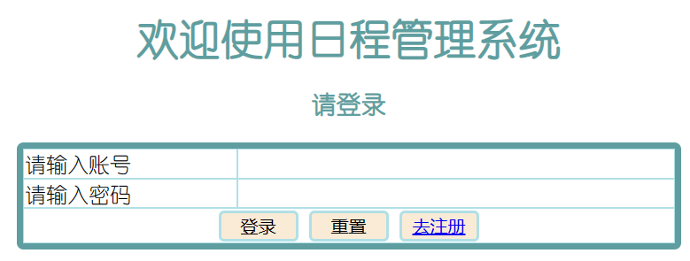
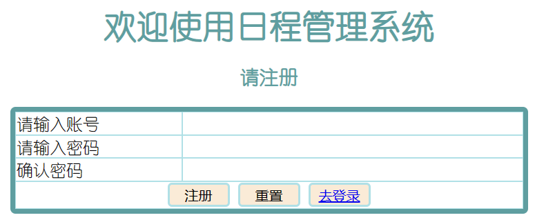

# 1 登录页及校验


``` html
<!DOCTYPE html>
<html lang="en">
<head>
<meta charset="UTF-8">
<title>登入頁面</title>
<style>
.ht {
	text-align: center;
	color: cadetblue;
	font-family: 幼圆;
}

.tab {
	width: 500px;
	border: 5px solid cadetblue;
	margin: 0px auto;
	border-radius: 5px;
	font-family: 幼圆;
}

.ltr td {
	border: 1px solid powderblue;
}

.ipt {
	border: 0px;
	width: 50%;
}

.btn1 {
	border: 2px solid powderblue;
	border-radius: 4px;
	width: 60px;
	background-color: antiquewhite;
}

#usernameMsg, #userPwdMsg {
	color: rgb(230, 87, 51);
}

.buttonContainer {
	text-align: center;
}
</style>
<script>
	// 检验用户名格式是否合法的函数
	function checkUsername() {
		// 定义正则表示字符串的规则
		var usernameReg = /^[a-zA-Z0-9]{5,10}$/
		// 获得用户在页面上输入的信息
		var usernameInput = document.getElementById("usernameInput")
		var username = usernameInput.value
		// 获得格式提示的框
		var usernameMsg = document.getElementById("usernameMsg")
		// 格式有误时,返回false,在页面上提示
		if (!usernameReg.test(username)) {
			usernameMsg.innerText = "用户名格式有误"
			return false
		}
		// 格式OK,返回true 在页面上提示OK
		usernameMsg.innerText = "OK"
		return true
	}

	// 检验密码格式是否合法的函数
	function checkUserPwd() {
		// 定义正则表示字符串的规则
		var userPwdReg = /^[0-9]{6}$/
		// 获得用户在页面上输入的信息
		var userPwdInput = document.getElementById("userPwdInput")
		var userPwd = userPwdInput.value
		// 获得格式提示的框
		var userPwdMsg = document.getElementById("userPwdMsg")
		// 格式有误时,返回false,在页面上提示
		if (!userPwdReg.test(userPwd)) {
			userPwdMsg.innerText = "密码必须是6位数字"
			return false
		}
		// 格式OK,返回true 在页面上提示OK
		userPwdMsg.innerText = "OK"
		return true
	}

	// 表单在提交时,校验用户名和密码格式,格式OK才会提交
	function checkForm() {
		var flag1 = checkUsername()
		var flag2 = checkUserPwd()

		return flag1 && flag2
	}
</script>
</head>

<body>
	<h1 class="ht">欢迎使用日程管理系统</h1>
	<h3 class="ht">请登录</h3>

	<form method="post" action="/user/login" onsubmit="return checkForm()">
		<table class="tab" cellspacing="0px">
			<tr class="ltr">
				<td>请输入账号</td>
				<td>
                    <input class="ipt" type="text" id="usernameInput"
					name="username" onblur="checkUsername()"> 
                    <span id="usernameMsg"></span>
                </td>
			</tr>
			<tr class="ltr">
				<td>请输入密码</td>
				<td>
                    <input class="ipt" type="password" id="userPwdInput"
					name="userPwd" onblur="checkUserPwd()"> 
                    <span id="userPwdMsg"></span>
                </td>
			</tr>
			<tr class="ltr">
				<td colspan="2" class="buttonContainer">
                    <input class="btn1" type="submit" value="登录"> 
                    <input class="btn1" type="reset" value="重置">
					<button class="btn1">
						<a href="regist.html">去注册</a>
					</button>
                </td>
			</tr>
		</table>
	</form>
</body>
</html>
```

# 2 注册页及校验



``` html
<!DOCTYPE html>
<html lang="en">
<head>
    <meta charset="UTF-8">
    <title>Title</title>
    <style>
        .ht{
            text-align: center;
            color: cadetblue;
            font-family: 幼圆;
        }

        .tab{
            width: 500px;
            border: 5px solid cadetblue;
            margin: 0px auto;
            border-radius: 5px;
            font-family: 幼圆;
        }

        .ltr td{
            border: 1px solid  powderblue;
        }

        .ipt{
            border: 0px;
            width: 50%;
        }

        .btn1{
            border: 2px solid powderblue;
            border-radius: 4px;
            width:60px;
            background-color: antiquewhite;
        }

        .msg {
            color: gold;
        }

        .buttonContainer{
            text-align: center;
        }
    </style>

    <script>
        function checkUsername(){
            var usernameReg = /^[a-zA-Z0-9]{5,10}$/
            var usernameInput = document.getElementById("usernameInput")  
            var username = usernameInput.value  
            var usernameMsg = document.getElementById("usernameMsg")
            if(!usernameReg.test(username)){
                usernameMsg.innerText="格式有误"
                return false
            } 
            usernameMsg.innerText="OK"
            return true 
        }


        function checkUserPwd(){
            var userPwdReg = /^\d{6}$/
            var userPwdInput = document.getElementById("userPwdInput")  
            var userPwd = userPwdInput.value  
            var userPwdMsg = document.getElementById("userPwdMsg")
            if(!userPwdReg.test(userPwd)){
                userPwdMsg.innerText="格式有误"
                return false
            } 
            userPwdMsg.innerText="OK"
            return true 
        }


        function checkReUserPwd(){
            var userPwdReg = /^\d{6}$/
            // 再次输入的密码的格式
            var reUserPwdInput = document.getElementById("reUserPwdInput")  
            var reUserPwd = reUserPwdInput.value 
            var reUserPwdMsg = document.getElementById("reUserPwdMsg")
            if(!userPwdReg.test(reUserPwd)){
                reUserPwdMsg.innerText="格式有误"
                return false
            } 
            // 获得上次密码,对比两次密码是否一致
            var userPwdInput = document.getElementById("userPwdInput")  
            var userPwd = userPwdInput.value  
            if(reUserPwd != userPwd){
                reUserPwdMsg.innerText="两次密码不一致"
                return false
            } 
            reUserPwdMsg.innerText="OK"
            return true 
        }

        function checkForm(){
            var flag1 = checkUsername()
            var flag2 = checkUserPwd()
            var flag3 = checkReUserPwd()

            return flag1 && flag2 && flag3
        }
    </script>
</head>
<body>
<h1 class="ht">欢迎使用日程管理系统</h1>
<h3 class="ht">请注册</h3>
<form method="post" action="/user/regist" onsubmit="return checkForm()">
    <table class="tab" cellspacing="0px">
        <tr class="ltr">
            <td>请输入账号</td>
            <td>
                <input class="ipt" id="usernameInput" type="text" name="username" onblur="checkUsername()">
                <span id="usernameMsg" class="msg"></span>
            </td>
        </tr>
        <tr class="ltr">
            <td>请输入密码</td>
            <td>
                <input class="ipt" id="userPwdInput" type="password" name="userPwd" onblur="checkUserPwd()">
                <span id="userPwdMsg" class="msg"></span>
            </td>
        </tr>
        <tr class="ltr">
            <td>确认密码</td>
            <td>
                <input class="ipt" id="reUserPwdInput" type="password" onblur="checkReUserPwd()">
                <span id="reUserPwdMsg" class="msg"></span>
            </td>
        </tr>
        <tr class="ltr">
            <td colspan="2" class="buttonContainer">
                <input class="btn1" type="submit" value="注册">
                <input class="btn1" type="reset" value="重置">
                <button class="btn1"><a  href="login.html">去登录</a></button>
            </td>
        </tr>
    </table>

</form>
</body>
</html>
```

