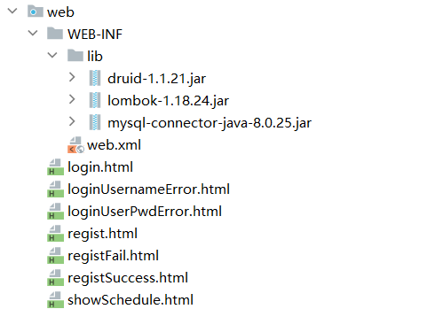

# 1 项目搭建

## 1.1 数据库准备
+ 创建 `schedule_system` 数据库并执行如下语句

``` sql
SET NAMES utf8mb4;
SET FOREIGN_KEY_CHECKS = 0;


-- ----------------------------
-- 创建日程表
-- ----------------------------
DROP TABLE IF EXISTS `sys_schedule`;
CREATE TABLE `sys_schedule`  (
  `sid` int NOT NULL AUTO_INCREMENT,
  `uid` int NULL DEFAULT NULL,
  `title` varchar(20) CHARACTER SET utf8mb4 COLLATE utf8mb4_0900_ai_ci NULL DEFAULT NULL,
  `completed` int(1) NULL DEFAULT NULL,
  PRIMARY KEY (`sid`) USING BTREE
) ENGINE = InnoDB AUTO_INCREMENT = 1 CHARACTER SET = utf8mb4 COLLATE = utf8mb4_0900_ai_ci ROW_FORMAT = Dynamic;

-- ----------------------------
-- 插入日程数据
-- ----------------------------

-- ----------------------------
-- 创建用户表
-- ----------------------------
DROP TABLE IF EXISTS `sys_user`;
CREATE TABLE `sys_user`  (
  `uid` int NOT NULL AUTO_INCREMENT,
  `username` varchar(10) CHARACTER SET utf8mb4 COLLATE utf8mb4_0900_ai_ci NULL DEFAULT NULL,
  `user_pwd` varchar(100) CHARACTER SET utf8mb4 COLLATE utf8mb4_0900_ai_ci NULL DEFAULT NULL,
  PRIMARY KEY (`uid`) USING BTREE,
  UNIQUE INDEX `username`(`username`) USING BTREE
) ENGINE = InnoDB CHARACTER SET = utf8mb4 COLLATE = utf8mb4_0900_ai_ci ROW_FORMAT = Dynamic;

-- ----------------------------
-- 插入用户数据
-- ----------------------------
INSERT INTO `sys_user` VALUES (1, 'zhangsan', 'e10adc3949ba59abbe56e057f20f883e');
INSERT INTO `sys_user` VALUES (2, 'lisi', 'e10adc3949ba59abbe56e057f20f883e');

SET FOREIGN_KEY_CHECKS = 1;
```

## 1.2 获得如下表格


## 1.3 项目结构




## 1.4 导入依赖


## 1.5 pojo包处理
>  使用 `lombok` 处理 `getter setter equals hashcode` 构造器 

``` java
//-----------------------------------------------------
package com.atguigu.schedule.pojo;

import lombok.AllArgsConstructor;
import lombok.Data;
import lombok.NoArgsConstructor;
import java.io.Serializable;
@AllArgsConstructor
@NoArgsConstructor
@Data
public class SysUser  implements Serializable {
    private Integer uid;
    private String username;
    private String userPwd;
}
//------------------------------------------------------
package com.atguigu.schedule.pojo;

import lombok.AllArgsConstructor;
import lombok.Data;
import lombok.NoArgsConstructor;
import java.io.Serializable;

@AllArgsConstructor
@NoArgsConstructor
@Data
public class SysSchedule implements Serializable {
    private Integer sid;
    private Integer uid;
    private String title;
    private Integer completed;
}
//------------------------------------------------------
```

## 1.6 dao包处理
### 1.6.1 导入 `JDBCUtils` 连接池工具类并准备 `jdbc.properties` 配置文件

``` java
package com.atguigu.schedule.util;


import com.alibaba.druid.pool.DruidDataSourceFactory;

import javax.sql.DataSource;
import java.io.IOException;
import java.io.InputStream;
import java.sql.Connection;
import java.sql.SQLException;
import java.util.Properties;

public class JDBCUtil {
    private static ThreadLocal<Connection> threadLocal =new ThreadLocal<>();

    private static DataSource dataSource;
    // 初始化连接池
    static{
        // 可以帮助我们读取.properties配置文件
        Properties properties =new Properties();
        InputStream resourceAsStream = JDBCUtil.class.getClassLoader().getResourceAsStream("jdbc.properties");
        try {
            properties.load(resourceAsStream);
        } catch (IOException e) {
            throw new RuntimeException(e);
        }

        try {
            dataSource = DruidDataSourceFactory.createDataSource(properties);
        } catch (Exception e) {
            throw new RuntimeException(e);
        }


    }
    /*1 向外提供连接池的方法*/
    public static DataSource getDataSource(){
        return dataSource;
    }

    /*2 向外提供连接的方法*/
    public static Connection getConnection(){
        Connection connection = threadLocal.get();
        if (null == connection) {
            try {
                connection = dataSource.getConnection();
            } catch (SQLException e) {
                throw new RuntimeException(e);
            }
            threadLocal.set(connection);
        }

        return connection;
    }


    /*定义一个归还连接的方法 (解除和ThreadLocal之间的关联关系) */
    public static void releaseConnection(){
        Connection connection = threadLocal.get();
        if (null != connection) {
            threadLocal.remove();
            // 把连接设置回自动提交的连接
            try {
                connection.setAutoCommit(true);
                // 自动归还到连接池
                connection.close();
            } catch (SQLException e) {
                throw new RuntimeException(e);
            }
        }
    }
}

```

``` properties
driverClassName=com.mysql.cj.jdbc.Driver
url=jdbc:mysql://localhost:3306/schedule_system
username=root
password=root
initialSize=5
maxActive=10
maxWait=1000
```

### 1.6.2 创建BaseDao对象并复制如下代码

``` java
package com.atguigu.schedule.dao;


import com.atguigu.schedule.util.JDBCUtil;

import java.lang.reflect.Field;
import java.sql.*;
import java.time.LocalDateTime;
import java.util.ArrayList;
import java.util.List;

public class BaseDao {
    // 公共的查询方法  返回的是单个对象
    public <T> T baseQueryObject(Class<T> clazz, String sql, Object ... args) {
        T t = null;
        Connection connection = JDBCUtil.getConnection();
        PreparedStatement preparedStatement = null;
        ResultSet resultSet = null;
        int rows = 0;
        try {
            // 准备语句对象
            preparedStatement = connection.prepareStatement(sql);
            // 设置语句上的参数
            for (int i = 0; i < args.length; i++) {
                preparedStatement.setObject(i + 1, args[i]);
            }

            // 执行 查询
            resultSet = preparedStatement.executeQuery();
            if (resultSet.next()) {
                t = (T) resultSet.getObject(1);
            }
        } catch (Exception e) {
            e.printStackTrace();
        } finally {
            if (null != resultSet) {
                try {
                    resultSet.close();
                } catch (SQLException e) {
                    e.printStackTrace();
                }
            }
            if (null != preparedStatement) {
                try {
                    preparedStatement.close();
                } catch (SQLException e) {
                    e.printStackTrace();
                }

            }
            JDBCUtil.releaseConnection();
        }
        return t;
    }
    // 公共的查询方法  返回的是对象的集合

    public <T> List<T> baseQuery(Class clazz, String sql, Object ... args){
        List<T> list =new ArrayList<>();
        Connection connection = JDBCUtil.getConnection();
        PreparedStatement preparedStatement=null;
        ResultSet resultSet =null;
        int rows = 0;
        try {
            // 准备语句对象
            preparedStatement = connection.prepareStatement(sql);
            // 设置语句上的参数
            for (int i = 0; i < args.length; i++) {
                preparedStatement.setObject(i+1,args[i]);
            }

            // 执行 查询
            resultSet = preparedStatement.executeQuery();

            ResultSetMetaData metaData = resultSet.getMetaData();
            int columnCount = metaData.getColumnCount();

            // 将结果集通过反射封装成实体类对象
            while (resultSet.next()) {
                // 使用反射实例化对象
                Object obj =clazz.getDeclaredConstructor().newInstance();

                for (int i = 1; i <= columnCount; i++) {
                    String columnName = metaData.getColumnLabel(i);
                    Object value = resultSet.getObject(columnName);
                    // 处理datetime类型字段和java.util.Data转换问题
                    if(value.getClass().equals(LocalDateTime.class)){
                        value= Timestamp.valueOf((LocalDateTime) value);
                    }
                    Field field = clazz.getDeclaredField(columnName);
                    field.setAccessible(true);
                    field.set(obj,value);
                }

                list.add((T)obj);
            }

        } catch (Exception e) {
            e.printStackTrace();
        } finally {
            if (null !=resultSet) {
                try {
                    resultSet.close();
                } catch (SQLException e) {
                    throw new RuntimeException(e);
                }
            }
            if (null != preparedStatement) {
                try {
                    preparedStatement.close();
                } catch (SQLException e) {
                    throw new RuntimeException(e);
                }
            }
            JDBCUtil.releaseConnection();
        }
        return list;
    }

    // 通用的增删改方法
    public int baseUpdate(String sql,Object ... args) {
        // 获取连接
        Connection connection = JDBCUtil.getConnection();
        PreparedStatement preparedStatement=null;
        int rows = 0;
        try {
            // 准备语句对象
            preparedStatement = connection.prepareStatement(sql);
            // 设置语句上的参数
            for (int i = 0; i < args.length; i++) {
                preparedStatement.setObject(i+1,args[i]);
            }

            // 执行 增删改 executeUpdate
            rows = preparedStatement.executeUpdate();
            // 释放资源(可选)


        } catch (SQLException e) {
            e.printStackTrace();
        } finally {
            if (null != preparedStatement) {
                try {
                    preparedStatement.close();
                } catch (SQLException e) {
                    throw new RuntimeException(e);
                }

            }
            JDBCUtil.releaseConnection();
        }
        // 返回的是影响数据库记录数
        return rows;
    }
}

```

### 1.6.3 dao层所有接口

``` java
//---------------------------------------------------
package com.atguigu.schedule.dao;
public interface SysUserDao {
}
//---------------------------------------------------
package com.atguigu.schedule.dao;
public interface SysScheduleDao {
}
//---------------------------------------------------
```

### 1.6.4 dao层所有实现类

``` java
//------------------------------------------------------------------------------
package com.atguigu.schedule.dao.impl;
import com.atguigu.schedule.dao.BaseDao;
import com.atguigu.schedule.dao.SysUserDao;
public class SysUserDaoImpl extends BaseDao implements SysUserDao {
}

//------------------------------------------------------------------------------
package com.atguigu.schedule.dao.impl;
import com.atguigu.schedule.dao.BaseDao;
import com.atguigu.schedule.dao.SysScheduleDao;
public class SysScheduleDaoImpl extends BaseDao implements SysScheduleDao {
}
//------------------------------------------------------------------------------
```

## 1.7 service包处理
### 1.7.1 接口
``` java
//------------------------------------------------------------------------------
package com.atguigu.schedule.service;
public interface SysUserService {
}
//------------------------------------------------------------------------------
package com.atguigu.schedule.service;
public interface SysScheduleService {
}
//------------------------------------------------------------------------------
```

### 1.7.2 实现类
```java
//------------------------------------------------------------------------------
package com.atguigu.schedule.service.impl;
import com.atguigu.schedule.service.SysUserService;
public class SysUserServiceImpl implements SysUserService {
}
//------------------------------------------------------------------------------
package com.atguigu.schedule.service.impl;
import com.atguigu.schedule.service.SysScheduleService;
public class SysScheduleServiceImpl implements SysScheduleService {
}
//------------------------------------------------------------------------------
```

## 1.8 controller包处理

### 1.8.1 BaseController处理请求路径问题
``` java
package com.atguigu.schedule.controller;

import jakarta.servlet.ServletException;
import jakarta.servlet.http.HttpServlet;
import jakarta.servlet.http.HttpServletRequest;
import jakarta.servlet.http.HttpServletResponse;
import java.io.IOException;
import java.lang.reflect.Method;

public class BaseController extends HttpServlet {
    @Override
    protected void service(HttpServletRequest req, HttpServletResponse resp) throws ServletException, IOException {
        

        String requestURI = req.getRequestURI();
        String[] split = requestURI.split("/");
        String methodName =split[split.length-1];
        // 通过反射获取要执行的方法
        Class clazz = this.getClass();
        try {
            Method method=clazz.getDeclaredMethod(methodName,HttpServletRequest.class,HttpServletResponse.class);
            // 设置方法可以访问
            method.setAccessible(true);
            // 通过反射执行代码
            method.invoke(this,req,resp);
        } catch (Exception e) {
            e.printStackTrace();
           
        }
    }
}
```

### 1.8.2 多个处理器继承BaseController
```  java
//----------------------------------------------------------------------------
package com.atguigu.schedule.controller;

import javax.servlet.annotation.WebServlet;

@WebServlet("/user/*")
public class UserController extends BaseController {
}
//----------------------------------------------------------------------------
package com.atguigu.schedule.controller;

import javax.servlet.annotation.WebServlet;

@WebServlet("/schedule/*")
public class SysScheduleController extends BaseController {
}
//----------------------------------------------------------------------------
```

## 1.9 加密工具类的使用

+ 导入MD5Util工具类

``` java
package com.atguigu.schedule.util;
import java.security.MessageDigest;
import java.security.NoSuchAlgorithmException;
public final class MD5Util {
    public static String encrypt(String strSrc) {
        try {
            char hexChars[] = { '0', '1', '2', '3', '4', '5', '6', '7', '8',
                    '9', 'a', 'b', 'c', 'd', 'e', 'f' };
            byte[] bytes = strSrc.getBytes();
            MessageDigest md = MessageDigest.getInstance("MD5");
            md.update(bytes);
            bytes = md.digest();
            int j = bytes.length;
            char[] chars = new char[j * 2];
            int k = 0;
            for (int i = 0; i < bytes.length; i++) {
                byte b = bytes[i];
                chars[k++] = hexChars[b >>> 4 & 0xf];
                chars[k++] = hexChars[b & 0xf];
            }
            return new String(chars);
        } catch (NoSuchAlgorithmException e) {
            e.printStackTrace();
            throw new RuntimeException("MD5加密出错!!!")
        }
    }
}
```


## 1.10 页面文件的导入
> 复制资源下的日程管理中的HTML到项目的web目录下即可


# 2 业务代码
## 2.1 注册业务处理
### 2.1.1 controller
``` java 
package com.atguigu.schedule.controller;

import com.atguigu.schedule.pojo.SysUser;
import com.atguigu.schedule.service.SysUserService;
import com.atguigu.schedule.service.impl.SysUserServiceImpl;
import jakarta.servlet.ServletException;
import jakarta.servlet.annotation.WebServlet;
import jakarta.servlet.http.HttpServletRequest;
import jakarta.servlet.http.HttpServletResponse;

import java.io.IOException;

@WebServlet("/user/*")
public class SysUserController  extends BaseContoller {

    private SysUserService userService =new SysUserServiceImpl();

    /**
     * 接收用户注册请求的业务处理方法( 业务接口 不是java中的interface  )
     * @param req
     * @param resp
     * @throws ServletException
     * @throws IOException
     */
    protected void regist(HttpServletRequest req, HttpServletResponse resp) throws ServletException, IOException {
        // 1 接收客户端提交的参数
        String username = req.getParameter("username");
        String userPwd = req.getParameter("userPwd");
        // 2 调用服务层方法,完成注册功能
            //将参数放入一个SysUser对象中,在调用regist方法时传入
        SysUser sysUser =new SysUser(null,username,userPwd);
        int rows =userService.regist(sysUser);
        // 3 根据注册结果(成功  失败) 做页面跳转
        if(rows>0){
            resp.sendRedirect("/registSuccess.html");
        }else{
            resp.sendRedirect("/registFail.html");
        }
    }
}
```

### 2.1.2 service

```java
package com.atguigu.schedule.service;

import com.atguigu.schedule.pojo.SysUser;

public interface SysUserService {
    /**
     * 用户完成注册的业务方法
     * @param registUser 用于保存注册用户名和密码的对象
     * @return 注册成功返回>0的整数,否则返回0
     */
    int regist(SysUser registUser);
}
```

``` java
package com.atguigu.schedule.service.impl;

import com.atguigu.schedule.dao.SysUserDao;
import com.atguigu.schedule.dao.impl.SysUserDaoImpl;
import com.atguigu.schedule.pojo.SysUser;
import com.atguigu.schedule.service.SysUserService;
import com.atguigu.schedule.util.MD5Util;

public class SysUserServiceImpl  implements SysUserService {
    private SysUserDao  userDao =new SysUserDaoImpl();
    @Override
    public int regist(SysUser sysUser) {

        // 将用户的明文密码转换为密文密码
        sysUser.setUserPwd(MD5Util.encrypt(sysUser.getUserPwd()));
        // 调用DAO 层的方法  将sysUser信息存入数据库
        return userDao.addSysUser(sysUser);
    }
}
```

### 2.1.3 dao

``` java
package com.atguigu.schedule.dao;

import com.atguigu.schedule.pojo.SysUser;

public interface SysUserDao {

    /**
     * 向数据库中增加一条用户记录的方法
     * @param sysUser 要增加的记录的username和user_pwd字段以SysUser实体类对象的形式接收
     * @return 增加成功返回1 增加失败返回0
     */
    int addSysUser(SysUser sysUser);
}
```

``` java
package com.atguigu.schedule.dao.impl;

import com.atguigu.schedule.dao.BaseDao;
import com.atguigu.schedule.dao.SysUserDao;
import com.atguigu.schedule.pojo.SysUser;
public class SysUserDaoImpl extends BaseDao implements SysUserDao {
    @Override
    public int addSysUser(SysUser sysUser) {
        String sql ="insert into sys_user values(DEFAULT,?,?)";
        return baseUpdate(sql,sysUser.getUsername(),sysUser.getUserPwd());
    }
}
```

## 2.2 登录业务处理

### 2.2.1 controller

``` java 
package com.atguigu.schedule.controller;

import com.atguigu.schedule.pojo.SysUser;
import com.atguigu.schedule.service.SysUserService;
import com.atguigu.schedule.service.impl.SysUserServiceImpl;
import com.atguigu.schedule.util.MD5Util;
import jakarta.servlet.ServletException;
import jakarta.servlet.annotation.WebServlet;
import jakarta.servlet.http.HttpServletRequest;
import jakarta.servlet.http.HttpServletResponse;

import java.io.IOException;

@WebServlet("/user/*")
public class SysUserController  extends BaseContoller {

    private SysUserService userService =new SysUserServiceImpl();
    /**
     * 接收用登录请求,完成的登录业务接口
     * @param req
     * @param resp
     * @throws ServletException
     * @throws IOException
     */
    protected void login(HttpServletRequest req, HttpServletResponse resp) throws ServletException, IOException {
        //1 接收用户名和密码
        String username = req.getParameter("username");
        String userPwd = req.getParameter("userPwd");
        //2 调用服务层方法,根据用户名查询用户信息
        SysUser loginUser =userService.findByUsername(username);
        if(null == loginUser){
            // 跳转到用户名有误提示页
            resp.sendRedirect("/loginUsernameError.html");
        }else if(! MD5Util.encrypt(userPwd).equals(loginUser.getUserPwd())){
            //3 判断密码是否匹配
            // 跳转到密码有误提示页
            resp.sendRedirect("/loginUserPwdError.html");
        }else{
            //4 跳转到首页
            resp.sendRedirect("/showSchedule.html");
        }

    }
}
```

### 2.2.2 service

```java
package com.atguigu.schedule.service;

import com.atguigu.schedule.pojo.SysUser;

public interface SysUserService {
        /**
     * 根据用户名获得完整用户信息的方法
     * @param username 要查询的用户名
     * @return 如果找到了返回SysUser对象,找不到返回null
     */
    SysUser findByUsername(String username);
}
```

``` java

package com.atguigu.schedule.service.impl;

import com.atguigu.schedule.dao.SysUserDao;
import com.atguigu.schedule.dao.impl.SysUserDaoImpl;
import com.atguigu.schedule.pojo.SysUser;
import com.atguigu.schedule.service.SysUserService;
import com.atguigu.schedule.util.MD5Util;

public class SysUserServiceImpl implements SysUserService {
    private SysUserDao userDao =new SysUserDaoImpl();

    @Override
    public SysUser findByUsername(String username) {
        // 调用服务层方法,继续查询

        return userDao.findByUsername(username);
    }
}

```

### 2.2.3 dao

``` java
package com.atguigu.schedule.dao;

import com.atguigu.schedule.pojo.SysUser;

public interface SysUserDao {
        /**
     * 根据用户名获得完整用户信息的方法
     * @param username 要查询的用户名
     * @return 如果找到了返回SysUser对象,找不到返回null
     */
    SysUser findByUsername(String username);
}
```

``` java 

import com.atguigu.schedule.dao.BaseDao;
import com.atguigu.schedule.dao.SysUserDao;
import com.atguigu.schedule.pojo.SysUser;

import java.util.List;

public class SysUserDaoImpl extends BaseDao implements SysUserDao {
    @Override
    public SysUser findByUsername(String username) {
        String sql ="select uid,username, user_pwd userPwd from sys_user where username = ?";
        List<SysUser> userList = baseQuery(SysUser.class, sql, username);
        return  null != userList&& userList.size()>0? userList.get(0):null;
    }
}
```