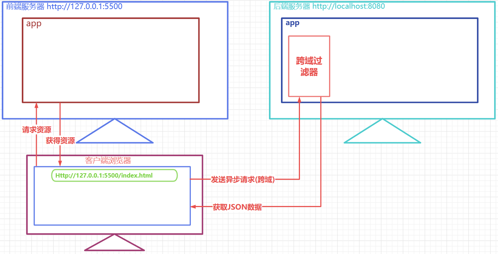

# 1. 前端代码处理
## 1.1 创建 src/utils/request.js文件
``` javascript
import axios from 'axios'

//  创建instance实例
const instance = axios.create({
    baseURL:'http://localhost:8080/' 
})

//  添加请求拦截
instance.interceptors.request.use(
    // 设置请求头配置信息
    config=>{
        //处理指定的请求头
        
        return config
    },
    // 设置请求错误处理函数
    error=>{
        return Promise.reject(error)
    }
)
// 添加响应拦截器
instance.interceptors.response.use(
    // 设置响应正确时的处理函数
    response=>{
        return response
    },
    // 设置响应异常时的处理函数
    error=>{
        return Promise.reject(error)
    }
)
// 默认导出
export default instance
```

## 1.2 注册页面完成注册

``` html
<script setup>
    import {ref,reactive} from 'vue'
    /* 导入发送请求的axios对象 */
    import request from'../utils/request'

    import {useRouter} from 'vue-router'
    const router = useRouter()

    let registUser = reactive({
        username:"",
        userPwd:""
    })
    let usernameMsg=ref('')
    let userPwdMsg=ref('')
    let reUserPwdMsg=ref('')
    let reUserPwd=ref('')
    async function checkUsername(){
        let usernameReg= /^[a-zA-Z0-9]{5,10}$/
        if(!usernameReg.test(registUser.username)){
            usernameMsg.value="格式有误"
            return false
        }
        // 发送异步请求   继续校验用户名是否被占用
        let {data} = await request.post(`user/checkUsernameUsed?username=${registUser.username}`)
        if(data.code != 200){
            usernameMsg.value="用户名占用"
            return false
        }
        usernameMsg.value="可用"
        return true
    }

    function checkUserPwd(){
        let userPwdReg = /^[0-9]{6}$/
        if(!userPwdReg.test(registUser.userPwd)){
            userPwdMsg.value="格式有误"
            return false
        }
        userPwdMsg.value="OK"
        return true
    }

    function checkReUserPwd(){
        let userPwdReg = /^[0-9]{6}$/
        if(!userPwdReg.test(reUserPwd.value)){
            reUserPwdMsg.value="格式有误"
            return false
        }
        if(registUser.userPwd != reUserPwd.value){
            reUserPwdMsg.value="两次密码不一致"
            return false
        }
        reUserPwdMsg.value="OK"
        return true
    }

    // 注册的方法
    async function regist(){
        // 校验所有的输入框是否合法
        let flag1 =await checkUsername()
        let flag2 =await checkUserPwd()
        let flag3 =await checkReUserPwd()
        if(flag1 && flag2 && flag3){
          let  {data}= await request.post("user/regist",registUser)
          if(data.code == 200){
            // 注册成功跳转 登录页
            alert("注册成功,快去登录吧")
            router.push("/login")
          }else{
            alert("抱歉,用户名被抢注了")
          }
        }else{
            alert("校验不通过,请求再次检查数据")
        }
    }

    function clearForm(){
        registUser.username=""
        registUser.userPwd=""
        usernameMsg.value=""
        userPwdMsg.value=""
        reUserPwd.value=""
        reUserPwdMsg.value=""

    }


</script>

<template>
  <div>
    <h3 class="ht">请注册</h3>

    <table class="tab" cellspacing="0px">
        <tr class="ltr">
            <td>请输入账号</td>
            <td>
                <input class="ipt" 
                  id="usernameInput" 
                  type="text" 
                  name="username" 
                  v-model="registUser.username"
                  @blur="checkUsername()">

                <span id="usernameMsg" class="msg" v-text="usernameMsg"></span>
            </td>
        </tr>
        <tr class="ltr">
            <td>请输入密码</td>
            <td>
                <input class="ipt" 
                id="userPwdInput" 
                type="password" 
                name="userPwd" 
                v-model="registUser.userPwd"
                @blur="checkUserPwd()">
                <span id="userPwdMsg" class="msg" v-text="userPwdMsg"></span>
            </td>
        </tr>
        <tr class="ltr">
            <td>确认密码</td>
            <td>
                <input class="ipt" 
                id="reUserPwdInput" 
                type="password" 
                v-model="reUserPwd"
                @blur="checkReUserPwd()">
                <span id="reUserPwdMsg" class="msg" v-text="reUserPwdMsg"></span>
            </td>
        </tr>
        <tr class="ltr">
            <td colspan="2" class="buttonContainer">
                <input class="btn1" type="button" @click="regist()" value="注册">
                <input class="btn1" type="button" @click="clearForm()" value="重置">
                <router-link to="/login">
                  <button class="btn1">去登录</button>
                </router-link>
            </td>
        </tr>
    </table>
  </div>
</template>
<style scoped>
       .ht{
            text-align: center;
            color: cadetblue;
            font-family: 幼圆;
        }
        .tab{
            width: 500px;
            border: 5px solid cadetblue;
            margin: 0px auto;
            border-radius: 5px;
            font-family: 幼圆;
        }
        .ltr td{
            border: 1px solid  powderblue;

        }
        .ipt{
            border: 0px;
            width: 50%;

        }
        .btn1{
            border: 2px solid powderblue;
            border-radius: 4px;
            width:60px;
            background-color: antiquewhite;

        }
        .msg {
            color: gold;
        }
        .buttonContainer{
            text-align: center;
        }
</style>
```

## 1.3 登录页面完成登录

``` html
<script setup>
        import {ref,reactive} from 'vue'
        import {useRouter} from 'vue-router'
        const router = useRouter()

        import request  from '../utils/request'

        let loginUser =reactive({
                username:"",
                userPwd:""
        })

       let usernameMsg =ref("")
       let userPwdMsg =ref("")


       function checkUsername(){
            let usernameReg= /^[a-zA-Z0-9]{5,10}$/
            if(!usernameReg.test(loginUser.username)){
                usernameMsg.value="格式有误"
                return false
            }
            usernameMsg.value="OK"
            return true
       }

       function checkUserPwd(){
            let userPwdReg = /^[0-9]{6}$/

            if(!userPwdReg.test(loginUser.userPwd)){
                userPwdMsg.value="格式有误"
                return false
            }

            userPwdMsg.value="OK"
            return true
       }

       async function login(){
            // 表单数据格式都正确再提交
            let flag1 =checkUsername()
            let flag2 =checkUserPwd()
            if(!(flag1 && flag2)){
                return 
            }
           let {data} = await request.post("user/login",loginUser)
           if(data.code == 200 ){
                alert("登录成功")
                // 跳转到showSchedule
                router.push("/showSchedule")
           } else if( data.code == 503){
                alert("密码有误")

           }else if (data.code == 501 ){
                alert("用户名有误")
           }else {
                alert("未知错误")
           }
           
       }


</script>

<template>
  <div>
    <h3 class="ht">请登录</h3>
        <table class="tab" cellspacing="0px">
            <tr class="ltr">
                <td>请输入账号</td>
                <td>
                    <input class="ipt" 
                    type="text" 
                    v-model="loginUser.username"
                    @blur="checkUsername()">
                    <span id="usernameMsg" v-text="usernameMsg"></span>
                </td>
            </tr>
            <tr class="ltr">
                <td>请输入密码</td>
                <td>
                    <input class="ipt" 
                    type="password" 
                    v-model="loginUser.userPwd"
                    @blur="checkUserPwd()">
                    <span id="userPwdMsg" v-text="userPwdMsg"></span>
                </td>
            </tr>
            <tr class="ltr">
                <td colspan="2" class="buttonContainer">
                    <input class="btn1" type="button" @click="login()" value="登录">
                    <input class="btn1" type="button" value="重置">
                    <router-link to="/regist">
                      <button class="btn1">去注册</button>
                    </router-link>
                </td>
            </tr>
        </table>
  </div>
</template>

<style scoped>
        .ht{
            text-align: center;
            color: cadetblue;
            font-family: 幼圆;
        }
        .tab{
            width: 500px;
            border: 5px solid cadetblue;
            margin: 0px auto;
            border-radius: 5px;
            font-family: 幼圆;
        }
        .ltr td{
            border: 1px solid  powderblue;
        }
        .ipt{
            border: 0px;
            width: 50%;
        }
        .btn1{
            border: 2px solid powderblue;
            border-radius: 4px;
            width:60px;
            background-color: antiquewhite;
        }
        #usernameMsg , #userPwdMsg {
            color: gold;
        }
        .buttonContainer{
            text-align: center;
        }
</style>
```

# 2 后端代码处理
## 2.1 添加跨域处理器
### 2.1.1 什么是跨域
> **同源策略（Sameoriginpolicy）** 是浏览器最核心也最基本的安全功能，如果缺少了同源策略，则浏览器的正常功能可能都会受到影响。可以说Web是构建在同源策略基础之上的，浏览器只是针对同源策略的一种实现。**`同源策略会阻止一个域的javascript脚本和另外一个域的内容进行交互。所谓同源（即指在同一个域）就是两个页面具有相同的协议（protocol），主机（host）和端口号`**

### 2.1.2 为什么会产生跨域
> 前后端分离模式下,客户端请求前端服务器获取视图资源，然后客户端自行向后端服务器获取数据资源，前端服务器的 协议,IP和端口和后端服务器很可能是不一样的,这样就产生了跨域


### 2.1.3 如何解决跨域
> 前端项目代理模式处理


> 后端跨域过滤器方式处理


#### CrosFilter过滤器
``` java
package com.atguigu.schedule.filter;

import com.atguigu.schedule.common.Result;
import com.atguigu.schedule.util.WebUtil;
import jakarta.servlet.*;
import jakarta.servlet.annotation.WebFilter;
import jakarta.servlet.annotation.WebServlet;
import jakarta.servlet.http.HttpServletRequest;
import jakarta.servlet.http.HttpServletResponse;

import java.io.IOException;

@WebFilter("/*")
public class CrosFilter implements Filter {
    @Override
    public void doFilter(ServletRequest servletRequest, ServletResponse servletResponse, FilterChain filterChain) throws IOException, ServletException {

        HttpServletRequest request = (HttpServletRequest) servletRequest;
        System.out.println(request.getMethod());
        HttpServletResponse response = (HttpServletResponse) servletResponse;
        response.setHeader("Access-Control-Allow-Origin", "*");
        response.setHeader("Access-Control-Allow-Methods", "POST, GET, PUT,OPTIONS, DELETE, HEAD");
        response.setHeader("Access-Control-Max-Age", "3600");
        response.setHeader("Access-Control-Allow-Headers", "access-control-allow-origin, authority, content-type, version-info, X-Requested-With");
        // 如果是跨域预检请求,则直接在此响应200业务码
        if(request.getMethod().equalsIgnoreCase("OPTIONS")){
            WebUtil.writeJson(response, Result.ok(null));
        }else{
            // 非预检请求,放行即可
            filterChain.doFilter(servletRequest, servletResponse);
        }
    }
}

```

> 未来我们使用框架，直接用一个 `@CrossOrigin` 就可以解决跨域问题了

## 2.2 重构UserController

``` java
package com.atguigu.schedule.controller;

import com.atguigu.schedule.common.Result;
import com.atguigu.schedule.common.ResultCodeEnum;
import com.atguigu.schedule.pojo.SysUser;
import com.atguigu.schedule.service.SysUserService;
import com.atguigu.schedule.service.impl.SysUserServiceImpl;
import com.atguigu.schedule.util.MD5Util;
import com.atguigu.schedule.util.WebUtil;
import jakarta.servlet.ServletException;
import jakarta.servlet.annotation.WebServlet;
import jakarta.servlet.http.HttpServletRequest;
import jakarta.servlet.http.HttpServletResponse;

import java.io.IOException;

@WebServlet("/user/*")
public class UserController extends BaseController{
    private SysUserService userService =new SysUserServiceImpl();


    /**
     * 注册时校验用户名是否被占用的业务接口
     * @param req
     * @param resp
     * @throws ServletException
     * @throws IOException
     */
    protected void checkUsernameUsed(HttpServletRequest req, HttpServletResponse resp) throws ServletException, IOException {
        String username = req.getParameter("username");
        SysUser registUser = userService.findByUsername(username);

        //封装结果对象
        Result result=null;
        if(null ==registUser){
            // 未占用,创建一个code为200的对象
            result= Result.ok(null);
        }else{
            // 占用, 创建一个结果为505的对象
            result= Result.build(null, ResultCodeEnum.USERNAME_USED);

        }
        // 将result对象转换成JSON并响应给客户端
        WebUtil.writeJson(resp,result);
    }

    /**
     * 用户注册的业务接口
     * @param req
     * @param resp
     * @throws ServletException
     * @throws IOException
     */
    protected void regist(HttpServletRequest req, HttpServletResponse resp) throws ServletException, IOException {
        // 接收要注册的用户信息
        SysUser registUser = WebUtil.readJson(req, SysUser.class);
        // 调用服务层方法,将用户注册进入数据库
        int rows =userService.regist(registUser);
        Result result =null;
        if(rows>0){
           result=Result.ok(null);
        }else{
           result =Result.build(null,ResultCodeEnum.USERNAME_USED);
        }
        WebUtil.writeJson(resp,result);
    }

    /**
     * 用户登录的业务接口
     * @param req
     * @param resp
     * @throws ServletException
     * @throws IOException
     */
    protected void login(HttpServletRequest req, HttpServletResponse resp) throws ServletException, IOException {

        // 接收用户请求参数
        // 获取要登录的用户名密码
        SysUser inputUser = WebUtil.readJson(req, SysUser.class);
        // 调用服务层方法,根据用户名查询数据库中是否有一个用户
        SysUser loginUser =userService.findByUsername(inputUser.getUsername());

        Result result = null;

        if(null == loginUser){
            // 没有根据用户名找到用户,说明用户名有误
            result=Result.build(null,ResultCodeEnum.USERNAME_ERROR);
        }else if(! loginUser.getUserPwd().equals(MD5Util.encrypt(inputUser.getUserPwd()))){
            // 用户密码有误,
           result=Result.build(null,ResultCodeEnum.PASSWORD_ERROR);
        }else{
            // 登录成功
            result=Result.ok(null);
        }

        WebUtil.writeJson(resp,result);
    }
}
```


## 2.3 删除登录校验过滤器
> 这里不使用 `cookie` 和 `session` 方式记录用户状态，未来使用 `token`，所以登录过滤器删除即可