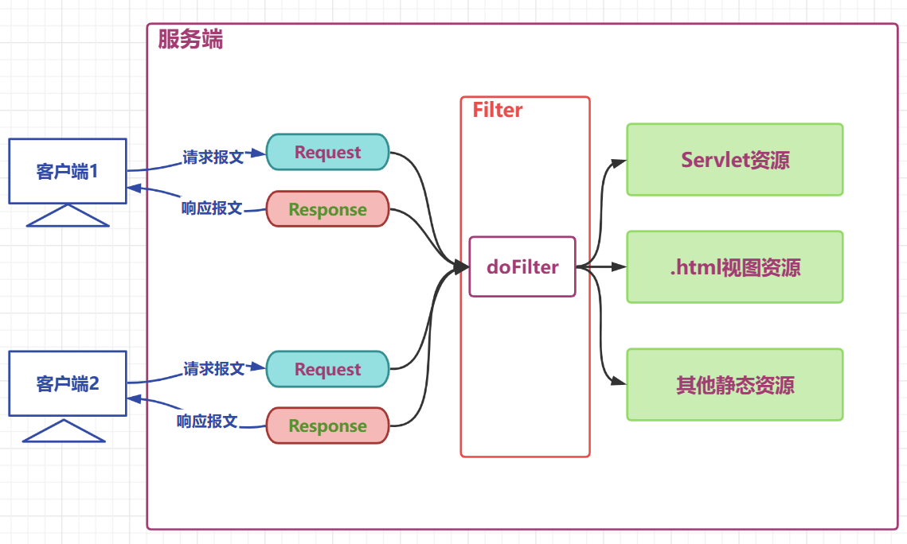

# 1. 过滤器概述
> Filter 即过滤器，是 JAVAEE 技术规范之一，作用目标资源的请求进行过滤的一套技术规范，是 Java Web 项目中 **最为实用的技术之**

+ Filter 接口定义了过滤器的开发规范，所有的过滤器都要实现该接口
+ Filter 的工作位置是项目中所有目标资源之前，容器在创建 HttpServletRequest 和 HttpServletResponse 对象后，会先调用 Filter 的 doFilter 方法
+ Filter 的 doFilter 方法可以控制请求是否继续，如果放行，则请求继续；如果拒绝，则请求到此为止，由过滤器本身做出响应
+ Filter 不仅可以对请求做出过滤，也可以在目标资源做出响应前，对响应再次进行处理
+ Filter 是 GOF 中责任链模式的典型案例
+ Filter 的常用应用包括但不限于 : 登录权限检查、解决网站乱码、过滤敏感字符、日志记录、性能分析... ...

- 生活举例 : 公司前台、停车场安保、地铁验票闸机
  - 公司前台对来访人员进行审核，如果是游客则拒绝进入公司，如果是客户则放行；客户离开时提醒客户不要遗忘物品
  - 停车场保安对来访车辆进行控制，如果没有车位拒绝进入，如果有车位，发放停车卡并放行，车辆离开时收取请车费
  - 地铁验票闸机在人员进入之前检查票，没票拒绝进入，有票验票后放行，人员离开时同样验票

- 过滤器开发中应用的场景
  - 日志的记录
  - 性能的分析
  - 乱码的处理
  - 事务的控制
  - 登录的控制
  - 跨域的处理
  - ... ...

### 1.1 过滤器工作位置图解



### 1.2 Filter 接口 API 源码

``` java
package jakarta.servlet;
import java.io.IOException;

public interface Filter {
    default public void init(FilterConfig filterConfig) throws ServletException {
    }
    
    public void doFilter(ServletRequest request, ServletResponse response, FilterChain chain)throws IOException, ServletException;
    
    default public void destroy() {
    }
}
```

### 1.3 API 目标

| API                                                          | 目标                                                         |
| ------------------------------------------------------------ | ------------------------------------------------------------ |
| default public void init(FilterConfig filterConfig)          | 初始化方法，由容器调用并传入初始配置信息filterConfig 对象    |
| public void doFilter(ServletRequest request, ServletResponse response, FilterChain chain) | 过滤方法，核心方法，过滤请求，决定是否放行，响应之前的其他处理等都在该方法中 |
| default public void destroy()                                | 销毁方法，容器在回收过滤器对象之前调用的方法                 |

# 2. 过滤器使用
- 目标 : 开发一个日志记录过滤器
  - 用户请求到达目标资源之前，记录用户的请求资源路径
  - 响应之前记录本次请求目标资源运算的耗时
  - 可以选择将日志记录进入文件，为了方便测试，这里将日志直接在控制台打印

## 2.1 定义一个过滤器类，编写功能代码 :

``` java
package com.atguigu.filters;

import java.io.IOException;
import java.text.SimpleDateFormat;
import java.util.Date;

import javax.servlet.Filter;
import javax.servlet.FilterChain;
import javax.servlet.ServletException;
import javax.servlet.ServletRequest;
import javax.servlet.ServletResponse;
import javax.servlet.http.HttpServletRequest;
import javax.servlet.http.HttpServletResponse;

public class LoggingFilter implements Filter {

	private SimpleDateFormat dateFormat = new SimpleDateFormat("yyyy-MM-dd HH:mm:ss");

	@Override
	public void doFilter(ServletRequest servletRequest, ServletResponse servletResponse, FilterChain filterChain)
			throws IOException, ServletException {
		// 参数父转子
		HttpServletRequest request = (HttpServletRequest) servletRequest;
		HttpServletResponse response = (HttpServletResponse) servletResponse;
		// 拼接日志文本
		String requestURI = request.getRequestURI();
		String time = dateFormat.format(new Date());
		String beforeLogging = requestURI + "在" + time + "被请求了";
		// 打印日志
		System.out.println(beforeLogging);
		// 获取系统时间
		long t1 = System.currentTimeMillis();
		// 放行请求
		filterChain.doFilter(request, response);
		// 获取系统时间
		long t2 = System.currentTimeMillis();
		// 拼接日志文本
		String afterLogging = requestURI + "在" + time + "的请求耗时:" + (t2 - t1) + "毫秒";
		// 打印日志
		System.out.println(afterLogging);
	}
}
```

+ 说明
  + `doFilter` 方法中的请求和响应对象是以父接口的形式声明的，实际传入的实参就是 HttpServletRequest 和 HttpServletResponse 子接口级别的，可以安全强转
  + `filterChain.doFilter(request,response);` 这行代码的功能是放行请求，如果没有这一行代码，则请求到此为止
  + `filterChain.doFilter(request,response);` 在放行时需要传入 request 和 response，意味着请求和响应对象要继续传递给后续的资源，这里没有产生新的 request 和 response 对象

## 2.2 定义两个 Servlet 作为目标资源

### ServletA
``` java 
package com.atguigu.servlet;

import java.io.IOException;

import javax.servlet.ServletException;
import javax.servlet.annotation.WebServlet;
import javax.servlet.http.HttpServlet;
import javax.servlet.http.HttpServletRequest;
import javax.servlet.http.HttpServletResponse;

@WebServlet(urlPatterns = "/servletA", name = "servletAName")
public class ServletA extends HttpServlet {
	@Override
	protected void service(HttpServletRequest req, HttpServletResponse resp) throws ServletException, IOException {
		// 处理器请求
		System.out.println("servletA处理请求的方法,耗时10毫秒");
		// 模拟处理请求耗时
		try {
			Thread.sleep(10);
		} catch (InterruptedException e) {
			throw new RuntimeException(e);
		}
	}
}
```

### ServletB
``` java 
package com.atguigu.servlet;

import java.io.IOException;

import javax.servlet.ServletException;
import javax.servlet.annotation.WebServlet;
import javax.servlet.http.HttpServlet;
import javax.servlet.http.HttpServletRequest;
import javax.servlet.http.HttpServletResponse;

@WebServlet(urlPatterns = "/servletB", name = "servletBName")
public class ServletB extends HttpServlet {
	@Override
	protected void service(HttpServletRequest req, HttpServletResponse resp) throws ServletException, IOException {
		// 处理器请求
		System.out.println("servletB处理请求的方法,耗时15毫秒");
		// 模拟处理请求耗时
		try {
			Thread.sleep(15);
		} catch (InterruptedException e) {
			throw new RuntimeException(e);
		}
	}
}
```

## 2.3 配置过滤器以及过滤器的过滤范围
### web.xml

``` xml
<!--配置filter,并为filter起别名 -->
<filter>
    <filter-name>loggingFilter</filter-name>
    <filter-class>com.atguigu.filters.LoggingFilter</filter-class>
</filter>
<!--为别名对应的filter配置要过滤的目标资源 -->
<filter-mapping>
    <filter-name>loggingFilter</filter-name>
    <!--通过映射路径确定过滤资源 -->
    <url-pattern>/servletA</url-pattern>
    <!--通过后缀名确定过滤资源 -->
    <url-pattern>*.html</url-pattern>
    <!--通过servlet别名确定过滤资源 -->
    <servlet-name>servletBName</servlet-name>
</filter-mapping>
```

+ 说明

  + filter-mapping 标签中定义了过滤器对那些资源进行过滤
  + 子标签 url-pattern 通过映射路径确定过滤范围
    + /servletA  精确匹配，表示对 servletA 资源的请求进行过滤
    + *.html 表示对以 .action 结尾的路径进行过滤
    + /* 表示对所有资源进行过滤
    + 一个 filter-mapping 下可以配置多个 url-pattern
  + 子标签 servlet-name 通过 servlet 别名确定对那些 servlet 进行过滤
    + 使用该标签确定目标资源的前提是 servlet 已经起了别名
  + 一个 filter-mapping 下可以定义多个 servlet-name
  + 一个 filter-mapping 下 servlet-name 和 url-pattern 子标签可以同时存在


### 过滤过程图解


# 3. 过滤器生命周期
> 过滤器作为 web 项目的组件之一，和 Servlet 的生命周期类似，略有不同，没有 servlet 的 `load-on-startup` 的配置，默认就是系统启动立刻构造

| 阶段       | 对应方法                                                     | 执行时机      | 执行次数 |
| ---------- | ------------------------------------------------------------ | ------------- | -------- |
| 创建对象   | 构造器                                                       | web应用启动时 | 1        |
| 初始化方法 | void init(FilterConfig filterConfig)                         | 构造完毕      | 1        |
| 过滤请求   | void doFilter(ServletRequest servletRequest, ServletResponse servletResponse, FilterChain filterChain) | 每次请求      | 多次     |
| 销毁       | default void destroy()                                       | web应用关闭时 | 1次      |

### 测试代码

``` java
package com.atguigu.filters;

import java.io.IOException;

import javax.servlet.Filter;
import javax.servlet.FilterChain;
import javax.servlet.FilterConfig;
import javax.servlet.ServletException;
import javax.servlet.ServletRequest;
import javax.servlet.ServletResponse;
import javax.servlet.annotation.WebFilter;

@WebFilter("/*")
public class LifeCycleFilter implements Filter {
	public LifeCycleFilter() {
		System.out.println("LifeCycleFilter constructor method invoked");
	}

	@Override
	public void init(FilterConfig filterConfig) throws ServletException {
		System.out.println("LifeCycleFilter init method invoked");
	}

	@Override
	public void doFilter(ServletRequest servletRequest, ServletResponse servletResponse, FilterChain filterChain)
			throws IOException, ServletException {
		System.out.println("LifeCycleFilter doFilter method invoked");
		filterChain.doFilter(servletRequest, servletResponse);
	}

	@Override
	public void destroy() {
		System.out.println("LifeCycleFilter destory method invoked");
	}
}
```

# 4. 过滤器链的使用
> 一个 web 项目中可以同时定义多个过滤器，多个过滤器对同一个资源进行过滤时，工作位置有先后，整体形成一个工作链，称之为过滤器链。

+ 过滤器链中的过滤器的顺序由 filter-mapping 顺序决定
+ 每个过滤器过滤的范围不同，针对同一个资源来说，过滤器链中的过滤器个数可能是不同的
+ 如果某个 Filter 是使用 ServletName 进行匹配规则的配置，那么这个 Filter 执行的优先级要更低

## 4.2 图解过滤器链


> 过滤器链功能测试 : 定义三个过滤器，对目标资源 Servlet 的请求进行过滤

## 4.3 目标 Servlet 资源代码

``` java
package com.atguigu.servlet;

import java.io.IOException;

import javax.servlet.ServletException;
import javax.servlet.annotation.WebServlet;
import javax.servlet.http.HttpServlet;
import javax.servlet.http.HttpServletRequest;
import javax.servlet.http.HttpServletResponse;

@WebServlet("/servletC")
public class ServletC extends HttpServlet {
	@Override
	protected void service(HttpServletRequest req, HttpServletResponse resp) throws ServletException, IOException {
		System.out.println("servletC service method  invoked");
	}
}
```

## 4.4 三个过滤器代码

```java
package com.atguigu.filters;

import java.io.IOException;

import javax.servlet.Filter;
import javax.servlet.FilterChain;
import javax.servlet.ServletException;
import javax.servlet.ServletRequest;
import javax.servlet.ServletResponse;

public class Filter1 implements Filter {
	@Override
	public void doFilter(ServletRequest servletRequest, ServletResponse servletResponse, FilterChain filterChain)
			throws IOException, ServletException {
		System.out.println("filter1 before chain.doFilter code invoked");

		filterChain.doFilter(servletRequest, servletResponse);

		System.out.println("filter1 after  chain.doFilter code invoked");
	}
}
```

```java
package com.atguigu.filters;

import java.io.IOException;

import javax.servlet.Filter;
import javax.servlet.FilterChain;
import javax.servlet.ServletException;
import javax.servlet.ServletRequest;
import javax.servlet.ServletResponse;

public class Filter2 implements Filter {
	@Override
	public void doFilter(ServletRequest servletRequest, ServletResponse servletResponse, FilterChain filterChain)
			throws IOException, ServletException {
		System.out.println("filter2 before chain.doFilter code invoked");

		filterChain.doFilter(servletRequest, servletResponse);

		System.out.println("filter2 after  chain.doFilter code invoked");
	}
}
```

``` java
package com.atguigu.filters;

import java.io.IOException;

import javax.servlet.Filter;
import javax.servlet.FilterChain;
import javax.servlet.ServletException;
import javax.servlet.ServletRequest;
import javax.servlet.ServletResponse;

public class Filter3 implements Filter {
	@Override
	public void doFilter(ServletRequest servletRequest, ServletResponse servletResponse, FilterChain filterChain)
			throws IOException, ServletException {
		System.out.println("filter3 before chain.doFilter code invoked");

		filterChain.doFilter(servletRequest, servletResponse);

		System.out.println("filter3 after  chain.doFilter code invoked");
	}
}
```

## 4.5 过滤器配置代码

``` xml
<?xml version="1.0" encoding="UTF-8"?>
<web-app xmlns="https://jakarta.ee/xml/ns/jakartaee"
         xmlns:xsi="http://www.w3.org/2001/XMLSchema-instance"
         xsi:schemaLocation="https://jakarta.ee/xml/ns/jakartaee https://jakarta.ee/xml/ns/jakartaee/web-app_5_0.xsd"
         version="5.0">
    <filter>
        <filter-name>filter1</filter-name>
        <filter-class>com.atguigu.filters.Filter1</filter-class>
    </filter>

    <filter>
        <filter-name>filter2</filter-name>
        <filter-class>com.atguigu.filters.Filter2</filter-class>
    </filter>

    <filter>
        <filter-name>filter3</filter-name>
        <filter-class>com.atguigu.filters.Filter3</filter-class>
    </filter>

    <!--filter-mapping的顺序决定了过滤器的工作顺序-->
    <filter-mapping>
        <filter-name>filter1</filter-name>
        <url-pattern>/servletC</url-pattern>
    </filter-mapping>

    <filter-mapping>
        <filter-name>filter2</filter-name>
        <url-pattern>/servletC</url-pattern>
    </filter-mapping>

    <filter-mapping>
        <filter-name>filter3</filter-name>
        <url-pattern>/servletC</url-pattern>
    </filter-mapping>
</web-app>
```

## 4.6 工作流程图解


# 5. 注解方式配置过滤器

> @WebFilter 注解的使用

## 5.1 源码

``` java
package jakarta.servlet.annotation;

import jakarta.servlet.DispatcherType;
import java.lang.annotation.Documented;
import java.lang.annotation.ElementType;
import java.lang.annotation.Retention;
import java.lang.annotation.RetentionPolicy;
import java.lang.annotation.Target;

@Target({ElementType.TYPE})
@Retention(RetentionPolicy.RUNTIME)
@Documented
public @interface WebFilter {
    String description() default "";

    String displayName() default "";

    WebInitParam[] initParams() default {};

    String filterName() default "";

    String smallIcon() default "";

    String largeIcon() default "";

    String[] servletNames() default {};

    String[] value() default {};

    String[] urlPatterns() default {};

    DispatcherType[] dispatcherTypes() default {DispatcherType.REQUEST};

    boolean asyncSupported() default false;
}

```

## 5.2 一个比较完整的 Filter 的 XML 配置

``` xml
<!--配置filter,并为filter起别名-->
<filter>
    <filter-name>loggingFilter</filter-name>
    <filter-class>com.atguigu.filters.LoggingFilter</filter-class>
    <!--配置filter的初始参数-->
    <init-param>
        <param-name>dateTimePattern</param-name>
        <param-value>yyyy-MM-dd HH:mm:ss</param-value>
    </init-param>
</filter>
<!--为别名对应的filter配置要过滤的目标资源-->
<filter-mapping>
    <filter-name>loggingFilter</filter-name>
    <!--通过映射路径确定过滤资源-->
    <url-pattern>/servletA</url-pattern>
    <!--通过后缀名确定过滤资源-->
    <url-pattern>*.html</url-pattern>
    <!--通过servlet别名确定过滤资源-->
    <servlet-name>servletBName</servlet-name>
</filter-mapping>
```

## 5.3 将 XML 配置转换成注解方式实现

``` java
package com.atguigu.filters;

import java.io.IOException;
import java.text.SimpleDateFormat;
import java.util.Date;

import javax.servlet.Filter;
import javax.servlet.FilterChain;
import javax.servlet.FilterConfig;
import javax.servlet.ServletException;
import javax.servlet.ServletRequest;
import javax.servlet.ServletResponse;
import javax.servlet.annotation.WebFilter;
import javax.servlet.annotation.WebInitParam;
import javax.servlet.http.HttpServletRequest;
import javax.servlet.http.HttpServletResponse;

@WebFilter(
		filterName = "loggingFilter", 
		initParams = { @WebInitParam(name = "dateTimePattern", value = "yyyy-MM-dd HH:mm:ss") }, 
		urlPatterns = { "/servletA", "*.html" }, 
		servletNames = { "servletBName" }
)
public class LoggingFilter implements Filter {
	private SimpleDateFormat dateFormat;

	/*
	 * init初始化方法,通过filterConfig获取初始化参数 init方法中,可以用于定义一些其他初始化功能代码
	 */
	@Override
	public void init(FilterConfig filterConfig) throws ServletException {
		// 获取初始参数
		String dateTimePattern = filterConfig.getInitParameter("dateTimePattern");
		// 初始化成员变量
		dateFormat = new SimpleDateFormat(dateTimePattern);
	}

	@Override
	public void doFilter(ServletRequest servletRequest, ServletResponse servletResponse, FilterChain filterChain)
			throws IOException, ServletException {
		// 参数父转子
		HttpServletRequest request = (HttpServletRequest) servletRequest;
		HttpServletResponse response = (HttpServletResponse) servletResponse;
		// 拼接日志文本
		String requestURI = request.getRequestURI();
		String time = dateFormat.format(new Date());
		String beforeLogging = requestURI + "在" + time + "被请求了";
		// 打印日志
		System.out.println(beforeLogging);
		// 获取系统时间
		long t1 = System.currentTimeMillis();
		// 放行请求
		filterChain.doFilter(request, response);
		// 获取系统时间
		long t2 = System.currentTimeMillis();
		String afterLogging = requestURI + "在" + time + "的请求耗时:" + (t2 - t1) + "毫秒";
		// 打印日志
		System.out.println(afterLogging);
	}
}
```
