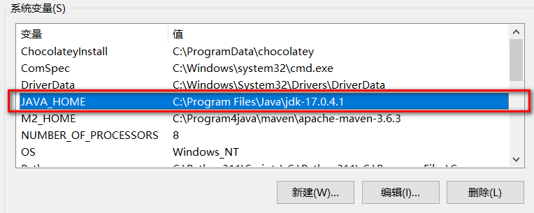
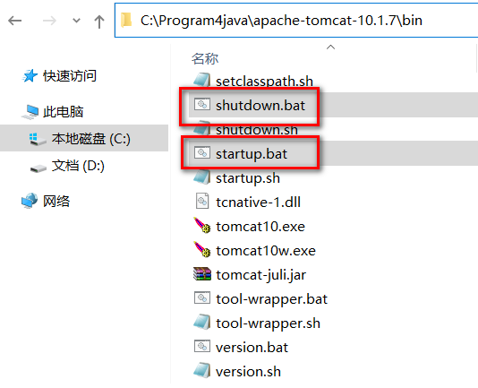

# 1 WEB服务器
> Web服务器通常由硬件和软件共同构成。


- **硬件：** 电脑，提供服务供其它客户电脑访问
- **软件：** 电脑上安装的服务器软件，安装后能提供服务给网络中的其他计算机，将本地文件映射成一个虚拟的url地址供网络中的其他人访问。

### 常见的JavaWeb服务器：

- **Tomcat（Apache）**：当前应用最广的JavaWeb服务器
- **Jetty**:更轻量级、更灵活的servlet容器
- **JBoss（Redhat红帽）**：支持JavaEE，应用比较广EJB容器 –> SSH轻量级的框架代替
- **GlassFish（Orcale）**：Oracle开发JavaWeb服务器，应用不是很广
- **Resin（Caucho）**：支持JavaEE，应用越来越广
- **Weblogic（Orcale）**：要钱的！支持JavaEE，适合大型项目
- **Websphere（IBM）**：要钱的！支持JavaEE，适合大型项目

# 2 Tomcat服务器

## 2.1 简介


> Tomcat是Apache 软件基金会（Apache Software Foundation）的Jakarta 项目中的一个核心项目，由Apache、Sun 和其他一些公司及个人共同开发而成。最新的Servlet 和JSP 规范总是能在Tomcat 中得到体现，因为Tomcat 技术先进、性能稳定，而且免费，因而深受Java 爱好者的喜爱并得到了部分软件开发商的认可，成为目前比较流行的Web 应用服务器。

## 2.2 安装

### 版本
- 版本：企业用的比较广泛的是8.0和9.0,目前比较新正式发布版本是Tomcat10.0, Tomcat11仍然处于测试阶段。
- JAVAEE 版本和Servlet版本号对应关系 [Jakarta EE Releases](https://jakarta.ee/release/) 

| **Servlet** Version | EE Version       |
| :------------------ | ---------------- |
| 6.1                 | Jakarta EE ?     |
| 6.0                 | Jakarta EE 10    |
| 5.0                 | Jakarta EE 9/9.1 |
| 4.0                 | JAVA EE 8        |
| 3.1                 | JAVA EE 7        |
| 3.1                 | JAVA EE 7        |
| 3.0                 | JAVAEE 6         |

**Tomcat 版本和 Servlet 版本之间的对应关系**

| **Servlet** Version | **Tomcat** Version | **JDK** Version                         |
| :------------------ | :------------------ | :-------------------------------------- |
| 6.1                 | 11.0.x              | 17 and later                            |
| 6.0                 | 10.1.x              | 11 and later                            |
| 5.0                 | 10.0.x (superseded) | 8 and later                             |
| 4.0                 | 9.0.x               | 8 and later                             |
| 3.1                 | 8.5.x               | 7 and later                             |
| 3.1                 | 8.0.x (superseded)  | 7 and later                             |
| 3.0                 | 7.0.x (archived)    | 6 and later (7 and later for WebSocket) |


### 下载
- Tomcat官方网站：[http://tomcat.apache.org/](http://tomcat.apache.org/ "http://tomcat.apache.org/")
- 安装版：需要安装，一般不考虑使用。
- 解压版: 直接解压缩使用，我们使用的版本。


### 安装

1. 正确安装JDK并配置JAVA_HOME(以JDK17为例 https://injdk.cn中可以下载各种版本的JDK)
   

2. 解压tomcat到非中文无空格目录
   

3. 点击bin/startup.bat启动
   

   

4. 打开浏览器输入 http://localhost:8080访问测试
   

5. 直接关闭窗口或者运行 bin/shutdown.bat关闭tomcat
   

6. 处理dos窗口日志中文乱码问题: 修改conf/logging.properties,将所有的UTF-8修改为GBK
   
   

   - 修改前
      

   - 修改后
      - 

   - 重启测试
      - 

# 3 Tomcat目录及测试
> `C:\Program4java\apache-tomcat-10.1.7` 这个目录下直接包含 **Tomcat** 的 `bin` 目录、`conf` 目录等，我们称之为 **Tomcat的安装目录或根目录**。

## 3.2 Tomcat `bin` 目錄說明
### 3.2.1. `bin` 目錄功能
- 存放 **啟動 (startup)**、**停止 (shutdown)** Tomcat 的**可執行檔案**與**腳本檔案**。
- 根據不同版本（安裝版或解壓版），內容會略有不同。

---

### 3.2.2. 安裝版 (Installer 版)
- 會出現以下 **兩個 `.exe` 檔案**（Windows專用）：
  - **tomcat10.exe**  
    → 在 **控制台下**啟動 Tomcat，可以以「服務」模式執行。
  - **tomcat10w.exe**  
    → 開啟 **GUI 圖形介面**，可以設定 Tomcat 的啟動參數（例如記憶體大小、啟動參數、Java路徑等）。

---

### 3.2.3. 解壓版 (ZIP/TAR.GZ 版)
- 會出現以下 **批次檔 (.bat)** 和 **Shell 腳本 (.sh)**：
  - **startup.bat / startup.sh**  
    → 用來**啟動 Tomcat**。
  - **shutdown.bat / shutdown.sh**  
    → 用來**停止 Tomcat**。
- **注意**：這裡有一個常見拼字錯誤！是 `shutdown.bat`，不是 `shutdawn.bat`。

---

### 3.2.4. JAVA_HOME 環境變數
- 使用 `startup.bat` 或 `startup.sh` 啟動時，**必須先設定好 `JAVA_HOME` 環境變數**。
- 否則啟動腳本會找不到 Java 執行環境（JRE/JDK），導致啟動失敗。

---

### 3.2.5. 小補充：啟動流程（概念）
#### 1. 執行 `startup.bat`（或 `startup.sh`）
- 使用者在命令列（或點擊）執行 `startup.bat`。
- `startup.bat` 其實只是個「**快捷指令**」，真正做的事情是：
  ```bat
  call catalina.bat start
  ```
- 所以 **startup.bat 只是呼叫 catalina.bat，並傳入 start 參數**！

---

#### 2. `catalina.bat`（或 `catalina.sh`）負責真正啟動
- `catalina.bat` 接收到 `start` 參數後，會開始進行以下動作：

  1. **讀取環境變數**
     - 確認 `JAVA_HOME` 是否正確設定。
     - 確認其他必要環境（如 `CATALINA_HOME`、`CATALINA_BASE` 等）。

  2. **執行預先設定的自定義腳本（如果存在）**
     - 如果有 `setenv.bat`，會先執行它設定 JVM 的啟動參數，比如記憶體大小：
       ```bat
       set JAVA_OPTS=-Xms512m -Xmx1024m
       ```
       > 如果需要自訂 JVM 參數（例如記憶體設定），可以在 `setenv.bat` (Windows) 或 `setenv.sh` (Linux/Mac) 中設定。

  3. **啟動 Java 虛擬機 (JVM)**
     - 使用 Java 命令，呼叫 Tomcat 的啟動類別：
       ```bat
       java org.apache.catalina.startup.Bootstrap start
       ```
     - `Bootstrap` 這個類別負責建立 Tomcat 內部的核心元件（Server、Service、Connector 等）。

---

#### 3. `Bootstrap` 類別啟動過程
- `Bootstrap` 是 Tomcat 的啟動入口，它做了這些事情：

  1. **初始化 Catalina**
     - Catalina 是 Tomcat 的核心控制器，負責載入 server.xml 的設定（例如連接埠、ThreadPool、WebApps 位置等）。
  
  2. **載入 server.xml**
     - server.xml 是 Tomcat 的主要設定檔，定義了伺服器的所有重要配置（例如 Connector、Engine、Host、Context）。

  3. **啟動各個元件**
     - 啟動 Service（包含 Connector、Engine、Host）。
     - 開始監聽 HTTP/HTTPS 請求（通常是 port 8080）。

  4. **完成啟動，等待外部連線請求**。

---

#### 4. 小圖解

```
[你] 
 ↓
執行 startup.bat
 ↓
呼叫 catalina.bat start
 ↓
讀取 JAVA_HOME + 環境變數
 ↓
執行 java org.apache.catalina.startup.Bootstrap start
 ↓
Bootstrap 啟動 Catalina
 ↓
載入 server.xml 設定
 ↓
啟動 HTTP 監聽 (8080 Port)
 ↓
Tomcat 成功啟動！
```

---

#### 5. 最重要記得：

| 階段 | 說明 |
|:--|:--|
| startup.bat | 呼叫 catalina.bat |
| catalina.bat | 準備環境並執行 Bootstrap |
| Bootstrap | 啟動 Catalina，載入設定，啟動服務 |
| Catalina | 真正管理所有 Web 服務 |

---

### 3.2.6 筆記重點快速記憶版

| 分類 | 內容 |
|:--|:--|
| bin 目錄作用 | 放啟動、停止等可執行檔和腳本 |
| 安裝版特點 | 有 `tomcat10.exe` 和 `tomcat10w.exe` |
| 解壓版特點 | 有 `startup.bat`、`shutdown.bat`（注意拼字！） |
| 啟動前必備 | 必須設定 `JAVA_HOME` |
| 啟動流程 | startup.bat → catalina.bat → Bootstrap 類別 |

---

## 3.2 conf：这是一个非常非常重要的目录，这个目录下有四个最为重要的文件：
> Tomcat 安裝目錄下的 conf 資料夾，主要是存放 Tomcat伺服器運作所需的重要設定檔，比如伺服器的端口、網站部署路徑、安全性設置等等。

### 3.2.1 server.xml
#### 3.2.1.1 `server.xml` 是什麼？
- `server.xml` 是 **Tomcat 的主配置檔**。
- 它負責設定整個 Tomcat 伺服器的啟動行為，例如：
  - 設定伺服器監聽的端口（如 8080）
  - 設定網站的部署位置（webapps）
  - 設定連線器（Connectors）、虛擬主機（Host）等。

可以理解成：
> `server.xml` 決定了「這台 Tomcat 伺服器整體該怎麼啟動、對外開放哪些服務」。

---

#### 3.2.1.2 `server.xml` 主要結構簡單說明
##### 1. `<?xml version="1.0" encoding="UTF-8"?>`
- **說明：** 這是標準的 XML 聲明。
- **代表：** 檔案格式是 XML，且使用 UTF-8 編碼。

---

##### 2. `<Server port="8005" shutdown="SHUTDOWN">`
- **最外層 Server 元素**，代表整個 Tomcat 伺服器實例。
- **`port="8005"`**：Tomcat 的關閉監聽端口。
  - 意思是，如果要安全關閉 Tomcat，可以連到8005端口，發送 `SHUTDOWN` 指令字串。
- **`shutdown="SHUTDOWN"`**：定義了關閉指令的字串。

---

##### 3. `<Listener>` 區塊
> 這裡註冊了一些「監聽器」類別，作用是**在 Tomcat 啟動或運行時執行特定功能**。

- `VersionLoggerListener`：啟動時列印 Tomcat 版本資訊。
- `AprLifecycleListener`：檢查並啟用 APR（Apache Portable Runtime）原生庫，可提升效能。
- `JreMemoryLeakPreventionListener`：防止 JVM 內記憶體洩漏問題。
- `GlobalResourcesLifecycleListener`：管理全域 JNDI 資源的生命週期。
- `ThreadLocalLeakPreventionListener`：防止 ThreadLocal 變數引起的記憶體洩漏。

✅ 這些 Listener 通常不需要改，除非你有特別需求。

---

##### 4. `<GlobalNamingResources>` 區塊
> 這是定義 **全域的 JNDI 資源**。

- 這裡配置了一個叫 `UserDatabase` 的資源，代表一個「記憶體中的使用者資料庫」。
- 主要用途是支援登入驗證（像是 admin 密碼管理）。

```xml
<Resource name="UserDatabase"
          auth="Container"
          type="org.apache.catalina.UserDatabase"
          factory="org.apache.catalina.users.MemoryUserDatabaseFactory"
          pathname="conf/tomcat-users.xml" />
```
這個資源實際上是從 `conf/tomcat-users.xml` 讀取使用者帳號資料的！

---

##### 5. `<Service name="Catalina">`
- `Service` 元素代表「一個服務集合」，通常一個 Service 包含：
  - 一個或多個 `<Connector>`（負責接收請求）
  - 一個 `<Engine>`（負責處理請求）

> 可以理解成：**Connector收請求 → Engine處理請求。**

---

###### 5-1. `<Connector>` 區塊
> **定義 Tomcat 接收請求的端口**。

**(1) 主要 HTTP 連接器**
```xml
<Connector port="8080" protocol="HTTP/1.1"
           connectionTimeout="20000"
           redirectPort="8443"
           maxParameterCount="1000" />
```
- `port="8080"`：網站服務的 HTTP 連接端口（最常見的）。
- `connectionTimeout="20000"`：連線超時時間（20秒）。
- `redirectPort="8443"`：如果需要 HTTPS（加密連線），會跳轉到 8443 端口。
- `maxParameterCount="1000"`：單次請求最多允許 1000 個參數。

  
**(2) 預備的 SSL 連接器（被註解）*8
- 定義了如何支援 HTTPS 安全連線（但目前是註解掉的，需要自行開啟）。

**(3) 預備的 AJP 連接器（被註解）**
- 用於 Tomcat 和其他伺服器（如 Apache HTTPD）之間快速通訊（AJP/1.3協議）。

---

###### 5-2. `<Engine>` 區塊
**處理接收進來的請求**。

```xml
<Engine name="Catalina" defaultHost="localhost">
  ...
</Engine>
```
- `name="Catalina"`：Engine的名字（預設叫 Catalina）。
- `defaultHost="localhost"`：如果請求沒有指定 Host（網址），預設會交給 localhost。

---

###### 5-3. `<Realm>` 區塊
- Realm 是認證機制。
- 這裡配置了一個 `LockOutRealm` → 用來防止暴力破解密碼。
- `UserDatabaseRealm` → 使用前面 `GlobalNamingResources` 定義的 `UserDatabase` 來驗證帳號密碼。

---

###### 5-4. `<Host>` 區塊
**定義一個虛擬主機（網站）**。

```xml
<Host name="localhost" appBase="webapps"
      unpackWARs="true" autoDeploy="true">
  ...
</Host>
```
- `name="localhost"`：這個 Host 的名字是 localhost。
- `appBase="webapps"`：網站的應用程式放在 `webapps/` 目錄下。
- `unpackWARs="true"`：自動解壓 `.war` 檔案成為資料夾。
- `autoDeploy="true"`：Tomcat 會自動偵測新部署的應用程式。

**(1) `<Valve>` 記錄訪問日誌**
```xml
<Valve className="org.apache.catalina.valves.AccessLogValve" directory="logs"
       prefix="localhost_access_log" suffix=".txt"
       pattern="%h %l %u %t &quot;%r&quot; %s %b" />
```
- 設定了存取日誌（Access Log），記錄每個來訪者的請求。
- 日誌檔案存在 `logs/` 資料夾，檔名格式是 `localhost_access_logxxx.txt`。

---

##### 🔥 總結整體結構圖
```plaintext
<Server> (Tomcat伺服器)
├── Listeners (啟動時觸發的功能)
├── <GlobalNamingResources> (全域資源)
├── <Service> (服務集合)
│   ├── <Connector> (接收請求)
│   └── <Engine> (處理請求)
│       ├── <Realm> (使用者驗證)
│       └── <Host> (虛擬主機)
│           └── <Valve> (記錄存取日誌)
```

---

##### 🌟 最後小補充
- **如果要改網站的 Port？** → 改 `<Connector port="8080">`
- **如果要設定多個網站？** → 新增多個 `<Host>`。
- **想開啟 HTTPS？** → 打開註解的 SSL `<Connector>`。

---

#### 3.2.1.3 小提醒
- `server.xml` 是非常敏感的設定檔。  
  **改錯了，Tomcat可能無法啟動。**
- 改完 `server.xml` 之後，需要 **重新啟動 Tomcat** 才會生效。

---

### 3.2.2 tomcat-users.xml
#### 1. `tomcat-users.xml` 是什麼？

- `tomcat-users.xml` 是 Tomcat 裡用來 **管理用戶 (user)** 和 **角色 (role)** 的設定檔案。
- 它位於 Tomcat 安裝目錄下的 `conf` 資料夾中。
- Tomcat 本身是「沒有資料庫」的，所以內建的管理帳號、密碼與權限，就是簡單地存在這個 XML 檔裡。

✅ 主要用途：
- 定義可以登入 Tomcat 後台（例如 **Manager App**、**Host Manager App**）的帳號。
- 設定這些帳號所擁有的**權限**（例如只能看狀態？還是可以部署新的應用？）。

---

#### 2. tomcat-users.xml 的結構說明

在你給的範例中，有兩種元素：

| 元素 | 說明 |
|:-----|:-----|
| `<role>` | 定義「角色」名稱（例如：`manager-gui` 代表可以操作管理介面 GUI）。 |
| `<user>` | 定義一個「用戶」，並賦予這個用戶一組或多組「角色」。 |

---

##### `<role>` 元素（定義角色）

```xml
<role rolename="manager-gui"/>
```
- 這表示新增一個**角色**，叫做 `manager-gui`。
- 「角色」不是帳號，而是某種「權限集合」。
- 後面可以讓用戶去擁有這個角色，進而取得某些操作權限。

---

##### `<user>` 元素（定義用戶）

```xml
<user username="admin" password="admin" roles="admin-gui,admin-script,manager-gui,manager-script,manager-jmx,manager-status"/>
```
- `username`：帳號名稱，這裡是 `admin`
- `password`：密碼，這裡是 `admin`
- `roles`：這個用戶擁有哪些角色（用逗號分隔）

也就是說：
- 這個帳號 `admin`，登入後可以做「admin-gui」、「admin-script」、「manager-gui」、「manager-script」、「manager-jmx」、「manager-status」這六種角色能做的事。

---

#### 3. 常見角色與權限對照表

| 角色名稱 | 說明 |
|:---------|:-----|
| `manager-gui` | 可以登入 **/manager/html** 管理網頁，進行 Web 應用部署、重新啟動、刪除等。 |
| `manager-script` | 允許透過 HTTP 請求的 API 指令來管理應用（適合自動化腳本）。 |
| `manager-jmx` | 可以使用 JMX (Java Management Extensions) 監控 Tomcat。 |
| `manager-status` | 可以瀏覽伺服器的狀態資訊，但**不能**做部署、停止等修改。 |
| `admin-gui` | 可以使用 **Host Manager** 的網頁介面來新增/刪除虛擬主機。 |
| `admin-script` | 允許用腳本 API 新增/刪除虛擬主機等設定。 |

> 🔥 注意：**`manager-gui`** 是最基本的！如果你要用網頁部署或重新啟動應用，必須有這個角色。

---

#### 4. 小提醒：部署好後要注意安全

在開發時這樣設帳號是方便，但如果你將 Tomcat 部署到正式環境，**請千萬不要用 `admin/admin` 這種簡單密碼**！

正式環境建議：
- 改成更安全的帳密。
- 最好限制 IP（只允許內網或某些 IP 登入）。
- 或直接關掉 Tomcat 的管理後台（Manager App）。

---

#### 5. 例子：假設你只要一個只看狀態的用戶

如果你只要一個「只能看狀態」的帳號，可以這樣寫：

```xml
<role rolename="manager-status"/>
<user username="readonly" password="readonly123" roles="manager-status"/>
```
這樣 `readonly` 用戶登入後，只能看伺服器狀態頁，不會有部署或刪除的權限。

---

#### 6. 簡單總結記憶：

> `tomcat-users.xml` = 「帳號密碼」+「角色權限」設定表  
>  
> 設定好帳號 → 配對角色 → 就能控制誰可以登入 Tomcat 管理後台做哪些事情。

---

要不要我再順便補充一下  
👉 **如果想新增不同的管理網站 (Context) 時要如何配合 tomcat-users.xml？**  
我可以一起教你連 Manager App 或 Host Manager 的 URL 路徑、授權流程也整理一下喔！要嗎？🚀

### 3.2.3 web.xml
#### 1. web.xml 是什麼？

- `web.xml` 是 **Web 應用的部署描述符**（Deployment Descriptor）。
- 在 Tomcat 中，`conf/web.xml` 是一個 **全域預設設定檔**，會對**所有部署在這個 Tomcat 上的應用**生效。
- 每個 Web 應用也可以有自己的 `WEB-INF/web.xml`，**當有局部設定時，會覆蓋 Tomcat 的全域設定**。

---

#### 2. web.xml 中的主要內容

##### (1) MIME 類型（你提供的重點）
- `web.xml` 中註冊了大量的 **MIME 類型**（Multipurpose Internet Mail Extensions）。
- MIME 類型是用來**說明文件的內容類型**，讓瀏覽器或客戶端知道該怎麼處理收到的資料。

範例：
```xml
<mime-mapping>
    <extension>html</extension>
    <mime-type>text/html</mime-type>
</mime-mapping>
<mime-mapping>
    <extension>jpg</extension>
    <mime-type>image/jpeg</mime-type>
</mime-mapping>
```
說明：
- 當使用者請求一個 `.html` 頁面時，伺服器除了送出內容外，也會回傳 `Content-Type: text/html`，告訴瀏覽器這是 HTML 文件，應直接渲染出來。
- 當請求 `.exe` 檔案時，瀏覽器因無法直接顯示執行檔，會根據 MIME 類型彈出**下載視窗**。
- 簡單來說，MIME 是告訴瀏覽器：這份資料是什麼型態，要如何處理它。

---

##### (2) 其他常見設定（補充）

| 分類 | 說明 | 舉例 |
| :-- | :-- | :-- |
| **Servlet 配置** | 定義哪些 Servlet 要啟動 | 例：DispatcherServlet |
| **Servlet 映射 (Mapping)** | 定義 URL 路徑對應到哪個 Servlet | 例：`/login` 對應到 LoginServlet |
| **Filter 配置** | 定義攔截器，例如登入驗證 | 例：LoginFilter |
| **Listener 配置** | 監聽 Session、Application 等生命週期事件 | 例：SessionListener |
| **Welcome Files** | 設定訪問目錄時預設打開的頁面 | 例：index.html、index.jsp |
| **Error Pages** | 定義錯誤時的顯示頁面 | 例：404.html、500.html |
| **Session Timeout** | 設定 Session 過期時間（分鐘） | 例：30 分鐘失效 |
| **安全性設定** | 設定需要授權才能訪問的資源 | 例：後台需登入才能進入 |

---

#### 3. 為什麼 `conf/web.xml` 很重要？

- 它是 **Tomcat 全域規則的總設定檔**。
- 當某個 Web 應用自己沒有定義某些行為時（例如沒有指定 welcome file），Tomcat 就會採用 `conf/web.xml` 中的預設值。
- **修改這個文件會影響到整個伺服器上所有應用**，必須特別小心。

---

#### 4. 優先順序說明（簡單圖示）

```text
單一 Web 應用自己的 WEB-INF/web.xml 設定
    >
Tomcat conf/web.xml 預設設定
```
- **Web App 局部設定優先 > Tomcat 全局設定**
- 當應用有自己的設定時，會覆蓋掉 `conf/web.xml` 中的對應設定。

---

#### 5. 小結
- `conf/web.xml` 是 Tomcat 的全域預設配置，控制了所有應用的基本行為。
- 主要設定包括：MIME 類型、Servlet/Filter、Welcome Page、錯誤頁面、Session timeout、安全授權等。
- 如果應用內有自己的 `WEB-INF/web.xml`，可以局部覆蓋這些設定。
- 修改 `conf/web.xml` 需注意會影響到**所有部署的應用**。

---

要不要我順便再幫你列出一份「常見 web.xml 配置模板範例」，讓你可以直接拿來套？  
要的話告訴我！🚀

### 3.2.4 context.xml
> **對所有應用的統一配置，通常我們不會去修改它。**
- `context.xml` 位於 Tomcat 的 `conf` 目錄下 (`$CATALINA_HOME/conf/context.xml`)。

- 它是**全局**的 Context 設定檔，作用是：  
  ➔ **提供所有 Web 應用統一適用的默認配置。**

- 在 Tomcat 中，「Context」代表一個 Web 應用（例如：一個部署的 `.war` 文件就是一個 Context）。

- 每個應用自己也可以有自己的 `META-INF/context.xml`，或是通過在 `server.xml` 中明確定義 `<Context>`，但 `conf/context.xml` 是**所有應用預設繼承的基礎設定**。

---

#### 典型 `context.xml` 範例

```xml
<Context>
    <!-- 禁止 Web 應用修改自己的 Web.xml 相關配置 -->
    <WatchedResource>WEB-INF/web.xml</WatchedResource>

    <!-- 可以統一設定 JDBC 資源 (資料庫連線池) -->
    <!--
    <Resource name="jdbc/MyDB"
              auth="Container"
              type="javax.sql.DataSource"
              maxTotal="100"
              maxIdle="30"
              maxWaitMillis="10000"
              username="dbuser"
              password="dbpassword"
              driverClassName="com.mysql.cj.jdbc.Driver"
              url="jdbc:mysql://localhost:3306/mydb"/>
    -->

</Context>
```

---

#### 常見的用途舉例：

| 用途 | 說明 |
|:---|:---|
| 監控 Web 應用的 `web.xml` 變更 | 透過 `<WatchedResource>` 配置，如果 `web.xml` 被修改，Tomcat 會自動重載應用。 |
| 統一配置資料庫連線池 | 在 `context.xml` 配置 `<Resource>`，讓所有應用共用相同的資料庫設定。 |
| 設定 Session 相關行為 | 例如可以加 `<Manager pathname="">` 來讓 Session 不被持久化到磁碟。 |
| 安全設定或資源共享 | 可在這裡定義一些共用的 JNDI 資源。 |

---

#### 注意事項：

- **一般情況下不建議直接修改 `conf/context.xml`**，因為它會影響到 Tomcat 上**所有部署的應用**。  
  ➔ 如果只是針對單個應用特別設定，建議放在該應用自己的 `META-INF/context.xml` 中。

- 修改 `conf/context.xml` 後，**需要重啟 Tomcat**，變更才會生效。

---

#### 簡單比喻一下：

- `context.xml` 有點像「學校的校規」，每個學生（Web 應用）都必須遵守。
- 但如果某個學生需要特別待遇（個別的配置），可以自己再寫一份「個別規定」（在自己的 `META-INF/context.xml` 中設定）。

---

要不要我順便也幫你舉個「實際情境範例」，讓你更容易理解？🌟  
例如：怎麼在 `context.xml` 統一配置一個 MySQL 資料庫連線資源？  
要的話跟我說～

## 3.3 lib 
### 1. 基本說明

- `lib` 是 **Tomcat 的類庫目錄**，裡面放了大量 Tomcat 運行所需的 `.jar` 檔案。
- 如果需要添加 **Tomcat 本身依賴** 的 jar 文件，可以直接放入這個目錄中。
- 也**可以**把**應用程式**依賴的 jar 文件放進來，但**不建議這麼做**（原因後述）。

### 2. `lib` 目錄的特性

- **所有部署在這個 Tomcat 實例上的應用程式都可以共用 `lib` 目錄中的 jar 檔案**。
- `lib` 目錄下的 jar 檔會被 **Tomcat 的 common classloader** 加載，因此是 **跨應用共用的資源**。
- 如果應用放到其他 Tomcat 環境，**就無法保證這些 jar 還存在**，所以會出現移植性問題。

### 3. 建議放入 `lib` 的內容

✅ **適合放入的 jar**：
- **Tomcat 運行必要的 jar**（如 Servlet API、JSP API 等）
- **JDBC 驅動程式**（如 MySQL Connector/J，當使用 DataSource 連資料庫時需要）
- **共用型的日誌框架實作**（如 slf4j-api、log4j-core，若希望所有應用共用統一的日誌）

❌ **不適合放入的 jar**：
- 應用程式自己需要的第三方庫（如 Spring、Hibernate）
- 應用程式自己的業務邏輯庫（專屬功能模組）

> **理由**：應用程式應該自己帶著自己的依賴，否則容易出現版本衝突、相依性混亂、移植困難等問題。

### 4. `lib` 目錄 vs `WEB-INF/lib` 差異比較

| 項目              | `$CATALINA_HOME/lib`                  | `WEB-INF/lib`                      |
|-------------------|--------------------------------------|-----------------------------------|
| 加載範圍          | 整個 Tomcat 中所有應用共用            | 單一個 web 應用獨立使用            |
| 使用者            | Tomcat 自己、所有部署的 Web 應用      | 特定的 Web 應用自己                 |
| 移植性            | 差，換 Tomcat 需要重新放置 jar        | 好，打包後可以直接移動部署         |
| 適合放的內容      | JDBC Driver、共用日誌實作             | Spring、Hibernate 等業務相關函式庫 |

### 5. 為什麼應避免把應用程式的 jar 放到 `lib`？

- **版本衝突**：不同應用程式可能需要不同版本的同一個庫。
- **降低可移植性**：應用無法單獨部署到其他 Tomcat，必須一起搬運依賴。
- **維護困難**：共用 jar 更新時，可能會破壞其他應用的運作。

### 6. 總結最佳實踐

- ✅ **Tomcat 自己需要的 jar → 放 lib**  
- ✅ **應用程式自己需要的 jar → 放 WEB-INF/lib**
- ✅ **保持應用的獨立性、移植性與可維護性**

---

## 3.4 logs 
> `logs` 目錄是 Tomcat 伺服器中**專門用來存放各種日誌檔案**的地方，這些日誌記錄了伺服器的運作狀態，例如啟動、運行過程、錯誤、關閉等資訊。

### 主要功能
- **啟動與關閉記錄**  
  當 Tomcat 啟動或關閉時，相關的訊息（包括時間點、過程細節）都會被記錄在日誌中。
- **錯誤與異常記錄**  
  如果 Tomcat 在啟動、運行中發生錯誤（例如配置錯誤、端口被占用、部署失敗），這些錯誤會被詳細記錄在日誌文件中，方便你事後排查問題。
- **訪問和請求記錄**（依設定而定）  
  Tomcat 也可以記錄用戶對應用程式的訪問行為（例如哪些 IP 連接了伺服器、請求了哪些資源）。

### 常見的幾種日誌文件
| 文件名稱 | 說明 |
|:---|:---|
| `catalina.out` | Tomcat 的**標準輸出與錯誤輸出**（類似總匯日誌），伺服器過程中出現的錯誤、警告、信息都會輸出到這裡。通常是最常查閱的日誌。 |
| `catalina.YYYY-MM-DD.log` | 每天生成的 Catalin 日誌，記錄伺服器運行過程中的重要訊息。 |
| `localhost.YYYY-MM-DD.log` | 記錄與「本地主機」相關的應用程序訊息，例如部署、載入、卸載 web 應用的訊息。 |
| `localhost_access_log.YYYY-MM-DD.txt` | 記錄所有對伺服器的**HTTP訪問請求**（類似 nginx 的 access log），包含 IP、請求方式、狀態碼、請求路徑等資訊。 |
| `manager.YYYY-MM-DD.log` | 記錄使用 Tomcat Manager（管理界面）操作時的活動記錄。 |
| `host-manager.YYYY-MM-DD.log` | 記錄使用 Host Manager 操作時的活動記錄。 |

> 註：YYYY-MM-DD 是產生日誌的日期，例如：`catalina.2025-04-27.log`

### 實際例子
假設你今天早上啟動 Tomcat 結果無法啟動，你可以到 `logs` 目錄裡打開：
- `catalina.out` 看看是不是有錯誤（比如 port 8080 被占用了）
- `catalina.2025-04-27.log` 看看今天的詳細啟動過程
- 如果是某個 WebApp 部署失敗，也可以看看 `localhost.2025-04-27.log`

### 小提醒
- **檢查錯誤**：Tomcat 啟動異常時，最直接就是先看 `catalina.out`。
- **自動清理**：因為日誌會隨時間累積，建議定期清理過舊的日誌，避免硬碟空間爆滿。
- **自訂日誌**：可以通過修改 `conf/logging.properties` 來調整日誌輸出格式、級別、目的地（例如只記錄警告，不記錄資訊等）。

---

要不要我也順便補充一份「**常見 Tomcat 啟動錯誤對應要看哪些 logs**」的表格？  
如果想要的話告訴我！🚀

## 3.5 temp
> 存放Tomcat的临时文件，这个目录下的东西可以在停止Tomcat后删除！

### 1. 基本用途
- `temp/` 目錄是 **Tomcat啟動和運行時產生的臨時文件存放位置**。
- 包括但不限於：
  - Java編譯過程中產生的臨時文件
  - 當Servlet容器需要將某些大文件暫時寫到磁碟時
  - 內部操作需要暫存數據（例如上傳文件時先暫存）
  - JSP編譯成Java、再編譯成class檔時，中間過程可能會用到這個目錄

### 2. 特點
- **Tomcat停止後，這些臨時文件就沒有用了**。
- 可以**安全地清空**這個目錄（前提是Tomcat已經停止）。
- **Tomcat重新啟動時會自動再生成需要的臨時文件**，不需要人工干預。

### 3. 實際例子
- 例如：用戶上傳一個大檔案到伺服器，Tomcat會先把檔案暫時存到 `temp/` 裡，等處理完（比如存到正式目錄或資料庫）後，這些檔案就沒有用了。
- 再比如：Tomcat運行一個 JSP 頁面時，會將 JSP 轉成 Java，再轉成 class，過程中的一些暫時性檔案會存到 `temp/`。

### 4. 注意事項
- **不要在Tomcat運行時手動刪除 `temp/` 內的文件**，否則可能會導致正在運行的應用出錯！
- **可以設定環境變數**來讓Tomcat使用其他地方作為temp目錄：
  - 可以透過設定 `CATALINA_TMPDIR` 來自定義temp目錄位置。
  - 預設情況下，`CATALINA_TMPDIR` 就是 `Tomcat安裝目錄/temp/`。

### 5. 小結
| 項目 | 說明 |
| :--- | :--- |
| 目錄名稱 | `temp/` |
| 主要功能 | 存放Tomcat運行期間產生的臨時檔案 |
| 可以刪除嗎？ | Tomcat停止後可以刪除 |
| 重啟影響 | 重啟後Tomcat會自動重新建立需要的臨時文件 |

---

## 3.6 webapps
### 基本概念：
- `webapps` 是 **Tomcat 用來部署 Web 應用（Web Project）** 的預設目錄。
- 這個目錄下面的**每個子資料夾**，代表一個可以透過瀏覽器訪問的**獨立 Web 應用**。

---

### 目錄內容說明：

| 項目 | 說明 |
|:----|:----|
| `webapps/ROOT` | **特殊應用**，對應網址根目錄（例如直接訪問 `http://localhost:8080/` 會打到這個應用）。 |
| `webapps/examples` | **示範專案**，Tomcat 官方自帶的範例，展示各種 Servlet、JSP 等功能的用法。 |
| `webapps/docs` | **線上文件**，Tomcat 的使用說明與 API 文件。可以透過 `http://localhost:8080/docs` 訪問。 |
| `webapps/manager` | **管理應用**，提供一個 Web 界面，讓你可以上傳、部署、啟動、停止 Web 應用。要設定帳號密碼才可登入。 |
| `webapps/host-manager` | **虛擬主機管理應用**，用來管理 Tomcat 的虛擬主機（Virtual Hosts）。 |

---

### 補充細節：

- **部署應用的方式**：
  - 直接把**一個 Web 專案的資料夾**放到 `webapps` 裡面。
  - 或者放一個 **`.war` 檔案**（Web Archive），Tomcat啟動時會自動解壓並部署成一個資料夾。

- **訪問規則**：
  - 如果放在 `webapps/yourApp`，就用網址 `http://localhost:8080/yourApp` 來訪問。
  - 如果部署 `.war` 檔案叫 `myapp.war`，會自動解壓成 `myapp/` 目錄，訪問網址一樣是 `http://localhost:8080/myapp`。
  - 如果 `.war` 檔名是 `ROOT.war`，會直接覆蓋掉 `ROOT` 預設專案。

- **特殊情況：ROOT 專案**：
  - 當網址只輸入到 `http://localhost:8080/`，而沒有指定應用名稱時，Tomcat 預設是打到 `webapps/ROOT` 裡的內容。
  - 如果想讓自己的網站成為預設網站，只需要把自己的專案部署成 `ROOT` 目錄（或者 `ROOT.war`）。

---

### 小結：

- `webapps` 是 Tomcat 的**主要部署目錄**。
- **每個子資料夾或 `.war`** 都代表一個**可獨立訪問**的網站或應用。
- `ROOT` 是特別的，對應無路徑時的預設入口。

---

要不要我順便也整理一下「如何自己部署一個自己的專案到 webapps」？我可以附一個小範例流程給你 👀  
要的話告訴我！

## 3.7 work
**基本概念：**  
`work` 目錄是 Tomcat 在**運行時（runtime）**自動生成的，用來存放**Tomcat內部運作過程中的中間文件**，主要是針對 **JSP（JavaServer Pages）** 處理而來的 Java 源碼和編譯後的 class 檔案。

這些文件不是原本就存在的，而是**當 Tomcat 啟動或當用戶請求 JSP 頁面時動態產生**的！

---

### `work` 目錄的主要功能
1. **JSP 轉譯成 Servlet：**  
   當客戶端第一次請求 `.jsp` 文件時，Tomcat 會自動：
   - 把 JSP 文件**翻譯成一個 Java Servlet 檔案**（生成 `.java` 檔案）。
   - 然後**編譯這個 Java 檔案生成 `.class` 檔案**。
   - 這些 `.java` 和 `.class` 檔案會被存放到 `work` 目錄中。

2. **加速響應速度：**  
   - **只需要轉譯一次。**  
     當 JSP 文件第一次被請求時才會轉譯和編譯，以後再次請求相同 JSP 時，就可以直接使用已經生成好的 Servlet `.class` 檔案，**不需要每次都重新生成**，大大提高了執行效率。
     
3. **自動清理與重建：**
   - 如果你**手動刪除 `work` 目錄**（或者 clean 專案時），下次 Tomcat 運行或重新請求 JSP 頁面時，**Tomcat會自動重新生成需要的 `.java` 和 `.class` 檔案**，所以這個資料夾**是可以安全刪除的**。

---

### 舉個實際流程例子

假設你的 `webapps` 目錄下有一個項目 `myapp`，裡面有一個 `hello.jsp`，當用戶訪問這個 `hello.jsp` 時，流程如下：

1. Tomcat 發現這是第一次請求 `hello.jsp`，所以會去翻譯成：
   ```
   hello_jsp.java
   ```
2. 接著，Tomcat 會編譯這個 `.java` 文件，產生：
   ```
   hello_jsp.class
   ```
3. 最後，這些 `.java` 和 `.class` 文件都會存放在 `work` 目錄的對應位置，例如：
   ```
   work/Catalina/localhost/myapp/org/apache/jsp/hello_jsp.java
   work/Catalina/localhost/myapp/org/apache/jsp/hello_jsp.class
   ```

之後當用戶再訪問 `hello.jsp`，Tomcat就直接用 `hello_jsp.class` 來快速響應，而不需要再重新轉譯與編譯。

---

### 小結重點

| 重點 | 說明 |
| :--- | :--- |
| **目錄來源** | Tomcat 自動生成 |
| **主要內容** | JSP 轉成的 `.java` 和 `.class` 檔案 |
| **可以刪除嗎？** | 可以安全刪除，Tomcat會自動重新生成 |
| **目的是什麼？** | 加速 JSP 頁面的回應速度，提高效能 |

---

要不要我順便也畫一個小流程圖給你？這樣整個從「JSP 被處理」到「產生 class 檔」的流程會更直覺！  
要的話跟我說一聲～🌟

## 3.8 LICENSE
**基本概念：**  
`LICENSE` 是「授權證書」文件，**告訴你這個軟體是用什麼授權條款開放的**。  
Tomcat 是**Apache Software Foundation（ASF）** 維護的開源項目，它的授權條款就是**Apache License 2.0**。

---

### LICENSE 文件的內容與作用

1. **授權條款說明（License Terms）：**
   - 告訴你 Tomcat 的原始碼、二進位檔案（比如 `.jar`）**可以怎麼使用**、**怎麼分發**、**怎麼修改**。
   - **開放原始碼（Open Source）**，**可以自由使用**，但必須遵守一些基本規定。

2. **允許你做什麼（你可以）：**
   - 免費使用 Tomcat。
   - 修改源碼，自行客製化。
   - 把修改後的版本重新發布。
   - 把 Tomcat 集成到你的商業項目中（即使是賣錢的商業軟體也可以使用！）。

3. **要求你做什麼（你必須）：**
   - 保留原本的 LICENSE 聲明（就是不能把 Apache 的版權聲明刪掉）。
   - 如果你修改了源碼，要標明你做了哪些修改。
   - 不能用 Apache 的名稱或 Logo 來宣傳你的產品（除非得到官方許可）。

4. **責任免除（Disclaimer）：**
   - Apache 基金會**不對 Tomcat 的使用後果負責**。
   - 使用 Tomcat 是**自負風險**的（比如系統出錯、資料遺失，不能怪 Apache）。

---

### 舉個簡單的例子

比如你想拿 Tomcat 來做自己公司的 Web 伺服器，或是拿來做一套商業版的產品，只要你遵守 LICENSE 裡的規定（像是保留版權聲明），**完全沒有問題**，而且**不用付授權費**！

如果你自己改了 Tomcat 原始碼，比如優化了它的性能，只要在你的發布說明中註明「這些部分是修改版」，也是合法的。

---

### 小結重點

| 重點 | 說明 |
| :--- | :--- |
| **授權類型** | Apache License 2.0 |
| **可以自由使用嗎？** | 可以，包括商業用途 |
| **有什麼要求？** | 保留版權聲明、標註修改、不能亂用 Apache 名字 |
| **要付錢嗎？** | 不需要，是免費的開源軟體 |
| **有保障嗎？** | 沒有保證，使用風險自負 |

---

### 額外補充：Apache License 2.0 與其他開源授權比較

| 授權類型 | 商業使用 | 修改後發布 | 是否需要開源 | 特點 |
| :--- | :--- | :--- | :--- | :--- |
| Apache License 2.0 | ✅ 可以 | ✅ 可以 | ❌ 不強制 | 保留版權聲明即可，適合商業 |
| GPL (例如 Linux) | ✅ 可以 | ✅ 可以 | ✅ 必須開源 | 修改後必須開源，感染性強 |
| MIT License | ✅ 可以 | ✅ 可以 | ❌ 不強制 | 非常寬鬆，簡單 |

➔ 可以看出來，Apache License 2.0 是非常**友善且彈性大的開源授權**，特別適合企業或商業開發使用。

---

## 3.9 NOTICE
**基本概念：**  
`NOTICE` 文件是一個**說明文件**，主要用來**提供法律聲明、版權信息、第三方軟體引用說明**等，讓使用者清楚知道這個軟體中有哪些**重要通知事項**。

它是配合 `LICENSE` 檔案一起存在的，兩者都屬於**Apache 開源項目的標準要求**。

---

### NOTICE 文件的主要作用

1. **列出版權聲明（Copyright Notice）：**
   - 告訴使用者：Tomcat 這個軟體的版權屬於誰（通常是 Apache Software Foundation）。

2. **列出第三方授權（Third-party Notices）：**
   - 如果 Tomcat 使用了其他開源軟體（比如某個函式庫），NOTICE 裡會列出這些**第三方組件的授權資訊**。
   - 通常會簡單標示哪些部分是引用了別人的技術，或者需要額外注意的法律事項。

3. **保護法律權益（Legal Protection）：**
   - 通過列出版權和引用，確保 Tomcat 團隊及 Apache 基金會不會因為授權問題被法律追究。
   - 同時提醒使用者遵守相應的條款。

4. **補充 LICENSE 文件：**
   - `LICENSE` 是完整授權條款，而 `NOTICE` 是補充性說明文件。
   - 也就是說，**`NOTICE` 不會單獨限制使用行為**，但有可能包含一些**必須一併遵守或標示的聲明**。

---

### 舉個實際例子

Tomcat 的 `NOTICE` 裡可能會寫類似這樣的內容：

```text
Apache Tomcat
Copyright 1999-2024 The Apache Software Foundation

This product includes software developed at
The Apache Software Foundation (http://www.apache.org/).

This product includes some software from The JDOM Project (http://www.jdom.org/).
```

這段話代表：
- Tomcat 主要是 Apache 自己開發的。
- 同時，Tomcat 也有使用 JDOM 這個第三方軟體，因此必須在 NOTICE 文件中明確說明。

---

### 小結重點

| 重點 | 說明 |
| :--- | :--- |
| **主要內容** | 版權聲明、第三方授權聲明、重要通知 |
| **功能** | 告知使用者軟體來源與引用的第三方軟體 |
| **和 LICENSE 的關係** | LICENSE 是授權條款，NOTICE 是補充說明 |
| **會有法律影響嗎？** | 主要是為了遵循開源授權規定，避免侵權問題 |

---

### LICENSE 和 NOTICE 的差別總結

| 項目 | LICENSE | NOTICE |
| :--- | :--- | :--- |
| 目的是什麼？ | 告訴你可以怎麼用、限制是什麼 | 告知誰擁有版權、引用了哪些第三方軟體 |
| 對使用行為的影響？ | 有直接法律約束力 | 主要是信息告知，有時要求轉發 NOTICE |
| 內容長度 | 通常比較長（完整條款） | 通常比較短（簡單版權、引用說明） |

---

要不要我順便也教你，如果將來你自己寫開源項目時，該怎麼撰寫自己的 `NOTICE` 文件？很簡單，學會的話以後超加分！要的話跟我說一聲～🚀

# 4 WEB项目的标准结构

> 一个标准的可以用于发布的WEB项目标准结构如下


+ app 本应用根目录
    + **static:** 非必要目录，约定俗成的名字，一般在此处放静态资源 (css、js、img)
    + **WEB-INF:** 必要目录，必须叫 `WEB-INF`，受保护的资源目录，浏览器通过url不可以直接访问的目录
        + **classes:** 必要目录，src 下源代码、配置文件，编译后会在该目录下，web 项目中如果没有源码，则该目录不会出现
        + **lib:** 必要目录，项目依赖的 jar 编译后会出现在该目录下，web 项目要是没有依赖任何jar，则该目录不会出现
        + **web.xml:** 必要文件，web项目的基本配置文件，较新的版本中可以没有该文件，但是学习过程中还是需要该文件 
    + **index.html:** 非必要文件，index.html、index.htm、index.jsp 为默认的欢迎页

> url的组成部分和项目中资源的对应关系


### 補充：整個動態Web工程目錄介紹


# 5 WEB项目部署的方式
> **方式1:** 直接将编译好的项目放在 webapps 目录下  (已经演示)

> **方式2:** 将编译好的项目打成 `war` 包放在 `webapps` 目录下，`tomcat`启动后会自动解压 `war` 包(其实和第一种一样)

> **方式3:** 可以将项目放在非 `webapps` 的其他目录下，在 `tomcat` 中通过配置文件指向 app 的实际磁盘路径

**在磁盘的自定义目录上准备一个app**


**在tomcat的conf下创建Catalina/localhost目录,并在该目录下准备一个app.xml文件**

``` xml
<!-- 
	path: 项目的访问路径,也是项目的上下文路径,就是在浏览器中,输入的项目名称
    docBase: 项目在磁盘中的实际路径
 -->
<Context path="/app" docBase="D:\mywebapps\app" />
```

**启动tomcat访问测试即可**

# 6 IDEA中开发并部署运行WEB项目

## 6.1 IDEA关联本地Tomcat
> 可以在创建项目前设置本地 tomcat，也可以在打开某个项目的状态下找到 settings


> 找到 Build、Execution、Eeployment 下的 Application Servers 找到 **+号**


> 选择 `Tomcat Server`


> 选择 `tomcat` 的安装目录


> 点击ok


> 关联完毕


## 6.2 IDEA创建web工程
> 推荐先创建一个空项目，这样可以在一个空项目下同时存在多个 modules，不用后续来回切换之前的项目，当然也可以忽略此步直接创建 `web` 项目


> 检查项目的 SDK、语法版本、以及项目编译后的输出目录


> 先创建一个普通的 JAVA 项目


> 检查各项信息是否填写有误


> 创建完毕后，为项目添加 Tomcat 依赖


> 选择 modules，添加 framework support（如果找不到使用记得全局搜索（快捷键 `ShiftShift`）（记得先选中模块））


> 选择 Web Application 注意 Version 为 5.0（如果上面没有为项目添加 Tomcat10 依赖的话是选不了的（新版已经是6.0了）），勾选  Create web.xml


> 删除 index.jsp，替换为 index.html


### 处理配置文件

+ 在工程下创建 `resources` 目录，专门用于存放配置文件(都放在`src`下也行，单独存放可以尽量避免文件集中存放造成的混乱)
+ 标记目录为资源目录，不标记的话则该目录不参与编译


+ 标记完成后,显示效果如下


### 处理依赖jar包问题
+ 在 `WEB-INF` 下创建 `lib`目录
+ 必须在 `WEB-INF` 下，且目录名必须叫 `lib` !!!
+ 复制 jar文件进入 `lib` 目录


+ 将lib目录添加为当前项目的依赖，后续可以用maven统一解决


+ 环境级别推荐选择module 级别，降低对其他项目的影响，name可以空着不写


### 查看当前项目有那些环境依赖


+ 在此位置，可以通过-号解除依赖


## 6.3 IDEA部署-运行web项目
> 检查idea是否识别modules为web项目并存在将项目构建成发布结构的配置

+ 就是检查工程目录下，web目录有没有特殊的识别标记


+ 以及artifacts下，有没有对应 _war_exploded，如果没有，就点击+号添加


> 点击向下箭头，出现 Edit Configurations选项


> 出现运行配置界面


> 点击+号，添加本地tomcat服务器


> 因为IDEA 只关联了一个Tomcat，红色部分就只有一个Tomcat可选


> 选择Deployment，通过+添加要部署到 Tomcat 中的 artifact


> applicationContext 中是默认的项目上下文路径，也就是url中需要输入的路径，这里可以自己定义，可以和工程名称不一样，也可以不写，但是要保留 `/`，我们这里暂时就用默认的


> 点击 apply 应用后，回到 Server 部分。`After Launch` 是配置启动成功后，是否默认自动打开浏览器并输入 `URL` 中的地址，HTTP port 是 Http 连接器目前占用的端口号


> 点击OK后，启动项目，访问测试

+ 绿色箭头是正常运行模式
+ "小虫子"是debug运行模式


+ 点击后，查看日志状态是否有异常


+ 浏览器自动打开并自动访问了 `index.html` 欢迎页


> 工程结构和可以发布的项目结构之间的目录对应关系


### IDEA部署并运行项目的原理
+ `idea` 并没有直接进将编译好的项目放入 `tomcat` 的 `webapps`中
+ `idea` 根据关联的 `tomcat`，创建了一个 `tomcat` 副本，将项目部署到了这个副本中
+ `idea` 的 `tomcat` 副本在 `C:\用户\当前用户\AppData\Local\JetBrains\IntelliJIdea2022.2\tomcat\` 中
+ `idea` 的 `tomcat` 副本并不是一个完整的 `tomcat`，副本里只是准备了和当前项目相关的配置文件而已
+ `idea` 启动 `tomcat` 时，是让本地 `tomcat` 程序按照 `tomcat` 副本里的配置文件运行
+ `idea` 的 `tomcat` 副本部署项目的模式是通过 `conf/Catalina/localhost/*.xml` 配置文件的形式实现项目部署的

