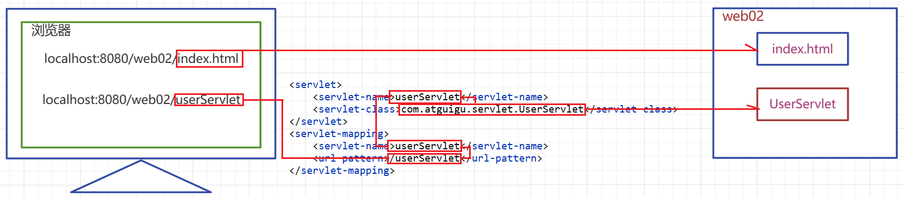
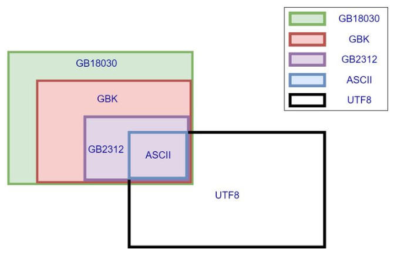
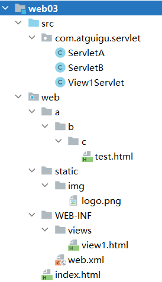

# 1. Servlet 简介

## 1.1 动态资源和静态资源
- **静态资源:** 无需在程序运行时通过代码运行生成的资源，在程序运行之前就写好的资源，例如 : html、css、js img、音频文件和视频文件。

- **动态资源:** 需要在程序运行时通过代码运行生成的资源，在程序运行之前无法确定的数据，运行时动态生成，例如 : Servlet、Thymeleaf ...。

> 动态资源指的不是视图上的动画效果或者是简单的人机交互效果

- 生活举例: 去蛋糕店买蛋糕
  - 直接买柜台上已经做好的: 静态资源
  - 和柜员说要求后现场制作: 动态资源

## 1.2 Servlet 简介
> **Servlet(server applet)** 是运行在服务端(tomcat)的 Java小程序，是 sun 公司提供一套定义动态资源规范；从代码层面上来讲 Servlet 就是一个接口

+ 用来接收、处理客户端请求、响应给浏览器的动态资源。在整个 Web 应用中，Servlet 主要负责接收处理请求、协同调度功能以及响应数据。我们可以把 Servlet 称为 Web 应用中的 **控制器**。


+ 不是所有的 JAVA 类都能用于处理客户端请求，能处理客户端请求并做出响应的一套技术标准就是 Servlet
+ Servlet 是运行在服务端的，所以 Servlet 必须在 WEB 项目中开发且在 Tomcat 这样的服务容器中运行

> 请求响应与 HttpServletRequest 和 HttpServletResponse 之间的对应关系


# 2. 第一個 Servlet 程序
## 2.1 步驟:
- **Step1:** 编写一个类去实现 `Servlet` 接口。
- **Step2:** 实现 `service` 方法，处理请求并响应数据。
- **Step3:** 到 `web.xml` 中去配置 `servlet` 程序的访问地址。

## 2.2 注意點
- **Servlet** 是運行在服務器上面的，所有服務器的東西都需要一個訪問地址，所以說 **Servlet** 也是需要一個訪問地址。

- **service()** 方法是專門來處理請求和響應的，也就是你只要訪問 **Servlet** 程序就會自動的執行這個方法。

- 寫好 **Servlet** 程序之後，必須到 `web.xml` 中去配置，否則服務器是不知道這個 Servlet 程序的。

- ```xml
  <!-- 配置 servlet 程序 -->
  <servlet>
      <servlet-name>給Servlet程序取別名</servlet-name>
      <servlet-class>Servlet程序的全類名</servlet-class>
  </servlet>
  
  <!-- 給 servlet 程序配置訪問地址 -->
  <servlet-mapping>
      <servlet-name>使用這個地址的Servlet的別名</servlet-name>
      <url-pattern>配置訪問地址</url-pattern>
  </servlet-mapping>
  ```

```java
package com.atguigu.servlet;

import java.io.IOException;

import javax.servlet.Servlet;
import javax.servlet.ServletConfig;
import javax.servlet.ServletException;
import javax.servlet.ServletRequest;
import javax.servlet.ServletResponse;

public class HelloServlet implements Servlet{

	@Override
	public void destroy() {
		// TODO Auto-generated method stub
		
	}

	@Override
	public ServletConfig getServletConfig() {
		// TODO Auto-generated method stub
		return null;
	}

	@Override
	public String getServletInfo() {
		// TODO Auto-generated method stub
		return null;
	}

	@Override
	public void init(ServletConfig config) throws ServletException {
		// TODO Auto-generated method stub
		
	}

	// service方法是专门用来处理请求和响应的
	@Override
	public void service(ServletRequest req, ServletResponse res) throws ServletException, IOException {
		// TODO Auto-generated method stub
		System.out.println("HelloServlet 被访问了");
	}
}
```

```xml
<!-- servlet标签给Tomcat配置Servlet程序 -->
<servlet>
    <!--servlet-name标签: Servlet程序起一个别名（一般是类名） -->
    <servlet-name>HelloServlet</servlet-name>
    <!--servlet-class標籤: 是Servlet程序的全类名 -->
    <servlet-class>com.atguigu.servlet.HelloServlet</servlet-class>
</servlet>

<!--servlet-mapping标签给servlet程序配置访问地址 -->
<servlet-mapping>
    <!--servlet-name标签的作用是告诉服务器，我当前配置的地址给哪个Servlet程序使用 -->
    <servlet-name>HelloServlet</servlet-name>
    <!-- url-pattern标签配置访问地址
   1. / 斜杠在服务器解析的时候，表示地址为： http://ip:port/工程路径/
   2. /hello 表示地址为： http://ip:port/工程路径/hello
  -->
    <url-pattern>/hello</url-pattern>
</servlet-mapping>
```

## 2.3 Servlet 程序常見的錯誤
### 常见错误 1：url-pattern 中配置的路径没有以斜杠打头 :


### 常见错误 2：servlet-name 配置的值不存在：


### 常见错误 3：servlet-class 标签的全类名配置错误：


## 2.4 url 地址如何定位到 Servlet 程序去訪問


**訪問路徑 : http:// ip地址 : 端口號 / 工程名 /hello**

1. 通過 ip 地址定位到服務器
2. 通過端口號定位到 Tomcat
3. 通過工程名確定我們要訪問哪一個工程
4. 通過資源路徑定位到 web.xml 中配置的 <url-pattern> 標籤
5. 通過 <url-pattern> 標籤 找到這個 Servlet 程序的名稱
6. 通過 Servlet 程序的名稱找到全類名路徑

# 3. 請求的分發處理

## 3.1 首先創建一個 a.html，創建用于向指定的 Servlet 发送 POST 请求的表单 :

```html
<!DOCTYPE html>
<html>
<head>
<meta charset="UTF-8">
<title>Insert title here</title>
</head>
<body>
	<form action="http://localhost:8080/Servlet/hello" method="post">
		<input type="submit">
	</form>
</body>
</html>
```

## 3.2 在 service() 處理請求 :

```java
// service方法是专门用来处理请求和响应的
@Override
public void service(ServletRequest servletRequest, ServletResponse servletResponse)
    throws ServletException, IOException {
    // 类型转换: ServletRequest 的子類可以使用 getMethod() 方法用來判斷請求的類型
    HttpServletRequest httpServletRequest = (HttpServletRequest) servletRequest;

    // 获取请求的方式
    String method = httpServletRequest.getMethod();

    if ("GET".equals(method)) {
        System.out.println("GET 請求");
    } else if ("POST".equals(method)) {
        System.out.println("POST 請求");
    }
}
```

## 3.3 優化之後 :
```java
// 做get请求的操作
public void doGet() {
    System.out.println("get请求");
}

// 做post请求的操作
public void doPost() {
    System.out.println("post请求");
}

// service方法是专门用来处理请求和响应的
@Override
public void service(ServletRequest servletRequest, ServletResponse servletResponse)
    throws ServletException, IOException {
    // 类型转换: ServletRequest 的子類可以使用 getMethod() 方法用來判斷請求的類型
    HttpServletRequest httpServletRequest = (HttpServletRequest) servletRequest;

    // 获取请求的方式
    String method = httpServletRequest.getMethod();

    if ("GET".equals(method)) {
        doGet();
    } else if ("POST".equals(method)) {
        doPost();
    }
}
```

# 4. 通過繼承 HttpServlet 類實現 Servlet 程序 
> 一般在实际项目开发中，都是使用继承 HttpServlet 类的方式去实现 Servlet 程序。

1. 编写一个类去继承 HttpServlet 類

2. 根据业务需要重写 doGet 或 doPost 方法

3. 到 web.xml 中的配置 Servlet 程序的访问地址

```java
package com.atguigu.servlet;

import java.io.IOException;

import javax.servlet.ServletException;
import javax.servlet.http.HttpServlet;
import javax.servlet.http.HttpServletRequest;
import javax.servlet.http.HttpServletResponse;

public class HelloServlet2 extends HttpServlet {
	// doGet（）在get请求的时候调用
	@Override
	protected void doGet(HttpServletRequest req, HttpServletResponse resp) throws ServletException, IOException {
		System.out.println("HelloServlet2 的doGet方法");
	}

	// doPost（）在post请求的时候调用
	@Override
	protected void doPost(HttpServletRequest req, HttpServletResponse resp) throws ServletException, IOException {
		System.out.println("HelloServlet2 的doPost方法");
	}
}
```

```xml
<servlet>
    <servlet-name>HelloServlet2</servlet-name>
    <servlet-class>com.atguigu.servlet.HelloServlet2</servlet-class>
</servlet>
<servlet-mapping>
    <servlet-name>HelloServlet2</servlet-name>
    <url-pattern>/hello2</url-pattern>
</servlet-mapping>
```

## 4.2 優化之後 :
> 一般來說 Servlet 可以只在實作 `doGet()` 或 `doPost()` 之一即可，其程式碼原理其實沒有甚麼不同，差異只在 `doPost()` 能接受的輸入資料量比較大

```java
package com.atguigu.servlet;

import java.io.IOException;

import javax.servlet.ServletException;
import javax.servlet.http.HttpServlet;
import javax.servlet.http.HttpServletRequest;
import javax.servlet.http.HttpServletResponse;

public class HelloServlet2 extends HttpServlet {
	// doGet（）在get请求的时候调用
	public void doGet(HttpServletRequest req, HttpServletResponse resp) throws ServletException, IOException {
		//將 get 請求轉交給 doPost() 處理以避免 405 的錯誤(反之亦然)
		doPost(req, resp);
	}

	// doPost（）在post请求的时候调用
	@Override
	protected void doPost(HttpServletRequest req, HttpServletResponse resp) throws ServletException, IOException {
		System.out.println("HelloServlet2 的doPost方法");
	}
}
```

# 5. Servlet 的生命週期
## 5.1 生命周期简介
- **什么是 Servlet 的生命周期 ?**
  - 应用程序中的对象不仅在空间上有层次结构的关系，在时间上也会因为处于程序运行过程中的不同阶段而表现出不同状态和不同行为  →  这就是对象的生命周期。
  - 简单的叙述生命周期，就是对象在容器中从开始创建到销毁的过程。

- **Servlet 容器**
  - Servlet 对象是 Servlet 容器创建的，生命周期方法都是由容器(目前我们使用的是Tomcat)调用的。这一点和我们之前所编写的代码有很大不同。在今后的学习中我们会看到，越来越多的对象交给容器或框架来创建，越来越多的方法由容器或框架来调用，开发人员要尽可能多的将精力放在业务逻辑的实现上。

## 5.2 Servlet 主要的生命周期执行特点

| 生命周期 | 对应方法                                                  | 执行时机               | 执行次数 |
| -------- | --------------------------------------------------------- | ---------------------- | -------- |
| 构造对象 | 构造器                                                    | 第一次请求或者容器启动 | 1        |
| 初始化   | init()                                                    | 构造完毕后             | 1        |
| 处理服务 | service(HttpServletRequest req, HttpServletResponse resp) | 每次请求               | 多次     |
| 销毁     | destory()                                                 | 容器关闭               | 1        |

- **執行順序**
  - 在第一次訪問的時候創建 Servlet 程序會調用 Servlet 構造器方法、init 初始化方法。
  - 執行 `service()` 方法 (每次訪問都會調用)。
  - 執行 `destory()` 銷毀方法 (在 web 工程停止的時候調用)。

- **構造器方法和 `init()`**
  - 當第一次訪問 Servlet 程序服務器就會幫我們創建 Servlet 程序，並執行構造器方法和 `init()` 初始化方法，所以說構造器方法和 `init()` 方法只會執行一次。

- **`service()`**
  - 每次訪問 Servlet 程序都會執行 `service()` 方法。

- **`destory()`**
  - 在 web 工程停止的時候調用。

## 5.3 生命周期测试

```java
package com.atguigu.servlet;

import java.io.IOException;

import javax.servlet.ServletException;
import javax.servlet.http.HttpServlet;
import javax.servlet.http.HttpServletRequest;
import javax.servlet.http.HttpServletResponse;

public class ServletLifeCycle  extends HttpServlet {
    public ServletLifeCycle(){
        System.out.println("构造器");
    }

    @Override
    public void init() throws ServletException {
        System.out.println("初始化方法");
    }
 
    @Override
    protected void service(HttpServletRequest req, HttpServletResponse resp) throws ServletException, IOException {
        System.out.println("service方法");
    }

    @Override
    public void destroy() {
        System.out.println("销毁方法");
    }
}
```

**配置 Servlet**

```xml
<servlet>
    <servlet-name>servletLifeCycle</servlet-name>
    <servlet-class>com.atguigu.servlet.ServletLifeCycle</servlet-class>
    <!--load-on-startup
            如果配置的是正整数则表示容器在启动时就要实例化Servlet,
            数字表示的是实例化的顺序
    -->
    <load-on-startup>1</load-on-startup>
</servlet>
<servlet-mapping>
    <servlet-name>servletLifeCycle</servlet-name>
    <url-pattern>/servletLiftCycle</url-pattern>
</servlet-mapping>
```

## 5.4 生命周期总结
1. 通过生命周期测试我们发现 `Servlet` 对象在容器中是单例的
2. 容器是可以处理并发的用户请求的每个请求在容器中都会开启一个线程
3. 多个线程可能会使用相同的 Servlet 对象，所以在 Servlet 中，我们不要轻易定义一些容易经常发生修改的成员变量
4. **load-on-startup** 中定义的正整数表示实例化顺序，如果数字重复了，容器会自行解决实例化顺序问题，但是应该避免重复
5. Tomcat 容器中，已经定义了一些随系统启动实例化的 Servlet，我们自定义的 Servlet 的 **load-on-startup** 尽量不要占用数字 1-5

## 5.5 Servlet Conrainer 的一般執行步驟
1. 當 Servlet 第一次被客戶端請求時，服務器會載入 Servlet，建立實體。
2. 呼叫 Servlet 的 `init()` 方法，以進行 Servlet 的初始化工作
3. 呼叫 Servlet 的 `service()` 方法，處理所有的請求
4. 當 container 關閉時，會呼叫每一個 Servlet 的 `destroy()` 方法

### 說明 :
- 當 Servlet Container 收到呼叫某個 Servlet 的請求時，會先檢查該 Servlet 是否已經載入到記憶體當中，如果還沒有則 Container 會使用類加載器載入該 Servlet，接著啟動該 Servlet 的構造器以建立新的類別實體

- 此時 Servlet 已被載入到記憶體當中，準備開始服務，但在任何請求被處理之前，Container 會先呼叫 Servlet 的 init( ) 方法，利用此方法預先建立好 Servlet 在處理請求的過程中，所需要的所有必要工作，如建立資料庫連線，自身的初始化參數 ... 等

- 於 init( ) 方法順利完成後，Servlet 就可以開始服務客戶端的請求了，預設情況中，只建立一個 Servlet 實體，Servlet Container 會分散請求為各個獨立的執行緒，再接著呼叫 service( ) 方法

- Servlet Unloading(卸載) 的發生時機有 3 

  1) Servlet Container Shutdwon 前

  2) 管理者以系統工具要求時

  3) 發生 Servlet Reloading 時 (更改Servlet)

  而 Servlet Container 會在 Servlet 卸載之前，先完成所有等待處理的請求之後，才主動呼叫該 Servlet 的 destroy( ) 方法

> 延伸閱讀 : [為什麼要有 Servlet ，什麼是 Servlet 容器，什麼是 Web 容器？](https://iter01.com/567716.html#google_vignette)

# 6. 整個 Servlet 的繼承體系


- HttpServlet : 繼承於 GenericServelt 類，並實現了 `service()` 方法，並實現了請求的分發處理

- 一個 Servlet 程序應該繼承自 HttpServlet 類別，並覆寫其 `doGet()` 或是 `doPost()` 方法

- 當服務器收到送往此 Servlet 程序的 request 請求時 :
  - 如為 get 請求  →  服務器會自動呼叫其 `doGet()` 方法
  - 如為 post 請求  →  服務器會自動呼叫其 `doPost()` 方法
  - 並傳入一個 `HttpServletRequest` 和一個 `HttpServletResponse` 介面型態的物件

- 從父類別 `HttpServlet` 繼承而來的 `doGet()` 或是 `doPost()` 方法，其原預設都是回傳錯誤訊息

## 6.1 Servlet 接口及方法说明
+ Servlet 规范接口，所有的 Servlet 必须实现(這是一個 interface)
  + public void init(ServletConfig config) throws ServletException;   
    + 初始化方法，容器在构造 Servlet 对象后，自动调用的方法，容器负责实例化一个 ServletConfig 对象，并在调用该方法时传入
    + ServletConfig 对象可以为 Servlet 提供初始化参数
  + public ServletConfig getServletConfig();
    + 获取 ServletConfig 对象的方法，后续可以通过该对象获取 Servlet 初始化参数
  + public void service(ServletRequest req, ServletResponse res) throws ServletException, IOException;
    + 处理请求并做出响应的服务方法，每次请求产生时由容器调用
    + 容器创建一个 ServletRequest 对象和 ServletResponse 对象，容器在调用 service 方法时，传入这两个对象
  + public String getServletInfo();
    + 获取 ServletInfo 信息的方法
  + public void destroy();
    + Servlet 实例在销毁之前调用的方法

## 6.2 GenericServlet 抽象类

> GenericServlet 抽象类是对 Servlet 接口一些固定功能的粗糙实现，以及对 service 方法的再次抽象声明，并定义了一些其他相关功能方法

+ private transient ServletConfig config; 
  + 初始化配置对象作为属性
+ public GenericServlet() { } 
  + 构造器，为了满足继承而准备
+ public void destroy() { } 
  + 销毁方法的平庸实现
+ public String getInitParameter(String name) 
  + 获取初始参数的快捷方法
+ public Enumeration<String> getInitParameterNames() 
  + 返回所有初始化参数名的方法
+ public ServletConfig getServletConfig()
  +  获取初始 Servlet 初始配置对象 ServletConfig 的方法
+ public ServletContext getServletContext()
  +  获取上下文对象 ServletContext 的方法
+ public String getServletInfo() 
  + 获取Servlet信息的平庸实现
+ public void init(ServletConfig config) throws ServletException() 
  + 初始化方法的实现，并在此调用了 init 的重载方法
+ public void init() throws ServletException 
  + 重载 init 方法，为了让我们自己定义初始化功能的方法
+ public void log(String msg) 
+ public void log(String message, Throwable t)
  +  打印日志的方法及重载
+ public abstract void service(ServletRequest req, ServletResponse res) throws ServletException, IOException; 
  + 服务方法再次声明
+ public String getServletName() 
  + 获取 ServletName 的方法

## 6.3 HttpServlet 抽象类

> abstract class HttpServlet extends GenericServlet : HttpServlet 抽象类，除了基本的实现以外，增加了更多的基础功能

+ private static final String METHOD_DELETE = "DELETE";
+ private static final String METHOD_HEAD = "HEAD";
+ private static final String METHOD_GET = "GET";
+ private static final String METHOD_OPTIONS = "OPTIONS";
+ private static final String METHOD_POST = "POST";
+ private static final String METHOD_PUT = "PUT";
+ private static final String METHOD_TRACE = "TRACE";
  + 上述属性用于定义常见请求方式名常量值
+ public HttpServlet() {}
  + 构造器，用于处理继承
+ public void service(ServletRequest req, ServletResponse res) throws ServletException, IOException
  + 对服务方法的实现
  + 在该方法中将请求和响应对象转换成对应 HTTP 协议的 HttpServletRequest、HttpServletResponse对象
  + 调用重载的 service 方法
+ public void service(HttpServletRequest req, HttpServletResponse res) throws ServletException, IOException
  + 重载的 service 方法，被重写的 service 方法所调用
  + 在该方法中通过请求方式判断，调用具体的 doXXX 方法完成请求的处理
+ protected void doGet(HttpServletRequest req, HttpServletResponse resp) throws ServletException, IOException
+ protected void doPost(HttpServletRequest req, HttpServletResponse resp) throws ServletException, IOException
+ protected void doHead(HttpServletRequest req, HttpServletResponse resp) throws ServletException, IOException
+ protected void doPut(HttpServletRequest req, HttpServletResponse resp) throws ServletException, IOException
+ protected void doDelete(HttpServletRequest req, HttpServletResponse resp) throws ServletException, IOException
+ protected void doOptions(HttpServletRequest req, HttpServletResponse resp) throws ServletException, IOException
+ protected void doTrace(HttpServletRequest req, HttpServletResponse resp) throws ServletException, IOException
  + 对应不同请求方式的处理方法
  + 除了 doOptions 和 doTrace 方法，其他的 doXXX 方法都在故意响应错误信息

## 6.4 自定义 Servlet
> 继承关系图解


+ 自定义 Servlet 中必须要对处理请求的方法进行重写
  + 要么重写 service 方法
  + 要么重写 doGet/doPost 方法

# 7. Servlet 小練習
> 校验注册时，用户名是否被占用，通过客户端向一个 Servlet 发送请求，携带 username，如果用户名是'atguigu'，则向客户端响应 NO，如果是其他响应YES

## 7.1 开发一个 form 表单，向 servlet 发送一个 get 请求并携带 username 参数 :

```html
<!DOCTYPE html>
<html lang="en">
<head>
<meta charset="UTF-8">
<title>Title</title>
</head>
<body>
	<form action="userServlet">
		请输入用户名:<input type="text" name="username" /> <br> 
		<input type="submit" value="校验">
	</form>
</body>
</html>
```

## 7.2 开发一个 UserServlet

```java
package com.atguigu.servlet;

import java.io.IOException;

import javax.servlet.ServletException;
import javax.servlet.http.HttpServlet;
import javax.servlet.http.HttpServletRequest;
import javax.servlet.http.HttpServletResponse;

public class UserServlet extends HttpServlet {
	// doGet（）在get请求的时候调用
	public void doGet(HttpServletRequest req, HttpServletResponse resp) throws ServletException, IOException {
		// 將 get 請求轉交給 doPost() 處理以避免 405 的錯誤(反之亦然)
		doPost(req, resp);
	}

	// doPost（）在post请求的时候调用
	@Override
	protected void doPost(HttpServletRequest req, HttpServletResponse resp) throws ServletException, IOException {
		// 获取请求中的参数
		String username = req.getParameter("username");
		if ("atguigu".equals(username)) {
			// 通过响应对象响应信息
			resp.getWriter().write("NO");
		} else {
			resp.getWriter().write("YES");
		}
	}
}
```

+ 自定义一个类要继承 HttpServlet 类
+ 根据业务需要重写 doGet 或 doPost 方法
+ HttpServletRequest 代表请求对象，是由请求报文经过 tomcat 转换而来的，通过该对象可以获取请求中的信息
+ HttpServletResponse 代表响应对象，该对象会被 tomcat 转换为响应的报文，通过该对象可以设置响应中的信息
+ Servlet 对象的生命周期(创建、初始化、处理服务、销毁)是由 tomcat 管理的，无需我们自己創建
+ HttpServletRequest、HttpServletResponse 两个对象也是有 tomcat 负责转换，在调用 service 方法时传入给我们用的。

## 7.3 在 web.xml 为 UseServlet 配置请求的映射路径

```xml
<servlet>
    <!--给UserServlet起一个别名 -->
    <servlet-name>userServlet</servlet-name>
    <servlet-class>com.atguigu.servlet.UserServlet</servlet-class>
</servlet>
<servlet-mapping>
    <!--关联别名和映射路径 -->
    <servlet-name>userServlet</servlet-name>
    <!--可以为一个Servlet匹配多个不同的映射路径,但是不同的Servlet不能使用相同的url-pattern -->
    <url-pattern>/userServlet</url-pattern>
    <!-- <url-pattern>/userServlet2</url-pattern> -->
    <!-- <url-pattern>/*</url-pattern> -->
    <!-- 
        /        表示通配所有资源,不包括jsp文件
        /*       表示通配所有资源,包括jsp文件
        /a/*     匹配所有以a前缀的映射路径
        *.action 匹配所有以action为后缀的映射路径
	-->
</servlet-mapping>
```

+ Servlet 并不是文件系统中实际存在的文件或者目录，所以为了能够请求到该资源，我们需要为其配置映射路径
+ Servlet 的请求映射路径配置在 web.xml 中
+ servlet-name 作为 servlet 的别名，可以自己随意定义，见名知意就好
+ url-pattern 标签用于定义 Servlet 的请求映射路径
+ 一个 Servlet 可以对应多个不同的 url-pattern
+ 多个 Servlet 不能使用相同的 url-pattern
+ url-pattern 中可以使用一些通配写法
  + /        表示通配所有资源，不包括 jsp 文件
  + /*      表示通配所有资源，包括 jsp 文件
  + /a/*     匹配所有以 a 前缀的映射路径
  + *.action 匹配所有以 action 为后缀的映射路径

## 7.4 映射关系图 :



# 8. ServletConfig 和 ServletContext
## 8.1 ServletConfig 的使用
> 一個 Servlet 對應一個 ServletConfig，封裝的是當前 Servlet 的配置信息

- **ServletConfig 是什么**
  - 为 Servlet 提供初始配置参数的一种对象，每个 Servlet 都有自己独立唯一的 ServletConfig 对象
  - 容器会为每个 Servlet 实例化一个 ServletConfig 对象，并通过 Servlet 生命周期的 init 方法传入给 Servlet 作为属性

- ServletConfig 类从类名上来看，就知道是 Servlet 程序的配置信息类。
- Servlet 程序和 ServletConfig 对象都由 Tomcat 负责建，我们负责使用。
- Servlet 程序默认是第一次访问的时候创建，ServletConfig 是每个 Servlet 程序创建时，就创建一个对应的 ServletConfig 对象。
- ServletConfig 类的三大作用
  - 可以获取 Servlet 程序的別名 servlet-name 的值
  - 获取初始化参数 init-param
  - 获取 ServletContext 对象


> ServletConfig 是一个接口，定义了如下 API

``` java
package jakarta.servlet;
import java.util.Enumeration;
public interface ServletConfig {
    String getServletName();
    ServletContext getServletContext();
    String getInitParameter(String var1);
    Enumeration<String> getInitParameterNames();
}
```

| 方法名                  | 作用                                                         |
| ----------------------- | ------------------------------------------------------------ |
| getServletName()        | 获取\<servlet-name>HelloServlet\</servlet-name>定义的Servlet名称 |
| getServletContext()     | 获取ServletContext对象                                       |
| getInitParameter()      | 获取配置Servlet时设置的『初始化参数』，根据名字获取值        |
| getInitParameterNames() | 获取所有初始化参数名组成的Enumeration对象                    |

> ServletConfig 怎么用，测试代码如下

### 8.1.1 定义 Servlet

```java
package com.atguigu.servlet;

import java.io.IOException;
import java.util.Enumeration;

import javax.servlet.ServletConfig;
import javax.servlet.ServletException;
import javax.servlet.http.HttpServlet;
import javax.servlet.http.HttpServletRequest;
import javax.servlet.http.HttpServletResponse;

public class ServletA extends HttpServlet {
	@Override
	protected void service(HttpServletRequest req, HttpServletResponse resp) throws ServletException, IOException {
		ServletConfig servletConfig = this.getServletConfig();
		// 根据参数名获取单个参数
		String value = servletConfig.getInitParameter("param1");
		System.out.println("param1:" + value);
		// 获取所有参数名
		Enumeration<String> parameterNames = servletConfig.getInitParameterNames();
		// 迭代并获取参数名
		while (parameterNames.hasMoreElements()) {
			String paramaterName = parameterNames.nextElement();
			System.out.println(paramaterName + ":" + servletConfig.getInitParameter(paramaterName));
		}
	}
}
```

``` java
package com.atguigu.servlet;

import java.io.IOException;
import java.util.Enumeration;

import javax.servlet.ServletConfig;
import javax.servlet.ServletException;
import javax.servlet.http.HttpServlet;
import javax.servlet.http.HttpServletRequest;
import javax.servlet.http.HttpServletResponse;

public class ServletB extends HttpServlet {
	@Override
	protected void service(HttpServletRequest req, HttpServletResponse resp) throws ServletException, IOException {
		ServletConfig servletConfig = this.getServletConfig();
		// 根据参数名获取单个参数
		String value = servletConfig.getInitParameter("param1");
		System.out.println("param1:" + value);
		// 获取所有参数名
		Enumeration<String> parameterNames = servletConfig.getInitParameterNames();
		// 迭代并获取参数名
		while (parameterNames.hasMoreElements()) {
			String paramaterName = parameterNames.nextElement();
			System.out.println(paramaterName + ":" + servletConfig.getInitParameter(paramaterName));
		}
	}
}
```

### 8.1.2 配置 Servlet

``` xml
<servlet>
    <servlet-name>ServletA</servlet-name>
    <servlet-class>com.atguigu.servlet.ServletA</servlet-class>
    <!--配置ServletA的初始参数-->
    <!--init-param是初始化参数 -->
    <init-param>
        <!--是参数名 -->
        <param-name>param1</param-name>
        <!--是参数值 -->
        <param-value>value1</param-value>
    </init-param>
    <init-param>
        <param-name>param2</param-name>
        <param-value>value2</param-value>
    </init-param>
</servlet>
<servlet-mapping>
    <servlet-name>ServletA</servlet-name>
    <url-pattern>/servletA</url-pattern>
</servlet-mapping>
```

```xml
<servlet>
    <servlet-name>ServletB</servlet-name>
    <servlet-class>com.atguigu.servlet.ServletB</servlet-class>
    <!--配置ServletB的初始参数-->
    <!--init-param是初始化参数 -->
    <init-param>
        <!--是参数名 -->
        <param-name>param3</param-name>
        <!--是参数值 -->
        <param-value>value3</param-value>
    </init-param>
    <init-param>
        <param-name>param4</param-name>
        <param-value>value4</param-value>
    </init-param>
</servlet>
<servlet-mapping>
    <servlet-name>ServletB</servlet-name>
    <url-pattern>/servletB</url-pattern>
</servlet-mapping>
```

## 8.2 ServletConfig 補充說明

- 每一個 Servlet 程序只對應自己的 ServletConfig ; 不可以獲取到別人的 ServletConfig，舉例 : HelloServlet2 不能獲取到 HelloServlet。

- 並不是只能在 init() 方法中才可以獲取到 ServletConfig 對象，其他的地方也可以獲取到

  - ```java
    // doPost（）在post请求的时候调用
    @Override
    protected void doPost(HttpServletRequest req, HttpServletResponse resp) throws ServletException, IOException {
        System.out.println("HelloServlet3 的doPost方法");
    
        // 並不是只能在 init() 方法中才可以獲取到 ServletConfig 對象，其他的地方也可以獲取到
        ServletConfig servletConfig = getServletConfig();
    }
    ```

- 當我們重寫了 init() 方法的時候，必須要顯示的調用父類的 init() 方法，因為當我們重寫了 init()方法之後，執行的就是子類當中的 init()方法，所以說父類中的 init() 方法中的保存 ServletConfig 操作就會丟失。

  - ```java
    @Override
    public void init(ServletConfig config) throws ServletException {
        super.init(config);
        System.out.println("重写了init初始化方法,做了一些工作");
    }
    ```

  - ```java
    // 以下是父類的 init() 方法
    public void init(ServletConfig config) throws ServletException{
    	this.config = config;
    	this.init();
    }
    ```

## 8.3 ServletContext 的使用

- ServletContext 是什么
  - ServletContext 对象有称呼为上下文对象，或者叫应用域对象(后面统一讲解域对象)
  - 容器会为每个 app 创建一个独立的唯一的 ServletContext 对象
  - ServletContext 对象为所有的 Servlet 所共享
  - ServletContext 可以为所有的 Filter、 Servlet、Listener 提供 web.xml 中配置的上下文参数 context-param
  - 上下文參數是屬於整個工程，也就是說但凡是我這個工程所創建的 Filter、 Servlet、Listener 都可以得到這些參數。
  - ServletContext 是在 web 工程署启动的时候创建，在 web 工程停止的時候銷毀
  - 當服務器啟動時，服務器就會預先讀取每一個 WebApp(工程) 的 web.xml 檔案，用來提供這個 WebApp(工程) 的資訊給服務器。


> ServletContext 怎么用

**配置 ServletContext 参数**

``` xml
<?xml version="1.0" encoding="UTF-8"?>
<web-app xmlns="https://jakarta.ee/xml/ns/jakartaee"
         xmlns:xsi="http://www.w3.org/2001/XMLSchema-instance"
         xsi:schemaLocation="https://jakarta.ee/xml/ns/jakartaee https://jakarta.ee/xml/ns/jakartaee/web-app_5_0.xsd"
         version="5.0">
	<!--context-param 是上下文参数(它属于整个web工程)-->
    <context-param>
        <param-name>paramA</param-name>
        <param-value>valueA</param-value>
    </context-param>
    <context-param>
        <param-name>paramB</param-name>
        <param-value>valueB</param-value>
    </context-param>
</web-app>
```

**在 Servlet 中获取 ServletContext并获取参数**

``` java
package com.atguigu.servlet;

import java.io.IOException;
import java.util.Enumeration;

import javax.servlet.ServletContext;
import javax.servlet.ServletException;
import javax.servlet.http.HttpServlet;
import javax.servlet.http.HttpServletRequest;
import javax.servlet.http.HttpServletResponse;

public class ServletA extends HttpServlet {
	@Override
	protected void service(HttpServletRequest req, HttpServletResponse resp) throws ServletException, IOException {
		// 从ServletContext中获取为所有的Servlet准备的参数
		ServletContext servletContext = this.getServletContext();
		String valueA = servletContext.getInitParameter("paramA");
		System.out.println("paramA:" + valueA);
		// 获取所有参数名
		Enumeration<String> initParameterNames = servletContext.getInitParameterNames();
		// 迭代并获取参数名
		while (initParameterNames.hasMoreElements()) {
			String paramaterName = initParameterNames.nextElement();
			System.out.println(paramaterName + ":" + servletContext.getInitParameter(paramaterName));
		}
	}
}
```

## 8.4 ServletContext 其他重要API

### 获取资源的真实路径

``` java
String realPath = servletContext.getRealPath("资源在web目录中的路径");
```

+ 例如我们的目标是需要获取项目中某个静态资源的路径，不是工程目录中的路径，而是**部署目录中的路径**；我们如果直接拷贝其在我们电脑中的完整路径的话其实是有问题的，因为如果该项目以后部署到公司服务器上的话，路径肯定是会发生改变的，所以我们需要使用代码动态获取资源的真实路径，只要使用了servletContext 动态获取资源的真实路径，**那么无论项目的部署路径发生什么变化，都会动态获取项目运行时候的实际路径**，所以就不会发生由于写死真实路径而导致项目部署位置改变引发的路径错误问题

### 获取项目的上下文路径

``` java
String contextPath = servletContext.getContextPath();
```

+ 项目的部署名称，也叫项目的上下文路径，在部署进入 tomcat 时所使用的路径，该路径是可能发生变化的，通过该 API 动态获取项目真实的上下文路径，可以**帮助我们解决一些后端页面渲染技术或者请求转发和响应重定向中的路径问题**

### 域对象的相关 API

+ 域对象 : 一些用于存储数据和传递数据的对象，传递数据不同的范围，我们称之为不同的域，不同的域对象代表不同的域，共享数据的范围也不同
+ ServletContext 代表应用，所以 ServletContext 域也叫作应用域，是 webapp中最大的域，可以在本应用内实现数据的共享和传递
+ webapp 中的三大域对象，分别是应用域、会话域、请求域
+ **后续我们会将三大域对象统一进行讲解和演示**，三大域对象都具有的 API 如下

| API                                          | 功能解释            |
| -------------------------------------------- | ------------------- |
| void setAttribute(String key, Object value); | 向域中存储/修改数据 |
| Object getAttribute(String key);             | 获得域中的数据      |
| void removeAttribute(String key);            | 移除域中的数据      |

# 9. HttpServletRequest

## 9.1 简介
- HttpServletRequest 是什么
  - HttpServletRequest 是一个接口，其父接口是 ServletRequest
  - HttpServletRequest 是 Tomcat 将请求报文转换封装而来的对象，在 Tomcat 调用 service 方法时传入
  - HttpServletRequest 代表客户端发来的请求，所有请求中的信息都可以通过该对象获得


## 9.2 常见 API
### 获取请求行信息相关(方式、请求的url、协议及版本)
| API                           | 功能解释                       |
| ----------------------------- | ------------------------------ |
| StringBuffer getRequestURL(); | 获取客户端请求的url            |
| String getRequestURI();       | 获取客户端请求项目中的具体资源 |
| int getServerPort();          | 获取客户端发送请求时的端口     |
| int getLocalPort();           | 获取本应用在所在容器的端口     |
| int getRemotePort();          | 获取客户端程序的端口           |
| String getScheme();           | 获取请求协议                   |
| String getProtocol();         | 获取请求协议及版本号           |
| String getMethod();           | 获取请求方式                   |

### 获得请求头信息相关
| API                                   | 功能解释               |
| ------------------------------------- | ---------------------- |
| String getHeader(String headerName);  | 根据头名称获取请求头   |
| Enumeration<String> getHeaderNames(); | 获取所有的请求头名字   |
| String getContentType();              | 获取content-type请求头 |

### 获得请求参数相关
| API                                                     | 功能解释                             |
| ------------------------------------------------------- | ------------------------------------ |
| String getParameter(String parameterName);              | 根据请求参数名获取请求单个参数值     |
| String[] getParameterValues(String parameterName);      | 根据请求参数名获取请求多个参数值数组 |
| Enumeration<String> getParameterNames();                | 获取所有请求参数名                   |
| Map<String, String[]> getParameterMap();                | 获取所有请求参数的键值对集合         |
| BufferedReader getReader() throws IOException;          | 获取读取请求体的字符输入流           |
| ServletInputStream getInputStream() throws IOException; | 获取读取请求体的字节输入流           |
| int getContentLength();                                 | 获得请求体长度的字节数               |

### 其他 API
| API                                          | 功能解释                    |
| -------------------------------------------- | --------------------------- |
| String getServletPath();                     | 获取请求的Servlet的映射路径 |
| ServletContext getServletContext();          | 获取ServletContext对象      |
| Cookie[] getCookies();                       | 获取请求中的所有cookie      |
| HttpSession getSession();                    | 获取Session对象             |
| void setCharacterEncoding(String encoding) ; | 设置请求体字符集            |

# 10. HttpServletResponse
## 10.1 简介
- HttpServletResponse 是什么
  - HttpServletResponse 是一个接口，其父接口是 ServletResponse
  - HttpServletResponse 是 Tomcat 预先创建的，在 Tomcat 调用 service 方法时传入
  - HttpServletResponse 代表对客户端的响应，该对象会被转换成响应的报文发送给客户端，通过该对象我们可以设置响应信息


## 10.2 常见 API
### 设置响应行相关
| API                        | 功能解释       |
| -------------------------- | -------------- |
| void setStatus(int  code); | 设置响应状态码 |

### 设置响应头相关
| API                                                    | 功能解释                                         |
| ------------------------------------------------------ | ------------------------------------------------ |
| void setHeader(String headerName, String headerValue); | 设置/修改响应头键值对                            |
| void setContentType(String contentType);               | 设置content-type响应头及响应字符集(设置MIME类型) |

### 设置响应体相关
| API                                                       | 功能解释                                                |
| --------------------------------------------------------- | ------------------------------------------------------- |
| PrintWriter getWriter() throws IOException;               | 获得向响应体放入信息的字符输出流                        |
| ServletOutputStream getOutputStream() throws IOException; | 获得向响应体放入信息的字节输出流                        |
| void setContentLength(int length);                        | 设置响应体的字节长度,其实就是在设置content-length响应头 |

### 其他 API
| API                                                          | 功能解释                                            |
| ------------------------------------------------------------ | --------------------------------------------------- |
| void sendError(int code, String message) throws IOException; | 向客户端响应错误信息的方法,需要指定响应码和响应信息 |
| void addCookie(Cookie cookie);                               | 向响应体中增加cookie                                |
| void setCharacterEncoding(String encoding);                  | 设置响应体字符集                                    |

- MIME类型
  - MIME 类型，可以理解为文档类型，用户表示传递的数据是属于什么类型的文档
  - 浏览器可以根据 MIME 类型决定该用什么样的方式解析接收到的响应体数据
  - 可以这样理解 : 前后端交互数据时，告诉对方发给对方的是 html、css、js、图片、声音、视频、.....
  - tomcat/conf/web.xml 中配置了常见文件的拓展名和 MIMIE 类型的对应关系

### 常见的 MIME 类型举例如下
| 文件拓展名                     | MIME类型               |
| ------------------------------ | ---------------------- |
| .html                          | text/html              |
| .css                           | text/css               |
| .js                            | application/javascript |
| .png、.jpeg、.jpg、......      | image/jpeg             |
| .mp3、.mpe、.mpeg、......      | audio/mpeg             |
| .mp4                           | video/mp4              |
| .m1v、.m1v、.m2v、.mpe、...... | video/mpeg             |

# 11. Servlet 注解方式配置

## 11.1 @WebServlet 注解源码
> 官方 JAVAEEAPI 文档下载地址 : [Java EE - Technologies (oracle.com)](https://www.oracle.com/java/technologies/javaee/javaeetechnologies.html#javaee8) 

### @WebServlet注解的源码阅读

``` java
package jakarta.servlet.annotation;

import java.lang.annotation.Documented;
import java.lang.annotation.ElementType;
import java.lang.annotation.Retention;
import java.lang.annotation.RetentionPolicy;
import java.lang.annotation.Target;

/**
 * @since Servlet 3.0
 */
@Target({ ElementType.TYPE })
@Retention(RetentionPolicy.RUNTIME)
@Documented
public @interface WebServlet {

    /**
     * The name of the servlet
     * 相当于 servlet-name
     * @return the name of the servlet
     */
    String name() default "";

    /**
     * The URL patterns of the servlet
     * 如果只配置一个url-pattern ,则通过该属性即可,和urlPatterns属性互斥
     * @return the URL patterns of the servlet
     */
    String[] value() default {};

    /**
     * The URL patterns of the servlet
     * 如果要配置多个url-pattern ,需要通过该属性,和value属性互斥
     * @return the URL patterns of the servlet
     */
    String[] urlPatterns() default {};

    /**
     * The load-on-startup order of the servlet
     * 配置Servlet是否在项目加载时实例化
     * @return the load-on-startup order of the servlet
     */
    int loadOnStartup() default -1;

    /**
     * The init parameters of the servlet
     * 配置初始化参数
     * @return the init parameters of the servlet
     */
    WebInitParam[] initParams() default {};

    /**
     * Declares whether the servlet supports asynchronous operation mode.
     *
     * @return {@code true} if the servlet supports asynchronous operation mode
     * @see jakarta.servlet.ServletRequest#startAsync
     * @see jakarta.servlet.ServletRequest#startAsync( jakarta.servlet.ServletRequest,jakarta.servlet.ServletResponse)
     */
    boolean asyncSupported() default false;

    /**
     * The small-icon of the servlet
     *
     * @return the small-icon of the servlet
     */
    String smallIcon() default "";

    /**
     * The large-icon of the servlet
     *
     * @return the large-icon of the servlet
     */
    String largeIcon() default "";

    /**
     * The description of the servlet
     *
     * @return the description of the servlet
     */
    String description() default "";

    /**
     * The display name of the servlet
     *
     * @return the display name of the servlet
     */
    String displayName() default "";

}
```

## 11.2 @WebServlet 注解使用
> 使用 @WebServlet 注解替换 Servlet 配置

```java
@WebServlet(
        name = "userServlet",
        //value = "/user",
        urlPatterns = {"/userServlet1","/userServlet2","/userServlet"},
        initParams = {@WebInitParam(name = "encoding",value = "UTF-8")},
        loadOnStartup = 6
)
public class UserServlet  extends HttpServlet {
    @Override
    protected void service(HttpServletRequest req, HttpServletResponse resp) throws ServletException, IOException {
        String encoding = getServletConfig().getInitParameter("encoding");
        System.out.println(encoding);
        // 获取请求中的参数
        String username = req.getParameter("username");
        if("atguigu".equals(username)){
            //通过响应对象响应信息
            resp.getWriter().write("NO");
        }else{
            resp.getWriter().write("YES");
        }
    }
}
```

# 12. 请求转发和响应重定向
## 12.1 概述
> 什么是请求转发和响应重定向

+ 请求转发和响应重定向是 web 应用中间接访问项目资源的两种手段，也是 Servlet 控制页面跳转的两种手段

+ 请求转发通过 HttpServletRequest 实现，响应重定向通过 HttpServletResponse 实现

+ 请求转发生活举例 : 张三找李四借钱，李四没有，李四找王五，让王五借给张三

+ 响应重定向生活举例 : 张三找李四借钱，李四没有，李四让张三去找王五，张三自己再去找王五借钱

## 12.2 请求转发
> 请求转发运行逻辑图


- 请求转发特点(背诵)
  - 请求转发通过 HttpServletRequest 对象获取请求转发器实现
  - 请求转发是服务器内部的行为，对客户端是屏蔽的
  - 客户端只发送了一次请求，客户端地址栏不变
  - 服务端只产生了一对请求和响应对象，这一对请求和响应对象会继续传递给下一个资源
  - 因为全程只有一个 HttpServletRequset 对象，所以请求参数可以传递，请求域中的数据也可以传递
  - 请求转发可以转发给其他 Servlet 动态资源，也可以转发给一些静态资源以实现页面跳转
  - 请求转发可以转发给 WEB-INF 下受保护的资源
  - 请求转发不能转发到本项目以外的外部资源

### ServletForward1
``` java
package com.atguigu.servlet;

import java.io.IOException;

import javax.servlet.RequestDispatcher;
import javax.servlet.ServletException;
import javax.servlet.annotation.WebServlet;
import javax.servlet.http.HttpServlet;
import javax.servlet.http.HttpServletRequest;
import javax.servlet.http.HttpServletResponse;

@WebServlet("/servletForward1")
public class ServletForward1 extends HttpServlet {
	@Override
	protected void service(HttpServletRequest req, HttpServletResponse resp) throws ServletException, IOException {
		// 获取请求转发器
		// 转发给servlet ok
		RequestDispatcher requestDispatcher = req.getRequestDispatcher("servletForward2");
		// 转发给一个视图资源 ok
		// RequestDispatcher requestDispatcher =
		// req.getRequestDispatcher("welcome.html");
		// 转发给WEB-INF下的资源 ok
		// RequestDispatcher requestDispatcher =
		// req.getRequestDispatcher("WEB-INF/views/view1.html");
		// 转发给外部资源 no
		// RequestDispatcher requestDispatcher =
		// req.getRequestDispatcher("http://www.atguigu.com");
		// 获取请求参数
		String username = req.getParameter("username");
		System.out.println(username);
		// 向请求域中添加数据
		req.setAttribute("reqKey", "requestMessage");
		// 做出转发动作
		requestDispatcher.forward(req, resp);
	}
}
```

### ServletForward2
``` java
package com.atguigu.servlet;

import java.io.IOException;

import javax.servlet.ServletException;
import javax.servlet.annotation.WebServlet;
import javax.servlet.http.HttpServlet;
import javax.servlet.http.HttpServletRequest;
import javax.servlet.http.HttpServletResponse;

@WebServlet("/servletForward2")
public class ServletForward2 extends HttpServlet {
	@Override
	protected void service(HttpServletRequest req, HttpServletResponse resp) throws ServletException, IOException {
		// 获取请求参数
		String username = req.getParameter("username");
		System.out.println(username);
		// 获取请求域中的数据
		String reqMessage = (String) req.getAttribute("reqKey");
		System.out.println(reqMessage);
		// 做出响应
		resp.getWriter().write("servletB response");
	}
}
```

### 打开浏览器，输入以下 url 测试
``` http
http://localhost:8080/工程名/servletForward1?username=atguigu
```

## 12.3 响应重定向
**响应重定向运行逻辑图**


- 响应重定向特点(背诵)
  - 响应重定向通过 HttpServletResponse 对象的 sendRedirect 方法实现
  - 响应重定向是服务端通过 302 响应码和路径，告诉客户端自己去找其他资源，是在服务端提示下的客户端的行为
  - 客户端至少发送了两次请求，客户端地址栏是要变化的
  - 服务端产生了多对请求和响应对象，且请求和响应对象不会传递给下一个资源
  - 因为全程产生了多个 HttpServletRequset 对象，所以请求参数不可以传递,请求域中的数据也不可以传递
  - 重定向可以是其他 Servlet 动态资源，也可以是一些静态资源以实现页面跳转
  - 重定向不可以到给 WEB-INF 下受保护的资源
  - 重定向可以到本项目以外的外部资源

### ServletForward1
``` java
package com.atguigu.servlet;

import java.io.IOException;

import javax.servlet.RequestDispatcher;
import javax.servlet.ServletException;
import javax.servlet.annotation.WebServlet;
import javax.servlet.http.HttpServlet;
import javax.servlet.http.HttpServletRequest;
import javax.servlet.http.HttpServletResponse;

@WebServlet("/servletForward1")
public class ServletForward1 extends HttpServlet {
	@Override
	protected void service(HttpServletRequest req, HttpServletResponse resp) throws ServletException, IOException {
		// 获取请求参数
		String username = req.getParameter("username");
		System.out.println(username);
		// 向请求域中添加数据
		req.setAttribute("reqKey", "requestMessage");
		// 响应重定向
		// 重定向到servlet动态资源 OK
		resp.sendRedirect("servletB");
		// 重定向到视图静态资源 OK
		// resp.sendRedirect("welcome.html");
		// 重定向到WEB-INF下的资源 NO
		// resp.sendRedirect("WEB-INF/views/view1");
		// 重定向到外部资源
		// resp.sendRedirect("http://www.atguigu.com");
	}
}
```

### ServletForward2
``` java
package com.atguigu.servlet;

import java.io.IOException;

import javax.servlet.ServletException;
import javax.servlet.annotation.WebServlet;
import javax.servlet.http.HttpServlet;
import javax.servlet.http.HttpServletRequest;
import javax.servlet.http.HttpServletResponse;

@WebServlet("/servletForward2")
public class ServletForward2 extends HttpServlet {
	@Override
	protected void service(HttpServletRequest req, HttpServletResponse resp) throws ServletException, IOException {
		// 获取请求参数
		String username = req.getParameter("username");
		System.out.println(username);
		// 获取请求域中的数据
		String reqMessage = (String) req.getAttribute("reqKey");
		System.out.println(reqMessage);
		// 做出响应
		resp.getWriter().write("servletB response");
	}
}
```

### 打开浏览器，输入以下 url 测试
``` http
http://localhost:8080/工程名/servletForward1?username=atguigu
```

# 13. web 乱码
## 13.1 乱码问题
- 乱码问题产生的根本原因是什么
  - 数据的编码和解码使用的不是同一个字符集
  - 使用了不支持某个语言文字的字符集

### 各个字符集的兼容性如下*


+ 由上图得知，上述字符集都兼容了 ASCII
+ ASCII 中有什么  →  英文字母和一些通常使用的符号，所以这些东西无论使用什么字符集都不会乱码

## 13.2 HTML 乱码问题
> 当前视图文件的字符集通过<meta charset="UTF-8"> 来告知浏览器通过什么字符集来解析当前文件

``` html
<!DOCTYPE html>
<html>
<head>
<meta charset="UTF-8">
<title>Insert title here</title>
</head>
<body>
	<h1>首頁</h1>
</body>
</html>
```

## 13.3 请求乱码问题
> 參考文章 : [Servlet中的乱码问题及解决办法](https://www.cnblogs.com/lijie0609/p/11825000.html)

### 13.3.1 针对 POST 提交方式的解决方案

假设现在有个 form 表单，当页面中提交一个包含中文的请求时，在服务端有可能出现中文乱码问题

```html
<!DOCTYPE html>
<html lang="zh_CN">
<head>
    <meta charset="UTF-8">
    <title>ParameterServlet</title>
</head>
<body>
    <form action="http://localhost:8080/02_Servlet/parameterServlet" method="post">
        用戶名：<input type="text" name="username"><br/>
        密碼：<input type="password" name="password"><br/>
        興趣愛好：<input type="checkbox" name="hobby" value="cpp">C++
        <input type="checkbox" name="hobby" value="java">Java
        <input type="checkbox" name="hobby" value="js">JavaScript<br/>
        <input type="submit">
    </form>
</body>
</html>
```

#### 乱码的产生原因 : 
HTTP 协议中规定，数据的传输采用字节编码方式，即无论浏览器提交的数据所包含的中文是什么字符编码格式，一旦由浏览器经过 HTTP 协议传输，则这些数据均将以字节的形式上传给服务器。这是因为 HTTP 协议的底层使用的是 TCP 传输协议。TCP（Transmission Control Protocol）是一种面向连接的、可靠的、基于字节流的、端对端的通信协议。在请求中，这些字节均以百分号开头，并以十六进制形式出现，例如 `%5A%3D` 等。

当用户通过浏览器提交一个包含 UTF 8 编码格式的两个字的中文请求时，浏览器会将这两个中文字符变为六个字节（一般一个 UTF 8 汉字占用三个字节），即形成六个类似 `%8E` 的字节表 示形式，并将这六个字节上传至 Tomcat 服务器。

Tomcat 服务器在接收到这六个字节后，并不知道它们原始采用的是什么字符编码。而 Tomcat 默认的编码格式为 `ISO 8859-1` 。所以会将这六个字节按照 `ISO 8859-1` 的格式进行编码，这种编码方式不支持中文，这样就出现了乱码。


设置了请求報文的字符编码，服务器解码的时候会按照 UTF-8 解码，但是这种方式对于 GET 方式的请求不适用，因为只对请求報文有作用，GET 方式的请求報文为空行，请求的参数出现在请求行。

```java
request.setCharacterEncoding("UTF-8");
```

#### 範例程式碼 :
```xml
<servlet>
    <servlet-name>ParameterServlet</servlet-name>
    <servlet-class>com.atguigu.servlet.ParameterServlet</servlet-class>
</servlet>
<servlet-mapping>
    <servlet-name>ParameterServlet</servlet-name>
    <url-pattern>/parameterServlet</url-pattern>
</servlet-mapping>
```

```java
package com.atguigu.servlet;

import java.io.IOException;
import java.util.Arrays;

import javax.servlet.ServletException;
import javax.servlet.http.HttpServlet;
import javax.servlet.http.HttpServletRequest;
import javax.servlet.http.HttpServletResponse;

public class ParameterServlet extends HttpServlet {
	// doGet（）在get请求的时候调用
	@Override
	protected void doGet(HttpServletRequest req, HttpServletResponse resp) throws ServletException, IOException {
		doPost(req, resp);
	}

	// doPost（）在post请求的时候调用
	@Override
	protected void doPost(HttpServletRequest req, HttpServletResponse resp) throws ServletException, IOException {
		// 设置请求体的字符集为UTF-8，从而解决post请求的中文乱码问题
		// 必須在获取请求参数之前调用才有效
		 req.setCharacterEncoding("UTF-8");

		System.out.println("-------------doPost------------");
		// 获取请求参数
		String username = req.getParameter("username");
		String password = req.getParameter("password");
		String[] hobby = req.getParameterValues("hobby");

		System.out.println("用戶名：" + username);
		System.out.println("密碼：" + password);
		System.out.println("興趣愛好：" + Arrays.asList(hobby));
	}
}
```

### 13.3.2 针对 GET 提交方式的解决方案
- 对于 GET 方式提交的情况，上述中设 `request.setCharacterEncoding("UTF-8");` 是不会起作用的，因为 GET方式的请求参数是在请求行，目前了解的两种解决方案：
  - Tomcat 的版本影响，我自己试了一下 Tomcat 的 7. x 版本的，什么都不设置的话，会有乱码，但是用 7.x 以上的 Tomcat 服务器8.x、9.x 的版本就不会出现乱码。
  - 当我们以 GET 方式向服务器提交数据的话，在地址栏中，URL 中 URI 部分的参数提交的中文会以字节的方式显示，对于请求路径中所携带参数的解析，由 Tomcat 服务器完成。而 Tomcat 服务器的字符编码默认为 ISO 8859-1 ，所以会将请求路径中所携带的数据，按照 ISO 8859-1 进行编码。


这种情况下我们可以通过修改 Tomcat 默认字符编码的方式来解决 GET 提交方式中携带中文的乱码问题。在 Tomcat 安装目录的 `conf/server.xml` 中，找到端口号为 8080 的 <Connector> 标签，在其中添加 `URIEncoding=UTF-8` 的设置，即可将 Tomcat 默认字符编码修改为 UTF-8 。


但是不建议這樣做，因為服务器有多个虚拟服务器，修改后会重启多个应用程序。

万能的解决方案（比较通用但是还是有弊端）

```java
String username = req.getParameter("username");

//先以iso8859-1进行编码，再以utf-8进行解码
username = new String(username.getBytes("iso-8859-1"), "UTF-8");
```

该方式无需设置 Tomcat 中的 server.xml 中的 Tomcat 默认字符编码，无需设置 request 的请求体的字符编码。从数据在请求中的存放形式，到数据被 Tomcat 中的 Servlet 接收到后的存放形式，均是由单个字 节的形式存在，而在众多字符编码格式中， ISO 8859-1 为单字节编码，所以，首先以 ISO 8859 -1 的形式先对单字节的数据进行编码，并将编码后的数据存放在字节数组中。然后，再将字节数组中的数据，按照指定的 UTF -8 格式进行解码，即变为了需要的 UTF- 8 字符编码的数据，解决了中文乱码问题。

> - 编码，即重新编排，即打散，将字符串打散后按照指定编码进行重新编排。 这里的编码使用的是 String 的 getBytes() 方法，完成的工作是：按照当前字符编码将数据打散。
> - 解码，即解释执行，即组装，对打散的字符按照指定编码组装后进行解释执行。 这里的解码使用的是 String 的带参构造器，完成的工作是：按照原有字符编码将数据组装。该方式针对 POST 与 GET 提交方式，均起作用。

## 13.4 响应乱码问题
> 參考文章 : [Servlet中的乱码问题及解决办法](https://www.cnblogs.com/lijie0609/p/11825000.html)

> **产生原因：** 之所以响应时会产生乱码，是因为 HTTP 协议中规定，默认响应体的字符编码为 `ISO-8859-1`。所以，若要解决乱码问题，就需要修改响应体的默认编码。

### 解決方式一 :
```java
resp.setContentType("text/html");//设置MIME类型
resp.setCharacterEncoding("UTF-8");
```

> 修改 MIME 的字符编码，即修改响应体的字符编码。但使用 `setCharacterEncoding()` 方法的前提是，之前必须要通过使用方法 `setContentType()` 方法设置响应内容的 MIME 类型。否则 `setCharacterEncoding()` 方法不起作用。

```java
package com.atguigu.servlet;

import java.io.IOException;
import java.io.PrintWriter;

import javax.servlet.RequestDispatcher;
import javax.servlet.ServletException;
import javax.servlet.http.HttpServlet;
import javax.servlet.http.HttpServletRequest;
import javax.servlet.http.HttpServletResponse;

public class ResponseIOServlet extends HttpServlet {
	// doGet（）在get请求的时候调用
	@Override
	protected void doGet(HttpServletRequest req, HttpServletResponse resp) throws ServletException, IOException {
		doPost(req, resp);
	}

	// doPost（）在post请求的时候调用
	@Override
	protected void doPost(HttpServletRequest req, HttpServletResponse resp) throws ServletException, IOException {
		// 服務器中默认的字符集是ISO-8859-1，這個字符集是不支持中文的
		System.out.println(resp.getCharacterEncoding());

		resp.setContentType("text/html");// 设置MIME类型
		resp.setCharacterEncoding("UTF-8");

		// 要求 ： 往客户端回传 字符串 数据。
		PrintWriter writer = resp.getWriter();
		writer.write("哈囉 蕭士麟！");
	}
}
```

```xml
<servlet>
    <servlet-name>ResponseIOServlet</servlet-name>
    <servlet-class>com.atguigu.servlet.ResponseIOServlet</servlet-class>
</servlet>
<servlet-mapping>
    <servlet-name>ResponseIOServlet</servlet-name>
    <url-pattern>/responseIOServlet</url-pattern>
</servlet-mapping>
```

### 解決方式二 :
```java
resp.setContentType("text/html;charset=UTF-8");
```

> 用于设置响应内容的 MIME 类型 ，其中可以指定 MIME 的字符编码。而 MIME 的字符编码，即响应体的字符编码。

```java
package com.atguigu.servlet;

import java.io.IOException;
import java.io.PrintWriter;

import javax.servlet.RequestDispatcher;
import javax.servlet.ServletException;
import javax.servlet.http.HttpServlet;
import javax.servlet.http.HttpServletRequest;
import javax.servlet.http.HttpServletResponse;

public class ResponseIOServlet extends HttpServlet {
	// doGet（）在get请求的时候调用
	@Override
	protected void doGet(HttpServletRequest req, HttpServletResponse resp) throws ServletException, IOException {
		doPost(req, resp);
	}

	// doPost（）在post请求的时候调用
	@Override
	protected void doPost(HttpServletRequest req, HttpServletResponse resp) throws ServletException, IOException {
		// 服務器中默认的字符集是ISO-8859-1，這個字符集是不支持中文的
		System.out.println(resp.getCharacterEncoding());

		resp.setContentType("text/html;charset=UTF-8");

		// 要求 ： 往客户端回传 字符串 数据。
		PrintWriter writer = resp.getWriter();
		writer.write("哈囉 蕭士麟！");
	}
}
```

```xml
<servlet>
    <servlet-name>ResponseIOServlet</servlet-name>
    <servlet-class>com.atguigu.servlet.ResponseIOServlet</servlet-class>
</servlet>
<servlet-mapping>
    <servlet-name>ResponseIOServlet</servlet-name>
    <url-pattern>/responseIOServlet</url-pattern>
</servlet-mapping>
```

### 總結
方法一、二是一样的，没啥区别！！！浏览器会根据响应体字符编码，自动调整其对响应体内容的解码方式，即会使用响应体的字符编码显示响应体内容。不过，需要注意一点，这些设置，必须在 PrintWriter 对象产生之前先设置，否则将不起作用。


# 14. 路径问题
+ 相对路径
  + 相对路径的规则是 : 以当前资源所在的路径为出发点去寻找目标资源
  + 相对路径不以 / 开头
  + 在 file 协议下使用的是磁盘路径
  + 在 http 协议下使用的是 url 路径
  + 相对路径中可以使用 ./ 表示当前资源所在路径，可以省略不写
  + 相对路径中可以使用 ../ 表示当前资源所在路径的上一层路径，需要时要手动添加

+ 绝对路径
  + 绝对路径的规则是 : 使用以一个固定的路径做出出发点去寻找目标资源，和当前资源所在的路径没有关系
  + 绝对路径要以 / 开头
  + 绝对路径的写法中，不以当前资源的所在路径为出发点，所以不会出现  ./ 和 ../
  + 不同的项目和不同的协议下，绝对路径的基础位置可能不同，要通过测试确定
  + 绝对路径的好处就是 : 无论当前资源位置在哪，寻找目标资源路径的写法都一致

+ 应用场景
  1. 前端代码中 href、src、action 等属性
  2. 请求转发和重定向中的路径

## 14.1 前端路径问题
**前端项目结构**



### 14.1.1 相对路径情况分析
#### 相对路径情况 1 : webapp/index.html 中引入 webapp/static/img/logo.png

- ```html
  <!DOCTYPE html>
  <html>
  <head>
  <meta charset="UTF-8">
  <title>Insert title here</title>
  </head>
  <body>
    
  </body>
  </html>
  ```

- 访问 index.html 的 url 为 :  `http://localhost:8080/工程名/index.html`

- 当前资源为 :  index.html

- 当前资源的所在路径为  : `http://localhost:8080/工程名/`

- 要获取的目标资源 url 为 :  `http://localhost:8080/工程名/static/img/logo.png`

- index.html 中定义 : ``

- 寻找方式就是在当前资源所在路径 `http://localhost:8080/工程名/` 后拼接 src 属性值 `static/img/logo.png` 正好是目标资源正常获取的 url `http://localhost:8080/工程名/static/img/logo.png`

#### 相对路径情况 2 : webapp/a/b/c/test.html 中引入 webapp/static/img/logo.png

- ```html
  <!DOCTYPE html>
  <html>
  <head>
  <meta charset="UTF-8">
  <title>Insert title here</title>
  </head>
  <body>
    <!-- ../代表上一层路径 -->
      
  </body>
  </html>
  ```

- 访问 test.html 的 url 为 :  `http://localhost:8080/工程名/a/b/c/test.html`

- 当前资源为: `test.html`

- 当前资源的所在路径为 : `http://localhost:8080/工程名/a/b/c/`

- 要获取的目标资源 url 为 : `http://localhost:8080/工程名/static/img/logo.png`

- test.html中定义的了 : ``

- 寻找方式就是在当前资源所在路径  `http://localhost:8080/工程名/a/b/c/` 后拼接 src 属性值 `../../../static/img/logo.png` ，其中 ../ 可以抵消一层路径，正好是目标资源正常获取的 url `http://localhost:8080/工程名/static/img/logo.png`

#### 相对路径情况 3 : webapp/WEB-INF/views/view1.html 中引入 webapp/static/img/logo.png
- `view1.html` 在 `WEB-INF` 下，需要通过 Servlet 请求转发获得

- ```java
  package com.atguigu.servlet;
  
  import java.io.IOException;
  
  import javax.servlet.RequestDispatcher;
  import javax.servlet.ServletException;
  import javax.servlet.annotation.WebServlet;
  import javax.servlet.http.HttpServlet;
  import javax.servlet.http.HttpServletRequest;
  import javax.servlet.http.HttpServletResponse;
  
  @WebServlet("/view1Servlet")
  public class View1Servlet extends HttpServlet {
    @Override
    protected void service(HttpServletRequest req, HttpServletResponse resp) throws ServletException, IOException {
      RequestDispatcher requestDispatcher = req.getRequestDispatcher("WEB-INF/views/view1.html");
      requestDispatcher.forward(req, resp);
    }
  }
  ```

- 访问 `view1.html` 的 url 为  :  `http://localhost:8080/工程名/view1Servlet`

- 当前资源为:  view1Servlet

- 当前资源的所在路径为 : `http://localhost:8080/工程名/`

- 要获取的目标资源 url 为 :  `http://localhost:8080/工程名/static/img/logo.png`

- view1.html 中定义的了    : ``

- 寻找方式就是在当前资源所在路径 `http://localhost:8080/工程名/` 后拼接 src 属性值 `static/img/logo.png` ，正好是目标资源正常获取的 url  `http://localhost:8080/工程名/static/img/logo.png`

- ```html
  <!DOCTYPE html>
  <html>
  <head>
  <meta charset="UTF-8">
  <title>Insert title here</title>
  </head>
  <body>
    
  </body>
  </html>
  ```

### 14.1.2 绝对路径情况分析

#### 绝对路径情况 1 : webapp/index.html 中引入webapp/static/img/logo.png
- 访问 index.html 的 url 为 :  `http://localhost:8080/工程名/index.html`

- 绝对路径的基准路径为 :  `http://localhost:8080`

- 要获取的目标资源 url 为 :  `http://localhost:8080/工程名/static/img/logo.png`

- index.html 中定义的了 : ``

- 寻找方式就是在基准路径 `http://localhost:8080` 后面拼接 src 属性值 `/工程名/static/img/logo.png`，得到的正是目标资源访问的正确路径

- ```html
  <!DOCTYPE html>
  <html>
  <head>
  <meta charset="UTF-8">
  <title>Insert title here</title>
  </head>
  <body>
      <!-- 绝对路径写法 -->
      
  </body>
  </html>
  ```

#### 绝对路径情况 2 : webapp/a/b/c/test.html 中引入 webapp/static/img/logo.png
- 访问 test.html 的 url 为:  `http://localhost:8080/工程名/a/b/c/test.html`

- 绝对路径的基准路径为:  `http://localhost:8080`

- 要获取的目标资源 url 为 :  `http://localhost:8080/工程名/static/img/logo.png`

- test.html 中定义的了 : ``

- 寻找方式就是在基准路径 `http://localhost:8080` 后面拼接 src 属性值`/工程名/static/img/logo.png`，得到的正是目标资源访问的正确路径

- ```html
  <!DOCTYPE html>
  <html>
  <head>
  <meta charset="UTF-8">
  <title>Insert title here</title>
  </head>
  <body>
      <!-- 绝对路径写法 -->
      
  </body>
  </html>
  ```

#### 绝对路径情况 3 : webapp/WEB-INF/views/view1.html 中引入 webapp/static/img/logo.png
- view1.html 在 WEB-INF 下，需要通过 Servlet 请求转发获得

- ```java
  package com.atguigu.servlet;
  
  import java.io.IOException;
  
  import javax.servlet.RequestDispatcher;
  import javax.servlet.ServletException;
  import javax.servlet.annotation.WebServlet;
  import javax.servlet.http.HttpServlet;
  import javax.servlet.http.HttpServletRequest;
  import javax.servlet.http.HttpServletResponse;
  
  @WebServlet("/view1Servlet")
  public class View1Servlet extends HttpServlet {
    @Override
    protected void service(HttpServletRequest req, HttpServletResponse resp) throws ServletException, IOException {
      RequestDispatcher requestDispatcher = req.getRequestDispatcher("WEB-INF/views/view1.html");
      requestDispatcher.forward(req, resp);
    }
  }
  ```

- 访问 view1.html 的 url 为 :  `http://localhost:8080/工程名/view1Servlet`

- 绝对路径的基准路径为 :  `http://localhost:8080`

- 要获取的目标资源 url 为 :  `http://localhost:8080/工程名/static/img/logo.png`

- view1.html 中定义的了  : ``

- 寻找方式就是在基准路径 `http://localhost:8080` 后面拼接 src 属性值 `/工程名/static/img/logo.png`，得到的正是目标资源访问的正确路径

- ```html
  <!DOCTYPE html>
  <html>
  <head>
  <meta charset="UTF-8">
  <title>Insert title here</title>
  </head>
  <body>
      <!-- 绝对路径写法 -->
      
  </body>
  </html>
  ```

### 14.1.3 base 标签的使用
> HTML 裡的 `<base>` 標籤，會告訴瀏覽器：「所有的相對路徑，請以誰為基準？」

+ base 标签定义在 head 标签中，用于定义相对路径的公共前缀
+ base 标签定义的公共前缀只在相对路径上有效，绝对路径中无效
+ 如果相对路径开头有 `./` 或者 `../` 修饰，则 `base` 标签对该路径同样无效

> index.html 和 a/b/c/test.html 以及 view1.html 中的路径处理
```html
<!DOCTYPE html>
<html lang="en">
<head>
    <meta charset="UTF-8">
    <title>Title</title>
    <!--定义相对路径的公共前缀,将相对路径转化成了绝对路径-->
    <base href="/工程名/">
</head>
<body>
    
</body>
</html>
```

### 14.1.4 缺省项目上下文路径

#### index.html

```html
<!DOCTYPE html>
<html>
<head>
<meta charset="UTF-8">
<title>Insert title here</title>
</head>
<body>
	<a href="http://localhost:8080/工程名/forwardC">请求转发：a/b/c.html</a>
	<br />
</body>
</html>
```

#### c.html**

```html
<!DOCTYPE html>
<html lang="zh_CN">
<head>
<meta charset="UTF-8">
<title>Title</title>
<!-- 
	base 标签设置页面相对路径工作时参照的地址，href 属性就是参数的地址值。
	<base href="http://localhost:8080/工程名/a/b/">
-->
</head>
<body>
	这是a下的b下的c.html页面
	<br />
	<a href="../../index.html">跳回首页</a>
	<br />
</body>
</html>
```

#### ForwardC
```java
package com.atguigu.servlet;

import java.io.IOException;

import javax.servlet.RequestDispatcher;
import javax.servlet.ServletException;
import javax.servlet.annotation.WebServlet;
import javax.servlet.http.HttpServlet;
import javax.servlet.http.HttpServletRequest;
import javax.servlet.http.HttpServletResponse;

@WebServlet("/forwardC")
public class ForwardC extends HttpServlet {
	@Override
	protected void service(HttpServletRequest req, HttpServletResponse resp) throws ServletException, IOException {
		System.out.println("经过了ForwardC程序");
        req.getRequestDispatcher("/a/b/c.html").forward(req, resp);
	}
}
```

- 项目上下文路径变化问题
  - 通过 base 标签虽然解决了相对路径转绝对路径问题，但是 base 標籤中定义的是项目的上下文路径
  - 项目的上下文路径是可以随意变化的
  - 一旦项目的上下文路径发生变化，所有 base 标签中的路径都需要改

> **解决方案:** 将项目的上下文路径进行缺省设置，设置为 `/`，所有的绝对路径中就不必填写项目的上下文了，直接就是 / 开头即可

## 14.2 重定向中的路径问题

### 相对路径写法

+ 访问 ServletA 的 url 为 :  `http://localhost:8080/PathTest/x/y/z/servletA`
+ 当前资源为 :  servletA
+ 当前资源的所在路径为 : `http://localhost:8080/PathTest/x/x/z/`
+ 要获取的目标资源 url 为 :  `http://localhost:8080/PathTest/a/b/c/test.html`
+ ServletA 重定向的路径  :  `../../../a/b/c/test/html`
+ 寻找方式就是在当前资源所在路径 `http://localhost:8080/PathTest/x/x/z/` 后拼接`../../../a/b/c/test/html`，形成 `http://localhost:8080/PathTest/x/y/z/../../../a/b/c/test/html` 每个 ../ 抵消一层目录，正好是目标资源正常获取的 url `http://localhost:8080/PathTest/a/b/c/test/html`

``` java
@WebServlet("/x/y/z/servletA")
public class ServletA extends HttpServlet {
    @Override
    protected void service(HttpServletRequest req, HttpServletResponse resp) throws ServletException, IOException {
        // 相对路径重定向到test.html
        resp.sendRedirect("../../../a/b/c/test.html");
    }
}
```

### 绝对路径写法

+ 访问 ServletA 的 url 为 :  `http://localhost:8080/PathTest/x/y/z/servletA`

+ 绝对路径的基准路径为  :  `http://localhost:8080`

+ 要获取的目标资源 url 为 :  `http://localhost:8080/PathTest/a/b/c/test.html`

+ ServletA 重定向的路径 : `/PathTest/a/b/c/test.html`

+ 寻找方式就是在基准路径 `http://localhost:8080` 后面拼接 `/PathTest/a/b/c/test.html`，得到 ` http://localhost:8080/PathTest/a/b/c/test.html` 正是目标资源访问的正确路径

+ 绝对路径中需要填写项目上下文路径，但是上下文路径是变换的

  + 可以通过 ServletContext 的 getContextPath() 获取上下文路径
  + 可以将项目上下文路径定义为 / 缺省路径，那么路径中直接以 / 开头即可

  ``` java
  package com.atguigu.servlet;
  
  import java.io.IOException;
  
  import javax.servlet.ServletException;
  import javax.servlet.annotation.WebServlet;
  import javax.servlet.http.HttpServlet;
  import javax.servlet.http.HttpServletRequest;
  import javax.servlet.http.HttpServletResponse;
  
  @WebServlet("/x/y/z/servletA")
  public class ServletA extends HttpServlet {
  	@Override
  	protected void service(HttpServletRequest req, HttpServletResponse resp) throws ServletException, IOException {
  		// 绝对路径中,要写项目上下文路径
  		resp.sendRedirect("/PathTest/a/b/c/test.html");
  		// 通过ServletContext对象动态获取项目上下文路径
  		// resp.sendRedirect(getServletContext().getContextPath()+"/a/b/c/test.html");
  		// 缺省项目上下文路径时,直接以/开头即可
  		// resp.sendRedirect("/a/b/c/test.html");
  	}
  }
  ```


## 14.3 请求转发中的路径问题
> 目标 : 由 `x/y/servletB` 请求转发到 `a/b/c/test.html`

### 相对路径写法
+ 访问 ServletB 的 url 为 :  `http://localhost:8080/工程名/x/y/servletB`

+ 当前资源为 :  servletB

+ 当前资源的所在路径为 : `http://localhost:8080/工程名/x/y/`

+ 要获取的目标资源 url 为 :  `http://localhost:8080/工程名/a/b/c/test.html`

+ ServletA请求转发路径 :  `../../a/b/c/test/html`

+ 寻找方式就是在当前资源所在路径 `http://localhost:8080/工程名/x/y/`后拼接 `../../a/b/c/test/html`，形成 `http://localhost:8080/工程名/x/y/../../a/b/c/test/html` 每个 ../ 抵消一层目录，正好是目标资源正常获取的 url `http://localhost:8080/工程名/a/b/c/test/html`

  ``` java
  package com.atguigu.servlet;
  
  import java.io.IOException;
  
  import javax.servlet.RequestDispatcher;
  import javax.servlet.ServletException;
  import javax.servlet.annotation.WebServlet;
  import javax.servlet.http.HttpServlet;
  import javax.servlet.http.HttpServletRequest;
  import javax.servlet.http.HttpServletResponse;
  
  @WebServlet("/x/y/servletB")
  public class ServletB extends HttpServlet {
  	@Override
  	protected void service(HttpServletRequest req, HttpServletResponse resp) throws ServletException, IOException {
  		RequestDispatcher requestDispatcher = req.getRequestDispatcher("../../a/b/c/test.html");
  		requestDispatcher.forward(req, resp);
  	}
  }
  ```

### 绝对路径写法

+ 请求转发只能转发到项目内部的资源，其绝对路径无需添加项目上下文路径

+ 请求转发绝对路径的基准路径相当于 `http://localhost:8080/工程名`

+ 在项目上下文路径为缺省值时，也无需改变，直接以 `/` 开头即可

  ```java
  package com.atguigu.servlet;
  
  import java.io.IOException;
  
  import javax.servlet.RequestDispatcher;
  import javax.servlet.ServletException;
  import javax.servlet.annotation.WebServlet;
  import javax.servlet.http.HttpServlet;
  import javax.servlet.http.HttpServletRequest;
  import javax.servlet.http.HttpServletResponse;
  
  @WebServlet("/x/y/servletB")
  public class ServletB extends HttpServlet {
  	@Override
  	protected void service(HttpServletRequest req, HttpServletResponse resp) throws ServletException, IOException {
  		RequestDispatcher requestDispatcher = req.getRequestDispatcher("/a/b/c/test.html");
  		requestDispatcher.forward(req, resp);
  	}
  }
  ```

### 目标资源内相对路径处理

+ 此时需要注意，请求转发是服务器行为，浏览器不知道，地址栏不变化，相当于我们访问 test.html 的路径为`http://localhost:8080/工程名/x/y/servletB`

+ 那么此时 test.html 资源的所在路径就是 `http://localhost:8080/工程名/x/y/` 所以 test.html 中相对路径要基于该路径编写，如果使用绝对路径则不用考虑

  ``` html
  <!DOCTYPE html>
  <html lang="en">
  <head>
      <meta charset="UTF-8">
      <title>Title</title>
  </head>
  <body>
      <!--
  		当前资源路径是     http://localhost:8080/工程名/x/y/servletB
          当前资源所在路径是  http://localhost:8080/工程名/x/y/
          目标资源路径=所在资源路径+src属性值 
  		http://localhost:8080/工程名/x/y/../../static/img/logo.png
          http://localhost:8080/工程名/static/img/logo.png
  		得到目标路径正是目标资源的访问路径	
      -->
  
  </body>
  </html>
  ```