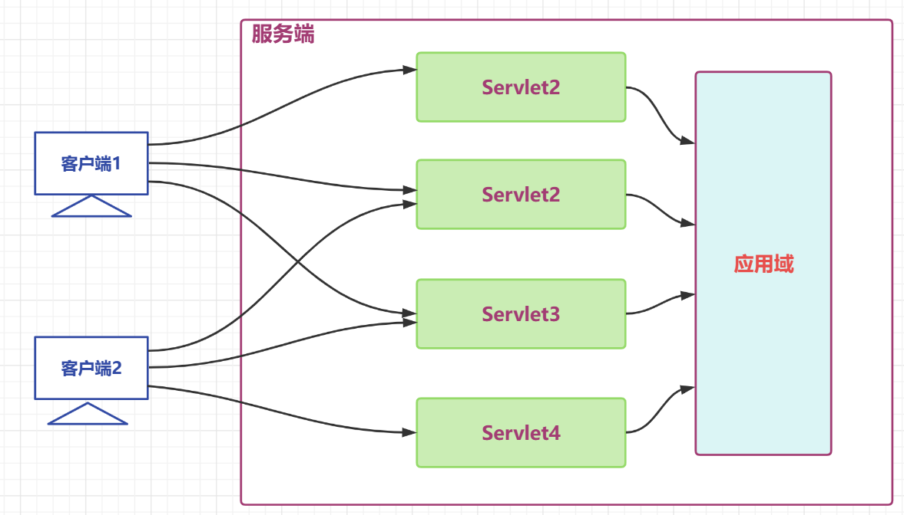

# 会话管理概述

## 为什么需要会话管理

- HTTP 是无状态协议
  - 无状态就是不保存状态，即无状态协议(stateless)，HTTP 协议自身不对请求和响应之间的通信状态进行保存，也就是说在 HTTP 协议这个级别，协议对于发送过的请求或者响应都不做持久化处理
  - 简单理解 : 浏览器发送请求，服务器接收并响应，但是服务器不记录请求是否来自哪个浏览器，服务器没记录浏览器的特征，就是客户端的状态

- 举例 : 张三去一家饭馆点了几道菜，觉得味道不错，第二天又去了，对老板说 : 还点上次的那几道菜
  - 无状态 : 老板没有记录张三是否来过，更没有记录上次他点了那些菜，张三只能重新再点一遍
  - 有状态 : 老板把每次来吃饭的用户都做好记录，查阅一下之前的记录，查到了张三之前的菜单，直接下单

## 会话管理实现的手段

- Cookie 和 Session 配合解决
  - cookie 是在客户端保留少量数据的技术，主要通过响应头向客户端响应一些客户端要保留的信息
  - session 是在服务端保留更多数据的技术，主要通过 HttpSession 对象保存一些和客户端相关的信息
  - cookie 和 session 配合记录请求状态

- 举例 : 张三去银行办业务
  - 张三第一次去某个银行办业务，银行会为张三开户(Session)，并向张三发放一张银行卡(cookie)
  - 张三后面每次去银行，就可以携带之间的银行卡(cookie)，银行根据银行卡找到之前张三的账户(session)

# Cookie

## Cookie 概述

> cookie 是一种客户端会话技术，cookie 由服务端产生，它是服务器存放在浏览器的一小份数据，浏览器以后每次访问该服务器的时候都会将这小份数据携带到服务器去。

+ 服务端创建 cookie，将 cookie 放入响应对象中，Tomcat 容器将 cookie 转化为 set-cookie 响应头，响应给客户端
+ 客户端在收到 cookie 的响应头时，在下次请求该服务的资源时会以 cookie 请求头的形式携带之前收到的Cookie
+ cookie 是一种键值对格式的数据，从 tomcat8.5 开始可以保存中文，但是不推荐
+ 由于 cookie 是存储于客户端的数据，比较容易暴露，一般不存储一些敏感或者影响安全的数据

**原理图**


**应用场景举例**

1. 记录用户名

   当我们在用户名的输入框中输入完用户名后，浏览器记录用户名，下一次再访问登录页面时，用户名自动填充到用户名的输入框

2. 保存电影播放进度

   在网页上播放电影的时候，如果中途退出浏览器了，下载再打开浏览器播放同一部电影的时候，会自动跳转到上次退出时候的进度，因为在播放的时候会将播放进度保存到 cookie 中

## Cookie 的使用

> servletA 向响应中增加 Cookie

``` java
package com.atguigu.servlet;

import java.io.IOException;

import javax.servlet.ServletException;
import javax.servlet.annotation.WebServlet;
import javax.servlet.http.Cookie;
import javax.servlet.http.HttpServlet;
import javax.servlet.http.HttpServletRequest;
import javax.servlet.http.HttpServletResponse;

@WebServlet("/servletA")
public class ServletA extends HttpServlet {
	@Override
	protected void service(HttpServletRequest req, HttpServletResponse resp) throws ServletException, IOException {
		// 创建Cookie
		Cookie cookie1 = new Cookie("c1", "c1_message");
		Cookie cookie2 = new Cookie("c2", "c2_message");
		// 将cookie放入响应对象
		resp.addCookie(cookie1);
		resp.addCookie(cookie2);
	}
}
```


> servletB 从请求中读取 Cookie

``` java
package com.atguigu.servlet;

import java.io.IOException;

import javax.servlet.ServletException;
import javax.servlet.annotation.WebServlet;
import javax.servlet.http.Cookie;
import javax.servlet.http.HttpServlet;
import javax.servlet.http.HttpServletRequest;
import javax.servlet.http.HttpServletResponse;

@WebServlet("/servletB")
public class ServletB extends HttpServlet {
	@Override
	protected void service(HttpServletRequest req, HttpServletResponse resp) throws ServletException, IOException {
		// 获取请求中的cookie
		Cookie[] cookies = req.getCookies();
		// 迭代cookies数组
		if (null != cookies && cookies.length != 0) {
			for (Cookie cookie : cookies) {
				System.out.println(cookie.getName() + ":" + cookie.getValue());
			}
		}
	}
}
```


## Cookie 的时效性

> 默认情况下 Cookie 的有效期是一次会话范围内，我们可以通过 cookie 的 setMaxAge() 方法让 Cookie 持久化保存到浏览器上

-   会话级 Cookie
    -   服务器端并没有明确指定 Cookie 的存在时间
    -   在浏览器端，Cookie 数据存在于内存中
    -   只要浏览器还开着，Cookie 数据就一直都在
    -   浏览器关闭，内存中的 Cookie 数据就会被释放
-   持久化 Cookie
    -   服务器端明确设置了 Cookie 的存在时间
    -   在浏览器端，Cookie 数据会被保存到硬盘上
    -   Cookie 在硬盘上存在的时间根据服务器端限定的时间来管控，不受浏览器关闭的影响
    -   持久化 Cookie 到达了预设的时间会被释放

> cookie.setMaxAge(int expiry) 参数单位是秒，表示 cookie 的持久化时间，如果设置参数为 0，表示将浏览器中保存的该 cookie 删除

**ServletA 设置一个 Cookie 为持久化 cookie**

``` java
package com.atguigu.servlet;

import java.io.IOException;

import javax.servlet.ServletException;
import javax.servlet.annotation.WebServlet;
import javax.servlet.http.Cookie;
import javax.servlet.http.HttpServlet;
import javax.servlet.http.HttpServletRequest;
import javax.servlet.http.HttpServletResponse;

@WebServlet("/servletA")
public class ServletA extends HttpServlet {
	@Override
	protected void service(HttpServletRequest req, HttpServletResponse resp) throws ServletException, IOException {
		// 创建Cookie
		Cookie cookie1 = new Cookie("c1", "c1_message");
		cookie1.setMaxAge(60);
		Cookie cookie2 = new Cookie("c2", "c2_message");
		// 将cookie放入响应对象
		resp.addCookie(cookie1);
		resp.addCookie(cookie2);
	}
}
```


**ServletB 接收 Cookie，浏览器中间发生一次重启再请求 ServletB 测试**

``` java
package com.atguigu.servlet;

import java.io.IOException;

import javax.servlet.ServletException;
import javax.servlet.annotation.WebServlet;
import javax.servlet.http.Cookie;
import javax.servlet.http.HttpServlet;
import javax.servlet.http.HttpServletRequest;
import javax.servlet.http.HttpServletResponse;

@WebServlet("/servletB")
public class ServletB extends HttpServlet {
	@Override
	protected void service(HttpServletRequest req, HttpServletResponse resp) throws ServletException, IOException {
		// 获取请求中的cookie
		Cookie[] cookies = req.getCookies();
		// 迭代cookies数组
		if (null != cookies && cookies.length != 0) {
			for (Cookie cookie : cookies) {
				System.out.println(cookie.getName() + ":" + cookie.getValue());
			}
		}
	}
}
```


## Cookie 的提交路径

> 访问互联网资源时不能每次都需要把所有 Cookie 带上。访问不同的资源时，可以携带不同的 cookie，我们可以通过 cookie 的 setPath(String path) 对 cookie 的路径进行设置

**从 ServletA 中获取 cookie**

``` java
package com.atguigu.servlet;

import java.io.IOException;

import javax.servlet.ServletException;
import javax.servlet.annotation.WebServlet;
import javax.servlet.http.Cookie;
import javax.servlet.http.HttpServlet;
import javax.servlet.http.HttpServletRequest;
import javax.servlet.http.HttpServletResponse;

@WebServlet("/servletA")
public class ServletA extends HttpServlet {
	@Override
	protected void service(HttpServletRequest req, HttpServletResponse resp) throws ServletException, IOException {
		// 创建Cookie
		Cookie cookie1 = new Cookie("c1", "c1_message");
		// 设置cookie的提交路径
		cookie1.setPath("/Cookie/servletB");
		Cookie cookie2 = new Cookie("c2", "c2_message");
		// 将cookie放入响应对象
		resp.addCookie(cookie1);
		resp.addCookie(cookie2);
	}
}
```


**向 ServletB 请求时携带携带了 c1**


**向其他资源请求时就不携带 c1 了**


# Session

## HttpSession 概述

>  HttpSession 是一种保留更多信息在服务端的一种技术，服务器会为每一个客户端开辟一块内存空间，即session 对象，客户端在发送请求时，都可以使用自己的 session，这样服务端就可以通过 session 来记录某个客户端的状态了

+ 服务端在为客户端创建 session 时，会同时将 session 对象的 id，即 JSESSIONID 以 cookie 的形式放入响应对象
+ 后端创建完 session 后，客户端会收到一个特殊的 cookie，叫做 JSESSIONID
+ 客户端下一次请求时携带 JSESSIONID，后端收到后，根据 JSESSIONID 找到对应的 session 对象
+ 通过该机制，服务端通过 session 就可以存储一些专门针对某个客户端的信息了
+ session 也是域对象(后续详细讲解)

**原理图如下**


**应用场景**

1. 记录用户的登录状态

   用户登录后，将用户的账号等敏感信息存入 session

2. 记录用户操作的历史

   例如记录用户的访问痕迹，用户的购物车信息等临时性的信息

## HttpSession 的使用

> 用户提交 form 表单到 ServletA，携带用户名 ServletA 获取 session 将用户名存到 Session，用户再请求其他任意 Servlet，获取之间存储的用户

**定义表单页提交用户名**

``` html
<!DOCTYPE html>
<html>
<head>
<meta charset="UTF-8">
<title>form</title>
</head>
<body>
    <form action="/Session/servletA" method="post">
        用户名:
        <input type="text" name="username">
        <input type="submit" value="提交">
    </form>
</body>
</html>
```

**定义 ServletA 将用户名存入 session**

``` java
package com.atguigu.servlet;

import java.io.IOException;

import javax.servlet.ServletException;
import javax.servlet.annotation.WebServlet;
import javax.servlet.http.HttpServlet;
import javax.servlet.http.HttpServletRequest;
import javax.servlet.http.HttpServletResponse;
import javax.servlet.http.HttpSession;

@WebServlet("/servletA")
public class ServletA extends HttpServlet {
	@Override
	protected void service(HttpServletRequest req, HttpServletResponse resp) throws ServletException, IOException {
		// 获取请求中的参数
		String username = req.getParameter("username");
		// 获取session对象
		HttpSession session = req.getSession();
		// 获取Session的ID
		String jSessionId = session.getId();
		System.out.println(jSessionId);
		// 判断session是不是新创建的session
		boolean isNew = session.isNew();
		System.out.println(isNew);
		// 向session对象中存入数据
		session.setAttribute("username", username);
	}
}
```

**响应中收到了一个 JSESSIONID 的 cookie**


定义其他 Servlet 从 session 中读取用户名

``` java
package com.atguigu.servlet;

import java.io.IOException;

import javax.servlet.ServletException;
import javax.servlet.annotation.WebServlet;
import javax.servlet.http.HttpServlet;
import javax.servlet.http.HttpServletRequest;
import javax.servlet.http.HttpServletResponse;
import javax.servlet.http.HttpSession;

@WebServlet("/servletB")
public class ServletB extends HttpServlet {
	@Override
	protected void service(HttpServletRequest req, HttpServletResponse resp) throws ServletException, IOException {
		// 获取session对象
		HttpSession session = req.getSession();
		// 获取Session的ID
		String jSessionId = session.getId();
		System.out.println(jSessionId);
		// 判断session是不是新创建的session
		boolean isNew = session.isNew();
		System.out.println(isNew);
		// 从session中取出数据
		String username = (String) session.getAttribute("username");
		System.out.println(username);
	}
}
```

请求中携带了一个 JSESSIONID 的 cookie


getSession 方法的处理逻辑


## HttpSession 时效性

- 为什么要设置 session 的时效
  - 用户量很大之后，Session 对象相应的也要创建很多。如果一味创建不释放，那么服务器端的内存迟早要被耗尽。
  - 客户端关闭行为无法被服务端直接侦测，或者客户端较长时间不操作也经常出现，类似这些的情况，就需要对 session 的时限进行设置了

> 默认的 session 最大闲置时间(两次使用同一个session中的间隔时间) 在 tomcat/conf/web.xml 配置为 30 分钟


> 我们可以自己在当前项目的 web.xm l对最大闲置时间进行重新设定


> 也可以通过 HttpSession 的 API 对最大闲置时间进行设定

``` java
// 设置最大闲置时间
session.setMaxInactiveInterval(60);
```

> 也可以直接让 session 失效

``` java
// 直接让 session 失效
session.invalidate();
```

# 三大域对象

## 域对象概述

> 域对象 :  一些用于存储数据和传递数据的对象，传递数据不同的范围，我们称之为不同的域，不同的域对象代表不同的域，共享数据的范围也不同

+ web 项目中，我们一定要熟练使用的域对象分别是 : 请求域、会话域、应用域
+ 请求域对象是 HttpServletRequest，传递数据的范围是一次请求之内及请求转发
+ 会话域对象是 HttpSession，传递数据的范围是一次会话之内，可以跨多个请求
+ 应用域对象是 ServletContext，传递数据的范围是本应用之内，可以跨多个会话

**生活举例 : 热水器摆放位置不同，使用的范围就不同**

1. 摆在张三工位下，就只有张三一个人能用
2. 摆在办公室的公共区，办公室内的所有人都可以用
3. 摆在楼层的走廊区，该楼层的所有人都可以用

> 三大域对象的数据作用范围图解

**请求域**


**会话域**


**应用域**



所有域在一起


## 域对象的使用

**域对象的 API**

| API                                         | 功能                    |
| ------------------------------------------- | ----------------------- |
| void setAttribute(String name,String value) | 向域对象中添加/修改数据 |
| Object getAttribute(String name);           | 从域对象中获取数据      |
| removeAttribute(String name);               | 移除域对象中的数据      |

**API 测试**

**ServletA 向三大域中放入数据**

``` java
package com.atguigu.servlet;

import java.io.IOException;

import javax.servlet.ServletContext;
import javax.servlet.ServletException;
import javax.servlet.annotation.WebServlet;
import javax.servlet.http.HttpServlet;
import javax.servlet.http.HttpServletRequest;
import javax.servlet.http.HttpServletResponse;
import javax.servlet.http.HttpSession;

@WebServlet("/servletA")
public class ServletA extends HttpServlet {
	@Override
	protected void service(HttpServletRequest req, HttpServletResponse resp) throws ServletException, IOException {
		// 向请求域中放入数据
		req.setAttribute("request", "request-message");
		// req.getRequestDispatcher("servletB").forward(req,resp);
		// 向会话域中放入数据
		HttpSession session = req.getSession();
		session.setAttribute("session", "session-message");
		// 向应用域中放入数据
		ServletContext application = getServletContext();
		application.setAttribute("application", "application-message");
	}
}
```

**ServletB 从三大于中取出数据**

``` java
package com.atguigu.servlet;

import java.io.IOException;

import javax.servlet.ServletContext;
import javax.servlet.ServletException;
import javax.servlet.annotation.WebServlet;
import javax.servlet.http.HttpServlet;
import javax.servlet.http.HttpServletRequest;
import javax.servlet.http.HttpServletResponse;
import javax.servlet.http.HttpSession;

@WebServlet("/servletB")
public class ServletB extends HttpServlet {
	@Override
	protected void service(HttpServletRequest req, HttpServletResponse resp) throws ServletException, IOException {
		// 从请求域中获取数据
		String reqMessage = (String) req.getAttribute("request");
		System.out.println(reqMessage);

		// 从会话域中获取数据
		HttpSession session = req.getSession();
		String sessionMessage = (String) session.getAttribute("session");
		System.out.println(sessionMessage);
        
		// 从应用域中获取数据
		ServletContext application = getServletContext();
		String applicationMessage = (String) application.getAttribute("application");
		System.out.println(applicationMessage);
	}
}
```

+ 请求转发时，请求域可以传递数据**请求域内一般放本次请求业务有关的数据，如 : 查询到的所有的部门信息**
+ 同一个会话内，不用请求转发、会话域可以传递数据**会话域内一般放本次会话的客户端有关的数据，如 :当前客户端登录的用户**
+ 同一个 APP 内，不同的客户端、应用域可以传递数据**应用域内一般放本程序应用有关的数据，如 : Spring 框架的 IOC 容器**
