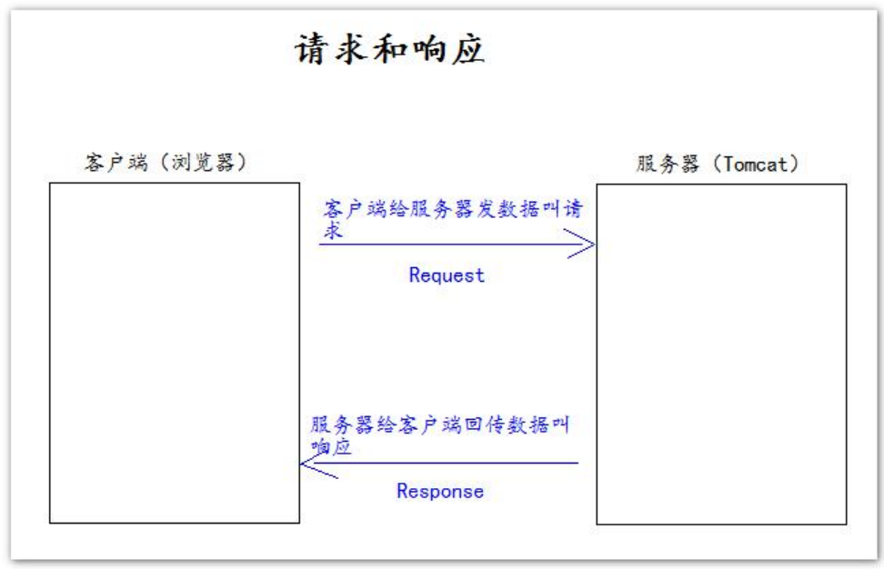
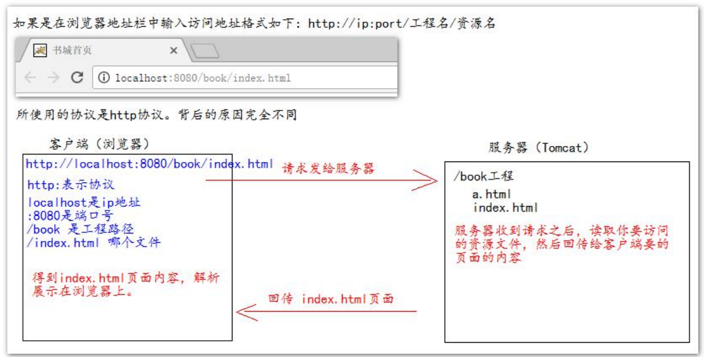

# 1. 甚麼是 JavaWeb?
> 所有通過 **java** 語言編寫並可以通過瀏覽器放問的程序的總稱，就叫做 **JavaWeb**，**JavaWeb** 是基於請求和響應來開發的

# 3. 請求和響應是成對出現的, 有請求就會有響應

- **請求:** 客戶端發送數據給服務器

- **響應:** 服務器回傳數據給客戶端

# 2. web 的資源分類
- **靜態資源:** html, css, js, txt, mp4, jpg ... 等等

- **動態資源:** jsp, servlet