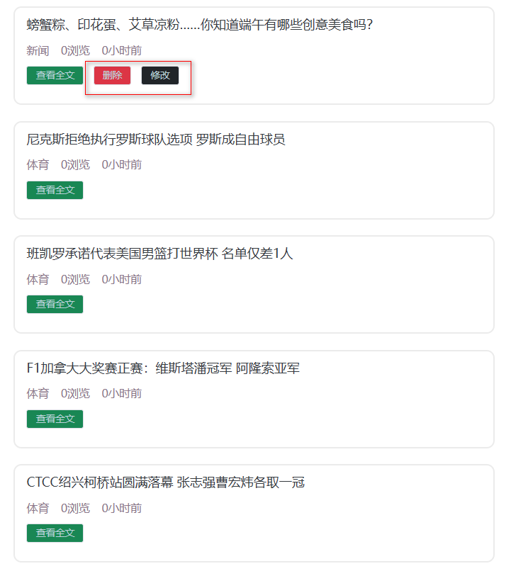
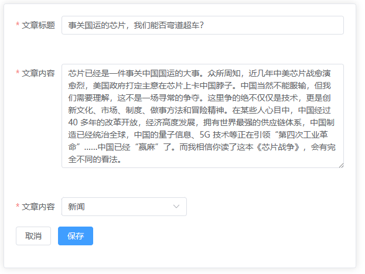
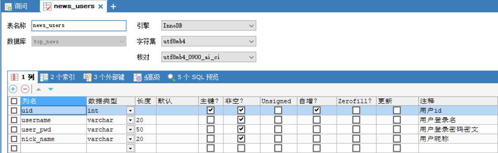
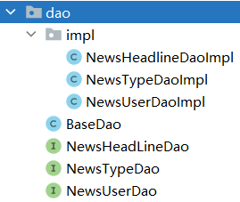
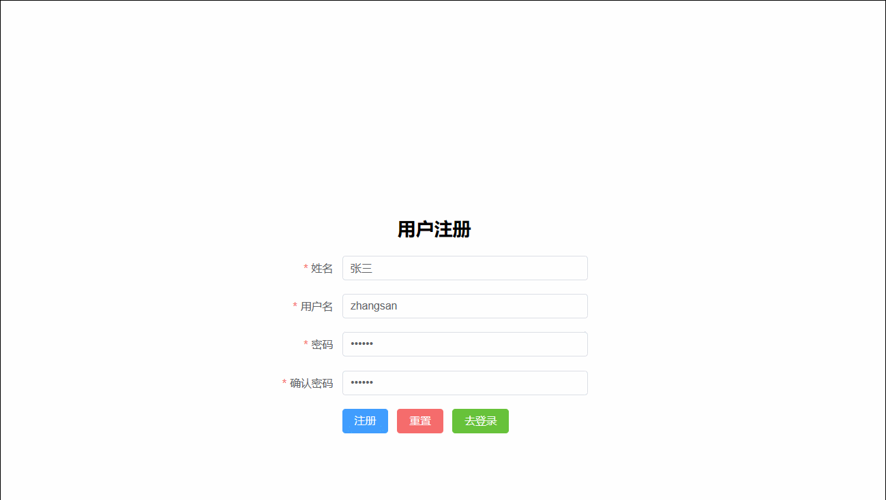

# 项目简介

## 微头�业务简介

> 微头�新闻�布和�览平�,主�包�业务如下

+ 用户功能
  + 注册功能
  + 登录功能
+ 头�新闻
  + 新闻的分页�览
  + 通过标题关键字�索新闻
  + 查看新闻详情
  + 新闻的修改和删除
+ ���制
  + 用户�能修改和自己�布的头�新闻

## 技术栈介�

> �端技术栈

+ ES6 作为基础 JS 语法
+ nodejs 用��行�境
+ npm 用�项目�赖管�工具
+ vite 用�项目的�建�工具
+ Vue3 用�项目数�的渲染框�
+ Axios 用���端数�的交互
+ Router 用�页�的跳转
+ Pinia 用�存储用户的数�
+ LocalStorage 作为用户校验 token 的存储手段
+ Element-Plus �供组件

> �端技术栈

+ JAVA 作为开�语言，版本为 JDK17
+ Tomcat 作为�务容器，版本为10.1.7
+ Mysql8 用�项目存储数�
+ Servlet 用��制层����端数�交互
+ JDBC 用���数�的 CURD
+ Druid 用��供数��的��池
+ MD5 用�用户密�的加密
+ Jwt 用� token 的生�和校验
+ Jackson 用�转� JSON
+ Filter 用�用户登录校验和跨域处�
+ Lombok 用�处��体类

## 功能展示

**头�首页信��索**


**登录功能**


**注册功能**


**���制功能**



**�布头�功能**


**修改头�功能**



**删除头�功能**


# �端项目�境�建

**创建项目，安装�赖 :**

```shell
npm create vite
cd 项目目录
npm install
npm install vue-router
npm install axios
npm install pinia
npm install element-plus
npm install nprogress
npm add -D sass
npm install mitt
```

## 路由

> src/router/index.js

**�置路由**

```javascript
import { createRouter, createWebHashHistory } from 'vue-router'

let router = createRouter({
  history: createWebHashHistory(),
  routes: []
})

export default router
```

**�置 main.js**

```javascript
import { createApp } from 'vue'

import App from './App.vue'

// 导入路由
import router from './router/index.js'

let app = createApp(App)

// 全局使用路由
app.use(router)

app.mount('#app')
```

**修改 App.vue**

```html
<script setup>
import { computed } from "vue"
import { useRoute } from 'vue-router'
import Header from './components/Header.vue'

const route = useRoute() // 路由信�对象

// 判断是�显示header组件
 const isHeader =  computed(() => {
    return route.name !== "Login" && route.name !== "Register" && route.name !== "addNews";
})
</script>

<template>
  <div>
    <Header v-show="isHeader"></Header>
    <!-- 视图的展示�置 -->
    <router-view></router-view>
  </div>
</template>

<style scoped></style>
```

## pinia

**src/stores 下创建 index.js 文件**

```java
// 导入pinia组件
import { createPinia } from 'pinia';
// 创建pinia对象
const pinia = createPinia();
// 导出默认的pinia
export default pinia;
```

**main.js 中使用 pinia**

```javascript
import { createApp } from 'vue'

import App from './App.vue'

// 导入pinia对象
import pinia from './stores';

let app = createApp(App)

// 全局使用pinia
app.use(pinia)

app.mount('#app')
```

## element-plus

**在 main.js 引入 element-plus**

```javascript
import { createApp } from 'vue'

import App from './App.vue'

//导入element-plus相关内容
import ElementPlus from 'element-plus'
import 'element-plus/dist/index.css'
import zhCn from 'element-plus/es/locale/lang/zh-cn'

let app = createApp(App)

// 全局使用ElementPlus
app.use(ElementPlus, {
  locale: zhCn,
})

app.mount('#app')
```

## NProgress

### � 写在��

NProgress 是一个轻�级的进度�组件，在 Github 上已� 2.4 万 star 数了，虽然这个组件已�好久没有更新了，最近一次更新是 20 年 4 月份，改了 jQuery 的版本，但是该组件的使用频�还是高的。

### � 在项目中安装

这里的包管�工具使用的 npm，如�你使用的是 yarn 或者 pnpm，请自行更改安装命令，安装命令如下：

```shell
npm i nprogress -S
```

如�是 TS 的项目，还需�安装其类�声�文件，命令如下：

```shell
npm i @types/nprogress -D
```

### � 简�的�装

�在我们对 NProgress 进行一下简�的�装，首先我们在 `utils` 目录下创建�给 `nporgress.js` 的文件，然�引入 NProgress 和 CSS 样�文件，示例代�如下：

```javascript
import NProgress from 'nprogress'
import 'nprogress/nprogress.css'
```

然�我们对进度�进行一些基础�置，示例代�如下：

```javascript
//全局进度�的�置
NProgress.configure({
  easing: 'ease', // 动画方�
  speed: 1000, // 递�进度�的速度
  showSpinner: false, // 是�显示加载ico
  trickleSpeed: 200, // 自动递�间隔
  minimum: 0.3, // 更改�动时使用的最�百分比
  parent: 'body', //指定进度�的父容器
})
```

最�我们�装两个方法，一个是开始方法，一个是结�的方法，示例代�如下：

```javascript
// 打开进度�
export const start = () => {
  NProgress.start()
}

// 关闭进度�
export const close = () => {
  NProgress.done()
}
```

### � 在 Vue 切�路由时展示进度�

�在我们就�使用我们上��装的 Nprogress，这里我们在 VueRouter 的�置文件中使用，��切�路由时在顶部展示进度�，首先我们打开 VueRouter 的�置文件，然�引入我们�装的 Nprogress：

```javascript
import { close, start } from '/@/utils/nprogress'
```

然�我们在创建的 Router �例中使用这两个方法：

```javascript
router.beforeEach((pre, next) => {
  start()
})

router.afterEach(() => {
  close()
})
```

- `beforeEach`：路由切�之�触�；
- `afterEach`：路由切�完��触�；

�在我们切�路由就�以��顶部进度�的切�。

## 創建 request.js 工具�

> 在 `utils` 目录下创建�给 `request.js` 的文件

```javascript
import axios from "axios";
import { ElMessage } from 'element-plus';
import NProgress from "nprogress";
import "nprogress/nprogress.css";

// �置新建一个 axios �例
const service = axios.create({
  baseURL: "http://localhost:8080/",
  timeout: 50000,
});

// 添加请求拦截器
service.interceptors.request.use((config) => {
  NProgress.start()//开�进度�

  return config;
});

// 添加�应拦截器
service.interceptors.response.use(
  (response) => {
    NProgress.done()//关闭进度�

    if (response.data.code !== 200) {
      // 判断�应状��
      if (response.data.code == 501) return Promise.reject(ElMessage.error("用户�有误"))
      else if (response.data.code == 503) return Promise.reject(ElMessage.error("密�有误"))
      else if (response.data.code == 504) return Promise.reject(ElMessage.error("登录已过期"))
      else if (response.data.code == 505) return Promise.reject(ElMessage.error("用户��用"))
    } else {
      return response.data.data; /* 返��功�应数�中的data�性数� */
    }
  },
  (error) => {
    NProgress.done()//关闭进度�
    return Promise.reject(error.message);
  }
);

export default service;
```

## 对 api 进行�装统一管�

> 在 `api` 目录下创建�给 `index.js` 的文件

```javascript
// 目�是空的
```

## 創建��

Step1 在 src 下創建 pages 目錄，�著在 pages 目錄裡�分別創建 AddOrModifyNews�Detail�HeadlineNews�Login�Register，最後在�個目錄底下新建 index.vue。


Step2 在 router 目錄下創建 routes.js 文件，�置�態路由

```javascript
export const staticRoutes = [
  {
    path: "/",
    redirect: "/headlinenews",
  },
  {
    // 头�
    path: "/headlinenews",
    component: () => import("../pages/HeadlineNews/index.vue"),
    name: "HeadlineNews",
  },
  {
    //头�详情
    path: "/detail",
    component: () => import("../pages/Detail/index.vue"),
    name: "Detail",
  },
  {
    // 登录
    path: "/login",
    component: () => import("../pages/Login/index.vue"),
    name: "Login",
  },
  {
    //注册
    path: "/register",
    component: () => import("../pages/Register/index.vue"),
    name: "Register",
  },
  {
    //�布新闻的页�
    path: "/addormodifynews",
    component: () => import("../pages/addOrModifyNews/index.vue"),
    name: "addOrModifyNews",
  },
];
```

Step3 在 router 目錄下的  index.js 中引入並使用 staticRoutes

```javascript
import { createRouter, createWebHashHistory } from 'vue-router'
import { staticRoutes } from "./routes.js";

let router = createRouter({
  history: createWebHashHistory(),
  routes: staticRoutes
})

export default router
```

## Vite �置代� Proxy，��跨域和��编写 url 的问题

我们在编写�端项目的时候，�常会�到跨域的问题，当我们访问�端 API 的 URL 路径时，��域��端�或访问�议（如 HTTP 和 HTTPS）有一项��，就会被�览器认定为跨域。�外我们也会�常��编写�端的域�，例如 `https://example.com/api/some_end_point`，`https://example.com/api/other_end_point`，针对这两�情况，�以直�用�一个�置�解决，�代��置。

�管是 Vite 还是 Webpack，这些打包工具都支�设置�端代�，它们能够把对�一段 URL 的访问直�转���一个真�的�端 API 地�，这样��端就视为使用了相�的域���议和端�，就��了跨域的问题，还能����的��编写域�。

### �置 Vite Proxy

我们这里以 Vite 的�置为例，�看一下如何给 API 请求设置代�。在 Vite 编写的项目里边，有一个 `vite.config.js` �置文件，里边是关� Vite 的�置项，�以在里边�置代�。�如我们�端项目路径为 `http://localhost:3000`，需�代�所有以 `/api` 开头的 API 请求，把它转�到 `http://localhost:3001`，并且�端的 API 路径中�带 `/api`�缀，需�自动�� `/api`�缀，如下图所示：


那么�以使用下�这样的�置：

```javascript
// vite.config.js
import { defineConfig } from "vite";

export default defineConfig({
  // 代�跨域�置
  server: {
    proxy: {
      "/app-dev": {
        // ��數據的�務器地�設置
        target: "http://localhost:8080",
        // 開啟代�，需�跨域
        changeOrigin: true,
        // 路徑�寫
        rewrite: (path) => path.replace(/^\/app-dev/, ""),
      },
    },
  },
});
```

在 vite 导出的�置里边：

- 添加 `server`  �置项。
- 在 `server` �置项下边添加 `proxy` �置项，值为一个对象，�性�为�代�的 URL 路径段，值为相关的�置。
- 这里�性�设置为 `/api`，��置转��端 `http://localhost:3000/api` 开头的所有请求路径。

在 proxy �置对象中：

- `target`，为�际的�端 URL，它会追加到�性��置的 `/api` 这个片段的��，例如访问 `/api/some_end_point` 会转�为 `http://localhost:3001/api/some_end_point`。
- `changeOrigin`，是�改写 origin，设置为 true 之�，就会把请求 API header 中的 origin，改�跟 `target` 里边的域�一样了。
- `rewrite` �以把请求的 URL 进行�写，这里因为�设�端的 API 路径�带 `/api` 段，所以我们使用 `rewrite`�� `/api`。给 `rewrite` 传递一个函数，函数的�数 `path` 是�端请求的 API 路径，��直�使用了 `replace()` 方法，在里�写一个正则表达�，把 `/api`开头的这一段替�为空。

这样 vite 的代�就�置好了。在�际�端请求的过程中，就�以直�使用 `/api/some_endpoint`这样的形�了：

```javascript
fetch("/api/posts");
```

��的 http �议�域�和端�就都�以�略�了，并且也没有了跨域的问题。

### Vite �置了proxy，查看真���地�

开��境 VIte �置了proxy，在�制�看�到�际请求的 URL

�以在 proxy 使用 byPass()

因为无法将其添加到请求头中，使用加到�应头方便查看

```javascript
export default defineConfig({
  plugins: [vue()],
  // 代�跨域�置
  server: {
    proxy: {
      "/app-dev": {
        // ��數據的�務器地�設置
        target: "http://localhost:8080",
        // 開啟代�，需�跨域
        changeOrigin: true,
        // 路徑�寫
        rewrite: (path) => path.replace(/^\/app-dev/, ""),
        bypass(req, res, options) {
          const proxyURL = options.target + options.rewrite(req.url)
          console.log('proxyURL', proxyURL)
          req.headers['x-req-proxyURL'] = proxyURL // 设置未生效
          res.setHeader('x-req-proxyURL', proxyURL) // 设置�应头�以看到
        },
      },
    },
  },
})
```

### �结

�端跨域问题其�是一个安全问题，就是为了防止��域�的�务之间进行互相访问，以����程�对�端资�进行�法��。在开�的时候，我们就�以利用代��把请求进行代�，把域�等改�一样的，这样就��了跨越的问题。在 Vite 中设置代�，是在 `vite.config.js` �置文件里，�置 `server` �性，并在里边�置 `proxy` �置项。代��以�置多个，根���的 API 路径�请求��的�端路径，本文里��置了一个 `/api`作为演示。

### 注��

> 請將 `utils` 目录下 `request.js` 的文件，更改 axios 的 baseURL �置為 `/app-dev`

```javascript
// 更改後
// �置新建一个 axios �例
const service = axios.create({
  baseURL: "/app-dev",
  timeout: 50000,
});
```

## Mitt

> �考文章
>
> - [Vue3 中使用 Event Bus](https://www.casper.tw/development/2020/12/15/vue-3-mitt/)
> - [Vue3.x ��使用 mitt.js](https://juejin.cn/post/6973106775755063333)

> vue3 ��建議使用 bus，vue3 沒有內置 bus，需引入 mitt 庫實� bus

所謂跨元件，�是兩個元件並無父�關係，並沒有被�方包著。如��互相傳�資料，�以使用 mitt（在 Vue 2 是 event bus）�Vuex 或 route props 來處�。

Event bus 和 Mitt 的��是一樣，�設�在有兩個元件，A 元件和 B 元件。我想把 A 元件的資料傳給 B 元件，步驟就是：

1. 在 A 元件發出�個事件
2. 在 B 元件使用 `on` 來註冊監�該事件
3. 當 B 元件銷毀時，使用 `off` 把該監�移除


**方� 1，全局总线，vue 入�文件 main.js 中挂载全局�性。**

```javascript
import { createApp } from 'vue';
import App from './App.vue';
import mitt from "mitt"

const app = createApp(App)
app.config.globalProperties.Bus = mitt()
```

**方� 2，�装自定义事务总线文件  mybus.js，创建新的 js 文件，在任何你想使用的地方导入��。**

```javascript
import mitt from 'mitt'
export default mitt()
```

**方� 3，直�在组件里�导入使用。��大家使用这�方�，因为分散�更方便管�和�查问题。**

```html
<template>
  
  <HelloWorld msg="Hello Vue 3.0 + Vite" />
</template>

<script>
import mitt from 'mitt'
import HelloWorld from './components/HelloWorld.vue'

export default {
  components: {
    HelloWorld
  },
  setup (props) {
    const formItemMitt = mitt()
    return {
      formItemMitt
    }
  }
}
</script>
```

### 範例程�碼

**A.vue**

```html
<script setup>
import { getCurrentInstance, ref } from "vue"
const { Bus } = getCurrentInstance().appContext.config.globalProperties

const text = ref('這有一段話')

function pushData() {
  Bus.emit('eventName', 'kevin');
}
</script>

<template>
  <div>
    {{ text }} 
    <button type="button" @click="pushData">發�至�一個元件</button>
  </div>
</template>

<style scoped></style>
```

**B.vue**

```html
<script setup>
import { getCurrentInstance, ref } from "vue"

const { Bus } = getCurrentInstance().appContext.config.globalProperties

const text = ref('�始資料')

//�收事件的地方使用事件總線
Bus.on('eventName', (payload) => {
  console.log(payload)
  //處�事件
  text.value = payload
});
</script>

<template>
  <div>{{ text }}</div>
</template>

<style scoped></style>
```

**Demo.vue**

```html
<script setup>
import A from './A.vue';
import B from './B.vue';
</script>

<template>
  <div>
    <A />
    <hr>
    <B />
  </div>
</template>

<style scoped></style>
```

# �端项目�境�建

## 数�库准备

> 导入资料中的 top_news.sql 文件��

**`news_users` 用户表**



**`news_type` 新闻类�表**


**`news_headline` 新闻信�表**


## MVC 项目��模�

>  MVC（Model View Controller）是软件工程中的一� **`软件��模�`**，它把软件系统分为 **`模�`**�**`视图`**和**`�制器`** 三个基本部分。用一�业务逻辑�数��界�显示分离的方法组织代�，将业务逻辑�集到一个部件里�，在改进和个性化定制界��用户交互的�时，�需��新编写业务逻辑。

+ **M**：Model 模�层，具体功能如下
  1. 存放和数�库对象的�体类以�一些用�存储�数�库表完整相关的 VO 对象
  2. 存放一些对数�进行逻辑�算�作的的一些业务处�代�

+ **V**：View 视图层，具体功能如下
  1. 存放一些视图文件相关的代� html�css�js 等
  2. 在��端分离的项目中，�端已�没有视图文件，该层次已��化�独立的�端项目

+ **C**：Controller �制层，具体功能如下
  1. �收客户端请求，�得请求数�
   2. 将准备好的数��应给客户端

> MVC 模�下，项目中的常�包

+ M :
  1. �体类包 (pojo�entity�bean) 专门存放和数�库对应的�体类和一些 VO 对象
  2. 数�库访问包 (dao�mapper)  专门存放对数�库��表格 CURD 方法�装的一些类
  3. �务包 (service)                       专门存放对数�进行业务逻辑预算的一些类

+ C :
  1. �制层包(controller)

+ V :
  1. web 目录下的视图资� html�css�js�img 等
  2. �端工程化�，在�端项目中已��存在了


## �建项目

### 创建 WEB 项目


### 导入�赖


### 准备包结�


+ controller �制层代�，主�由 Servlet 组�
+ service     �务层代�，主�用�处�业务逻辑
+ dao          数�访问层，主�用户定义对��个表格的 CURD 的方法
+ pojo         �体类层，主�用�存放和数�库对应的�体类以�一些 VO 对象
+ util           工具类包，主�用存放一些工具类
+ common  公共包，主�用户存放一些其他公共代�
+ filters       过滤器包，专门用�存放一些过滤器
+ test          测试代�包，专门用�定义一些测试的功能代�，上线�应该删�，�期用 maven �以自动处��

## 准备工具类

### 异步�应规范格�类

**Result ç±»**

```java
package com.atguigu.headline.common;

// 全局统一返�结�类
public class Result<T> {
	// 返��
	private Integer code;
	// 返�消�
	private String message;
	// 返�数�
	private T data;

	public Result() {
	}

	// 返�数�
	protected static <T> Result<T> build(T data) {
		Result<T> result = new Result<T>();
		if (data != null)
			result.setData(data);
		return result;
	}

	public static <T> Result<T> build(T body, Integer code, String message) {
		Result<T> result = build(body);
		result.setCode(code);
		result.setMessage(message);
		return result;
	}

	public static <T> Result<T> build(T body, ResultCodeEnum resultCodeEnum) {
		Result<T> result = build(body);
		result.setCode(resultCodeEnum.getCode());
		result.setMessage(resultCodeEnum.getMessage());
		return result;
	}

	/**
	 * �作�功
	 * 
	 * @param data baseCategory1List
	 * @param <T>
	 * @return
	 */
	public static <T> Result<T> ok(T data) {
		Result<T> result = build(data);
		return build(data, ResultCodeEnum.SUCCESS);
	}

	public Result<T> message(String msg) {
		this.setMessage(msg);
		return this;
	}

	public Result<T> code(Integer code) {
		this.setCode(code);
		return this;
	}

	public Integer getCode() {
		return code;
	}

	public void setCode(Integer code) {
		this.code = code;
	}

	public String getMessage() {
		return message;
	}

	public void setMessage(String message) {
		this.message = message;
	}

	public T getData() {
		return data;
	}

	public void setData(T data) {
		this.data = data;
	}
}
```

**ResultCodeEnum �举类**

```java
package com.atguigu.headline.common;

// 统一返�结�状�信�类
public enum ResultCodeEnum {

	SUCCESS(200, "success"), USERNAME_ERROR(501, "usernameError"), PASSWORD_ERROR(503, "passwordError"),
	NOTLOGIN(504, "notLogin"), USERNAME_USED(505, "userNameUsed");

	private Integer code;
	private String message;

	private ResultCodeEnum(Integer code, String message) {
		this.code = code;
		this.message = message;
	}

	public Integer getCode() {
		return code;
	}

	public String getMessage() {
		return message;
	}
}
```

### MD5 加密工具类

```java
package com.atguigu.headline.util;

import java.security.MessageDigest;
import java.security.NoSuchAlgorithmException;

public final class MD5Util {
	public static String encrypt(String strSrc) {
		try {
			char hexChars[] = { '0', '1', '2', '3', '4', '5', '6', '7', '8', '9', 'a', 'b', 'c', 'd', 'e', 'f' };
			byte[] bytes = strSrc.getBytes();
			MessageDigest md = MessageDigest.getInstance("MD5");
			md.update(bytes);
			bytes = md.digest();
			int j = bytes.length;
			char[] chars = new char[j * 2];
			int k = 0;
			for (int i = 0; i < bytes.length; i++) {
				byte b = bytes[i];
				chars[k++] = hexChars[b >>> 4 & 0xf];
				chars[k++] = hexChars[b & 0xf];
			}
			return new String(chars);
		} catch (NoSuchAlgorithmException e) {
			e.printStackTrace();
			throw new RuntimeException("MD5加密出错��+" + e);
		}
	}
}
```

### JDBCUtil ��池工具类

**添加 jdbc.properties �置文件**

```properties
driverClassName=com.mysql.cj.jdbc.Driver
url=jdbc:mysql://localhost:3306/schedule_system
username=root
password=root
initialSize=5
maxActive=10
maxWait=1000
```

**測試**

```java
@Test
public void getConnection() {
    Connection connection = JDBCUtil.getConnection();
    System.out.println(connection);
    JDBCUtil.releaseConnection();
}
```

```java
package com.atguigu.headline.util;

import com.alibaba.druid.pool.DruidDataSourceFactory;

import javax.sql.DataSource;
import java.io.IOException;
import java.io.InputStream;
import java.sql.Connection;
import java.sql.SQLException;
import java.util.Properties;

public class JDBCUtil {
	private static ThreadLocal<Connection> threadLocal = new ThreadLocal<>();

	private static DataSource dataSource;
	
	// �始化��池
	static {
		// �以帮助我们读�.properties�置文件
		Properties properties = new Properties();
		InputStream resourceAsStream = JDBCUtil.class.getClassLoader().getResourceAsStream("jdbc.properties");
		try {
			properties.load(resourceAsStream);
		} catch (IOException e) {
			throw new RuntimeException(e);
		}

		try {
			dataSource = DruidDataSourceFactory.createDataSource(properties);
		} catch (Exception e) {
			throw new RuntimeException(e);
		}

	}

	/* 1 �外�供��池的方法 */
	public static DataSource getDataSource() {
		return dataSource;
	}

	/* 2 �外�供��的方法 */
	public static Connection getConnection() {
		Connection connection = threadLocal.get();
		if (null == connection) {
			try {
				connection = dataSource.getConnection();
			} catch (SQLException e) {
				throw new RuntimeException(e);
			}
			threadLocal.set(connection);
		}

		return connection;
	}

	/* 定义一个归还��的方法 (解除和ThreadLocal之间的关�关系) */
	public static void releaseConnection() {
		Connection connection = threadLocal.get();
		if (null != connection) {
			threadLocal.remove();
			// 把��设置�自动�交的��
			try {
				connection.setAutoCommit(true);
				// 自动归还到��池
				connection.close();
			} catch (SQLException e) {
				throw new RuntimeException(e);
			}
		}
	}
}
```

### JwtHelper 工具类

```java
package com.atguigu.headline.util;

import com.alibaba.druid.util.StringUtils;
import io.jsonwebtoken.*;

import java.util.Date;

public class JwtHelper {
	private static long tokenExpiration = 24 * 60 * 60 * 1000;
	private static String tokenSignKey = "123456";

	// 生�token字符串
	public static String createToken(Long userId) {
		String token = Jwts.builder()
				.setSubject("YYGH-USER").setExpiration(new Date(System.currentTimeMillis() + tokenExpiration))
				.claim("userId", userId).signWith(SignatureAlgorithm.HS512, tokenSignKey)
				.compressWith(CompressionCodecs.GZIP).compact();
		return token;
	}

	// �token字符串��userid
	public static Long getUserId(String token) {
		if (StringUtils.isEmpty(token))
			return null;
		Jws<Claims> claimsJws = Jwts.parser().setSigningKey(tokenSignKey).parseClaimsJws(token);
		Claims claims = claimsJws.getBody();
		Integer userId = (Integer) claims.get("userId");
		return userId.longValue();
	}

	// 判断token是�有效
	public static boolean isExpiration(String token) {
		try {
			boolean isExpire = Jwts.parser().setSigningKey(tokenSignKey).parseClaimsJws(token).getBody().getExpiration()
					.before(new Date());
			// 没有过期，有效，返�false
			return isExpire;
		} catch (Exception e) {
			// 过期出�异常，返�true
			return true;
		}
	}
}
```

### JSON 转�的 WEBUtil 工具类

```java
package com.atguigu.headline.util;

import java.io.BufferedReader;
import java.io.IOException;
import java.text.SimpleDateFormat;

import javax.servlet.http.HttpServletRequest;
import javax.servlet.http.HttpServletResponse;

import com.atguigu.headline.common.Result;
import com.fasterxml.jackson.databind.ObjectMapper;

public class WebUtil {
	private static ObjectMapper objectMapper;
	
	// �始化objectMapper
	static {
		objectMapper = new ObjectMapper();
		// 设置JSON和Object转�时的时间日期格�
		objectMapper.setDateFormat(new SimpleDateFormat("yyyy-MM-dd HH:mm:ss"));
	}

	// �请求中��JSON串并转�为Object
	public static <T> T readJson(HttpServletRequest request, Class<T> clazz) {
		T t = null;
		BufferedReader reader = null;
		try {
			reader = request.getReader();
			StringBuffer buffer = new StringBuffer();
			String line = null;
			while ((line = reader.readLine()) != null) {
				buffer.append(line);
			}

			t = objectMapper.readValue(buffer.toString(), clazz);
		} catch (IOException e) {
			throw new RuntimeException(e);
		}
		return t;
	}

	// 将Result对象转��JSON串并放入�应对象
	public static void writeJson(HttpServletResponse response, Result result) {
		response.setContentType("application/json;charset=UTF-8");
		try {
			String json = objectMapper.writeValueAsString(result);
			response.getWriter().write(json);
		} catch (IOException e) {
			throw new RuntimeException(e);
		}
	}
}
```

## 准备�层的��和��类

### 准备�体类和 VO 对象

**NewsUser**

```java
package com.atguigu.headline.pojo;

import lombok.AllArgsConstructor;
import lombok.Data;
import lombok.NoArgsConstructor;
import java.io.Serializable;

@AllArgsConstructor
@NoArgsConstructor
@Data
public class NewsUser implements Serializable {
	private Integer uid;
	private String username;
	private String userPwd;
	private String nickName;
}
```

**NewsType**

```java
package com.atguigu.headline.pojo;

import lombok.AllArgsConstructor;
import lombok.Data;
import lombok.NoArgsConstructor;
import java.io.Serializable;

@AllArgsConstructor
@NoArgsConstructor
@Data
public class NewsType implements Serializable {
	private Integer tid;
	private String tname;
}
```

**NewsHeadline**

```java
package com.atguigu.headline.pojo;

import lombok.AllArgsConstructor;
import lombok.Data;
import lombok.NoArgsConstructor;
import java.io.Serializable;
import java.util.Date;

@AllArgsConstructor
@NoArgsConstructor
@Data
public class NewsHeadline implements Serializable {
	private Integer hid;
	private String title;
	private String article;
	private Integer type;
	private Integer publisher;
	private Integer pageViews;
	private Date createTime;
	private Date updateTime;
	private Integer isDeleted;
}
```

**HeadlineQueryVo**

```java
package com.atguigu.headline.pojo.vo;

import lombok.AllArgsConstructor;
import lombok.Data;
import lombok.NoArgsConstructor;
import java.io.Serializable;

@AllArgsConstructor
@NoArgsConstructor
@Data
public class HeadlineQueryVo implements Serializable {
	private String keyWords;
	private Integer type;
	private Integer pageNum;
	private Integer pageSize;
}
```

**HeadlinePageVo**

```java
package com.atguigu.headline.pojo.vo;

import lombok.AllArgsConstructor;
import lombok.Data;
import lombok.NoArgsConstructor;
import java.io.Serializable;

@AllArgsConstructor
@NoArgsConstructor
@Data
public class HeadlinePageVo implements Serializable {
	private Integer hid;
	private String title;
	private Integer type;
	private Integer pageViews;
	private Long pastHours;
	private Integer publisher;
}
```

**HeadlineDetailVo**

```java
package com.atguigu.headline.pojo.vo;

import lombok.AllArgsConstructor;
import lombok.Data;
import lombok.NoArgsConstructor;
import java.io.Serializable;

@AllArgsConstructor
@NoArgsConstructor
@Data
public class HeadlineDetailVo implements Serializable {
	private Integer hid;
	private String title;
	private String article;
	private Integer type;
	private String typeName;
	private Integer pageViews;
	private Long pastHours;
	private Integer publisher;
	private String author;
}
```

### DAO 层��和��类

> BaseDao 基础类，�装了公共的查询方法和公共的�删改方法，所有的 Dao ��的��类都�继承BaseDao。



**BaseDao**

```java
package com.atguigu.headline.dao;

import com.atguigu.headline.util.JDBCUtil;
import java.lang.reflect.Field;
import java.sql.*;
import java.time.LocalDateTime;
import java.util.ArrayList;
import java.util.List;

public class BaseDao {
	// 公共的查询方法 返�的是�个对象
	public <T> T baseQueryObject(Class<T> clazz, String sql, Object... args) {
		T t = null;
		Connection connection = JDBCUtil.getConnection();
		PreparedStatement preparedStatement = null;
		ResultSet resultSet = null;
		int rows = 0;
		try {
			// 准备语�对象
			preparedStatement = connection.prepareStatement(sql);
			// 设置语�上的�数
			for (int i = 0; i < args.length; i++) {
				preparedStatement.setObject(i + 1, args[i]);
			}

			// 执行 查询
			resultSet = preparedStatement.executeQuery();
			if (resultSet.next()) {
				t = (T) resultSet.getObject(1);
			}
		} catch (Exception e) {
			throw new RuntimeException(e);
		} finally {
			if (null != resultSet) {
				try {
					resultSet.close();
				} catch (SQLException e) {
					throw new RuntimeException(e);
				}
			}
			if (null != preparedStatement) {
				try {
					preparedStatement.close();
				} catch (SQLException e) {
					throw new RuntimeException(e);
				}
			}
			JDBCUtil.releaseConnection();
		}
		return t;
	}
	
	
	// 公共的查询方法 返�的是对象的集�
	public <T> List<T> baseQuery(Class clazz, String sql, Object... args) {
		List<T> list = new ArrayList<>();
		Connection connection = JDBCUtil.getConnection();
		PreparedStatement preparedStatement = null;
		ResultSet resultSet = null;
		int rows = 0;
		try {
			// 准备语�对象
			preparedStatement = connection.prepareStatement(sql);
			// 设置语�上的�数
			for (int i = 0; i < args.length; i++) {
				preparedStatement.setObject(i + 1, args[i]);
			}

			// 执行 查询
			resultSet = preparedStatement.executeQuery();

			ResultSetMetaData metaData = resultSet.getMetaData();
			int columnCount = metaData.getColumnCount();

			// 将结�集通过�射�装��体类对象
			while (resultSet.next()) {
				// 使用�射�例化对象
				Object obj = clazz.getDeclaredConstructor().newInstance();

				for (int i = 1; i <= columnCount; i++) {
					String columnName = metaData.getColumnLabel(i);
					Object value = resultSet.getObject(columnName);
					// 处�datetime类�字段和java.util.Data转�问题
					if (value.getClass().equals(LocalDateTime.class)) {
						value = Timestamp.valueOf((LocalDateTime) value);
					}
					Field field = clazz.getDeclaredField(columnName);
					field.setAccessible(true);
					field.set(obj, value);
				}
				list.add((T) obj);
			}
		} catch (Exception e) {
			throw new RuntimeException(e);
		} finally {
			if (null != resultSet) {
				try {
					resultSet.close();
				} catch (SQLException e) {
					throw new RuntimeException(e);
				}
			}
			if (null != preparedStatement) {
				try {
					preparedStatement.close();
				} catch (SQLException e) {
					throw new RuntimeException(e);
				}
			}
			JDBCUtil.releaseConnection();
		}
		return list;
	}

	
	// 通用的�删改方法
	public int baseUpdate(String sql, Object... args) {
		// ����
		Connection connection = JDBCUtil.getConnection();
		PreparedStatement preparedStatement = null;
		int rows = 0;
		try {
			// 准备语�对象
			preparedStatement = connection.prepareStatement(sql);
			// 设置语�上的�数
			for (int i = 0; i < args.length; i++) {
				preparedStatement.setObject(i + 1, args[i]);
			}

			// 执行 �删改 executeUpdate
			rows = preparedStatement.executeUpdate();
			// 释放资�(�选)

		} catch (SQLException e) {
			throw new RuntimeException(e);
		} finally {
			if (null != preparedStatement) {
				try {
					preparedStatement.close();
				} catch (SQLException e) {
					throw new RuntimeException(e);
				}
			}
			JDBCUtil.releaseConnection();
		}
		// 返�的是影�数�库记录数
		return rows;
	}
}
```

**dao 层的所有��**

```java
package com.atguigu.headline.dao;

public interface NewsHeadLineDao {

}
```

```java
package com.atguigu.headline.dao;

public interface NewsTypeDao {

}
```

```java
package com.atguigu.headline.dao;

public interface NewsUserDao {

}
```

**dao 层所有��类**

```java
package com.atguigu.headline.dao.impl;

import com.atguigu.headline.di{.aóeDAO
JimfOò6"cmÍn`teuiwp>heedlinM.Lao.NE~sHeaflïfeDeo:‹
*Pq2mkc`cl`ss(	eçSLuailo.eDcoKmàì(g}vEodS bc;eÄñ2m-²le-oôs$Neu{hei`Dine`go!
)
¿Å*``@-
B`àêáò)
PaÉk`gå0cmm.cv·u)÷U.heafline®`um.éM°l»

impwòt`#í-.atguíGulheallyne¤aoBaseD n:M
ampOpp0so}latgwicu>(eáthingôam.NgusT}peDao;
�$uâ`ic chcóc Nus41p}DafImpnwøu%&es áseDpo$mm0egme~4s Jes3qypeDaï`{mM@``L-ª```.éFaMŠpaójagç`cod~aVW}igu*hDatlafe.xáï+im`l;M

km@Oru0cï,.ctcuifm.e`fnK.g®fao.Â!eÅao;
lmpïrp Ko
.i4gõ'unheaälkne
dai.NggóUsevDao;

pubmqâ,chasw Näw#Usg8aoMmpl"eht¥zD{ ÓãreTao im°<Åm%bts LagóÄsdrD!o {
*<
"p`Š	###!qMavi+e 层öŠ¥å�Ãõ’Œä®Úí°ç±;-
ˆ![!68#34989r&3U8y-afes.16<7S14989r&3npşg)ÏJ�
.ªògrvose ొç‰fœ�æ�¡æ�£**/)€`0zavã
tqc+ógeg?
i4euiGu.h%a,l)nenr$tvi'e7
�puÂLhs in4$vnáaq$LEwsHeatlxjaQWrrkge!ûM

}
``Dœ-`dĞjáwå
pa#kage ao=*`uouigu/hgadlinQ>÷mb6icE;	
ğ7"daC inteZnaceLa7s|xQe3ir6ice"M
}J```

`` Jaba
q`Cïage$cm.aÔcuioU.ie`älAn'.su÷rigm3
Jpu`lik$intErfece(Nåws]cfpSedvhc% Zˆ
-õ
h@`

Šª*sEr^éce 层所有å®�ç�°ç±»**

```java
package com.atguigu.headline.service.impl;

import com.atguigu.headline.service.NewsHeadlineService;

public class NewsHeadlineServiceImpl implements NewsHeadlineService {

}
```

```java
package com.atguigu.headline.service.impl;

import com.atguigu.headline.service.NewsTypeService;

public class NewsTypeServiceImpl implements NewsTypeService {

}
```

```java
package com.atguigu.headline.service.impl;

import com.atguigu.headline.service.NewsUserService;

public class NewsUserServiceImpl implements NewsUserService {

}
```

### Controller 层��和��类

> BaseController 用�将路径关�到处�方法的基础�制器，所有的 Controller 都�继承该类

**BaseController**

```java
package com.atguigu.headline.controller;


import java.io.IOException;
import java.lang.reflect.Method;

import javax.servlet.ServletException;
import javax.servlet.http.HttpServlet;
import javax.servlet.http.HttpServletRequest;
import javax.servlet.http.HttpServletResponse;

public class BaseController extends HttpServlet {
	@Override
	protected void service(HttpServletRequest req, HttpServletResponse resp) throws ServletException, IOException {
		// �应的MIME类�和乱�问题
		resp.setContentType("application/json;charset=UTF-8");

		String requestURI = req.getRequestURI();
		String[] split = requestURI.split("/");
		String methodName = split[split.length - 1];
		// 通过�射���执行的方法
		Class clazz = this.getClass();
		try {
			Method method = clazz.getDeclaredMethod(methodName, HttpServletRequest.class, HttpServletResponse.class);
			// 设置方法�以访问
			method.setAccessible(true);
			// 通过�射执行代�
			method.invoke(this, req, resp);
		} catch (Exception e) {
			e.printStackTrace();
			throw new RuntimeException(e.getMessage());
		}
	}
}
```

**所有的 Controller 类**

```java
package com.atguigu.headline.controller;

import javax.servlet.annotation.WebServlet;

@WebServlet("/headline/*")
public class NewsHeadlineController extends BaseController {

}
```

```java
package com.atguigu.headline.controller;

import javax.servlet.annotation.WebServlet;

@WebServlet("/type/*")
public class NewsTypeController {

}
```

```java
package com.atguigu.headline.controller;

import javax.servlet.annotation.WebServlet;

@WebServlet("/user/*")
public class NewsUserController extends BaseController {

}
```

```java
package com.atguigu.headline.controller;

import javax.servlet.annotation.WebServlet;

@WebServlet("/portal/*")
public class PortalController extends BaseController {

}
```

## 开�跨域 CORS 过滤器

### 什么是跨域

> ��策略（Sameoriginpolicy）是�览器最核心也最基本的安全功能，如�缺少了��策略，则�览器的正常功能�能都会�到影�。�以说 Web 是�建在��策略基础之上的，�览器�是针对��策略的一���。**`��策略会阻止一个域的javascript脚本和�外一个域的内容进行交互。所谓��（�指在�一个域）就是两个页�具有相�的�议（protocol），主机（host）和端��`**

### 为什么会产生跨域

> ��端分离模�下，客户端请求�端�务器��视图资�，然�客户端自行��端�务器��数�资�，�端�务器的�议，IP 和端�和�端�务器很�能是�一样的，这样就产生了跨域。


### 如何解决跨域

**�端项目代�模�处�**


**�端跨域过滤器方�处�**


**CrosFilter 过滤器**

```java
package com.atguigu.headline.filters;

import java.io.IOException;

import javax.servlet.Filter;
import javax.servlet.FilterChain;
import javax.servlet.ServletException;
import javax.servlet.ServletRequest;
import javax.servlet.ServletResponse;
import javax.servlet.annotation.WebFilter;
import javax.servlet.http.HttpServletRequest;
import javax.servlet.http.HttpServletResponse;

@WebFilter("/*")
public class CrosFilter implements Filter {
	@Override
	public void doFilter(ServletRequest servletRequest, ServletResponse servletResponse, FilterChain filterChain)
			throws IOException, ServletException {
		HttpServletResponse response = (HttpServletResponse) servletResponse;
		HttpServletRequest request = (HttpServletRequest) servletRequest;
		response.setHeader("Access-Control-Allow-Origin", "*");
		response.setHeader("Access-Control-Allow-Methods", "POST, GET, OPTIONS, DELETE, HEAD");
		response.setHeader("Access-Control-Max-Age", "3600");
		response.setHeader("Access-Control-Allow-Headers",
				"access-control-allow-origin, authority, content-type, version-info, X-Requested-With");
		// �预检请求,放行��,预检请求,则到此结�,�需�放行
		if (!request.getMethod().equalsIgnoreCase("OPTIONS")) {
			filterChain.doFilter(servletRequest, servletResponse);
		}
	}
}
```

> 未�我们使用框�，直�用一个 @CrossOrigin 就�以解决跨域问题了

# PostMan 测试工具

## 什么是 PostMan

+  Postman 是一个 **`��测试工具`**，在���测试的时候 Postman 相当�一个客户端，它�以模拟用户�起的�类 HTTP 请求，将请求数���至�务端，��对应的�应结�，�而验��应中的结�数�是�和预期值相匹�；并确�开�人员能够�时处���中的 bug，进而��产�上线之�的稳定性和安全性。 它主�是用�模拟�� HTTP 请求的(如 :get�post�delete�put...等等)，Postman ��览器的区别在�有的�览器�能输出 Json 格�，而 Postman 更直观��返�的结�。 

## �么安装 PostMan

+ 官网下载地� : https://www.getpostman.com 
+ 安装过程简�，一路 next ��
+ 第一次�动 Postman 会�求输入用户�和密�，如�没有的�，关闭，�次�动就�以直�进入了 

## �么使用 PostMan

**�动 PostMan �，创建一个 collection，在该 collection 下专门存放和微头�项目相关的测试**


**创建完毕�，�加新的��测试**


**填写�测试的��相关的路径��数�请求体内容等信�**


**测试完毕�，�以选择将该��的测试进行�存，方便�续�时�次测试**


# 登录注册功能

## 登录表��交


> 需求�述 : 用户在客户端输入用户�密�并��端�交，�端根�用户�和密�判断登录是��功，用户有误或者密�有误�应��的�示信�

**uri** 

``` http
/user/login
```

**请求方�**

``` http
POST
```

**请求�数**

``` json
{
    "username":"zhangsan", //用户�
    "userPwd":"123456"     //�文密�
}
```

**登录�功**

``` json
{
    "code":"200",         // �功状�� 
 	"message":"success"   // �功状��述
 	"data":{
		"token":"... ..." // 用户id的token
	}
}
```

**用户�有误**

``` json
{
    "code":"501",
 	"message":"用户�有误"
 	"data":{}
}
```

**密�有误**

``` json
{
    "code":"503",
 	"message":"密�有误"
 	"data":{}
}
```

### �端代碼

**pages/Login/index.vue**

```html
<template>
  <div class="login-container">
    <el-form :model="loginForm" ref="formRef" label-width="80px" class="login-form" :rules="loginRules">
      <h2>用户登录</h2>
      <el-form-item label="用户�" prop="username">
        <el-input v-model="loginForm.username" ref="username" name="username" autocomplete="off"
          placeholder="请输入用户�"></el-input>
      </el-form-item>
      <el-form-item label="密�" prop="userPwd">
        <el-input type="password" v-model="loginForm.userPwd" autocomplete="off" placeholder="请输入密�"></el-input>
      </el-form-item>
      <el-form-item>
        <el-button type="success" @click.native.prevent="login">登录</el-button>
        <el-button type="primary" @click="toRegister">注册</el-button>
      </el-form-item>
    </el-form>
  </div>
</template>

<script lang="ts">
import { defineComponent } from 'vue'
export default defineComponent({
  name: 'Login'
})
</script>
<script lang="ts" setup>
import { ref } from "vue"
import { useUserInfoStore } from '../../stores/userInfo';
import type { FormInstance } from 'element-plus';
import { useRouter } from 'vue-router'

const userInfoStore = useUserInfoStore()
const router = useRouter()

const formRef = ref<FormInstance>()
const loading = ref(false)
//账�密��数
const loginForm = ref({
  username: "zhangsan",
  userPwd: "123456",
})

// 校验规则
const validateUsername = (rule: any, value: any, callback: any) => {
  if (value.length < 4) {
    callback(new Error('用户�长度�能��4�'))
  } else {
    callback()
  }
}

// 校验规则
const validatePassword = (rule: any, value: any, callback: any) => {
  if (value.length < 6) {
    callback(new Error('密�长度�能��6�'))
  } else {
    callback()
  }
}

// 校验规则
const loginRules = {
  username: [{ required: true, validator: validateUsername }],
  userPwd: [{ required: true, trigger: 'blur', validator: validatePassword }]
}

//点击登录的�调
const login = async () => {
  await formRef.value?.validate()
  loading.value = true
  try {
    await userInfoStore.login(loginForm.value)
    router.push({ name: "HeadlineNews" });
  } finally {
    loading.value = false
  }
}

const toRegister = () => {
  router.push({ name: "Register" });
}
</script>

<style scoped lang="scss">
.login-container {
  display: flex;
  justify-content: center;
  align-items: center;
  height: 100vh;
}

.login-form {
  width: 400px;
  text-align: center;
}
</style>
```

**stores/userInfo.js**

```javascript
import { defineStore } from 'pinia';
import { getToken, setToken } from '../utils/tokenUtils';
import { getLogin } from '../api/index';

/**
 * 用户信�
 * @methods setUserInfos 设置用户信�
 */
export const useUserInfoStore = defineStore('userInfo', {

  state: () => ({
    token: getToken()
  }),
  actions: {
    // 登陆的异步action
    async login(loginForm) {
      // ��登陆的请求
      const result = await getLogin(loginForm)

      // 请求�功�, �出token�存  pinia和local中
      const token = result.token

      this.token = token

      setToken(token)
    }
  },
});
```

**utils/tokenUtils.ts**

```typescript
const TokenKey = 'vue_admin_template_token'

ex!òt`f5ncUkoo gåtuokon()!{	
mzetuo`lKÓuìtnòawe.GEôAtem¨TocfNey	�
{

:ex`osd!vµjsdcgnóAtTokmn(&kaî2 ótran'¨`
  dgamCtgpawese4i4e}TokenK`y- 4oëun)
}

åxpgrP .tîÁvin^ paov%tieo- ?Š lK#alwtkóqge¯Zçmnveitcm*PnIejÏey)
	}L```
FM
*zipo/in$dh*n
	
``bji~aScbépÔ�
)eqrt sea}wsp wBoi°".&-54ál3/reQqequ*	J
+o登콕皤ä¤å†ã
Ex`/bu KolstclrL.gmn \ inæO!&=¾([
` 2a|5rg€òepu!{t.0OóTh /usw2/oçin", a.fg);
}:
``d


kàŸ®ö•¹ `5Xiì2` 狦何伋ç�-``r%qñeqt.jsp0文侶ª*

```nà6assziPT
//$í·óå¼è¿·ä±Ò抆截器	*seğviae.inpdrCePtkss.re1u}3t.wsd((ckNfig94-> {
J* PpoOreSs>wtárT()n¯í­�À ¯ê·›çè£æ�¡
J$3//宆f��æ�‰0Okunn i –è¿'èï·æ1Â夼f�²ä¨¦ç»•ç��å�°
N!`c/~sT 5wErIlvoQtorá =±õReUó%pK.fgCtïrg(`imy!) // å'‚ä�˜ô˜­öØ.m°¨ç»„ä«®æğ­ú0ƒç”((¥½…饻伤入pk^he
0 {nlst"tn{un ½ }secÙjfoR¶Mr%.Tmkíî
  iæ {ke,(!:	
   c/nfyg®hæeldw7[#tKien'L `tnien
*"}(! Råd5robonDiCûM
|)3
d  

J### å��§�¯Ä»£á¬�H)+*NewsõPerCont2ml.ár+®

a`aje6a
páck#çe cïe.'uwuikwniua@lHe.Condro|ler;�
�JííportàjvA.on.HMExc$ptinF;
-Axort java.util.HashMap;
import java.util.Map;

import javax.servlet.ServletException;
import javax.servlet.annotation.WebServlet;
import javax.servlet.http.HttpServletRequest;
import javax.servlet.http.HttpServletResponse;

import com.atguigu.headline.common.Result;
import com.atguigu.headline.common.ResultCodeEnum;
import com.atguigu.headline.pojo.NewsUser;
import com.atguigu.headline.service.NewsUserService;
import com.atguigu.headline.service.impl.NewsUserServiceImpl;
import com.atguigu.headline.util.JwtHelper;
import com.atguigu.headline.util.MD5Util;
import com.atguigu.headline.util.WebUtil;

@WebServlet("/user/*")
public class NewsUserController extends BaseController {
	private NewsUserService newsUserService = new NewsUserServiceImpl();

	/**
	 * 登录验�
	 * 
	 * @param req
	 * @param resp
	 * @throws ServletException
	 * @throws IOException
	 */
	protected void login(HttpServletRequest req, HttpServletResponse resp) throws ServletException, IOException {
		NewsUser newsUser = WebUtil.readJson(req, NewsUser.class);

		Result result = null;
		NewsUser loginNewsUser = newsUserService.findByUserName(newsUser.getUsername());
		// 判断用户�
		if (null != loginNewsUser) {
			// 判断密�
			if (loginNewsUser.getUserPwd().equals(MD5Util.encrypt(newsUser.getUserPwd()))) {
				// 密�正确
				Map<String, Object> data = new HashMap<>();
				// 生�token�令
				String token = JwtHelper.createToken(loginNewsUser.getUid().longValue());
				// �装数�map
				data.put("token", token);
				// �装结�
				result = Result.ok(data);
			} else {
				// �装密�错误结�
				result = Result.build(null, ResultCodeEnum.PASSWORD_ERROR);
			}
		} else {
			// �装用户�错误结�
			result = Result.build(null, ResultCodeEnum.USERNAME_ERROR);
		}
		// �应结�
		WebUtil.writeJson(resp, result);
	}
}
```

**NewsUserService**

```java
package com.atguigu.headline.service;

import com.atguigu.headline.pojo.NewsUser;

public interface NewsUserService {
	/**
	 * 根�用户�,�得查询用户的方法
	 * 
	 * @param username �查询的用户�
	 * @return 如�找到返�NewsUser对象,找�到返�null
	 */
	NewsUser findByUserName(String username);
}
```

**NewsUserServiceImpl**

```java
package com.atguigu.headline.service.impl;

import com.atguigu.headline.dao.NewsUserDao;
import com.atguigu.headline.dao.impl.NewsUserDaoImpl;
import com.atguigu.headline.pojo.NewsUser;
import com.atguigu.headline.service.NewsUserService;

public class NewsUserServiceImpl implements NewsUserService {
	private NewsUserDao newsUserDao = new NewsUserDaoImpl();

	@Override
	public NewsUser findByUserName(String username) {
		return newsUserDao.findByUserName(username);
	}
}
```

**NewUserDao**

```java
package com.atguigu.headline.dao;

import com.atguigu.headline.pojo.NewsUser;

public interface NewsUserDao {
	/**
	 * 根�用户�查询用户信�
	 * 
	 * @param username �查询的用户�
	 * @return 找到返�NewsUser对象,找�到返�null
	 */
	NewsUser findByUserName(String username);
}
```

**NewsUserDaoImpl**

```java
package com.atguigu.headline.dao.impl;

import java.util.List;

import com.atguigu.headline.dao.BaseDao;
import com.atguigu.headline.dao.NewsUserDao;
import com.atguigu.headline.pojo.NewsUser;

public class NewsUserDaoImpl extends BaseDao implements NewsUserDao {
	@Override
	public NewsUser findByUserName(String username) {
		// 准备SQL
		String sql = "select uid,username,user_pwd userPwd ,nick_name nickName from news_user where username = ?";
		// 调用BaseDao公共查询方法
		List<NewsUser> newsUserList = baseQuery(NewsUser.class, sql, username);
		// 如�找到,返�集�中的第一个数�(其�就一个)
		if (null != newsUserList && newsUserList.size() > 0) {
			return newsUserList.get(0);
		}
		return null;
	}
}
```

## 根� token ��完整用户信�

> 需求�述 : 客户端��请求，�交 token 请求头，�端根� token 请求头��登录用户的详细信�并�应给客户端进行存储

**uri**

``` http
/user/getUserInfo
```

**请求方�**

``` http
GET
```

**请求头**

``` json
token: ... ...
```

**�功��**

``` JSON
{
    "code": 200,
    "message": "success",
    "data": {
        "loginUser": {
            "uid": 1,
            "username": "zhangsan",
            "userPwd": "",
            "nickName": "张三"
        }
    }
}
```

**��失败**

``` json
{
    "code": 504,
    "message": "notLogin",
    "data": null
}
```

### �端代碼

**stores/userInfo.js**

```javascript
import { defineStore } from 'pinia';
import { getUserInfo } from '../api/index';

// 用户信�
export const useUserInfoStore = defineStore('userInfo', {
  state: () => ({
    nickName: '',
    uid: '',
  }),
  actions: {
    async getInfo () {
      const result = await getUserInfo()
      this.nickName = result.loginUser.nickName
      this.uid = result.loginUser.uid
    },
  },
});
```

**api/index**

```javascript
import request from "../utils/request"

//��用户信�的��
export const getUserInfo = (info) => {
  return request.get("/user/getUserInfo");
};
```

### �端代�

**NewsUserController**

```java
package com.atguigu.headline.controller;

import java.io.IOException;
import java.util.HashMap;
import java.util.Map;

import javax.servlet.ServletException;
import javax.servlet.annotation.WebServlet;
import javax.servlet.http.HttpServletRequest;
import javax.servlet.http.HttpServletResponse;

import com.atguigu.headline.common.Result;
import com.atguigu.headline.common.ResultCodeEnum;
import com.atguigu.headline.pojo.NewsUser;
import com.atguigu.headline.service.NewsUserService;
import com.atguigu.headline.service.impl.NewsUserServiceImpl;
import com.atguigu.headline.util.JwtHelper;
import com.atguigu.headline.util.MD5Util;
import com.atguigu.headline.util.WebUtil;

@WebServlet("/user/*")
public class NewsUserController extends BaseController {
	private NewsUserService newsUserService = new NewsUserServiceImpl();

	/**
	 * �收token,根�token查询完整用户信�
	 * 
	 * @param req
	 * @param resp
	 * @throws ServletException
	 * @throws IOException
	 */
	protected void getUserInfo(HttpServletRequest req, HttpServletResponse resp) throws ServletException, IOException {
		String token = req.getHeader("token");
		Result result = Result.build(null, ResultCodeEnum.NOTLOGIN);
		if (null != token) {
			if (!JwtHelper.isExpiration(token)) {
				Integer uid = JwtHelper.getUserId(token).intValue();
				NewsUser newsUser = newsUserService.findByUid(uid);
				newsUser.setUserPwd("");
				Map<String, Object> data = new HashMap<>();
				data.put("loginUser", newsUser);
				result = Result.ok(data);
			}
		}
		WebUtil.writeJson(resp, result);
	}
}
```

**NewsUserService**

```java
package com.atguigu.headline.service;

import com.atguigu.headline.pojo.NewsUser;

public interface NewsUserService {
	/**
	 * 根�用户id查询用户信�
	 * 
	 * @param uid �查询的用户id
	 * @return 找到返�NewsUser对象,找�到返�null
	 */
	NewsUser findByUid(Integer uid);
}
```

**NewsUserServiceImpl**

```java
package com.atguigu.headline.service.impl;

import com.atguigu.headline.dao.NewsUserDao;
import com.atguigu.headline.dao.impl.NewsUserDaoImpl;
import com.atguigu.headline.pojo.NewsUser;
import com.atguigu.headline.service.NewsUserService;

public class NewsUserServiceImpl implements NewsUserService {
	private NewsUserDao newsUserDao = new NewsUserDaoImpl();
	
    @Override
    public NewsUser findByUid(Integer uid) {
        return newsUserDao.findByUid(uid);
    }
}
```

**NewUserDao**

```java
package com.atguigu.headline.dao;

import com.atguigu.headline.pojo.NewsUser;

public interface NewsUserDao {
	/**
	 * 根�用户id��数�库查询用户信�
	 * 
	 * @param uid �查询的用户id
	 * @return 找到返�NewsUser对象,找�到返�null
	 */
	NewsUser findByUid(Integer uid);
}
```

**NewUserDaoImpl**

```java
package com.atguigu.headline.dao.impl;

import java.util.List;

import com.atguigu.headline.dao.BaseDao;
import com.atguigu.headline.dao.NewsUserDao;
import com.atguigu.headline.pojo.NewsUser;

public class NewsUserDaoImpl extends BaseDao implements NewsUserDao {
	@Override
	public NewsUser findByUid(Integer uid) {
		String sql = "select uid,username,user_pwd userPwd ,nick_name nickName from news_user where uid = ?";
		List<NewsUser> newsUserList = baseQuery(NewsUser.class, sql, uid);
		if (null != newsUserList && newsUserList.size() > 0) {
			return newsUserList.get(0);
		}
		return null;
	}
}
```

## 注册时用户��用校验



> 需求说� : 用户在注册时输入用户�时，立刻将用户���给�端，�端根�用户�查询用户�是��用并�出�应

**uri**

``` http
/user/checkUserName
```

**请求方�**

``` http
POST
```

**请求�数**

``` json
username=zhangsan
```

**用户�校验通过**

``` json
{
    "code":"200",
 	"message":"success"
 	"data":{}
}
```

**用户��用**

``` json
{
    "code":"505",
 	"message":"用户��用"
 	"data":{}
}
```

### �端代�

**NewsUserController**

```java
package com.atguigu.headline.controller;

import java.io.IOException;
import java.util.HashMap;
import java.util.Map;

import javax.servlet.ServletException;
import javax.servlet.annotation.WebServlet;
import javax.servlet.http.HttpServletRequest;
import javax.servlet.http.HttpServletResponse;

import com.atguigu.headline.common.Result;
import com.atguigu.headline.common.ResultCodeEnum;
import com.atguigu.headline.pojo.NewsUser;
import com.atguigu.headline.service.NewsUserService;
import com.atguigu.headline.service.impl.NewsUserServiceImpl;
import com.atguigu.headline.util.JwtHelper;
import com.atguigu.headline.util.MD5Util;
import com.atguigu.headline.util.WebUtil;

@WebServlet("/user/*")
public class NewsUserController extends BaseController {
	private NewsUserService newsUserService = new NewsUserServiceImpl();

	/**
	 * 注册时校验用户�是�被�用
	 * 
	 * @param req
	 * @param resp
	 * @throws ServletException
	 * @throws IOException
	 */
	protected void checkUserName(HttpServletRequest req, HttpServletResponse resp)
			throws ServletException, IOException {
		String username = req.getParameter("username");
		NewsUser newsUser = newsUserService.findByUserName(username);
		Result result = null;
		if (null == newsUser) {
			result = Result.ok(null);
		} else {
			result = Result.build(null, ResultCodeEnum.USERNAME_USED);
		}
		WebUtil.writeJson(resp, result);
	}
}
```

**NewsUserService**

```java
package com.atguigu.headline.service;

import com.atguigu.headline.pojo.NewsUser;

public interface NewsUserService {
	/**
	 * 根�用户�,�得查询用户的方法
	 * 
	 * @param username �查询的用户�
	 * @return 如�找到返�NewsUser对象,找�到返�null
	 */
	NewsUser findByUserName(String username);
}
```

**NewsUserServiceImpl**

```java
package com.atguigu.headline.service.impl;

import com.atguigu.headline.dao.NewsUserDao;
import com.atguigu.headline.dao.impl.NewsUserDaoImpl;
import com.atguigu.headline.pojo.NewsUser;
import com.atguigu.headline.service.NewsUserService;

public class NewsUserServiceImpl implements NewsUserService {
	private NewsUserDao newsUserDao = new NewsUserDaoImpl();

	@Override
	public NewsUser findByUserName(String username) {
		return newsUserDao.findByUserName(username);
	}
}
```

**NewUserDao**

```java
package com.atguigu.headline.dao;

import com.atguigu.headline.pojo.NewsUser;

public interface NewsUserDao {
	/**
	 * 根�用户�查询用户信�
	 * 
	 * @param username �查询的用户�
	 * @return 找到返�NewsUser对象,找�到返�null
	 */
	NewsUser findByUserName(String username);
}
```

**NewsUserDaoImpl**

```java
package com.atguigu.headline.dao.impl;

import java.util.List;

import com.atguigu.headline.dao.BaseDao;
import com.atguigu.headline.dao.NewsUserDao;
import com.atguigu.headline.pojo.NewsUser;

public class NewsUserDaoImpl extends BaseDao implements NewsUserDao {
	@Override
	public NewsUser findByUserName(String username) {
		// 准备SQL
		String sql = "select uid,username,user_pwd userPwd ,nick_name nickName from news_user where username = ?";
		// 调用BaseDao公共查询方法
		List<NewsUser> newsUserList = baseQuery(NewsUser.class, sql, username);
		// 如�找到,返�集�中的第一个数�(其�就一个)
		if (null != newsUserList && newsUserList.size() > 0) {
			return newsUserList.get(0);
		}
		return null;
	}
}
```

## 注册表��交


> 需求说� : 客户端将新用户信���给�务端，�务端将新用户存入数�库，存入之��用户�是�被�用校验，校验通过�应�功�示，�则�应失败�示

**uri**

``` http
/user/regist
```

**请求方�**

``` http
POST
```

**请求�数**

``` json
{
    "username":"zhangsan",
    "userPwd":"123456",
    "nickName":"张三"
}
```

**注册�功**

``` json
{
    "code":"200",
 	"message":"success"
 	"data":{}
}
```

**用户��用**

``` json
{
    "code":"505",
 	"message":"用户��用"
 	"data":{}
}
```

### �端代碼

**pages/Register/index.vue**

```html
<script lang="ts" setup>
import { ref } from "vue";
import type { FormInstance } from 'element-plus';
import { useRouter } from 'vue-router'
import { ElMessage } from 'element-plus';
import { registerValidateApi, registerApi } from "../../api/index"

const router = useRouter()

// �始化注册�数
const registerForm = ref({
  username: "",
  userPwd: "",
  confirmPassword: "",
  nickName: ''
})

const formRef = ref<FormInstance>()

// 校验规则
const validateNickName = (rule: any, value: any, callback: any) => {
  if (value.length >= 2 && value.length <= 6) {
    callback()
  } else {
    callback(new Error('姓�必须在2-6�'))
  }
}

// 校验规则
const validateUsername = (rule: any, value: any, callback: any) => {
  if (value.length < 4) {
    callback(new Error('用户�长度�能��4�'))
  } else {
    callback()
  }
}

// 校验规则
const validatePassword = (rule: any, value: any, callback: any) => {
  if (value.length < 6) {
    callback(new Error('密�长度�能��6�'))
  } else {
    callback()
  }
}

// 校验规则
const validateConfirmPassword = (rule: any, value: any, callback: any) => {
  if (value.length < 6) {
    callback(new Error('密�长度�能��6�'))
  } else {
    callback()
  }
}

// 校验规则
const registerRules = {
  nickName: [{ required: true, trigger: 'blur', validator: validateNickName }],
  username: [{ required: true, validator: validateUsername }],
  userPwd: [{ required: true, trigger: 'blur', validator: validatePassword }],
  confirmPassword: [{ required: true, trigger: 'blur', validator: validateConfirmPassword }]
}

//点击注册的�调
const register = async () => {
  await formRef.value?.validate()
  if (registerForm.value.userPwd == registerForm.value.confirmPassword) {
    // 调用用户�校验��
    await registerValidateApi(registerForm.value.username)
    //  整��数
    const obj = {
      username: "",
      userPwd: "",
      nickName: ''
    }
    obj.username = registerForm.value.username
    obj.userPwd = registerForm.value.userPwd
    obj.nickName = registerForm.value.nickName
    //  调用注册��
    await registerApi(obj)
    formRef.value?.resetFields()
    ElMessage.success("注册�功")
  } else {
    return ElMessage.error("密�和确定密�必须一致")
  }
}

//点击�登录的�调
const goLogin = () => {
  router.push({ path: "/login" })
}

//点击�置的�调
const resetForm = () => {
  //�置表�
  formRef.value?.resetFields()
}
</script>

<template>
  <div class="register-container">
    <el-form :model="registerForm" ref="formRef" label-width="80px" class="register-form" :rules="registerRules">
      <h2>用户注册</h2>
      <el-form-item label="姓�" prop="nickName">
        <el-input v-model="registerForm.nickName" autocomplete="off" name="nickName" placeholder="请输入姓�" />
      </el-form-item>

      <el-form-item label="用户�" prop="username">
        <el-input v-model="registerForm.username" autocomplete="off" name="username" placeholder="请输入用户�" />
      </el-form-item>

      <el-form-item label="密�" prop="userPwd">
        <el-input type="password" v-model="registerForm.userPwd" name="userPwd" autocomplete="off"
          placeholder="请输入密�" />
      </el-form-item>

      <el-form-item label="确认密�" prop="confirmPassword">
        <el-input type="password" v-model="registerForm.confirmPassword" autocomplete="off" name="confirmPassword"
          placeholder="请确认密�" />
      </el-form-item>

      <el-form-item>
        <el-button type="primary" @click="register">注册</el-button>
        <el-button type="danger" @click="resetForm">�置</el-button>
        <el-button type="success" @click="goLogin">�登录</el-button>
      </el-form-item>
    </el-form>
  </div>
</template>

<style scoped lang="scss">
.register-container {
  display: flex;
  justify-content: center;
  align-items: center;
  height: 100vh;
}

.register-form {
  width: 400px;
  text-align: center;
}
</style>
```

**api/index**

```javascript
import request from "../utils/request"

//注册校验的��  user/checkUserName
export const registerValidateApi = (username) => {
  return request({
    method: "post",
    url: "user/checkUserName",
    headers: {
      "Content-Type": "application/x-www-form-urlencoded;charset=utf-8",
    },
    data: `username=${username}`
  })
};

// 注册的��
export const registerApi = (userInfo) => {
  return request.post("/user/regist", userInfo)
}
```

### �端代�

**NewsUserController**

```java
package com.atguigu.headline.controller;

import java.io.IOException;
import java.util.HashMap;
import java.util.Map;

import javax.servlet.ServletException;
import javax.servlet.annotation.WebServlet;
import javax.servlet.http.HttpServletRequest;
import javax.servlet.http.HttpServletResponse;

import com.atguigu.headline.common.Result;
import com.atguigu.headline.common.ResultCodeEnum;
import com.atguigu.headline.pojo.NewsUser;
import com.atguigu.headline.service.NewsUserService;
import com.atguigu.headline.service.impl.NewsUserServiceImpl;
import com.atguigu.headline.util.JwtHelper;
import com.atguigu.headline.util.MD5Util;
import com.atguigu.headline.util.WebUtil;

@WebServlet("/user/*")
public class NewsUserController extends BaseController {
	private NewsUserService newsUserService = new NewsUserServiceImpl();

	/**
	 * 注册功能��
	 * 
	 * @param req
	 * @param resp
	 * @throws ServletException
	 * @throws IOException
	 */
	protected void regist(HttpServletRequest req, HttpServletResponse resp) throws ServletException, IOException {
		NewsUser newsUser = WebUtil.readJson(req, NewsUser.class);
		NewsUser usedUser = newsUserService.findByUserName(newsUser.getUsername());
		Result result = null;
		if (null == usedUser) {
			newsUserService.registUser(newsUser);
			result = Result.ok(null);
		} else {
			result = Result.build(null, ResultCodeEnum.USERNAME_USED);
		}
		WebUtil.writeJson(resp, result);
	}
}
```

**NewsUserService**

```java
package com.atguigu.headline.service;

import com.atguigu.headline.pojo.NewsUser;

public interface NewsUserService {
	/**
	 * 注册用户信�,注册�功返�大�0的整数,失败返�0
	 * 
	 * @param newsUser
	 * @return
	 */
	int registUser(NewsUser newsUser);
}
```

**NewsUserServiceImpl**

```java
package com.atguigu.headline.service.impl;

import com.atguigu.headline.dao.NewsUserDao;
import com.atguigu.headline.dao.impl.NewsUserDaoImpl;
import com.atguigu.headline.pojo.NewsUser;
import com.atguigu.headline.service.NewsUserService;
import com.atguigu.headline.util.MD5Util;

public class NewsUserServiceImpl implements NewsUserService {
	private NewsUserDao newsUserDao = new NewsUserDaoImpl();
    
	@Override
	public int registUser(NewsUser newsUser) {
		// 密��文转密文
		newsUser.setUserPwd(MD5Util.encrypt(newsUser.getUserPwd()));
		// 存入数�库
		return newsUserDao.insertNewsUser(newsUser);
	}
}
```

**NewUserDao**

```java
package com.atguigu.headline.dao;

import com.atguigu.headline.pojo.NewsUser;

public interface NewsUserDao {
	/**
	 * 将用户信�存入数�库
	 * 
	 * @param newsUser
	 * @return
	 */
	int insertNewsUser(NewsUser newsUser);
}
```

**NewUserDaoImpl**

```java
package com.atguigu.headline.dao.impl;

import java.util.List;

import com.atguigu.headline.dao.BaseDao;
import com.atguigu.headline.dao.NewsUserDao;
import com.atguigu.headline.pojo.NewsUser;

public class NewsUserDaoImpl extends BaseDao implements NewsUserDao {
	@Override
	public int insertNewsUser(NewsUser newsUser) {
		String sql = "insert into news_user values(DEFAULT,?,?,?)";
		return baseUpdate(sql, newsUser.getUsername(), newsUser.getUserPwd(), newsUser.getNickName());
	}
}
```

## 設置全局路由守衛

**src/router/index.js**

```javascript
//全局�置守�
router.beforeEach(async (to, from, next) => {
  const token = getToken()
  const userInfo = !!userInfoStore.nickName
  if (token) {
    if (to.path == "/login") {
      next({ path: "/" })
    } else {
      if (userInfo) {
        next()
      } else {
        try {
          await userInfoStore.getInfo()
          next()
        } catch (error) {
          removeToken()
        }
      }
    }
  } else {
    next()
  }
});
```

# 头�首页功能

## 查询所有头�分类


> 需求说� : 进入新闻首页，查询所有分类并动�展示新闻类别��

**uri**

``` http
/portal/findAllTypes
```

**请求方�**

``` http
GET
```

**请求�数**

``` JSON
æ— 
```

**�应示例**

``` JSON
{
    "code":"200",
 	"message":"OK"
 	"data":
            [
                {
                    "tid":"1",
                    "tname":"æ–°é—»"
                },
                {
                    "tid":"2",
                    "tname":"体育"
                },
                {
                    "tid":"3",
                    "tname":"娱�"
                },
                {
                    "tid":"4",
                    "tname":"科技"
                },
                {
                    "tid":"5",
                    "tname":"其他"
                }
            ]   
}
```

### �端代�

**PortalController**

```java
package com.atguigu.headline.controller;

import java.io.IOException;
import java.util.List;

import javax.servlet.ServletException;
import javax.servlet.annotation.WebServlet;
import javax.servlet.http.HttpServletRequest;
import javax.servlet.http.HttpServletResponse;

import com.atguigu.headline.common.Result;
import com.atguigu.headline.pojo.NewsType;
import com.atguigu.headline.service.NewsHeadlineService;
import com.atguigu.headline.service.NewsTypeService;
import com.atguigu.headline.service.impl.NewsHeadlineServiceImpl;
import com.atguigu.headline.service.impl.NewsTypeServiceImpl;
import com.atguigu.headline.util.WebUtil;

@WebServlet("/portal/*")
public class PortalController extends BaseController {
	private NewsHeadlineService headlineService = new NewsHeadlineServiceImpl();
	private NewsTypeService newsTypeService = new NewsTypeServiceImpl();

	/**
	 * 查询所有新闻类�
	 * 
	 * @param req
	 * @param resp
	 * @throws ServletException
	 * @throws IOException
	 */
	protected void findAllTypes(HttpServletRequest req, HttpServletResponse resp) throws ServletException, IOException {
		List<NewsType> newsTypeList = newsTypeService.findAll();
		WebUtil.writeJson(resp, Result.ok(newsTypeList));
	}
}
```

**NewsTypeService**

```java
package com.atguigu.headline.service;

import java.util.List;

import com.atguigu.headline.pojo.NewsType;

public interface NewsTypeService {
	/**
	 * 查询全部新闻类�
	 * 
	 * @return
	 */
	List<NewsType> findAll();
}
```

**NewsTypeServiceImpl**

```java
package com.atguigu.headline.service.impl;

import java.util.List;

import com.atguigu.headline.dao.NewsTypeDao;
import com.atguigu.headline.dao.impl.NewsTypeDaoImpl;
import com.atguigu.headline.pojo.NewsType;
import com.atguigu.headline.service.NewsTypeService;

public class NewsTypeServiceImpl implements NewsTypeService {
	private NewsTypeDao newsTypeDao = new NewsTypeDaoImpl();

	@Override
	public List<NewsType> findAll() {
		return newsTypeDao.findAll();
	}
}
```

**NewUserDao**

```java
package com.atguigu.headline.dao;

import java.util.List;

import com.atguigu.headline.pojo.NewsType;

public interface NewsTypeDao {
	/**
	 * �数�库中查询全部新闻类�
	 * 
	 * @return
	 */
	List<NewsType> findAll();
}
```

**NewsTypeDaoImpl**

```java
package com.atguigu.headline.dao.impl;

import java.util.List;

import com.atguigu.headline.dao.BaseDao;
import com.atguigu.headline.dao.NewsTypeDao;
import com.atguigu.headline.pojo.NewsType;

public class NewsTypeDaoImpl extends BaseDao implements NewsTypeDao {
	@Override
	public List<NewsType> findAll() {
		String sql = "select tid,tname from news_type";
		return baseQuery(NewsType.class, sql);
	}
}
```

## 分页带�件查询所有头�


> 需求说�
>
> - 客户端��务端��查询关键字�新闻类别�页�数�页大�
> - �务端根��件�索分页信�，返��页�数�页大��总页数�总记录数�当�页数�等信�，并根�时间��，�览�����

**uri**

``` http
/portal/findNewsPage
```

**请求方�**

``` http
POST
```

**请求�数**

``` json
{
    "keyWords":"马斯克", // �索标题关键字
    "type":0,           // 新闻类�
    "pageNum":1,        // 页�数
    "pageSize":"10"     // 页大�
}
```

**�应示例**

``` json
{
    "code":"200",
 	"message":"success"
 	"data":{
    	"pageInfo":{
    		"pageData":[                           // 本页的数�
    			{
    				"hid":"1",                     // æ–°é—»id 
    				"title":"尚硅谷宣布 ... ...",   // 新闻标题
    				"type":"1",                    // 新闻所�类别编�
    				"pageViews":"40",              // 新闻�览�
    				"pastHours":"3" ,              // �布时间已过�时数
    				"publisher":"1"                // �布用户ID
				},
				{
    				"hid":"1",                     // æ–°é—»id 
    				"title":"尚硅谷宣布 ... ...",   // 新闻标题
    				"type":"1",                    // 新闻所�类别编�
    				"pageViews":"40",              // 新闻�览�
    				"pastHours":"3",              // �布时间已过�时数
    				"publisher":"1"                // �布用户ID
				},
				{
    				"hid":"1",                     // æ–°é—»id 
    				"title":"尚硅谷宣布 ... ...",   // 新闻标题
    				"type":"1",                    // 新闻所�类别编�
    				"pageViews":"40",              // 新闻�览�
    				"pastHours":"3",               // �布时间已过�时数
    				"publisher":"1"                // �布用户ID
				}
    		],
			"pageNum":1,    //页�数
			"pageSize":10,  // 页大�
			"totalPage":20, // 总页数
			"totalSize":200 // 总记录数
		}
	}
}
```

### �端代�

**PortalController**

```java
package com.atguigu.headline.controller;

import java.io.IOException;
import java.util.HashMap;
import java.util.List;
import java.util.Map;

import javax.servlet.ServletException;
import javax.servlet.annotation.WebServlet;
import javax.servlet.http.HttpServletRequest;
import javax.servlet.http.HttpServletResponse;

import com.atguigu.headline.common.Result;
import com.atguigu.headline.pojo.NewsType;
import com.atguigu.headline.pojo.vo.HeadlineQueryVo;
import com.atguigu.headline.service.NewsHeadlineService;
import com.atguigu.headline.service.NewsTypeService;
import com.atguigu.headline.service.impl.NewsHeadlineServiceImpl;
import com.atguigu.headline.service.impl.NewsTypeServiceImpl;
import com.atguigu.headline.util.WebUtil;

@WebServlet("/portal/*")
public class PortalController extends BaseController {
	private NewsHeadlineService headlineService = new NewsHeadlineServiceImpl();
	private NewsTypeService newsTypeService = new NewsTypeServiceImpl();

	/**
	 * 分页带�件查询新闻
	 * 
	 * @param req
	 * @param resp
	 * @throws ServletException
	 * @throws IOException
	 */
	protected void findNewsPage(HttpServletRequest req, HttpServletResponse resp) throws ServletException, IOException {
		HeadlineQueryVo headLineQueryVo = WebUtil.readJson(req, HeadlineQueryVo.class);
		// 查询分页五项数�
		Map<String, Object> pageInfo = headlineService.findPage(headLineQueryVo);
		// 将分页五项数�放入PageInfoMap
		Map<String, Object> pageInfoMap = new HashMap<>();
		pageInfoMap.put("pageInfo", pageInfo);
		// �应JSON
		WebUtil.writeJson(resp, Result.ok(pageInfoMap));
	}
}
```

**NewsHeadlineService**

```java
package com.atguigu.headline.service;

import java.util.Map;

import com.atguigu.headline.pojo.vo.HeadlineQueryVo;

public interface NewsHeadlineService {
	/**
	 * 分页查询头�新闻方法
	 * 
	 * @param headLineQueryVo
	 * @return
	 */
	Map<String, Object> findPage(HeadlineQueryVo headLineQueryVo);
}
```

**NewsHeadlineServiceImpl**

```java
package com.atguigu.headline.service.impl;

import java.util.HashMap;
import java.util.List;
import java.util.Map;

import com.atguigu.headline.dao.NewsHeadLineDao;
import com.atguigu.headline.dao.impl.NewsHeadlineDaoImpl;
import com.atguigu.headline.pojo.vo.HeadlinePageVo;
import com.atguigu.headline.pojo.vo.HeadlineQueryVo;
import com.atguigu.headline.service.NewsHeadlineService;

public class NewsHeadlineServiceImpl implements NewsHeadlineService {
	private NewsHeadLineDao newsHeadLineDao = new NewsHeadlineDaoImpl();

	@Override
	public Map<String, Object> findPage(HeadlineQueryVo headLineQueryVo) {
		// 准备一个map,用�装分页的五项数�
		Map<String, Object> pageInfo = new HashMap<>();
		// 分页查询本页数�
		List<HeadlinePageVo> pageData = newsHeadLineDao.findPageList(headLineQueryVo);
		// 分页查询满足记录的总数��
		int totalSize = newsHeadLineDao.findPageCount(headLineQueryVo);
		// 页大�
		int pageSize = headLineQueryVo.getPageSize();
		// 总页�数
		int totalPage = totalSize % pageSize == 0 ? totalSize / pageSize : totalSize / pageSize + 1;
		// 当�页�数
		int pageNum = headLineQueryVo.getPageNum();
		pageInfo.put("pageData", pageData);
		pageInfo.put("pageNum", pageNum);
		pageInfo.put("pageSize", pageSize);
		pageInfo.put("totalPage", totalPage);
		pageInfo.put("totalSize", totalSize);

		return pageInfo;
	}
}
```

**NewsHeadLineDao**

```java
package com.atguigu.headline.dao;

import java.util.List;

import com.atguigu.headline.pojo.vo.HeadlinePageVo;
import com.atguigu.headline.pojo.vo.HeadlineQueryVo;

public interface NewsHeadLineDao {
	/**
	 * 根�查询�件,查询满足�件的记录数
	 * 
	 * @param headLineQueryVo
	 * @return
	 */
	int findPageCount(HeadlineQueryVo headLineQueryVo);

	/**
	 * 根�查询�件,查询当�页数�
	 * 
	 * @param headLineQueryVo
	 * @return
	 */
	List<HeadlinePageVo> findPageList(HeadlineQueryVo headLineQueryVo);
}
```

**NewsHeadlineDaoImpl**

```java
package com.atguigu.headline.dao.impl;

import java.util.LinkedList;
import java.util.List;

import com.atguigu.headline.dao.BaseDao;
import com.atguigu.headline.dao.NewsHeadLineDao;
import com.atguigu.headline.pojo.vo.HeadlinePageVo;
import com.atguigu.headline.pojo.vo.HeadlineQueryVo;

public class NewsHeadlineDaoImpl extends BaseDao implements NewsHeadLineDao {
	@Override
	public int findPageCount(HeadlineQueryVo headLineQueryVo) {
		// 拼�动� SQL,拼��数
		List<Object> args = new LinkedList<>();
		String sql = "select count(1) from news_headline where is_deleted=0 ";
		StringBuilder sqlBuffer = new StringBuilder(sql);
		String keyWords = headLineQueryVo.getKeyWords();
		// 判断并动�拼��件
		if (null != keyWords && keyWords.length() > 0) {
			sqlBuffer.append("and title like ? ");
			args.add("%" + keyWords + "%");
		}
		// 判断并动�拼��件
		Integer type = headLineQueryVo.getType();
		if (null != type && type != 0) {
			sqlBuffer.append("and type  =  ? ");
			args.add(type);
		}

		// �数转数组
		Object[] argsArr = args.toArray();
		System.out.println(sqlBuffer.toString());
		Long totalSize = baseQueryObject(Long.class, sqlBuffer.toString(), argsArr);
		// 返�数�
		return totalSize.intValue();
	}

	@Override
	public List<HeadlinePageVo> findPageList(HeadlineQueryVo headLineQueryVo) {
		// 拼�动� SQL,拼��数
		List<Object> args = new LinkedList<>();
		String sql = "select hid,title,type,page_views pageViews,TIMESTAMPDIFF(HOUR,create_time,NOW()) pastHours,publisher from news_headline where is_deleted=0 ";
		StringBuilder sqlBuffer = new StringBuilder(sql);
		String keyWords = headLineQueryVo.getKeyWords();
		if (null != keyWords && keyWords.length() > 0) {
			sqlBuffer.append("and title like ? ");
			args.add("%" + keyWords + "%");
		}
		Integer type = headLineQueryVo.getType();
		if (null != type && type != 0) {
			sqlBuffer.append("and type  =  ? ");
			args.add(type);
		}

		sqlBuffer.append("order by pastHours , page_views desc ");
		sqlBuffer.append("limit ? , ?");
		args.add((headLineQueryVo.getPageNum() - 1) * headLineQueryVo.getPageSize());
		args.add(headLineQueryVo.getPageSize());

		// �数转数组
		Object[] argsArr = args.toArray();
		System.out.println(sqlBuffer.toString());
		List<HeadlinePageVo> pageData = baseQuery(HeadlinePageVo.class, sqlBuffer.toString(), argsArr);

		return pageData;
	}
}
```

##  查看头�详情


> 需求说�
>
> - 用户点击 "查看全文" 时，��务端��新闻 id
> - �端根�新闻 id 查询完整新闻文章信�并返�
> - �端��时让新闻的�览� +1

**uri**

``` http
/portal/showHeadlineDetail
```

**请求方�**

``` http
POST
```

**请求�数**

``` json
hid=1
```

**�应示例**

``` json
{
    "code":"200",
    "message":"success",
    "data":{
        "headline":{
            "hid":"1",                     // æ–°é—»id 
            "title":"马斯克宣布 ... ...",   // 新闻标题
            "article":"... ..."            // 新闻正文
            "type":"1",                    // 新闻所�类别编�
            "typeName":"科技",             // 新闻所�类别
            "pageViews":"40",              // 新闻�览�
            "pastHours":"3" ,              // �布时间已过�时数
            "publisher":"1" ,               // �布用户ID
            "author":"张三"                 // 新闻作者
        }
    }
}
```

### �端代�

**PortalController**

```java
package com.atguigu.headline.controller;

import java.io.IOException;
import java.util.HashMap;
import java.util.List;
import java.util.Map;

import javax.servlet.ServletException;
import javax.servlet.annotation.WebServlet;
import javax.servlet.http.HttpServletRequest;
import javax.servlet.http.HttpServletResponse;

import com.atguigu.headline.common.Result;
import com.atguigu.headline.pojo.NewsType;
import com.atguigu.headline.pojo.vo.HeadlineDetailVo;
import com.atguigu.headline.pojo.vo.HeadlineQueryVo;
import com.atguigu.headline.service.NewsHeadlineService;
import com.atguigu.headline.service.NewsTypeService;
import com.atguigu.headline.service.impl.NewsHeadlineServiceImpl;
import com.atguigu.headline.service.impl.NewsTypeServiceImpl;
import com.atguigu.headline.util.WebUtil;

@WebServlet("/portal/*")
public class PortalController extends BaseController {
	private NewsHeadlineService headlineService = new NewsHeadlineServiceImpl();
	private NewsTypeService newsTypeService = new NewsTypeServiceImpl();

	/**
	 * 查询�个新闻详情
	 * 
	 * @param req
	 * @param resp
	 * @throws ServletException
	 * @throws IOException
	 */
	protected void showHeadlineDetail(HttpServletRequest req, HttpServletResponse resp)
			throws ServletException, IOException {
		// ���查询的详情新闻id
		Integer hid = Integer.parseInt(req.getParameter("hid"));

		// 查询新闻详情vo
		HeadlineDetailVo headlineDetailVo = headlineService.findHeadlineDetail(hid);
		// �装data内容
		Map<String, Object> data = new HashMap<>();
		data.put("headline", headlineDetailVo);
		// �应JSON
		WebUtil.writeJson(resp, Result.ok(data));
	}
}
```

**NewsHeadlineService**

```java
package com.atguigu.headline.service;

import java.util.Map;

import com.atguigu.headline.pojo.vo.HeadlineDetailVo;
import com.atguigu.headline.pojo.vo.HeadlineQueryVo;

public interface NewsHeadlineService {
	/**
	 * 根�头�id,显示头�详情
	 * 
	 * @param hid
	 * @return
	 */
	HeadlineDetailVo findHeadlineDetail(Integer hid);
}
```

**NewsHeadlineServiceImpl**

```java
package com.atguigu.headline.service.impl;

import java.util.HashMap;
import java.util.List;
import java.util.Map;

import com.atguigu.headline.dao.NewsHeadLineDao;
import com.atguigu.headline.dao.impl.NewsHeadlineDaoImpl;
import com.atguigu.headline.pojo.vo.HeadlineDetailVo;
import com.atguigu.headline.pojo.vo.HeadlinePageVo;
import com.atguigu.headline.pojo.vo.HeadlineQueryVo;
import com.atguigu.headline.service.NewsHeadlineService;

public class NewsHeadlineServiceImpl implements NewsHeadlineService {
	private NewsHeadLineDao newsHeadLineDao = new NewsHeadlineDaoImpl();

	@Override
	public HeadlineDetailVo findHeadlineDetail(Integer hid) {
		// 修改新闻信��览�+1
		newsHeadLineDao.increasePageViews(hid);
		// 查询新闻详情
		return newsHeadLineDao.findHeadlineDetail(hid);
	}
}
```

**NewsHeadLineDao**

```java
package com.atguigu.headline.dao;

import java.util.List;

import com.atguigu.headline.pojo.vo.HeadlineDetailVo;
import com.atguigu.headline.pojo.vo.HeadlinePageVo;
import com.atguigu.headline.pojo.vo.HeadlineQueryVo;

public interface NewsHeadLineDao {
	/**
	 * 多表查询新闻详情
	 * 
	 * @param hid
	 * @return
	 */
	HeadlineDetailVo findHeadlineDetail(Integer hid);

	int increasePageViews(Integer hid);
}
```

**NewsHeadlineDaoImpl**

```java
package com.atguigu.headline.dao.impl;

import java.util.LinkedList;
import java.util.List;

import com.atguigu.headline.dao.BaseDao;
import com.atguigu.headline.dao.NewsHeadLineDao;
import com.atguigu.headline.pojo.vo.HeadlineDetailVo;
import com.atguigu.headline.pojo.vo.HeadlinePageVo;
import com.atguigu.headline.pojo.vo.HeadlineQueryVo;

public class NewsHeadlineDaoImpl extends BaseDao implements NewsHeadLineDao {
	@Override
	public HeadlineDetailVo findHeadlineDetail(Integer hid) {
		String sql = "select hid,title,article,type, tname typeName ,page_views pageViews,TIMESTAMPDIFF(HOUR,create_time,NOW()) pastHours,publisher,nick_name author from news_headline h left join  news_type t on h.type = t.tid left join news_user u  on h.publisher = u.uid where hid = ?";
		List<HeadlineDetailVo> headlineDetailVoList = baseQuery(HeadlineDetailVo.class, sql, hid);
		if (null != headlineDetailVoList && headlineDetailVoList.size() > 0)
			return headlineDetailVoList.get(0);
		return null;
	}

	@Override
	public int increasePageViews(Integer hid) {
		String sql = "update news_headline set page_views = page_views +1 where hid =?";
		return baseUpdate(sql, hid);
	}
}
```

# 头��布修改和删除

## 登录校验

> 需求说�
>
> - 客户端在进入�布页���布新闻��进入修改页��修改��删除新闻�先��务端��请求�带token 请求头
> - �端�收 token 请求头�，校验用户登录是�过期并��应
> - �端根��应信��示用户进入登录页还是进入正常业务页�

**uri**

``` http
/user/checkLogin
```

**请求方�**

``` http
GET
```

**请求�数**

``` json
æ— 
```

**请求头**

``` JSON
token: ... ...
```

**登录未过期**

``` json
{
    "code":"200",
    "message":"success",
    "data":{}
}
```

**登录已过期**

``` json
{
    "code":"504",
    "message":"loginExpired",
    "data":{}
}
```

### �端代�

**NewsUserController**

```java
package com.atguigu.headline.controller;

import java.io.IOException;
import java.util.HashMap;
import java.util.Map;

import javax.servlet.ServletException;
import javax.servlet.annotation.WebServlet;
import javax.servlet.http.HttpServletRequest;
import javax.servlet.http.HttpServletResponse;

import com.atguigu.headline.common.Result;
import com.atguigu.headline.common.ResultCodeEnum;
import com.atguigu.headline.pojo.NewsUser;
import com.atguigu.headline.service.NewsUserService;
import com.atguigu.headline.service.impl.NewsUserServiceImpl;
import com.atguigu.headline.util.JwtHelper;
import com.atguigu.headline.util.MD5Util;
import com.atguigu.headline.util.WebUtil;

@WebServlet("/user/*")
public class NewsUserController extends BaseController {
	private NewsUserService newsUserService = new NewsUserServiceImpl();

	/**
	 * 通过token检验用户登录是�过期
	 * 
	 * @param req
	 * @param resp
	 * @throws ServletException
	 * @throws IOException
	 */
	protected void checkLogin(HttpServletRequest req, HttpServletResponse resp) throws ServletException, IOException {
		String token = req.getHeader("token");
		Result result = Result.build(null, ResultCodeEnum.NOTLOGIN);
		if (null != token) {
			if (!JwtHelper.isExpiration(token)) {
				result = Result.ok(null);
			}
		}
		WebUtil.writeJson(resp, result);
	}
}
```

**登录校验过滤器**

```java
package com.atguigu.headline.filters;

import java.io.IOException;

import javax.servlet.Filter;
import javax.servlet.FilterChain;
import javax.servlet.ServletException;
import javax.servlet.ServletRequest;
import javax.servlet.ServletResponse;
import javax.servlet.http.HttpServletRequest;
import javax.servlet.http.HttpServletResponse;

import com.atguigu.headline.common.Result;
import com.atguigu.headline.common.ResultCodeEnum;
import com.atguigu.headline.util.JwtHelper;
import com.atguigu.headline.util.WebUtil;

public class LoginFilter implements Filter {
	@Override
	public void doFilter(ServletRequest servletRequest, ServletResponse servletResponse, FilterChain filterChain)
			throws IOException, ServletException {
		HttpServletRequest request = (HttpServletRequest) servletRequest;
		String token = request.getHeader("token");
		boolean flag = false;
		// token�为空并且没过期
		if (null != token) {
			boolean expiration = JwtHelper.isExpiration(token);
			if (!expiration) {
				flag = true;
			}
		}
		if (flag) {
			filterChain.doFilter(servletRequest, servletResponse);
		} else {
			WebUtil.writeJson((HttpServletResponse) servletResponse, Result.build(null, ResultCodeEnum.NOTLOGIN));
		}
	}
}
```

**web.xml 中�置登录校验过滤器**

```xml
<!--登录校验过滤器 -->
<filter>
    <filter-name>loginFilter</filter-name>
    <filter-class>com.atguigu.headline.filters.LoginFilter</filter-class>
</filter>
<filter-mapping>
    <filter-name>loginFilter</filter-name>
    <url-pattern>/headline/*</url-pattern>
</filter-mapping>
```

## �交�布头�


> 需求说�
>
> - 用户在客户端输入�布的新闻信�完毕�
> - �布�先请求�端的登录校验��验�登录
> - 登录通过则�交新闻信�
> - �端将新闻信�存入数�库

**uri**

``` http
/headline/publish
```

**请求方�**

``` http
POST
```

**请求头**

``` json
token: ... ...
```

**请求�数**

``` json
{
    "title":"尚硅谷宣布 ... ...",   // 文章标题
    "article":"... ...",          // 文章内容
    "type":"1"                    // 文章类别
}
```

**�布�功**

``` json
{
    "code":"200",
    "message":"success",
    "data":{}
}
```

**失�登录状��布失败**

```  json
{
    "code":"504",
    "message":"loginExpired",
    "data":{}
}
```


### �端代�

**NewsHeadlineController**

```java
package com.atguigu.headline.controller;

import java.io.IOException;

import javax.servlet.ServletException;
import javax.servlet.annotation.WebServlet;
import javax.servlet.http.HttpServletRequest;
import javax.servlet.http.HttpServletResponse;

import com.atguigu.headline.common.Result;
import com.atguigu.headline.pojo.NewsHeadline;
import com.atguigu.headline.service.NewsHeadlineService;
import com.atguigu.headline.service.impl.NewsHeadlineServiceImpl;
import com.atguigu.headline.util.JwtHelper;
import com.atguigu.headline.util.WebUtil;

@WebServlet("/headline/*")
public class NewsHeadlineController extends BaseController {
	private NewsHeadlineService newsHeadlineService = new NewsHeadlineServiceImpl();

	/**
	 * �布新闻
	 * 
	 * @param req
	 * @param resp
	 * @throws ServletException
	 * @throws IOException
	 */
	protected void publish(HttpServletRequest req, HttpServletResponse resp) throws ServletException, IOException {
		// 读�新闻信�
		NewsHeadline newsHeadline = WebUtil.readJson(req, NewsHeadline.class);
		// 通过token���布者ID
		String token = req.getHeader("token");
		Long userId = JwtHelper.getUserId(token);
		newsHeadline.setPublisher(userId.intValue());
		// 将新闻存入数�库
		newsHeadlineService.addNewsHeadline(newsHeadline);
		WebUtil.writeJson(resp, Result.ok(null));
	}
}
```

**NewsHeadlineService**

```java
package com.atguigu.headline.service;

import java.util.Map;

import com.atguigu.headline.pojo.NewsHeadline;
import com.atguigu.headline.pojo.vo.HeadlineDetailVo;
import com.atguigu.headline.pojo.vo.HeadlineQueryVo;

public interface NewsHeadlineService {
	/**
	 * 新�头�
	 * 
	 * @param newsHeadline
	 * @return
	 */
	int addNewsHeadline(NewsHeadline newsHeadline);
}
```

**NewsHeadlineServiceImpl**

```java
package com.atguigu.headline.service.impl;

import java.util.HashMap;
import java.util.List;
import java.util.Map;

import com.atguigu.headline.dao.NewsHeadLineDao;
import com.atguigu.headline.dao.impl.NewsHeadlineDaoImpl;
import com.atguigu.headline.pojo.NewsHeadline;
import com.atguigu.headline.pojo.vo.HeadlineDetailVo;
import com.atguigu.headline.pojo.vo.HeadlinePageVo;
import com.atguigu.headline.pojo.vo.HeadlineQueryVo;
import com.atguigu.headline.service.NewsHeadlineService;

public class NewsHeadlineServiceImpl implements NewsHeadlineService {
	private NewsHeadLineDao newsHeadLineDao = new NewsHeadlineDaoImpl();

    @Override
	public int addNewsHeadline(NewsHeadline newsHeadline) {
		return newsHeadLineDao.addNewsHeadline(newsHeadline);
	}
}
```

**NewsHeadLineDao**

```java
package com.atguigu.headline.dao;

import java.util.List;

import com.atguigu.headline.pojo.NewsHeadline;
import com.atguigu.headline.pojo.vo.HeadlineDetailVo;
import com.atguigu.headline.pojo.vo.HeadlinePageVo;
import com.atguigu.headline.pojo.vo.HeadlineQueryVo;

public interface NewsHeadLineDao {
	/**
	 * 头�存入数�库
	 * 
	 * @param newsHeadline
	 * @return
	 */
	int addNewsHeadline(NewsHeadline newsHeadline);
}
```

**NewsHeadlineDaoImpl**

```java
package com.atguigu.headline.dao.impl;

import java.util.LinkedList;
import java.util.List;

import com.atguigu.headline.dao.BaseDao;
import com.atguigu.headline.dao.NewsHeadLineDao;
import com.atguigu.headline.pojo.NewsHeadline;
import com.atguigu.headline.pojo.vo.HeadlineDetailVo;
import com.atguigu.headline.pojo.vo.HeadlinePageVo;
import com.atguigu.headline.pojo.vo.HeadlineQueryVo;

public class NewsHeadlineDaoImpl extends BaseDao implements NewsHeadLineDao {
	@Override
	public int addNewsHeadline(NewsHeadline newsHeadline) {
		String sql = "insert into news_headline values(DEFAULT,?,?,?,?,0,NOW(),NOW(),0)";

		return baseUpdate(sql, newsHeadline.getTitle(), newsHeadline.getArticle(), newsHeadline.getType(),
				newsHeadline.getPublisher());
	}
}
```

## 修改头��显


> 需求说�
>
> - �端先调用登录校验��，校验登录是�过期
> - 登录校验通过�，则根�新闻 id 查询新闻的完整信�并�应给�端

**uri**

``` http
/headline/findHeadlineByHid
```

**请求方�**

``` http
POST
```

**请求�数**

``` json
hid=1
```

**查询�功**

``` json
{
    "code":"200",
    "message":"success",
    "data":{
        "headline":{
            "hid":"1",
            "title":"马斯克宣布",
            "article":"... ... ",
            "type":"2"
        }
    }
}
```

### �端代�

**NewsHeadlineController**

```java
package com.atguigu.headline.controller;

import java.io.IOException;
import java.util.HashMap;
import java.util.Map;

import javax.servlet.ServletException;
import javax.servlet.annotation.WebServlet;
import javax.servlet.http.HttpServletRequest;
import javax.servlet.http.HttpServletResponse;

import com.atguigu.headline.common.Result;
import com.atguigu.headline.pojo.NewsHeadline;
import com.atguigu.headline.service.NewsHeadlineService;
import com.atguigu.headline.service.impl.NewsHeadlineServiceImpl;
import com.atguigu.headline.util.JwtHelper;
import com.atguigu.headline.util.WebUtil;

@WebServlet("/headline/*")
public class NewsHeadlineController extends BaseController {
	private NewsHeadlineService newsHeadlineService = new NewsHeadlineServiceImpl();

	/**
	 * 修改新闻�显
	 * 
	 * @param req
	 * @param resp
	 * @throws ServletException
	 * @throws IOException
	 */
	protected void findHeadlineByHid(HttpServletRequest req, HttpServletResponse resp)
			throws ServletException, IOException {
		Integer hid = Integer.parseInt(req.getParameter("hid"));
		NewsHeadline newsHeadline = newsHeadlineService.findHeadlineByHid(hid);
		Map<String, Object> data = new HashMap<>();
		data.put("headline", newsHeadline);
		WebUtil.writeJson(resp, Result.ok(data));

	}
}
```

**NewsHeadlineService**

```java
package com.atguigu.headline.service;

import java.util.Map;

import com.atguigu.headline.pojo.NewsHeadline;
import com.atguigu.headline.pojo.vo.HeadlineDetailVo;
import com.atguigu.headline.pojo.vo.HeadlineQueryVo;

public interface NewsHeadlineService {
	/**
	 * 根�新闻id查询�个新闻
	 * 
	 * @param hid
	 * @return
	 */
	NewsHeadline findHeadlineByHid(Integer hid);
}
```

**NewsHeadlineServiceImpl**

```java
package com.atguigu.headline.service.impl;

import java.util.HashMap;
import java.util.List;
import java.util.Map;

import com.atguigu.headline.dao.NewsHeadLineDao;
import com.atguigu.headline.dao.impl.NewsHeadlineDaoImpl;
import com.atguigu.headline.pojo.NewsHeadline;
import com.atguigu.headline.pojo.vo.HeadlineDetailVo;
import com.atguigu.headline.pojo.vo.HeadlinePageVo;
import com.atguigu.headline.pojo.vo.HeadlineQueryVo;
import com.atguigu.headline.service.NewsHeadlineService;

public class NewsHeadlineServiceImpl implements NewsHeadlineService {
	private NewsHeadLineDao newsHeadLineDao = new NewsHeadlineDaoImpl();
	
    @Override
    public NewsHeadline findHeadlineByHid(Integer hid) {
        return newsHeadLineDao.findHeadlineByHid(hid);
    }
}
```

**NewsHeadLineDao**

```java
package com.atguigu.headline.dao;

import java.util.List;

import com.atguigu.headline.pojo.NewsHeadline;
import com.atguigu.headline.pojo.vo.HeadlineDetailVo;
import com.atguigu.headline.pojo.vo.HeadlinePageVo;
import com.atguigu.headline.pojo.vo.HeadlineQueryVo;

public interface NewsHeadLineDao {
	NewsHeadline findHeadlineByHid(Integer hid);
}
```

**NewUserDaoImpl**

```java
package com.atguigu.headline.dao.impl;

import java.util.LinkedList;
import java.util.List;

import com.atguigu.headline.dao.BaseDao;
import com.atguigu.headline.dao.NewsHeadLineDao;
import com.atguigu.headline.pojo.NewsHeadline;
import com.atguigu.headline.pojo.vo.HeadlineDetailVo;
import com.atguigu.headline.pojo.vo.HeadlinePageVo;
import com.atguigu.headline.pojo.vo.HeadlineQueryVo;

public class NewsHeadlineDaoImpl extends BaseDao implements NewsHeadLineDao {
	@Override
	public NewsHeadline findHeadlineByHid(Integer hid) {
		String sql = "select hid,title,article,type,publisher,page_views pageViews from news_headline where hid =?";
		List<NewsHeadline> newsHeadlineList = baseQuery(NewsHeadline.class, sql, hid);
		if (null != newsHeadlineList && newsHeadlineList.size() > 0)
			return newsHeadlineList.get(0);
		return null;
	}
}
```

## �存修改

> 需求�述
>
> - 客户端将新闻信�修改�，�交�先请求登录校验��校验登录状�
> - 登录校验通过则�交修改�的新闻信�，�端�收并更新进入数�库

**uri**

``` http
/headline/update
```

**请求方�** 

``` http
POST
```

**请求�数**

``` JSON
{
    "hid":"1",
    "title":"尚硅谷宣布 ... ...",
    "article":"... ...",
    "type":"2"
}
```

**修改�功**

``` json
{
    "code":"200",
    "message":"success",
    "data":{}
}
```

**修改失败**

```  json
{
    "code":"504",
    "message":"loginExpired",
    "data":{}
}
```

### �端代�

**NewsHeadlineController**

```java
package com.atguigu.headline.controller;

import java.io.IOException;
import java.util.HashMap;
import java.util.Map;

import javax.servlet.ServletException;
import javax.servlet.annotation.WebServlet;
import javax.servlet.http.HttpServletRequest;
import javax.servlet.http.HttpServletResponse;

import com.atguigu.headline.common.Result;
import com.atguigu.headline.pojo.NewsHeadline;
import com.atguigu.headline.service.NewsHeadlineService;
import com.atguigu.headline.service.impl.NewsHeadlineServiceImpl;
import com.atguigu.headline.util.JwtHelper;
import com.atguigu.headline.util.WebUtil;

@WebServlet("/headline/*")
public class NewsHeadlineController extends BaseController {
	private NewsHeadlineService newsHeadlineService = new NewsHeadlineServiceImpl();

	/**
	 * 更新新闻信�
	 * 
	 * @param req
	 * @param resp
	 * @throws ServletException
	 * @throws IOException
	 */
	protected void update(HttpServletRequest req, HttpServletResponse resp) throws ServletException, IOException {
		NewsHeadline newsHeadline = WebUtil.readJson(req, NewsHeadline.class);
		newsHeadlineService.updateNewsHeadline(newsHeadline);
		WebUtil.writeJson(resp, Result.ok(null));
	}
}
```

**NewsHeadlineService**

```java
package com.atguigu.headline.service;

import java.util.Map;

import com.atguigu.headline.pojo.NewsHeadline;
import com.atguigu.headline.pojo.vo.HeadlineDetailVo;
import com.atguigu.headline.pojo.vo.HeadlineQueryVo;

public interface NewsHeadlineService {
	int updateNewsHeadline(NewsHeadline newsHeadline);
}
```

**NewsHeadlineServiceImpl**

```java
package com.atguigu.headline.service.impl;

import java.util.HashMap;
import java.util.List;
import java.util.Map;

import com.atguigu.headline.dao.NewsHeadLineDao;
import com.atguigu.headline.dao.impl.NewsHeadlineDaoImpl;
import com.atguigu.headline.pojo.NewsHeadline;
import com.atguigu.headline.pojo.vo.HeadlineDetailVo;
import com.atguigu.headline.pojo.vo.HeadlinePageVo;
import com.atguigu.headline.pojo.vo.HeadlineQueryVo;
import com.atguigu.headline.service.NewsHeadlineService;

public class NewsHeadlineServiceImpl implements NewsHeadlineService {
	private NewsHeadLineDao newsHeadLineDao = new NewsHeadlineDaoImpl();

    @Override
    public int updateNewsHeadline(NewsHeadline newsHeadline) {
        return newsHeadLineDao.updateNewsHeadline(newsHeadline);
    }
}
```

**NewsHeadLineDao**

```java
package com.atguigu.headline.dao;

import java.util.List;

import com.atguigu.headline.pojo.NewsHeadline;
import com.atguigu.headline.pojo.vo.HeadlineDetailVo;
import com.atguigu.headline.pojo.vo.HeadlinePageVo;
import com.atguigu.headline.pojo.vo.HeadlineQueryVo;

public interface NewsHeadLineDao {
	int updateNewsHeadline(NewsHeadline newsHeadline);
}
```

**NewUserDaoImpl**

```java
package com.atguigu.headline.dao.impl;

import java.util.LinkedList;
import java.util.List;

import com.atguigu.headline.dao.BaseDao;
import com.atguigu.headline.dao.NewsHeadLineDao;
import com.atguigu.headline.pojo.NewsHeadline;
import com.atguigu.headline.pojo.vo.HeadlineDetailVo;
import com.atguigu.headline.pojo.vo.HeadlinePageVo;
import com.atguigu.headline.pojo.vo.HeadlineQueryVo;

public class NewsHeadlineDaoImpl extends BaseDao implements NewsHeadLineDao {
	@Override
	public int updateNewsHeadline(NewsHeadline newsHeadline) {
		String sql = "update news_headline set title = ?, article= ? , type =? , update_time = NOW() where hid = ? ";
		return baseUpdate(sql, newsHeadline.getTitle(), newsHeadline.getArticle(), newsHeadline.getType(),
				newsHeadline.getHid());
	}
}
```

## 删除头�


> 需求说�
>
> - 将�删除的新闻 id ��给�务端
> - �务端校验登录是�过期，未过期则直�删除，过期则�应登录过期信�


**uri**

``` http
/headline/removeByHid
```

**请求方�**

``` http
POST
```

**请求�数**

```  json
hid=1
```

**删除�功**

``` json
{
    "code":"200",
    "message":"success",
    "data":{}
}
```

**删除失败**

``` json
{
    "code":"504",
    "message":"loginExpired",
    "data":{}
    
}
```

### �端代�

**NewsHeadlineController**

```java
package com.atguigu.headline.controller;

import java.io.IOException;
import java.util.HashMap;
import java.util.Map;

import javax.servlet.ServletException;
import javax.servlet.annotation.WebServlet;
import javax.servlet.http.HttpServletRequest;
import javax.servlet.http.HttpServletResponse;

import com.atguigu.headline.common.Result;
import com.atguigu.headline.pojo.NewsHeadline;
import com.atguigu.headline.service.NewsHeadlineService;
import com.atguigu.headline.service.impl.NewsHeadlineServiceImpl;
import com.atguigu.headline.util.JwtHelper;
import com.atguigu.headline.util.WebUtil;

@WebServlet("/headline/*")
public class NewsHeadlineController extends BaseController {
	private NewsHeadlineService newsHeadlineService = new NewsHeadlineServiceImpl();

	/**
	 * 删除新闻
	 * 
	 * @param req
	 * @param resp
	 * @throws ServletException
	 * @throws IOException
	 */
	protected void removeByHid(HttpServletRequest req, HttpServletResponse resp) throws ServletException, IOException {
		Integer hid = Integer.parseInt(req.getParameter("hid"));
		newsHeadlineService.removeByHid(hid);
		WebUtil.writeJson(resp, Result.ok(null));
	}
}
```

**NewsHeadlineService**

```java
package com.atguigu.headline.service;

import java.util.Map;

import com.atguigu.headline.pojo.NewsHeadline;
import com.atguigu.headline.pojo.vo.HeadlineDetailVo;
import com.atguigu.headline.pojo.vo.HeadlineQueryVo;

public interface NewsHeadlineService {
	int removeByHid(Integer hid);
}
```

**NewsHeadlineServiceImpl**

```java
package com.atguigu.headline.service.impl;

import java.util.HashMap;
import java.util.List;
import java.util.Map;

import com.atguigu.headline.dao.NewsHeadLineDao;
import com.atguigu.headline.dao.impl.NewsHeadlineDaoImpl;
import com.atguigu.headline.pojo.NewsHeadline;
import com.atguigu.headline.pojo.vo.HeadlineDetailVo;
import com.atguigu.headline.pojo.vo.HeadlinePageVo;
import com.atguigu.headline.pojo.vo.HeadlineQueryVo;
import com.atguigu.headline.service.NewsHeadlineService;

public class NewsHeadlineServiceImpl implements NewsHeadlineService {
	private NewsHeadLineDao newsHeadLineDao = new NewsHeadlineDaoImpl();

	@Override
	public int removeByHid(Integer hid) {
		return newsHeadLineDao.removeByHid(hid);
	}
}
```

**NewsHeadLineDao**

```java
package com.atguigu.headline.dao;

import java.util.List;

import com.atguigu.headline.pojo.NewsHeadline;
import com.atguigu.headline.pojo.vo.HeadlineDetailVo;
import com.atguigu.headline.pojo.vo.HeadlinePageVo;
import com.atguigu.headline.pojo.vo.HeadlineQueryVo;

public interface NewsHeadLineDao {
	int removeByHid(Integer hid);
}
```

**NewsHeadlineDaoImpl**

```java
package com.atguigu.headline.dao.impl;

import java.util.LinkedList;
import java.util.List;

import com.atguigu.headline.dao.BaseDao;
import com.atguigu.headline.dao.NewsHeadLineDao;
import com.atguigu.headline.pojo.NewsHeadline;
import com.atguigu.headline.pojo.vo.HeadlineDetailVo;
import com.atguigu.headline.pojo.vo.HeadlinePageVo;
import com.atguigu.headline.pojo.vo.HeadlineQueryVo;

public class NewsHeadlineDaoImpl extends BaseDao implements NewsHeadLineDao {
	@Override
	public int removeByHid(Integer hid) {
		String sql = "update news_headline set is_deleted =1 ,  update_time =NOW() where hid = ? ";
		return baseUpdate(sql, hid);
	}
}
```


# æš«å­˜

- [vue3中defineComponent 的作用详解](https://juejin.cn/post/7198426159478456381)

- [Vue3 中 createWebHistory 和 createWebHashHistory 的区别](https://blog.csdn.net/weixin_44917334/article/details/129387658)