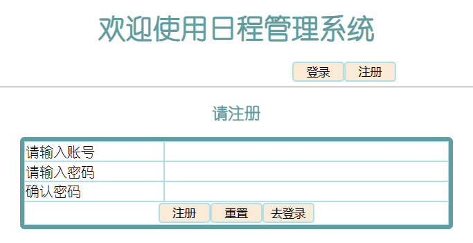
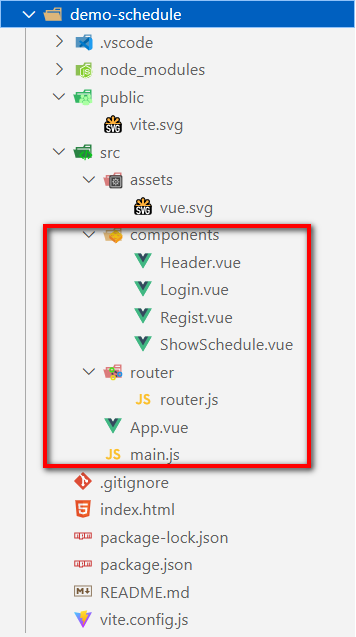

# 重构前端工程

## 业务目标展示

登录页


**注册页**



**日程管理页**


## 创建项目，安装依赖

``` shell
npm create vite
cd 项目目录
npm  install
npm  install vue-router
```

**项目结构如下**



## 开发视图

**Header.vue 视图**

``` html
<script setup>

</script>

<template>
  <div>
    <h1 class="ht">欢迎使用日程管理系统</h1>
    <div>
      <div class="optionDiv">
        <router-link to="/login">
          <button class="b1s">登录</button>
        </router-link>
        <router-link to="/regist">
          <button class="b1s">注册</button>
        </router-link>
      </div>


      <div class="optionDiv">
        欢迎xxx
        <button class="b1b">退出登录</button>
        <router-link to="/showSchedule">
          <button class="b1b">查看我的日程</button>
        </router-link>
      </div>
      <br>
    </div>
  </div>
</template>

<style scoped>
.ht {
  text-align: center;
  color: cadetblue;
  font-family: 幼圆;
}

.b1s {
  border: 2px solid powderblue;
  border-radius: 4px;
  width: 60px;
  background-color: antiquewhite;

}

.b1b {
  border: 2px solid powderblue;
  border-radius: 4px;
  width: 100px;
  background-color: antiquewhite;
}

.optionDiv {
  width: 300px;
  float: right;
}
</style>
```

**Login.vue 视图**

``` html
<script setup>
import { ref, reactive } from 'vue'

// 响应式数据,保存用户输入的表单信息
let loginUser = reactive({
  username: '',
  userPwd: ''
})

// 响应式数据,保存校验的提示信息
let usernameMsg = ref('')
let userPwdMsg = ref('')

// 校验用户名的方法
function checkUsername() {
  // 定义正则
  var usernameReg = /^[a-zA-Z0-9]{5,10}$/
  // 校验用户名
  if (!usernameReg.test(loginUser.username)) {
    // 格式不合法
    usernameMsg.value = "格式有误"
    return false
  }
  usernameMsg.value = "ok"
  return true
}

// 校验密码的方法
function checkUserPwd() {
  // 定义正则
  var passwordReg = /^[0-9]{6}$/
  // 校验密码
  if (!passwordReg.test(loginUser.userPwd)) {
    // 格式不合法
    userPwdMsg.value = "格式有误"
    return false
  }
  userPwdMsg.value = "ok"
  return true
}
</script>

<template>
  <div>
    <h3 class="ht">请登录</h3>
    <table class="tab" cellspacing="0px">
      <tr class="ltr">
        <td>请输入账号</td>
        <td>
          <input class="ipt" type="text" v-model="loginUser.username" @blur="checkUsername()">
          <span id="usernameMsg" v-text="usernameMsg"></span>
        </td>
      </tr>
      <tr class="ltr">
        <td>请输入密码</td>
        <td>
          <input class="ipt" type="password" v-model="loginUser.userPwd" @blur="checkUserPwd()">
          <span id="userPwdMsg" v-text="userPwdMsg"></span>
        </td>
      </tr>
      <tr class="ltr">
        <td colspan="2" class="buttonContainer">
          <input class="btn1" type="button" value="登录">
          <input class="btn1" type="button" value="重置">
          <router-link to="/regist">
            <button class="btn1">去注册</button>
          </router-link>
        </td>
      </tr>
    </table>
  </div>
</template>

<style scoped>
.ht {
  text-align: center;
  color: cadetblue;
  font-family: 幼圆;
}

.tab {
  width: 500px;
  border: 5px solid cadetblue;
  margin: 0px auto;
  border-radius: 5px;
  font-family: 幼圆;
}

.ltr td {
  border: 1px solid powderblue;
}

.ipt {
  border: 0px;
  width: 50%;
}

.btn1 {
  border: 2px solid powderblue;
  border-radius: 4px;
  width: 60px;
  background-color: antiquewhite;
}

#usernameMsg,
#userPwdMsg {
  color: gold;
}

.buttonContainer {
  text-align: center;
}
</style>
```

**Regist.vue 视图**

``` html
<script setup>
import { ref, reactive } from 'vue'

// 响应式数据,保存用户输入的表单信息
let registUser = reactive({
  username: '',
  userPwd: ''
})

// 响应式数据,保存校验的提示信息
let reUserPwd = ref('')
let reUserPwdMsg = ref('')
let usernameMsg = ref('')
let userPwdMsg = ref('')

// 校验用户名的方法
function checkUsername() {
  // 定义正则
  let usernameReg = /^[a-zA-Z0-9]{5,10}$/
  // 校验
  if (!usernameReg.test(registUser.username)) {
    // 提示
    usernameMsg.value = "不合法"
    return false
  }
  // 通过校验
  usernameMsg.value = "OK"
  return true
}

// 校验密码的方法
function checkUserPwd() {
  // 定义正则
  let passwordReg = /^[0-9]{6}$/
  // 校验
  if (!passwordReg.test(registUser.userPwd)) {
    // 提示
    userPwdMsg.value = "不合法"
    return false
  }
  // 通过校验
  userPwdMsg.value = "OK"
  return true
}

// 校验密码的方法
function checkReUserPwd() {
  // 定义正则
  let passwordReg = /^[0-9]{6}$/
  // 校验
  if (!passwordReg.test(reUserPwd.value)) {
    // 提示
    reUserPwdMsg.value = "不合法"
    return false
  }
  console.log(registUser.userPwd, reUserPwd.value)
  // 校验
  if (!(registUser.userPwd == reUserPwd.value)) {
    // 提示
    reUserPwdMsg.value = "不一致"
    return false
  }


  // 通过校验
  reUserPwdMsg.value = "OK"
  return true
}
</script>

<template>
  <div>
    <h3 class="ht">请注册</h3>

    <table class="tab" cellspacing="0px">
      <tr class="ltr">
        <td>请输入账号</td>
        <td>
          <input class="ipt" id="usernameInput" type="text" name="username" v-model="registUser.username"
            @blur="checkUsername()">

          <span id="usernameMsg" class="msg" v-text="usernameMsg"></span>
        </td>
      </tr>
      <tr class="ltr">
        <td>请输入密码</td>
        <td>
          <input class="ipt" id="userPwdInput" type="password" name="userPwd" v-model="registUser.userPwd"
            @blur="checkUserPwd()">
          <span id="userPwdMsg" class="msg" v-text="userPwdMsg"></span>
        </td>
      </tr>
      <tr class="ltr">
        <td>确认密码</td>
        <td>
          <input class="ipt" id="reUserPwdInput" type="password" v-model="reUserPwd" @blur="checkReUserPwd()">
          <span id="reUserPwdMsg" class="msg" v-text="reUserPwdMsg"></span>
        </td>
      </tr>
      <tr class="ltr">
        <td colspan="2" class="buttonContainer">
          <input class="btn1" type="button" value="注册">
          <input class="btn1" type="button" value="重置">
          <router-link to="/login">
            <button class="btn1">去登录</button>
          </router-link>
        </td>
      </tr>
    </table>
  </div>
</template>

<style scoped>
.ht {
  text-align: center;
  color: cadetblue;
  font-family: 幼圆;
}

.tab {
  width: 500px;
  border: 5px solid cadetblue;
  margin: 0px auto;
  border-radius: 5px;
  font-family: 幼圆;
}

.ltr td {
  border: 1px solid powderblue;

}

.ipt {
  border: 0px;
  width: 50%;

}

.btn1 {
  border: 2px solid powderblue;
  border-radius: 4px;
  width: 60px;
  background-color: antiquewhite;

}

.msg {
  color: gold;
}

.buttonContainer {
  text-align: center;
}
</style>
```

**ShowSchedule.vue 视图**

``` html
<script setup>

</script>

<template>
  <div>
    <h3 class="ht">您的日程如下</h3>
    <table class="tab" cellspacing="0px">
      <tr class="ltr">
        <th>编号</th>
        <th>内容</th>
        <th>进度</th>
        <th>操作</th>
      </tr>
      <tr class="ltr">
        <td></td>
        <td></td>
        <td></td>
        <td class="buttonContainer">
          <button class="btn1">删除</button>
          <button class="btn1">保存修改</button>
        </td>
      </tr>
      <tr class="ltr buttonContainer">
        <td colspan="4">
          <button class="btn1">新增日程</button>
        </td>
      </tr>
    </table>
  </div>
</template>

<style scoped>
.ht {
  text-align: center;
  color: cadetblue;
  font-family: 幼圆;
}

.tab {
  width: 80%;
  border: 5px solid cadetblue;
  margin: 0px auto;
  border-radius: 5px;
  font-family: 幼圆;
}

.ltr td {
  border: 1px solid powderblue;
}

.ipt {
  border: 0px;
  width: 50%;
}

.btn1 {
  border: 2px solid powderblue;
  border-radius: 4px;
  width: 100px;
  background-color: antiquewhite;
}

#usernameMsg,
#userPwdMsg {
  color: gold;
}

.buttonContainer {
  text-align: center;
}
</style>
```

**App.vue 视图**

``` html
<script setup>
import Header from './components/Header.vue'
</script>

<template>
  <div>
    <Header></Header>
    <hr>
    <!-- 用于路由切换视图使用 -->
    <router-view></router-view>
  </div>
</template>

<style scoped></style>

```

**配置路由**

``` javascript
import { createRouter, createWebHashHistory } from 'vue-router'
import Login from '../components/Login.vue'
import Regist from '../components/Regist.vue'
import ShowScedule from '../components/ShowSchedule.vue'

let router = createRouter({
  history: createWebHashHistory(),
  routes: [
    {
      path: "/",
      component: Login
    },
    {
      path: "/login",
      component: Login
    },
    {
      path: "/showSchedule",
      component: ShowScedule
    },
    {
      path: "/regist",
      component: Regist
    }
  ]
})

export default router
```

**配置 main.js**

``` javascript
import { createApp } from 'vue'

import App from './App.vue'

// 导入路由
import router from './router/router.js'

let app = createApp(App)

// 全局使用路由
app.use(router)

app.mount('#app')
```
